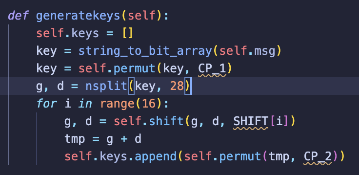

本部办的面向新手的比赛,这里只挑一些我觉得有意思的题目写一写wp.

> Crypto题目太少了!

# Crypto

## Yamato

出题人把题目名字打错了,故本wp未采用原题名XD

```python title="task.py"
import time
import random
from Crypto.Util.number import *
from secret import flag, msg


stream1 = random.Random(int(time.time())) # Guess what time it is :P (year=2019， UTC+8)
stream2 = random.Random(flag)

open('msg','wb').write(msg)

msg += flag
c = b''

assert len(msg) % 4 == 0

for i in range(len(msg)//4):
    c += long_to_bytes(bytes_to_long(msg[i*4:i*4+4]) ^ stream1.getrandbits(32) ^ stream2.getrandbits(32)).rjust(4, b'\x00')

open('ciphertext','wb').write(c)
```

msg和ciphertext太长就不放了,总之这个长度足够取出624个32bit,所以一眼预测MT19937.

不过,我猜出题人不知道多个MT19937的异或依然是MT19937,所以才会特意给出其中一个流的seed(甚至还在注释里调皮😡)

为什么呢?因为MT19937的twist过程和异或是结合的,而异或甚至还是交换的,所以多个MT19937异或之后还是一个MT19937.这样我们直接把题目中两个流的输出拿去randcrack就可以了,根本不需要爆破出题人藏起来的seed🤣

> exp

```python
from randcrack import RandCrack
from Crypto.Util.number import bytes_to_long, long_to_bytes

rc = RandCrack()
ct = open("ciphertext", "rb").read()
pt = open("msg", "rb").read()
for i in range(624):
    rc.submit(
        bytes_to_long(pt[i * 4 : i * 4 + 4]) ^ bytes_to_long(ct[i * 4 : i * 4 + 4])
    )
for i in range(624, len(pt) // 4):
    rc.predict_getrandbits(32)
flag = b""
for i in range(len(pt) // 4, len(ct) // 4):
    flag += long_to_bytes(
        rc.predict_getrandbits(32) ^ bytes_to_long(ct[i * 4 : i * 4 + 4])
    )
print(flag)

```

当然,如果硬要爆seed,你会发现出题人用的seed刚好就是2019-01-01 00:00的时间戳.

## Feistel Collision


```python collapse={16-145} title="task.py"
from param import *
import socket


def string_to_bit_array(text):
    array = list()
    for char in text:
        binval = binvalue(char, 8)
        array.extend([int(x) for x in list(binval)])
    return array


def bit_array_to_string(array):
    res = "".join(
        [
            chr(int(y, 2))
            for y in ["".join([str(x) for x in bytes]) for bytes in nsplit(array, 8)]
        ]
    )
    return res


def binvalue(val, bitsize):
    binval = bin(val)[2:] if isinstance(val, int) else bin(ord(val))[2:]
    if len(binval) > bitsize:
        binval = binval[-bitsize:]
    while len(binval) < bitsize:
        binval = "0" + binval
    return binval


def nsplit(s, n):
    return [s[k : k + n] for k in range(0, len(s), n)]


class thisishash:
    def __init__(self):
        self.msg = None
        self.text = None
        self.keys = list()

    def run(self, msg, text):
        self.msg = msg
        self.text = text

        self.generatekeys()
        text_blocks = nsplit(self.text, 8)
        result = list()
        for block in text_blocks:
            block = string_to_bit_array(block)
            block = self.permut(block, PI)
            g, d = nsplit(block, 32)
            tmp = None
            for i in range(16):
                d_e = self.expand(d, E)
                tmp = self.xor(self.keys[i], d_e)
                tmp = self.substitute(tmp)
                tmp = self.permut(tmp, P)
                tmp = self.xor(g, tmp)
                g = d
                d = tmp
            result += self.permut(d + g, PI_1)
        final_res = bit_array_to_string(result)
        return final_res

    def substitute(self, d_e):
        subblocks = nsplit(d_e, 6)
        result = list()
        for i in range(len(subblocks)):
            block = subblocks[i]
            row = int(str(block[0]) + str(block[5]), 2)
            column = int("".join([str(x) for x in block[1:][:-1]]), 2)
            val = S_BOX[i][row][column]
            bin = binvalue(val, 4)
            result += [int(x) for x in bin]
        return result

    def permut(self, block, table):
        return [block[x - 1] for x in table]

    def expand(self, block, table):
        return [block[x - 1] for x in table]

    def xor(self, t1, t2):
        return [x ^ y for x, y in zip(t1, t2)]

    def generatekeys(self):
        self.keys = []
        key = string_to_bit_array(self.msg)
        key = self.permut(key, CP_1)
        g, d = nsplit(key, 28)
        for i in range(16):
            g, d = self.shift(g, d, SHIFT[i])
            tmp = g + d
            self.keys.append(self.permut(tmp, CP_2))

    def shift(self, g, d, n):
        return g[n:] + g[:n], d[n:] + d[:n]

    def hash(self, msg):
        msg += len(msg).to_bytes()
        while len(msg) % 8 != 0:
            msg += b"\x00"
        text = b"\x00" * 8
        for i in range(0, len(msg), 8):
            text = self.run(msg[i : i + 8], text)
        return text.encode("latin-1")


def dohash(msg):
    h = thisishash()
    res = h.hash(msg)
    return res


def start_server(host="0.0.0.0", port=8000):
    server_socket = socket.socket(socket.AF_INET, socket.SOCK_STREAM)
    server_socket.bind((host, port))
    server_socket.listen(1)
    print(f"Listening on {host}:{port}")
    while True:
        try:
            client_socket, client_address = server_socket.accept()
            print(f"Connection from {client_address}")
            try:
                msg1 = b"Cra2y_4_V_mE_S0"
                client_socket.send(b"Msg: ")
                msg2 = client_socket.recv(1024)[:-1]
                if msg1 != msg2 and dohash(msg1) == dohash(msg2):
                    client_socket.send(b"Congratulations! Here is flag: ")
                    client_socket.sendall(open("/flag", "rb").read())
                else:
                    client_socket.sendall(b"nonono")
            except Exception as e:
                client_socket.sendall(b"Error")
                print(f"Error: {e}")
            finally:
                client_socket.close()
                print(f"Connection with {client_address} closed")
        except:
            client_socket.close()


if __name__ == "__main__":
    start_server()

```

```python collapse={10-101} title="param.py"
PI = [58, 50, 42, 34, 26, 18, 10, 2,
      60, 52, 44, 36, 28, 20, 12, 4,
      62, 54, 46, 38, 30, 22, 14, 6,
      64, 56, 48, 40, 32, 24, 16, 8,
      57, 49, 41, 33, 25, 17, 9, 1,
      59, 51, 43, 35, 27, 19, 11, 3,
      61, 53, 45, 37, 29, 21, 13, 5,
      63, 55, 47, 39, 31, 23, 15, 7]

CP_1 = [20, 5, 17, 29, 16, 30, 15,
        63, 1, 54, 50, 53, 9, 14, 
        31, 62, 44, 24, 43, 59, 27, 
        23, 49, 19, 38, 3, 13, 10, 
        2, 61, 6, 21, 58, 56, 8, 
        12, 28, 55, 33, 64, 11, 35, 
        60, 7, 42, 57, 4, 48, 25, 
        32, 37, 34, 52, 39, 46, 41]


CP_2 = [14, 17, 11, 24, 1, 5, 3, 28,
        15, 6, 21, 10, 23, 19, 12, 4,
        26, 8, 16, 7, 27, 20, 13, 2,
        41, 52, 31, 37, 47, 55, 30, 40,
        51, 45, 33, 48, 44, 49, 39, 56,
        34, 53, 46, 42, 50, 36, 29, 32]

E = [32, 1, 2, 3, 4, 5,
     4, 5, 6, 7, 8, 9,
     8, 9, 10, 11, 12, 13,
     12, 13, 14, 15, 16, 17,
     16, 17, 18, 19, 20, 21,
     20, 21, 22, 23, 24, 25,
     24, 25, 26, 27, 28, 29,
     28, 29, 30, 31, 32, 1]

S_BOX = [
         
[[14, 4, 13, 1, 2, 15, 11, 8, 3, 10, 6, 12, 5, 9, 0, 7],
 [0, 15, 7, 4, 14, 2, 13, 1, 10, 6, 12, 11, 9, 5, 3, 8],
 [4, 1, 14, 8, 13, 6, 2, 11, 15, 12, 9, 7, 3, 10, 5, 0],
 [15, 12, 8, 2, 4, 9, 1, 7, 5, 11, 3, 14, 10, 0, 6, 13],
],

[[15, 1, 8, 14, 6, 11, 3, 4, 9, 7, 2, 13, 12, 0, 5, 10],
 [3, 13, 4, 7, 15, 2, 8, 14, 12, 0, 1, 10, 6, 9, 11, 5],
 [0, 14, 7, 11, 10, 4, 13, 1, 5, 8, 12, 6, 9, 3, 2, 15],
 [13, 8, 10, 1, 3, 15, 4, 2, 11, 6, 7, 12, 0, 5, 14, 9],
],

[[10, 0, 9, 14, 6, 3, 15, 5, 1, 13, 12, 7, 11, 4, 2, 8],
 [13, 7, 0, 9, 3, 4, 6, 10, 2, 8, 5, 14, 12, 11, 15, 1],
 [13, 6, 4, 9, 8, 15, 3, 0, 11, 1, 2, 12, 5, 10, 14, 7],
 [1, 10, 13, 0, 6, 9, 8, 7, 4, 15, 14, 3, 11, 5, 2, 12],
],

[[7, 13, 14, 3, 0, 6, 9, 10, 1, 2, 8, 5, 11, 12, 4, 15],
 [13, 8, 11, 5, 6, 15, 0, 3, 4, 7, 2, 12, 1, 10, 14, 9],
 [10, 6, 9, 0, 12, 11, 7, 13, 15, 1, 3, 14, 5, 2, 8, 4],
 [3, 15, 0, 6, 10, 1, 13, 8, 9, 4, 5, 11, 12, 7, 2, 14],
],  

[[2, 12, 4, 1, 7, 10, 11, 6, 8, 5, 3, 15, 13, 0, 14, 9],
 [14, 11, 2, 12, 4, 7, 13, 1, 5, 0, 15, 10, 3, 9, 8, 6],
 [4, 2, 1, 11, 10, 13, 7, 8, 15, 9, 12, 5, 6, 3, 0, 14],
 [11, 8, 12, 7, 1, 14, 2, 13, 6, 15, 0, 9, 10, 4, 5, 3],
], 

[[12, 1, 10, 15, 9, 2, 6, 8, 0, 13, 3, 4, 14, 7, 5, 11],
 [10, 15, 4, 2, 7, 12, 9, 5, 6, 1, 13, 14, 0, 11, 3, 8],
 [9, 14, 15, 5, 2, 8, 12, 3, 7, 0, 4, 10, 1, 13, 11, 6],
 [4, 3, 2, 12, 9, 5, 15, 10, 11, 14, 1, 7, 6, 0, 8, 13],
], 

[[4, 11, 2, 14, 15, 0, 8, 13, 3, 12, 9, 7, 5, 10, 6, 1],
 [13, 0, 11, 7, 4, 9, 1, 10, 14, 3, 5, 12, 2, 15, 8, 6],
 [1, 4, 11, 13, 12, 3, 7, 14, 10, 15, 6, 8, 0, 5, 9, 2],
 [6, 11, 13, 8, 1, 4, 10, 7, 9, 5, 0, 15, 14, 2, 3, 12],
],
   
[[13, 2, 8, 4, 6, 15, 11, 1, 10, 9, 3, 14, 5, 0, 12, 7],
 [1, 15, 13, 8, 10, 3, 7, 4, 12, 5, 6, 11, 0, 14, 9, 2],
 [7, 11, 4, 1, 9, 12, 14, 2, 0, 6, 10, 13, 15, 3, 5, 8],
 [2, 1, 14, 7, 4, 10, 8, 13, 15, 12, 9, 0, 3, 5, 6, 11],
]
]

P = [16, 7, 20, 21, 29, 12, 28, 17,
     1, 15, 23, 26, 5, 18, 31, 10,
     2, 8, 24, 14, 32, 27, 3, 9,
     19, 13, 30, 6, 22, 11, 4, 25]

PI_1 = [40, 8, 48, 16, 56, 24, 64, 32,
        39, 7, 47, 15, 55, 23, 63, 31,
        38, 6, 46, 14, 54, 22, 62, 30,
        37, 5, 45, 13, 53, 21, 61, 29,
        36, 4, 44, 12, 52, 20, 60, 28,
        35, 3, 43, 11, 51, 19, 59, 27,
        34, 2, 42, 10, 50, 18, 58, 26,
        33, 1, 41, 9, 49, 17, 57, 25]

SHIFT = [1,1,2,2,2,2,2,2,1,2,2,2,2,2,2,1]
```

大概看了看貌似用的几个box都是DES原版,所以问题大概不会在`param.py`里.输出的是定长8字节,所以碰撞是必然存在的.

对DES熟悉的朋友知道,DES的64bit key里只有56bit是有用的,这题其实也是一样:



所以合理猜测改动原消息中的某个字节,得到的hash应该就能碰撞了.

> exp

```python
from param import *
from task import *
import itertools
from tqdm import tqdm


# while True:
#     x = input("Input: ").encode()
#     print(len(dohash(x)))
#     print(dohash(x))
charset = "ABCDEFGHIJKLMNOPQRSTUVWXYZabcdefghijklmnopqrstuvwxyz0123456789_!@#$%^&"
length = 1
# print(dohash(b"Cra2y_4_V_mE_S0"))
cands = itertools.product(charset, repeat=length)
for cand in tqdm(cands, total=len(charset) ** length):
    cand = "".join(cand)
    cand = "Cra2y" + cand + "4_V_mE_S0"
    if dohash(cand.encode()) == b"\xb36\\Y\xdbaZ\xcd" and cand != "Cra2y_4_V_mE_S0":
        print(cand)
        break
```
## 榴莲披萨

```python collapse={16-} title="task.sage"
from Crypto.Util.number import *
import socket
from hashlib import md5
from pubkey import *

A = Matrix(GF(P), A)
Y = Matrix(GF(P), Y)

def H(m, R):
    con = m + b''.join([long_to_bytes(int(R[i,j])) for i in range(R.nrows()) for j in range(R.ncols())])
    return bytes_to_long(md5(con).digest())

def verify(msg, sign):
    R, s = sign
    return pow(A, s) * pow(Y, H(msg, R)) == R

def start_server(host='0.0.0.0', port=8002):
    server_socket = socket.socket(socket.AF_INET, socket.SOCK_STREAM)
    server_socket.bind((host, port))
    server_socket.listen(1)
    print(f"Listening on {host}:{port}")
    while True:
        try:
            client_socket, client_address = server_socket.accept()
            print(f"Connection from {client_address}")
            try:
                client_socket.sendall(b'Show me the order: ')
                msg = client_socket.recv(1024)[:-1]
                client_socket.sendall(b'Now sign here \n')
                client_socket.send(b'R : ')
                R = MatrixSpace(GF(P), 2, 2)(list(map(int, client_socket.recv(4096).decode().split(','))))
                print(R)
                client_socket.send(b's : ')
                s = int(client_socket.recv(1024).decode())
                if verify(msg, (R, s)):
                    client_socket.sendall(b'Order Accepted. \n')
                    if b"Durian Pizza" in msg:
                        client_socket.sendall(b'Nice choice, here is the gift for you: ' + open('/flag','rb').read())
                    else:
                        client_socket.sendall(b'OK. Just a simple order...')
                else:
                    client_socket.sendall(b'You bad hacker, get out of here!')
            except Exception as e:
                client_socket.sendall(b'Error')
                print(f"Error: {e}")
            finally:
                client_socket.close()
                print(f"Connection with {client_address} closed")
        except:
            client_socket.close()

if __name__ == '__main__':
    start_server()

```

取R=A,msg=b"Durian Pizza",然后就是Matrix DLP,直接看exp吧.

> exp

```python
from Crypto.Util.number import *
from hashlib import md5
def H(m, R):
    con = m + b''.join([long_to_bytes(int(R[i,j])) for i in range(R.nrows()) for j in range(R.ncols())])
    return bytes_to_long(md5(con).digest())
P = 1683208011904326369614622637266279437689133954448379616371700884204960914555663940480279149713339270325925168420440219242200974530089995855592800607008073352225050959921163648597810918064999130339182045419187967563900627029777127035486454797289161072439261816273949811644402761487035852329832281344470933105020032726743824545249720464432569452215560618818514051408518771115575262610796105200817560692660322603801622552450039704827403440905951313734995767297
R = Matrix(GF(P), [[306700786523733288127563783681848823006456525267952414387036425998652549307949988593007687582478535334067674517509565315171938613480399904359954585830581523585558073311363741302799256568336682815835441659143960426151588139793023914143424535581523298788512595840330631617969545759272026148371373075203662191077958559649315210878146898217842473230159453682401688457611705415004511599063203354166266788612140582658966506911588298630633388400309051986894205804,  898493349040480199153592243958992314191963408360073625966541729304603658316508680147937425593248154129810765596014229152451507193234039112178515042043817048874736850299548861565236437945160674604922706903446910844630061969334818474057806045775782477812955497138720990852520447665806649572216935868677853001029070348491622378944402007509695995454089129758863556001949090741758276896622211458295841117575080291218939015929794632885224152554006538258120717959],
[1070408185553777684924887289127693699505974797150581442162558590284160898118339817555561866619981534509146776251491383739673326080446964595439329417431387177894748293096547119284964894077902368995682849682375512785350309125681997994323091528708260879905779174677291269553997258377623641279335617616240586273900331484690672325173624431117165190387829122078173806088187434648570881460488239465167964704025689038686900031799039852963300562160981337466101170883,  872815754423889432486455323688140196971212677821212252181112928241360807311109944124429611697722635920751870188997259457056211155256589563537007971820749599255672345124735545739677744646778847682334333856184910667389813998106894263407412284367039331100765440519835572862142760963231956622584096257200398689818679540066508818477254336532048189416245915396869858328710431697432262622517819938726863804823949894769573590600861202853611514429570627349112703753]]
)
A = [[306700786523733288127563783681848823006456525267952414387036425998652549307949988593007687582478535334067674517509565315171938613480399904359954585830581523585558073311363741302799256568336682815835441659143960426151588139793023914143424535581523298788512595840330631617969545759272026148371373075203662191077958559649315210878146898217842473230159453682401688457611705415004511599063203354166266788612140582658966506911588298630633388400309051986894205804,  898493349040480199153592243958992314191963408360073625966541729304603658316508680147937425593248154129810765596014229152451507193234039112178515042043817048874736850299548861565236437945160674604922706903446910844630061969334818474057806045775782477812955497138720990852520447665806649572216935868677853001029070348491622378944402007509695995454089129758863556001949090741758276896622211458295841117575080291218939015929794632885224152554006538258120717959],
[1070408185553777684924887289127693699505974797150581442162558590284160898118339817555561866619981534509146776251491383739673326080446964595439329417431387177894748293096547119284964894077902368995682849682375512785350309125681997994323091528708260879905779174677291269553997258377623641279335617616240586273900331484690672325173624431117165190387829122078173806088187434648570881460488239465167964704025689038686900031799039852963300562160981337466101170883,  872815754423889432486455323688140196971212677821212252181112928241360807311109944124429611697722635920751870188997259457056211155256589563537007971820749599255672345124735545739677744646778847682334333856184910667389813998106894263407412284367039331100765440519835572862142760963231956622584096257200398689818679540066508818477254336532048189416245915396869858328710431697432262622517819938726863804823949894769573590600861202853611514429570627349112703753]]

Y = [[569221265496504238942945693554068397706391716814376249621468746085606677609024122327190355190545280511569358362045716912472862687376495923421347892536804772552218628634797818626162513565604850720301010641441907405691323855840964759482349988343133005784561550110798320270191622800893164485030807635942811468650662916644006667146031299342168345469691689840612415732808271922646737822896761890506471963413710524787437003180230030354223459624218489193847386735, 448641541250014681977435132660276907264884735846866597143637198056296225528000870178106999259132780594897820892500042543923315835812373763935403404644591981125171357702176319937420473996469514651207535340474453302179415188291743562417160583014323365260282356550655596778807839064633433184000640034353853655119222603995428199466612589865772770418212404742664370332994700317628457209259983556801920132784428690030695846465650476044629926135305874206546904156],
[584450015343679651087115964921906069166537034724216404437604528445135151396700973640135244044247318822809561085816217445845629681424337320943693313410820749623059838584721750429611069071998569524805877232175491056228415066726705711711732279838230208824503409469256579978434212002771448313029184228477705283488739175691570686476452972096925120209059947637352338606007893063452214060581381918073210966410360355133789577415332048957763666702318657439606021657, 764559888664606401534225480736064437067658358660006307888391620032083930915626822612404836876166088195968973827538654016269493960123320763468320519776730733720771130077512305604485475783075420319817336316034439224022563627887439851685107891108412944463104743964448732654360534152974463787314042406770484509094543799363032423886771387089189268353456897006595208113642590397368327041111607296512108952392720547545025108011391788403169558407549663707058554910]]
A = Matrix(GF(P), A)
Y = Matrix(GF(P), Y)
# print(A==R)
# print(R)

print(H(b"Durian Pizza",R))
exp = H(b"Durian Pizza",R)
S = pow(Y,-exp)
A_Jor, Ax = A.jordan_form(transformation=True)
S_ = ~Ax*S*Ax
ss = GF(P)(int(S_[1][1]))
aa = GF(P)(int(A_Jor[1][1]))
exp2 = ss.log(aa)
"""
--------------------
"""
from pwn import *
conn = remote("405.trainoi.com","27016")
context.log_level="debug"
data = conn.recvuntil(b"order: ")
print(data)
conn.sendline(b"Durian Pizza")
data = conn.recv()
print(data)
conn.recv()
conn.sendline(b"306700786523733288127563783681848823006456525267952414387036425998652549307949988593007687582478535334067674517509565315171938613480399904359954585830581523585558073311363741302799256568336682815835441659143960426151588139793023914143424535581523298788512595840330631617969545759272026148371373075203662191077958559649315210878146898217842473230159453682401688457611705415004511599063203354166266788612140582658966506911588298630633388400309051986894205804,898493349040480199153592243958992314191963408360073625966541729304603658316508680147937425593248154129810765596014229152451507193234039112178515042043817048874736850299548861565236437945160674604922706903446910844630061969334818474057806045775782477812955497138720990852520447665806649572216935868677853001029070348491622378944402007509695995454089129758863556001949090741758276896622211458295841117575080291218939015929794632885224152554006538258120717959,1070408185553777684924887289127693699505974797150581442162558590284160898118339817555561866619981534509146776251491383739673326080446964595439329417431387177894748293096547119284964894077902368995682849682375512785350309125681997994323091528708260879905779174677291269553997258377623641279335617616240586273900331484690672325173624431117165190387829122078173806088187434648570881460488239465167964704025689038686900031799039852963300562160981337466101170883,872815754423889432486455323688140196971212677821212252181112928241360807311109944124429611697722635920751870188997259457056211155256589563537007971820749599255672345124735545739677744646778847682334333856184910667389813998106894263407412284367039331100765440519835572862142760963231956622584096257200398689818679540066508818477254336532048189416245915396869858328710431697432262622517819938726863804823949894769573590600861202853611514429570627349112703753")
data = conn.recv()
print(data)
# send exp2+1
conn.sendline(b"561069337301442123204874212422093145896377984816126538790566961401653638185221313493426383237779756775308389473480073080733658176696665285197600202336024450741683653307054549532603639354999710113060681806395989187966875676592375678495484932429720357479753938757983073743489221490225230362400447872033401938537447498755495386257671854338962031619361124531065740568590293072907186041764475143640079181467181062866544393694051300332715406121918275481653530561")
data = conn.recv()
print(data)

conn.interactive()

```

# Misc

## 神秘文件

给了个以PDP-11的端序存储的数据,按wiki上对PDP-11端序的描述调了一下然后乱搞一通就出了XD

> exp

```python
data = [1819497543,1312250199,1383555909,1316313210,2017614407,961176172,963137110,1232623666,964322374,1227908168,1684821101,1178159443]
dat = ""
for dd in data:
    dat+=hex(dd)[2:]
print(dat)
# 去CyberChef乱bake一通
# https://gchq.github.io/CyberChef/#recipe=Swap_endianness('Hex',2,true)From_Hex('Space')Reverse('Character')From_Base64('A-Za-z0-9%2B/%3D',true,false)&input=NmM3MzU0NDc0ZTM3NTk1NzUyNzc2MzQ1NGU3NTU4N2E3ODQyNWE0NzM5NGE2MjZjMzk2ODRlNTY0OTc4NTgzMjM5N2E2NDQ2NDkzMDY0NDg2NDZjNTQ2ZDQ2Mzk0OTUz
data = "!!}Ngetr4t_s_b15_an_IdlA_3npDpac{Lil"
flag = ""
for i in range(0,len(data),3):
    flag+=data[-i-3]
    flag+=data[-i-2]
    flag+=data[-i-1]
print(flag)
```

## 宇宙的回响

一耳朵就知道是反相+sstv.但是双声道直接反相是不行的,因为两边混入的噪声的响度不一致.把左声道响度降低18.5dB后反相相加,然后sstv decode成功.

> exp

```python
import numpy as np
from scipy.io import wavfile


def db_to_linear(db):
    # 将分贝值转换为线性缩放值
    return 10 ** (db / 20)


def adjust_volume(data, db_change):
    scale_factor = db_to_linear(db_change)
    return data * scale_factor


def main():
    sample_rate, data = wavfile.read("flag.wav")
    if data.ndim != 2 or data.shape[1] != 2:
        raise ValueError("WAV文件必须为双声道")

    # 分离左右声道
    left_channel, right_channel = data[:, 0], data[:, 1]

    # 对左声道音量减少18.5 dB
    adjusted_left = adjust_volume(left_channel, -18.5)
    difference = adjusted_left - right_channel

    wavfile.write("output.wav", sample_rate, difference.astype(np.int16))


if __name__ == "__main__":
    main()
```

decode出来一张Aztec Code


Google Play上找到一个Aztec Scanner的App,下载安装扫码get🥰

# 总结

满打满算应该是做了3天题,最后还能再出大概两三道,但是要赶毕设和备课就摆了,对我来说Crypto AK就已经心满意足了~

`Tiny Image`那题有点可惜,虽然想到要对bmp的后12字节数据动刀子但是试了两三次都莫名其妙地过不去后端的文件结构校验,后来也没继续尝试.`修修补补`也是知道要动调改rip去让它吐flag,但是那天在实验室带的是Macbook没有对应环境,后面回宿舍的时候又过去了做题的热情,200分就这么不了了之.

密码出得挺有意思,`榴莲披萨`差不多做了一个小时才出,本来以为Matrix DLP这种套路能一把梭的,结果还是有思维漏洞--只用Jordan标准型中的一个对角线元素去求得的DLP未必就一定是矩阵本身的DLP.中间又细致地处理了multiplicative order的问题,最后才成功解出.(不过解出后发现只用一个对角线元素求也是可以的,只是我用的那个不是该用的那个QAQ)`Yamato`貌似用了非预期解,而且感觉比预期还要巧妙XD

唯一有点不爽的就是Crypto题目数量与其他方向相比明显偏少,气抖冷,我们密码什么时候才能站起来😡
