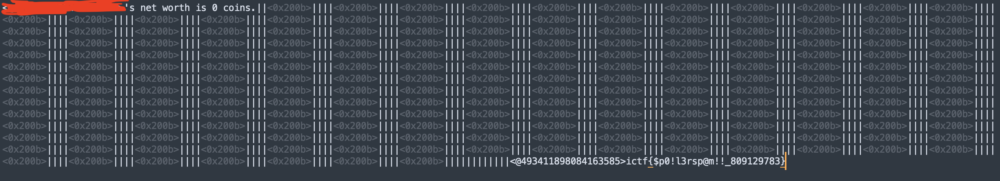

# Crypto

## Integrity

> task

```python
from Crypto.Util.number import *
from binascii import crc_hqx

p = getPrime(1024)
q = getPrime(1024)

n = p*q
e = 65537
tot = (p-1)*(q-1)
d = pow(e, -1, tot)

flag = bytes_to_long(open("flag.txt", "rb").read())
ct = pow(flag, e, n)

#signature = pow(flag, d, n) # no, im not gonna do that
signature = pow(flag, crc_hqx(long_to_bytes(d), 42), n)

print(f"{n = }")
print(f"{ct = }")
print(f"{signature = }")
```

爆破e之后common modulus attack即可。

> exp

```python
import gmpy2 as gp
from Crypto.Util.number import *

n = 
e1 = 65537
for e2 in range(0, 65537):
    c1 = 
    c2 = 

    gcd, s, t = gp.gcdext(e1, e2)
    if s<0:
        s = - s
        c1 = gp.invert(c1, n)
    elif t<0:
        t = - t
        c2 = gp.invert(c2, n)

    m = pow(c1,s,n)*pow(c2,t,n) % n
    try:
        m = long_to_bytes(m).decode()
        if "ictf" in m:
            print(m)
            exit(0)
    except:
        continue

```

## tango

> task

```python
from Crypto.Cipher import Salsa20
from Crypto.Util.number import bytes_to_long, long_to_bytes
import json
from secrets import token_bytes, token_hex
from zlib import crc32

from secret import FLAG

KEY = token_bytes(32)


def encrypt_command(command):
    if len(command) != 3:
        print('Nuh uh.')
        return
    cipher = Salsa20.new(key=KEY)
    nonce = cipher.nonce
    data = json.dumps({'user': 'user', 'command': command, 'nonce': token_hex(8)}).encode('ascii')
    checksum = long_to_bytes(crc32(data))
    ciphertext = cipher.encrypt(data)
    print('Your encrypted packet is:', (nonce + checksum + ciphertext).hex())


def run_command(packet):
    packet = bytes.fromhex(packet)
    nonce = packet[:8]
    checksum = bytes_to_long(packet[8:12])
    ciphertext = packet[12:]

    try:
        cipher = Salsa20.new(key=KEY, nonce=nonce)
        plaintext = cipher.decrypt(ciphertext)

        if crc32(plaintext) != checksum:
            print('Invalid checksum. Aborting!')
            return

        data = json.loads(plaintext.decode('ascii'))
        user = data.get('user', 'anon')
        command = data.get('command', 'nop')

        if command == 'nop':
            print('...')
        elif command == 'sts':
            if user not in ['user', 'root']:
                print('o_O')
                return
            print('The server is up and running.')
        elif command == 'flag':
            if user != 'root':
                print('You wish :p')
            else:
                print(FLAG)
        else:
            print('Unknown command.')
    except (json.JSONDecodeError, UnicodeDecodeError):
        print('Invalid data. Aborting!')


def menu():
    print('[E]ncrypt a command')
    print('[R]un a command')
    print('[Q]uit')


def main():
    print('Welcome to the Tango server! What would you like to do?')
    while True:
        menu()
        option = input('> ').upper()
        if option == 'E':
            command = input('Your command: ')
            encrypt_command(command)
        elif option == 'R':
            packet = input('Your encrypted packet (hex): ')
            run_command(packet)
        elif option == 'Q':
            exit(0)
        else:
            print('Unknown option:', option)


if __name__ == '__main__':
    main()
```

题目的明文格式已知+key固定+nonce已知，所以每次new一个salsa20对象后生成的随机字节流也是固定的。直接异或后拿到随机字节流就可以随意构造了。赛场上审代码的时候犯了惯性思维，以为输入时也校验了json里的nonce项，愣是在这道题上卡了半个下午😂

> exp

```python
import json
from pwn import *
from zlib import crc32
packet = "<data>"
packet = bytes.fromhex(packet)
nonce = packet[:8]
checksum = packet[8:12]
ct = packet[12:]
data = json.dumps({'user': 'user', 'command': 'fla', 'nonce': '****************'}).encode('ascii')
print(xor(ct,data)[:35])
print(nonce.hex())

"""
"""
import json
from pwn import *
from zlib import crc32
from Crypto.Util.number import long_to_bytes

data = json.dumps({'user': 'root', 'command': 'flag'}).encode('ascii')
stream = b'<data>'
print(xor(data, stream).hex())
print(long_to_bytes(crc32(data)).hex())

```


## *lf3r

> task

```python
import secrets, os

n = 256
MASK = 0x560074275752B31E43E64E99D996BC7B5A8A3DAC8B472FE3B83E6C6DDB5A26E7


class LF3R:
    def __init__(self, n, key, mask):
        self.n = n
        self.state = key & ((1 << n) - 1)
        self.mask = mask

    def __call__(self):
        v = self.state % 3
        self.state = (self.state >> 1) | (
            ((self.state & self.mask).bit_count() & 1) << (self.n - 1)
        )
        return v


def int_to_base(n, b):
    digits = []
    while n:
        digits.append(n % b)
        n //= b
    return digits


if __name__ == "__main__":
    key = secrets.randbits(n)
    lf3r = LF3R(n, key, MASK)

    stream = [lf3r() for _ in range(2048)]

    flag = os.environ["FLAG"].encode()
    flag_digits = int_to_base(int.from_bytes(flag, "big"), 3)
    stream += [(x + lf3r()) % 3 for x in flag_digits]
    print(f"{stream = }")

```

赛后才出的，没在赛场上出有一点遗憾。明明这个思路之前自己还出过类似的题的（

设某时刻的状态为$S_{t}$,则$S_{t+1} = \frac{(S_{t}-x)}{2} + y*2^{256-1}$，其中x和y的取值范围都是 $\{0,1\}$

演算一下可以知道，

$$
\begin{align}
S_{t+1}\%3-S_{t}\%3 & = (\frac{-x-S_{t}}{2}+2*y)\%3 \\
& =(x-y+S_{t})\%3
\end{align}
$$

当$x-y = 1$或$-1$时，我们就可以唯一确定$(x, y)$的取值，这样可以获得足够多的$GF(2)$上的方程（按maple的回复，可以获得至少70%的bits），然后求解方程就可以获得key。

> exp

```python
from sage.all import *
import output

n = output.n
MASK = output.MASK
stream_key = output.stream[0:2048]
stream_flag = output.stream[2048:]

vec = [1] + [0] * (n - 1)
transition = []
for i in range(n - 1):
    transition.append((i, i + 1))
for j in range(n):
    if (MASK >> j) & 1:
        transition.append((n - 1, j))

def next_coef(vec):
    vec_next = [0] * n
    for i, j in transition:
        vec_next[j] ^= vec[i]
    return vec_next

vec2 = vec
for _ in range(n):
    vec2 = next_coef(vec2)

mat = []
value = []
for i in range(len(stream_key) - 1):
    s, t = stream_key[i], stream_key[i + 1]
    candidate = []
    for x in range(2):
        for y in range(2):
            if (x - s - y) % 3 == t:
                candidate.append((x, y))
    if len(candidate) == 1:
        x, y = candidate[0]
        mat.append(vec)
        value.append(x)
        mat.append(vec2)
        value.append(y)
    vec = next_coef(vec)
    vec2 = next_coef(vec2)

key_vec = matrix(GF(2), mat).solve_right(vector(GF(2), value))

print(f"{key_vec=}")

key = sum([int(key_vec[i]) << i for i in range(n)])

class LF3R:
    def __init__(self, n, key, mask):
        self.n = n
        self.state = key & ((1 << n) - 1)
        self.mask = mask

    def __call__(self):
        v = self.state % 3
        self.state = (self.state >> 1) | (
            (bin(self.state & self.mask).count('1') & 1) << (self.n - 1)
        )
        return v

lf3r = LF3R(n, key, MASK)

for _ in range(2048):
    lf3r()

flag_vec = []
for x in stream_flag:
    flag_vec.append((x - lf3r()) % 3)

flag = 0
for x in reversed(flag_vec):
    flag = 3 * flag + x

print(flag.to_bytes(50, "big"))
```

## *solitude

> task

```python
#!/usr/bin/env python3

import random

def xor(a: bytes, b: bytes):
  out = []
  for m,n in zip(a,b):
    out.append(m^n)
  return bytes(out)

class RNG():
  def __init__(self, size, state=None):
    self.size = size
    self.state = list(range(self.size+2))
    random.shuffle(self.state)
  def next(self):
    idx = self.state.index(self.size)
    self.state.pop(idx)
    self.state.insert((idx+1) % (len(self.state)+1), self.size)
    if self.state[0] == self.size:
      self.state.pop(0)
      self.state.insert(1, self.size)
    idx = self.state.index(self.size+1)
    self.state.pop(idx)
    self.state.insert((idx+1) % (len(self.state)+1), self.size+1)
    if self.state[0] == self.size+1:
      self.state.pop(0)
      self.state.insert(1, self.size+1)
    if self.state[1] == self.size+1:
      self.state.pop(1)
      self.state.insert(2, self.size+1)
    c1 = self.state.index(self.size)
    c2 = self.state.index(self.size+1)
    self.state = self.state[max(c1,c2)+1:] + [self.size if c1<c2 else self.size+1] + self.state[min(c1,c2)+1:max(c1,c2)] + [self.size if c1>c2 else self.size+1] + self.state[:min(c1,c2)]
    count = self.state[-1]
    if count in [self.size,self.size+1]:
      count = self.size
    self.state = self.state[count:-1] + self.state[:count] + self.state[-1:]
    idx = self.state[0]
    if idx in [self.size,self.size+1]:
      idx = self.size
    out = self.state[idx]
    if out in [self.size,self.size+1]:
      out = self.next()
    return out

if __name__ == "__main__":
  flag = open("flag.txt", "rb").read()
  while True:
    i = int(input("got flag? "))
    for _ in range(i):
      rng = RNG(128)
      stream = bytes([rng.next() for _ in range(len(flag))])
      print(xor(flag, stream).hex())

```

赛场上被这题硬控2天😇做的时候完完全全想复杂了...记录一下思考的脚手架吧

先测试一下这个RNG，会发现它有循环周期

> test1

```python
import random
from PIL import Image

class RNG():
  def __init__(self, size, state=None):
    self.size = size
    self.state = list(range(self.size+2))
    random.shuffle(self.state)
  def next(self):
    idx = self.state.index(self.size)
    self.state.pop(idx)
    self.state.insert((idx+1) % (len(self.state)+1), self.size)
    if self.state[0] == self.size:
      self.state.pop(0)
      self.state.insert(1, self.size)
    idx = self.state.index(self.size+1)
    self.state.pop(idx)
    self.state.insert((idx+1) % (len(self.state)+1), self.size+1)
    if self.state[0] == self.size+1:
      self.state.pop(0)
      self.state.insert(1, self.size+1)
    if self.state[1] == self.size+1:
      self.state.pop(1)
      self.state.insert(2, self.size+1)
    c1 = self.state.index(self.size)
    c2 = self.state.index(self.size+1)
    self.state = self.state[max(c1,c2)+1:] + [self.size if c1<c2 else self.size+1] + self.state[min(c1,c2)+1:max(c1,c2)] + [self.size if c1>c2 else self.size+1] + self.state[:min(c1,c2)]
    count = self.state[-1]
    if count in [self.size,self.size+1]:
      count = self.size
    self.state = self.state[count:-1] + self.state[:count] + self.state[-1:]
    idx = self.state[0]
    if idx in [self.size,self.size+1]:
      idx = self.size
    out = self.state[idx]
    if out in [self.size,self.size+1]:
      out = self.next()
    return out


rng = RNG(128)


width, height = 510, 1024
pixels = [rng.next() % 256 for _ in range(width * height)]


image = Image.new('RGB', (width, height))


for y in range(height):
    for x in range(width):
        value = pixels[y * width + x]
        image.putpixel((x, y), (value, value, value))

# Save the image
image.save('rng_output.png')
```


但是题目的rng每次迭代都重新init了，测试下来基本都是还没到周期就进入新一轮输出了，这条路走不通。

能不能考虑爆破key呢？这题的RNG输出的每个数字都在0～127之间，跟flag文本异或之后范围也还是落在0～127里面，所以基本没什么可以区分开的特征。又一条路堵死。

然后想了想，0～127都可以用7bit长来表示，所以bit串中0和1的数量不一样。如果把bit串中1的数量作为hamming weight，那么每个输出的hamming weight会不会透露出什么信息？不过赛场上实验了一下还是没走通。

赛后继续试验这条路的时候发现，就算按题目中每次迭代都init RNG，似乎输出的序列也不是很均匀。多次取输出，每次取10240个，发现貌似0出现的频率总是更高一点？

然后写了个exp试了试，还真的出了😔

> exp

```python
from collections import Counter

with open("stream.txt", "rb") as f:
    data = f.read()
data = [bytes.fromhex(x.decode()) for x in data.split(b"\n")]
data = [[data[i][j] for i in range(len(data))] for j in range(len(data[0]))]
flag = ""
for c in data:
    flag +=chr(Counter(c).most_common(1)[0][0])

print(flag)
```


# Reverse

这次只是辅助队友扫了两个Reverse的尾巴，姑且记录下最后出flag的exp吧。

膜拜一下队友oldkingOK，出了大把高难度的Re, 甚至赢了r3kapig一题（

## absolute Flag checker

验证程序是一个47元的线性方程组，主要工作量在于提取方程组的数据。提取之后Sagemath一把梭：

> exp

```python
from sage.all import *

A = Matrix(ZZ, [[660, 290, 426, 812, 584, 826, 515, 888, 411, 996, 610, 139, 21, 659, 567, 669, 357, 845, 71, 246, 260, 954, 871, 931, 278, 635, 132, 365, 145, 188, 487, 524, 160, 525, 951, 151, 330, 621, 448, 575, 335, 680, 626, 317, 338, 740, 813],  [9, 573, 886, 444, 205, 738, 1018, 799, 281, 222, 162, 909, 472, 195, 462, 953, 899, 374, 477, 853, 660, 725, 323, 212, 62, 925, 220, 629, 859, 651, 641, 125, 422, 706, 984, 195, 298, 877, 880, 882, 506, 677, 13, 267, 35, 917, 576],  [425, 479, 988, 59, 393, 523, 50, 996, 713, 731, 79, 808, 112, 205, 521, 658, 687, 475, 956, 540, 103, 245, 494, 69, 490, 430, 51, 867, 262, 54, 335, 315, 576, 392, 667, 207, 861, 996, 682, 631, 807, 896, 811, 563, 621, 891, 529],  [64, 588, 786, 498, 1001, 941, 790, 429, 160, 15, 925, 848, 333, 903, 505, 569, 486, 4, 742, 123, 832, 472, 263, 899, 293, 372, 916, 1019, 678, 627, 333, 238, 178, 987, 946, 557, 744, 415, 629, 498, 682, 872, 816, 452, 115, 148, 340],  [666, 874, 383, 609, 67, 823, 514, 605, 5, 21, 314, 127, 645, 296, 651, 43, 230, 274, 996, 547, 309, 193, 324, 507, 517, 138, 381, 973, 342, 892, 56, 559, 700, 238, 313, 98, 189, 91, 228, 204, 378, 880, 512, 936, 658, 610, 188],  [509, 67, 645, 751, 204, 978, 795, 420, 142, 301, 105, 982, 222, 976, 273, 632, 114, 741, 411, 441, 335, 175, 597, 901, 317, 296, 861, 847, 633, 1001, 764, 782, 171, 331, 565, 389, 535, 716, 926, 456, 279, 692, 111, 1020, 457, 760, 985],  [862, 5, 862, 153, 391, 402, 738, 204, 750, 153, 88, 5, 174, 601, 596, 925, 905, 541, 583, 330, 45, 107, 746, 1011, 183, 639, 480, 707, 886, 504, 151, 637, 753, 208, 111, 271, 811, 401, 542, 873, 37, 966, 83, 399, 421, 176, 409],  [237, 54, 59, 382, 236, 880, 560, 245, 450, 377, 940, 506, 398, 972, 209, 628, 932, 313, 699, 607, 549, 301, 438, 298, 468, 52, 942, 606, 36, 444, 743, 385, 918, 796, 238, 314, 577, 981, 463, 438, 690, 791, 904, 585, 759, 647, 446],  [601, 503, 575, 431, 376, 773, 534, 616, 720, 948, 34, 311, 964, 1004, 124, 612, 468, 61, 579, 540, 961, 628, 484, 430, 498, 108, 152, 250, 535, 295, 302, 37, 524, 29, 522, 402, 512, 724, 110, 14, 470, 177, 248, 331, 459, 270, 364],  [144, 602, 909, 948, 430, 861, 683, 549, 54, 628, 152, 260, 745, 170, 582, 329, 880, 854, 191, 162, 590, 64, 189, 699, 786, 261, 116, 957, 209, 445, 947, 21, 723, 730, 555, 374, 397, 595, 14, 289, 975, 3, 221, 868, 63, 332, 123],  [96, 774, 1023, 645, 528, 969, 128, 998, 903, 987, 805, 677, 377, 177, 224, 2, 1021, 662, 798, 194, 401, 927, 750, 967, 863, 738, 870, 739, 703, 995, 834, 494, 1020, 591, 463, 22, 603, 493, 776, 887, 345, 721, 766, 748, 821, 467, 125],  [548, 174, 319, 748, 1016, 526, 462, 885, 763, 359, 981, 358, 83, 541, 189, 471, 200, 420, 179, 654, 27, 395, 160, 31, 665, 698, 92, 855, 239, 504, 287, 475, 576, 432, 56, 525, 117, 244, 513, 559, 725, 962, 274, 715, 725, 134, 437],  [82, 817, 737, 410, 3, 315, 937, 972, 14, 115, 561, 228, 762, 89, 714, 893, 580, 127, 649, 231, 73, 738, 75, 544, 357, 122, 759, 255, 93, 16, 259, 435, 506, 848, 314, 108, 1015, 543, 188, 856, 798, 47, 582, 209, 173, 208, 691],  [469, 766, 265, 707, 182, 359, 999, 540, 18, 864, 277, 910, 518, 739, 429, 667, 927, 537, 846, 567, 145, 50, 367, 204, 812, 404, 242, 385, 139, 825, 508, 700, 271, 338, 5, 485, 268, 305, 43, 110, 449, 613, 460, 528, 654, 807, 339],  [87, 609, 1013, 338, 864, 370, 636, 466, 994, 816, 955, 487, 619, 122, 358, 903, 1004, 531, 648, 411, 888, 848, 877, 87, 329, 276, 191, 967, 772, 254, 495, 171, 317, 225, 726, 901, 574, 629, 157, 496, 516, 844, 474, 563, 907, 263, 507],  [278, 844, 457, 1000, 501, 771, 236, 996, 274, 693, 1011, 180, 47, 754, 960, 4, 349, 88, 520, 518, 15, 88, 771, 92, 114, 829, 872, 56, 257, 873, 664, 962, 596, 482, 281, 698, 312, 14, 839, 606, 773, 699, 70, 142, 44, 610, 315],  [558, 272, 173, 188, 204, 279, 822, 645, 898, 0, 914, 876, 798, 375, 142, 407, 385, 742, 184, 236, 69, 911, 546, 969, 675, 728, 866, 1013, 659, 229, 477, 983, 308, 364, 326, 998, 623, 197, 97, 97, 983, 833, 781, 832, 724, 701, 385],  [618, 513, 631, 214, 552, 466, 288, 198, 986, 122, 306, 691, 233, 268, 899, 490, 508, 480, 27, 298, 623, 568, 322, 352, 1, 803, 222, 437, 716, 930, 1020, 202, 379, 10, 173, 834, 439, 169, 531, 898, 226, 940, 699, 692, 264, 576, 301],  [786, 530, 248, 706, 865, 829, 879, 182, 955, 203, 814, 894, 914, 505, 464, 92, 242, 816, 612, 304, 262, 127, 530, 657, 478, 73, 2, 28, 367, 571, 121, 780, 476, 641, 837, 780, 756, 314, 348, 329, 251, 553, 448, 458, 173, 173, 421],  [772, 128, 1011, 982, 937, 810, 874, 853, 706, 867, 887, 321, 509, 236, 619, 509, 584, 720, 434, 399, 670, 746, 844, 838, 289, 679, 898, 160, 618, 269, 721, 874, 797, 508, 43, 809, 960, 692, 863, 441, 717, 920, 981, 820, 261, 818, 894],  [278, 8, 630, 523, 158, 803, 587, 93, 119, 617, 583, 61, 407, 5, 186, 78, 872, 974, 1007, 63, 805, 284, 174, 325, 647, 730, 517, 713, 418, 477, 585, 862, 9, 372, 343, 501, 313, 577, 31, 852, 53, 839, 356, 964, 621, 323, 957],  [266, 484, 64, 224, 153, 658, 870, 543, 518, 776, 787, 563, 444, 82, 301, 57, 1009, 289, 950, 1018, 985, 42, 416, 879, 793, 457, 483, 389, 382, 234, 206, 541, 239, 809, 922, 855, 416, 56, 581, 16, 649, 129, 926, 937, 535, 781, 924],  [778, 801, 677, 1011, 743, 541, 567, 745, 834, 660, 123, 102, 50, 211, 725, 331, 994, 996, 894, 261, 476, 956, 735, 354, 904, 950, 61, 163, 495, 320, 411, 466, 197, 724, 732, 854, 679, 811, 41, 964, 673, 173, 914, 248, 755, 299, 504],  [357, 277, 464, 810, 937, 760, 853, 334, 100, 399, 629, 899, 587, 142, 161, 964, 120, 882, 244, 15, 772, 961, 361, 711, 472, 147, 76, 600, 448, 849, 494, 25, 962, 445, 669, 630, 685, 306, 211, 590, 756, 813, 942, 922, 189, 781, 416],  [336, 54, 279, 872, 135, 40, 701, 833, 731, 718, 32, 89, 19, 231, 723, 644, 769, 778, 482, 562, 426, 314, 787, 159, 167, 186, 363, 73, 459, 34, 244, 423, 518, 435, 958, 24, 649, 1000, 36, 794, 299, 77, 80, 956, 12, 148, 770],  [598, 120, 486, 396, 119, 270, 631, 802, 799, 801, 349, 336, 302, 862, 162, 460, 541, 431, 408, 366, 236, 96, 876, 125, 859, 641, 1022, 44, 349, 395, 752, 356, 202, 582, 766, 196, 340, 233, 397, 999, 188, 131, 134, 997, 838, 411, 612],  [284, 106, 19, 140, 48, 972, 83, 989, 80, 622, 931, 905, 699, 36, 983, 547, 899, 329, 562, 249, 913, 177, 389, 419, 1002, 478, 919, 476, 561, 887, 457, 401, 620, 501, 250, 824, 523, 672, 169, 611, 38, 698, 345, 149, 774, 762, 570],  [84, 743, 828, 517, 639, 508, 630, 808, 482, 436, 750, 803, 264, 316, 682, 306, 592, 325, 40, 44, 579, 263, 848, 939, 37, 133, 679, 109, 202, 19, 197, 1018, 940, 278, 521, 903, 570, 12, 651, 539, 370, 972, 82, 496, 433, 526, 456],  [284, 202, 301, 106, 368, 598, 812, 964, 929, 588, 504, 157, 421, 466, 236, 111, 96, 594, 922, 282, 128, 719, 457, 216, 678, 890, 186, 628, 710, 896, 432, 439, 720, 295, 430, 36, 144, 25, 643, 485, 723, 511, 260, 772, 459, 338, 153],  [222, 692, 622, 1019, 981, 696, 745, 827, 326, 272, 802, 775, 443, 109, 541, 297, 865, 918, 910, 592, 188, 338, 51, 275, 921, 904, 103, 563, 68, 421, 245, 544, 252, 574, 554, 959, 420, 1015, 302, 107, 955, 419, 916, 314, 654, 428, 303],  [385, 940, 181, 39, 666, 923, 895, 845, 228, 713, 9, 684, 524, 709, 508, 608, 139, 943, 581, 940, 112, 494, 516, 70, 352, 32, 165, 1013, 475, 343, 332, 94, 960, 898, 887, 795, 532, 553, 735, 526, 1023, 350, 671, 501, 279, 240, 919],  [830, 738, 993, 531, 284, 917, 26, 680, 730, 546, 606, 607, 880, 882, 637, 534, 852, 239, 970, 290, 146, 70, 462, 825, 287, 107, 318, 400, 874, 989, 299, 832, 309, 43, 121, 238, 163, 695, 914, 939, 914, 698, 603, 793, 298, 136, 616],  [719, 438, 534, 364, 767, 179, 185, 1011, 86, 295, 48, 83, 804, 53, 741, 479, 445, 493, 880, 95, 543, 105, 861, 957, 725, 277, 815, 1, 795, 78, 932, 383, 578, 815, 59, 335, 598, 935, 756, 510, 511, 719, 343, 131, 421, 379, 695],  [373, 983, 784, 952, 635, 238, 661, 783, 3, 493, 524, 905, 823, 684, 2, 847, 44, 822, 869, 104, 93, 111, 406, 639, 345, 1018, 703, 487, 952, 857, 103, 988, 595, 598, 579, 12, 437, 162, 335, 854, 972, 701, 286, 977, 996, 533, 878],  [528, 727, 114, 512, 932, 893, 657, 679, 739, 874, 527, 414, 1000, 985, 650, 542, 731, 739, 514, 304, 883, 245, 133, 705, 440, 640, 779, 244, 14, 498, 415, 444, 623, 486, 191, 681, 760, 919, 518, 770, 935, 411, 8, 21, 355, 718, 382],  [971, 60, 396, 931, 383, 245, 803, 989, 272, 959, 903, 160, 53, 72, 328, 399, 529, 756, 450, 741, 264, 874, 404, 20, 720, 83, 339, 428, 715, 94, 639, 637, 660, 136, 181, 0, 216, 922, 807, 499, 615, 755, 586, 324, 394, 135, 462],  [560, 920, 552, 723, 428, 196, 517, 602, 516, 569, 112, 1017, 706, 617, 740, 212, 977, 929, 70, 712, 994, 225, 619, 1001, 527, 236, 219, 559, 702, 923, 212, 876, 969, 374, 658, 385, 988, 389, 974, 722, 286, 356, 901, 759, 787, 918, 762],  [949, 961, 27, 1022, 556, 17, 837, 111, 81, 889, 711, 767, 671, 728, 271, 310, 522, 673, 726, 699, 565, 60, 757, 463, 996, 681, 122, 282, 948, 615, 763, 682, 266, 148, 298, 57, 329, 341, 426, 174, 840, 376, 545, 743, 771, 856, 143],  [438, 400, 769, 734, 297, 341, 405, 186, 271, 633, 1007, 930, 183, 920, 133, 319, 1019, 699, 147, 1013, 381, 647, 118, 441, 561, 948, 853, 290, 540, 705, 519, 194, 603, 486, 305, 182, 102, 843, 687, 636, 662, 887, 566, 773, 485, 11, 311],  [779, 246, 688, 518, 421, 85, 78, 571, 281, 1023, 127, 89, 497, 549, 323, 173, 81, 813, 757, 377, 903, 762, 125, 594, 996, 877, 968, 711, 714, 43, 629, 67, 263, 929, 721, 821, 865, 326, 262, 877, 370, 288, 143, 969, 695, 138, 495],  [274, 483, 52, 163, 33, 633, 875, 341, 838, 153, 155, 82, 746, 794, 786, 62, 370, 986, 518, 263, 615, 594, 218, 791, 212, 110, 157, 718, 240, 411, 724, 47, 253, 33, 377, 729, 368, 179, 67, 569, 82, 68, 808, 511, 998, 29, 545],  [718, 140, 45, 557, 824, 485, 928, 920, 233, 824, 947, 381, 546, 789, 198, 650, 874, 568, 434, 771, 384, 431, 350, 9, 915, 64, 653, 29, 437, 773, 506, 224, 910, 345, 679, 540, 845, 1016, 114, 520, 228, 865, 233, 712, 373, 383, 607],  [308, 775, 649, 320, 218, 126, 295, 929, 326, 458, 470, 795, 129, 94, 397, 218, 727, 996, 929, 1009, 989, 815, 742, 496, 179, 369, 535, 441, 903, 942, 887, 143, 90, 624, 953, 368, 775, 957, 29, 677, 641, 326, 989, 407, 348, 737, 199],  [228, 911, 313, 811, 178, 376, 196, 247, 324, 32, 246, 33, 971, 705, 949, 69, 382, 389, 268, 912, 236, 401, 803, 732, 401, 578, 623, 284, 424, 950, 550, 507, 577, 655, 246, 960, 403, 243, 502, 117, 915, 215, 477, 584, 198, 894, 114],  [817, 851, 572, 579, 981, 604, 128, 666, 427, 910, 786, 429, 93, 759, 152, 789, 625, 280, 863, 129, 296, 828, 88, 172, 934, 520, 865, 652, 340, 594, 198, 205, 899, 55, 8, 381, 594, 103, 989, 521, 209, 964, 887, 872, 102, 300, 265],  [662, 880, 402, 392, 324, 811, 596, 431, 718, 212, 456, 69, 365, 525, 536, 418, 942, 130, 593, 112, 546, 205, 438, 943, 343, 151, 346, 507, 8, 0, 1006, 530, 401, 577, 983, 145, 165, 400, 900, 766, 579, 581, 1022, 11, 230, 314, 448],  [281, 1021, 375, 970, 252, 922, 271, 241, 1022, 110, 325, 889, 294, 1013, 499, 741, 186, 238, 45, 14, 2, 14, 33, 883, 591, 245, 577, 464, 828, 865, 933, 754, 564, 162, 426, 713, 820, 334, 224, 191, 210, 821, 803, 328, 895, 919, 263]])

b = vector([2418373, 2519130, 2410525, 2636936, 2001991, 2616456, 2226206, 2438804, 2107275, 2187656, 3060182, 2106171, 1969653, 2176941, 2658391, 2188027, 2510283, 2220943, 2322631, 3160127, 2180863, 2447720, 2649697, 2531775, 1994440, 2184786, 2380571, 2230704, 2126732, 2538169, 2516019, 2619695, 2297196, 2669838, 2579438, 2285803, 2920377, 2471657, 2512964, 2351755, 1909222, 2557994, 2584886, 2134976, 2504301, 2234809, 2374375])
x = A.solve_right(b)

flag = ""
for i in x:
    flag += chr(i)
print(flag)
```

## *watchdog

又是离flag一步之遥，背大锅了（

这题在Z/nZ上求解后还要再`&0xff`才能拿到flag。

> exp

```python
from sage.all import *
def my_pow(i: int, j: int) -> int:
    if j == 0:
        return 1
    if j == 1:
        return i
    if j & 1:
        return i * my_pow(i * i, (j - 1) >> 1)
    return my_pow(i * i, j >> 1)

flag = list(b"aaaaaaaaaaaaaaaaaaaaaaaaaaaaaaaaaaaaaaaaaaa")
N = 2**64
# 多项式系数的数量
n = len(flag)
enc = [0x000348A627D10659, 0x27485A840365FE61, 0x9E735DADF26D31CD, 0x82714BC9F9B579D9, 0x3DFB7CC801D16BC9, 0x602A04EFE5DAD659, 0x0EB801D915A30D3D, 0x217DBE10EDCB20A1, 0xADEE2637E875CA19, 0x0CD44AED238E9871, 0x0D3BFF76AE6B504D, 0x7181426EFF59E789, 0x477616CB20C2DAC9, 0xCE1206E1E46CE4A9, 0x946E7CB964A3F87D, 0x0499607CBF0C3291, 0x6871D4372347C759, 0x075412F56B7D8B01, 0xF8E57C264786E34D, 0x194CA6020EC505B9, 0x3E1A22E34FE84949, 0xA46DE25172742B79, 0xCD0E971BCBFE6E3D, 0x56561961138A2501, 0x78D2B538AB53CA19, 0xA9980CA75AB6D611, 0x5F81576B5D4716CD, 0x17B9860825B93469, 0xC012F75269298349, 0x17373EE9C7A3AAC9, 0xB2E50798B11E1A7D, 0xADA5A6562E0FD7F1, 0xEC3D9A68F1C99E59, 0x3D828B35505D79A1, 0xF76E5264F7BD16CD, 0xDD230B3EC48ED399, 0x80D93363DCD354C9, 0x7031567681E76299, 0x8977338CD4E2A93D, 0x8A5708A1D4C02B61, 0x2066296A21501019, 0x9E260D94A4D775B1, 0xE7667BBD72280F4D, 0x12DF4035E1684349]

A = Matrix(Zmod(N), n+1, n)
b = vector(Zmod(N), enc)
for i in range(n+1):
    for j in range(n):
        A[i, j] = my_pow((i + 2), (n - 1 - j))


x = A.solve_right(b)
flag = "".join([chr(int(c) & 0xff) for c in x])
print(flag)

# ictf{i_l0ve_interp0lati0n_2ca38d6ef0a709e0}
```

# Misc

## sussy

在网站上注册之后跟着discord页面的指引加入一个discord server，搜索`ictf`可以看到bot发送的一堆消息，选一个复制文本粘进编辑器可以在末尾看到flag。




# 总结

不愧是imaginaryCTF，有不少题真的很需要想象力，打完也深刻认识到自己知识点的欠缺。Crypto的pacap赛中想到了$u = 1 - x^3, v = y^3$的代换，但是在构造出这个多项式的形式之后直接转向LLL了，最终也没能想到通过gcd再转化到系数更小的情况；tango卡壳到晚上，醒悟之后痛感自己是铸币；剩下的几道题甚至连加密原理还看不懂...

非常感谢几位队友，在第一天白天Misc和Crypto都卡住的时候也没有给我什么压力，二进制的几位还疯狂上分，真的相当程度上鼓舞了大家的士气，最终也是拿到了Del0n1x国际赛史上最高的排名。

最后，无限进步！