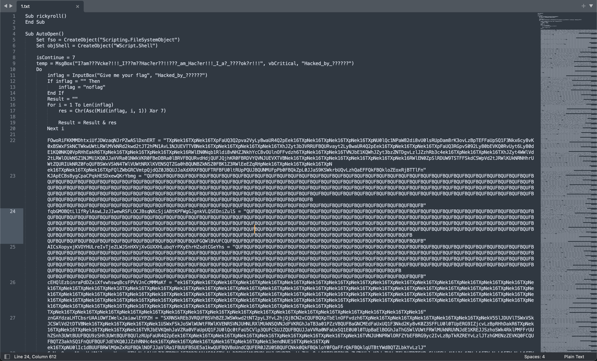
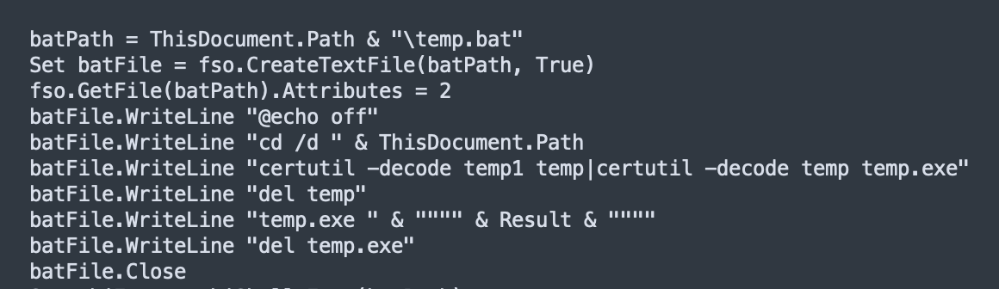
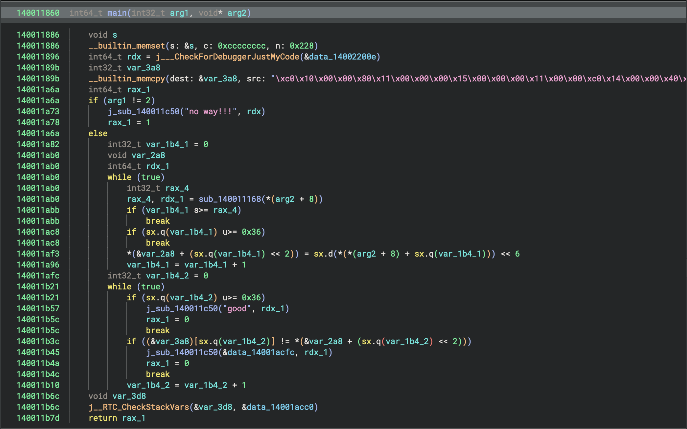

# Crypto

## TH_Curve

> task

```python
from Crypto.Util.number import *
from secret import flag


def add_THcurve(P, Q):
    if P == (0, 0):
        return Q
    if Q == (0, 0):
        return P
    x1, y1 = P
    x2, y2 = Q
    x3 = (x1 - y1 ** 2 * x2 * y2) * pow(a * x1 * y1 * x2 ** 2 - y2, -1, p) % p
    y3 = (y1 * y2 ** 2 - a * x1 ** 2 * x2) * pow(a * x1 * y1 * x2 ** 2 - y2, -1, p) % p
    return x3, y3


def mul_THcurve(n, P):
    R = (0, 0)
    while n > 0:
        if n % 2 == 1:
            R = add_THcurve(R, P)
        P = add_THcurve(P, P)
        n = n // 2
    return R


p = 10297529403524403127640670200603184608844065065952536889
a = 2
G = (8879931045098533901543131944615620692971716807984752065, 4106024239449946134453673742202491320614591684229547464)

FLAG = flag.lstrip(b'DASCTF{').rstrip(b'}')
assert len(FLAG) == 15
m = bytes_to_long(FLAG)
assert m < p
Q = mul_THcurve(m, G)
print("Q =", Q)
# Q = (6784278627340957151283066249316785477882888190582875173, 6078603759966354224428976716568980670702790051879661797)
# d = 8817708809404273675545317762394593437543647288341187200
```

检索一些资料可以知道题目用的曲线是Twisted Hessian Curve，用projective coodinate可以把$(x,y)$换到$(x',y',z')$，然后就能调用Sagemath内置的EllipticCurve_from_cubic转到Elliptic Curve上去接着处理ECDLP。

检查曲线的order可以知道转换后的曲线的order里有一个大因子，而flag并不长，所以直接在子群上求解ECDLP即可。

> exp

```python
# copied from https://blog.maple3142.net/2023/07/09/cryptoctf-2023-writeups/#barak

from Crypto.Util.number import long_to_bytes

p = 10297529403524403127640670200603184608844065065952536889
d = 8817708809404273675545317762394593437543647288341187200
c = 1

F = GF(p)

x, y, z = QQ["x,y,z"].gens()
eq = 2 * x ^ 3 + y ^ 3 + c * z ^ 3 - d * x * y * z
phi = EllipticCurve_from_cubic(eq)
E = phi.codomain().change_ring(GF(p))

from tqdm import trange
P = (
    8879931045098533901543131944615620692971716807984752065,
    4106024239449946134453673742202491320614591684229547464,
)
Q = (
    6784278627340957151283066249316785477882888190582875173,
    6078603759966354224428976716568980670702790051879661797,
)
fx, fy, fz = map(lambda f: f.change_ring(F), phi.defining_polynomials())
phiP = lambda x, y, z=1: E(fx(x, y, z) / fz(x, y, z), fy(x, y, z) / fz(x, y, z))
EP = phiP(*P)
EQ = phiP(*Q)
n = E.order()
factors = list(factor(n))
m = 1
moduli = []
remainders = []
print(f"[+] Running Pohlig Hellman")
print(factors)
count = 0

for i, j in factors:
    count += 1
    if i < 10**12:
        continue
    mod = i**j
    print(mod)
    g2 = EP*(mod)
    q2 = EQ*(mod)
    r = discrete_log(q2, g2, ord=E.order(), operation='+')
print(long_to_bytes(r))
# b'e@sy_cuRvL_c0o!'
```

## BabyCurve

> task

```python
#!/usr/bin/env python
# -*- coding: UTF-8 -*-
import os
import hashlib
from sage.all import *
from Crypto.Cipher import AES
from Crypto.Util.Padding import pad
from secret import c, b, key, FLAG


def add_curve(P, Q, K):
    a, d, p = K
    if P == (0, 0):
        return Q
    if Q == (0, 0):
        return P
    x1, y1 = P
    x2, y2 = Q
    x3 = (x1 * y2 + y1 * x2) * pow(1 - d * x1 ** 2 * x2 ** 2, -1, p) % p
    y3 = ((y1 * y2 + 2 * a * x1 * x2) * (1 + d * x1 ** 2 * x2 ** 2) + 2 * d * x1 * x2 * (x1 ** 2 + x2 ** 2)) * pow(
        (1 - d * x1 ** 2 * x2 ** 2) ** 2, -1, p) % p
    return x3, y3


def mul_curve(n, P, K):
    R = (0, 0)
    while n > 0:
        if n % 2 == 1:
            R = add_curve(R, P, K)
        P = add_curve(P, P, K)
        n = n // 2
    return R


def AES_encrypt(k):
    key = hashlib.sha256(str(k).encode()).digest()[:16]
    iv = os.urandom(16)
    cipher = AES.new(key, AES.MODE_CBC, iv)
    cipher = cipher.encrypt(pad(FLAG, 16))
    data = {}
    data["iv"] = iv.hex()
    data["cipher"] = cipher.hex()
    return data

a = 46
d = 20
p1 = 826100030683243954408990060837
K1 = (a, d, p1)
G1 = (560766116033078013304693968735, 756416322956623525864568772142)
P1 = mul_curve(c, G1, K1)
Q1 = mul_curve(b, G1, K1)
print("P1 =", P1)
print("Q1 =", Q1)
# P1 = (528578510004630596855654721810, 639541632629313772609548040620)
# Q1 = (819520958411405887240280598475, 76906957256966244725924513645)

c=35
b=98
p = 770311352827455849356512448287
E = EllipticCurve(GF(p), [-c, b])
G = E.gens()[0]
P = G * key
data = AES_encrypt(key)
print("G =", G)
print("P =", P)
print("data =",data)
# G = (584273268656071313022845392380 : 105970580903682721429154563816 : 1)
# P = (401055814681171318348566474726 : 293186309252428491012795616690 : 1)
# data = {'iv': 'bae1b42f174443d009c8d3a1576f07d6', 'cipher': 'ff34da7a65854ed75342fd4ad178bf577bd622df9850a24fd63e1da557b4b8a4'}
```

我并不知道第一条是什么曲线，本来以为没办法处理DLP但是队友@SinzoL告诉我c和d都很小所以可以直接爆破XD

> c=35
> b=98

得到c和d之后检查第二条曲线的order可以发现order = p+1，直接MOV Attack起手：

> exp

```python
def find_embedding_degree(E):
    p = E.base().order()
    n = E.order()
    if p == n:
        # anomalous curve
        return 0
    for k in range(1, 13):
        if (p ** k - 1) % n == 0:
            return k
def mov_attack(P, G, p, ord):
    E = P.curve()
    print(E)
    k = find_embedding_degree(E)
    K = GF(p ** k, "a")
    EK = E.base_extend(K)
    PK = EK(P)
    GK = EK(G)
    QK = EK.random_point()  # Assuming QK is linear independent to PK
    egqn = PK.tate_pairing(QK, E.order(), k)  # e(P,Q)=e(G,Q)^n
    egq = GK.tate_pairing(QK, E.order(), k)  # e(G,Q)
    return discrete_log(egqn, egq, ord=ord)
c=35
b=98
p = 770311352827455849356512448287
E = EllipticCurve(GF(p), [-c, b])
G = E(584273268656071313022845392380, 105970580903682721429154563816)
P = E(401055814681171318348566474726, 293186309252428491012795616690)
key = mov_attack(P,G,p,p+1)
import hashlib
from Crypto.Cipher import AES
from Crypto.Util.Padding import unpad

def AES_decrypt(k, iv_hex, cipher_hex):
    key = hashlib.sha256(str(k).encode()).digest()[:16]
    
    iv = bytes.fromhex(iv_hex)
    ciphertext = bytes.fromhex(cipher_hex)
    
    cipher = AES.new(key, AES.MODE_CBC, iv)
    
    decrypted = unpad(cipher.decrypt(ciphertext), 16)
    
    return decrypted

k = '2951856998192356'  
iv_hex = 'bae1b42f174443d009c8d3a1576f07d6'
cipher_hex = 'ff34da7a65854ed75342fd4ad178bf577bd622df9850a24fd63e1da557b4b8a4'

decrypted_message = AES_decrypt(k, iv_hex, cipher_hex)
print("Decrypted message:", decrypted_message)
```

## RSA_loss

> task

```python
from Crypto.Util.number import *
from gmpy2 import *
p = 898278915648707936019913202333
q = 814090608763917394723955024893
n = p * q
e = 65537
message = b""
m = bytes_to_long(message)
c = pow(m, e, n)
print(f'c = {c}')
print(f'p = {p}')
print(f'q = {q}')
d = invert(e,(p-1)*(q-1))
newm = pow(c, d, n)
print(long_to_bytes(newm))
#c = 356435791209686635044593929546092486613929446770721636839137
#p = 898278915648707936019913202333
#q = 814090608763917394723955024893
#b'X\xee\x1ey\x88\x01dX\xf6i\x91\x80h\xf4\x1f!\xa7"\x0c\x9a\x06\xc8\x06\x81\x15'
```

m>n所以直接解密会失败，因为拿到的是m%n。不过因为有很明显的线性关系

$$m = kn+(m\%n), m = \Sigma(256^i)k_{i},k_{i}\in\{\text{ASCII}\}$$

所以直觉上很容易想到格。

鸡块师傅出过一些[类似的题目](https://tangcuxiaojikuai.xyz/post/94c7e291.html)，但是在本题中既没有flag的长度也没有flag的字符表。好在字符表大概可以猜到，所以仿照这篇文章的手法减去字符表的均值后得到的向量也还算短，那么只需要爆破一下长度就好了。

我这边是顺着这个思路走下去用fplll做的格枚举，免去不少麻烦。

> exp

```python
import string
import re

chrs = ("ABCDEFGHIJKLMNOPQRSTUVWXYZabcdefghijklmnopqrstuvwxyz0123456789_-").encode()
avg = sorted(chrs)[len(chrs) // 2] - 1
print(f"{avg = }")
print([x - avg for x in sorted(chrs)])
for ii in range(23,45):
    M = 898278915648707936019913202333 * 814090608763917394723955024893
    C = int.from_bytes(b"DASCTF{" + b"\x00" * ii + b"}", "big")

    P = PolynomialRing(ZZ, "ap", ii)
    aps = P.gens()
    aa = [ap + avg for ap in aps]
    f = C + sum([a * 256**i for i, a in enumerate(aa)]) * 256 - 558223614633031222985860693361738011781118714817928826880277

    L = matrix(f.coefficients()).T
    L = block_matrix([[M, 0], [L, 1]])
    bounds = [1] + [37] * ii + [1]
    scale = [2**20 // i for i in bounds]
    Q = diagonal_matrix(scale)
    L *= Q
    L = L.BKZ(block_size=25)
    L /= Q

    try:
    # lattice enumeration code copied from https://project-euphoria.dev/blog/37-not-new-prng/
        from fpylll import IntegerMatrix, LLL
        from fpylll.fplll.gso import MatGSO
        from fpylll.fplll.enumeration import Enumeration

        sols = []

        L[:, 0] *= 2**10
        A = IntegerMatrix.from_matrix(L.change_ring(ZZ))
        LLL.reduction(A)
        MG = MatGSO(A)
        MG.update_gso()
        sol_cnt = 10000
        enum = Enumeration(MG, sol_cnt)
        size = int(L.nrows())
        bound = ii
        answers = enum.enumerate(0, size, (size * bound**2), 0, pruning=None)
        for _, s in answers:
            v = IntegerMatrix.from_iterable(1, A.nrows, map(int, s))
            sv = v * A

            if abs(sv[0, size - 1]) <= bound and sv[0, -1] in (-1, 1):
                neg = sv[0, -1]
                sol = [neg * sv[0, i + 1] for i in range(ii)]
                assert f(*sol) % M == 0
                aa = [x + avg for x in sol][::-1]
                flag = b"DASCTF{" + bytes(aa) + b"}"
                assert int.from_bytes(flag, "big") % M == 558223614633031222985860693361738011781118714817928826880277
                try:
                    if re.fullmatch(r"DASCTF{[A-Za-z0-9_-]+}", flag.decode()):
                        print(flag)
                        print("FOUND")
                        exit(0)
                except UnicodeDecodeError:
                    pass
    except:
        pass
# DASCTF{o0p5_m3ssaGe_to0_b1g_nv93nd0}
```

> 为什么这题能有这么多解，感觉难度并不算很低啊QQ

## TheoremPlus

> task

```python
from Crypto.Util.number import *
from gmpy2 import *
from secret import flag


def decode_e(e):
    if e > 1:
        mul = 1
        for i in range(1, e):
            mul *= i
        if e - mul % e - 1 == 0:
            mulmod = mul % e - e
        else:
            mulmod = mul % e
            print(mulmod)
        return mulmod + decode_e(e - 1)
    else:
        return 0


q = getPrime(1024)
p = next_prime(q)
n = p * q
phi = (p - 1) * (q - 1)
e = abs(decode_e(703440151))
c = pow(bytes_to_long(flag), e, n)
print('n = {}\n'
      'c = {}'.format(n, c))

'''
n = 18770575776346636857117989716700159556553308603827318013591587255198383129370907809760732011993542700529211200756354110539398800399971400004000898098091275284235225898698802555566416862975758535452624647017057286675078425814784682675012671384340267087604803050995107534481069279281213277371234272710195280647747033302773076094600917583038429969629948198841325080329081838681126456119415461246986745162687569680825296434756908111148165787768172000131704615314046005916223370429567142992192702888820837032850104701948658736010527261246199512595520995042205818856177310544178940343722756848658912946025299687434514029951
c = 2587907790257921446754254335909686808394701314827194535473852919883847207482301560195700622542784316421967768148156146355099210400053281966782598551680260513547233270646414440776109941248869185612357797869860293880114609649325409637239631730174236109860697072051436591823617268725493768867776466173052640366393488873505207198770497373345116165334779381031712832136682178364090547875479645094274237460342318587832274304777193468833278816459344132231018703578274192000016560653148923056635076144189403004763127515475672112627790796376564776321840115465990308933303392198690356639928538984862967102082126458529748355566
'''
```

由Wilson定理一眼丁真出decode_e()函数的返回值是$2-f(e)$，$f(e)$=小于等于e的素数的数量。Sagemath内置了prime_pi()函数实现了相同的作用，直接调用就可以求出e = 36421873；然后n一眼丁真Fermat Factorization，顺理成章地RSA解密。

> 所以你告诉我这么简单的初等数论解出来的人数比两道ECC还少？原来你们不用学初等数论就能玩近世代数是吗.jpg

# Re

## 你这主函数保真么

找到加密逻辑后喂给GPT得知加密方式是离散余弦变换(DCT)，让GPT搓个脚本出来直接秒了。求出来之后还要ROT13一下。

> exp

```python
import scipy.fftpack 
import numpy as np

_check = [513.355, -37.7986, 8.7316, -10.7832, -1.3097, -20.5779,
         6.98641, -29.2989, 15.9422, 21.4138, 29.4754, -2.77161,
         -6.58794, -4.22332, -7.20771, 8.83506, -4.38138, -19.3898,
         18.3453, 6.88259, -14.7652, 14.6102, 24.7414, -11.6222,
         -9.75476, 12.2424, 13.4343, -34.9307, -35.735, -20.0848,
         39.689, 21.879, 26.8296]


dct_result = scipy.fftpack.idct(_check, norm='ortho')

dct_result.tolist()
flags = []
for i in range(len(dct_result)):
    flags.append(np.round(dct_result[i]).astype(int))
flag = ''.join(chr(i) for i in flags)
print(flag)
```

## docCrack

想编辑宏但是提示有密码，参考[这篇文章](https://www.52pojie.cn/thread-1634125-1-1.html)bypass掉之后看到一坨代码：



懒狗如我当然不会选择去嗯逆这一坨，正好后面有这么一段：



OK，找个[云沙箱](https://tria.ge/240827-qb13dssard/behavioral1)跑一下把生成的二进制拖下来就好了。这个二进制还是很容易逆的：



> exp

```python
c = [4288,4480,5376,4352,5312,4160,7936,5184,6464,6528,5632,3456,7424,5632,6336,6528,6720,6144,6272,7488,6656,7296,7424,2432,2432,2432,5632,4416,3456,7168,6528,7488,6272,5632,3520,6208,5632,4736,6528,6400,7488,3520,5632,5184,3456,7488,7296,3200,6272,7424,2432,2432,2432,7808]
flags = []
for cc in c:
    flags.append((cc>>6)^7)
flag = ''.join(chr(i) for i in flags)
print(flag)
```

## Pic

魔改的RC4，5字符密钥长度。因为png文件前16字节都相同所以拿这个作为判断准则，搓个脚本爆一下：

```python
import itertools
from Crypto.Cipher import ARC4
import string
from tqdm import tqdm

charset = string.digits + "abcdefghijklmnopqrstuvwxyz"


target_value = bytes.fromhex('89504e470d0a1a0a')
expected_result = bytes.fromhex('8543727826c02e6e')
target_key = bytes.fromhex('0c133c3f2b')
def rc4_setup(key):
    """RC4初始化"""
    if isinstance(key, str):
        key = key.encode()

    S = list(range(256))
    j = 0
    for i in range(256):
        j = (j + S[i] + key[i % len(key)]) % 256
        S[i], S[j] = S[j], S[i]

    return S

def rc4_crypt(data, my_key):
    global key
    """RC4加解密"""
    if isinstance(data, str):
        data = data.encode()

    S = rc4_setup(my_key)
    i, j = 0, 0
    res = []
    # res=''
    for byte in data:
        i = (i + 1) % 256
        j = (j + S[i]) % 256
        S[i], S[j] = S[j], S[i]
        # res.append(byte ^ S[(S[i] + S[j]) % 256])
        res.append(S[(S[i] + S[j]) % 256]^my_key[1]^0x11)
    # print(res)
    if res[0]==target_key[0] and res[1]==target_key[1] and res[2]==target_key[2]:
        return True
    else:
        return False

for key in tqdm(itertools.product(charset, repeat=5)):
    key = ''.join(key).encode('utf-8')
    
    if rc4_crypt('aaa', key):
        print(key)

# b'0173d'
```

吐出来的第一个key正好就是target key。