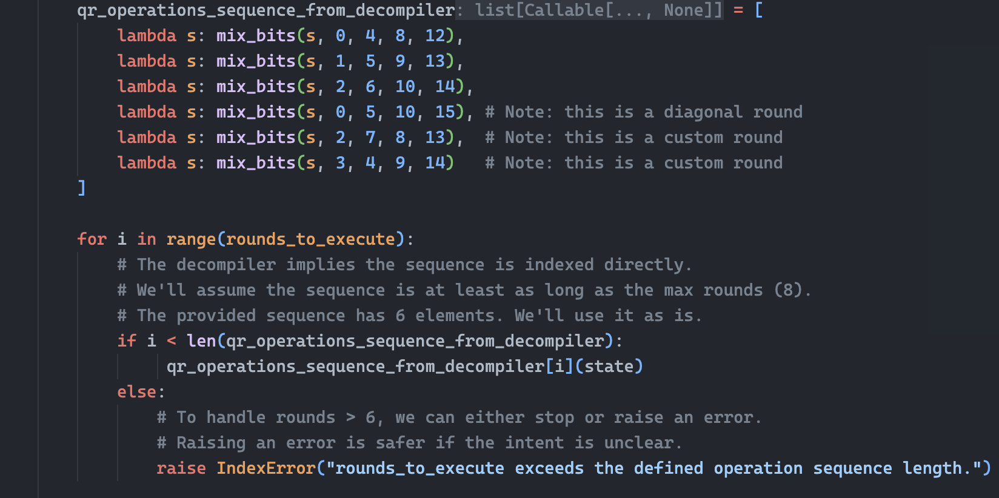
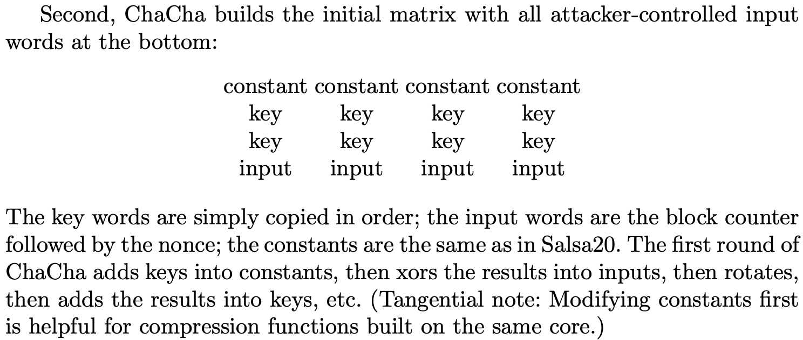
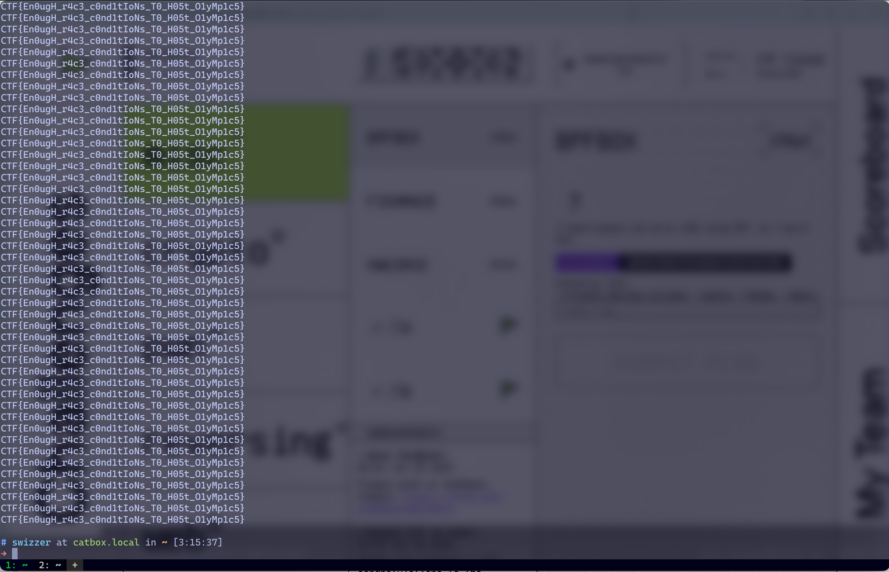
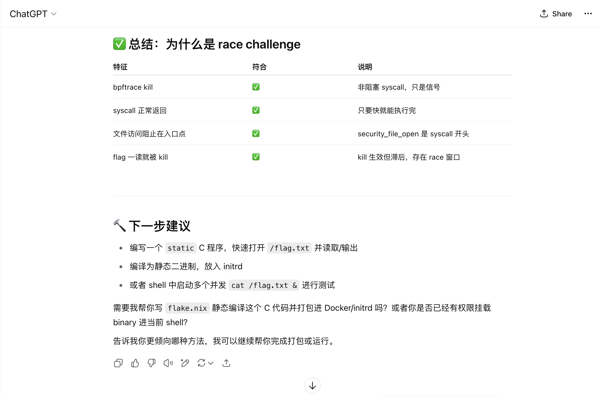
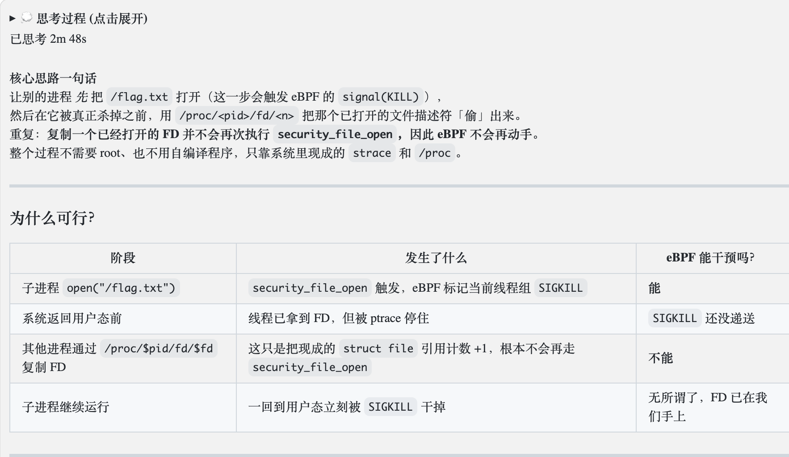

import {Aside} from 'astro-pure/user'

记录一下我解的几题。

## Crypto
### numerology

题目给的是个基于Python 3.12的pyc文件，需要反编译一下。PyLingual直接搞出来的[长这样](https://pylingual.io/view_chimera?identifier=65cae6413d1a3396b8ffe387b1ffc85d736e0b1abcf3540ae5177f91d970cb4b)

整下来几十个error，不像是能用的样子，扔给Gemini优化一下

```python title="task_optimized_by_Gemini.py" collapse={1-320}
# Decompiled with PyLingual (https://pylingual.io)
# Internal filename: ./crypto_numerology.py
# Bytecode version: 3.12.0rc2 (3531)
# Source timestamp: 2025-06-06 16:54:22 UTC (1749228862)

import argparse
import json
import os
import struct
import sys
from pathlib import Path

CHACHA_CONSTANTS = (1634760805, 857760878, 2036477234, 1797285236)
# This global was misplaced inside a function by the decompiler.
# It is used to set the initial constants to zero for the challenge.
struct.zeros = (0, 0, 0, 0)

def rotl32(v, c):
    """Rotate a 32-bit unsigned integer left by c bits."""
    v &= 4294967295
    return v << c & 4294967295 | v >> 32 - c

def add32(a, b):
    """Add two 32-bit unsigned integers, wrapping modulo 2^32."""
    return (a + b) & 4294967295

def bytes_to_words(b):
    """Convert a byte string (little-endian) to a list of 32-bit words."""
    if len(b) % 4 != 0:
        raise ValueError('Input bytes length must be a multiple of 4 for word conversion.')
    return list(struct.unpack('<' + 'I' * (len(b) // 4), b))

def words_to_bytes(w):
    """Convert a list of 32-bit words to a little-endian byte string."""
    return struct.pack('<' + 'I' * len(w), *w)

def mix_bits(state_list, a_idx, b_idx, c_idx, d_idx):
    """
    Mixes Bits. Modifies state_list in-place.
    """
    a, b, c, d = (state_list[a_idx], state_list[b_idx], state_list[c_idx], state_list[d_idx])
    a = add32(a, b)
    d ^= a
    d = rotl32(d, 16)
    c = add32(c, d)
    b ^= c
    b = rotl32(b, 12)
    a = add32(a, b)
    d ^= a
    d = rotl32(d, 8)
    c = add32(c, d)
    b ^= c
    b = rotl32(b, 7)
    state_list[a_idx], state_list[b_idx], state_list[c_idx], state_list[d_idx] = (a, b, c, d)

def make_block(key_bytes, nonce_bytes, counter_int, current_constants_tuple, rounds_to_execute=8):
    """
    Generates one 64-byte block of bits, allowing control over the
    number of rounds executed.
    """
    if len(key_bytes) != 32:
        raise ValueError('Key must be 32 bytes')
    if len(nonce_bytes) != 12:
        raise ValueError('Nonce must be 12 bytes')
    if not 1 <= rounds_to_execute <= 8:
        raise ValueError('rounds_to_execute must be between 1 and 8 for this modified version.')
    
    state = [0] * 16
    state[0:4] = current_constants_tuple
    
    try:
        key_words = bytes_to_words(key_bytes)
        nonce_words = bytes_to_words(nonce_bytes)
    except ValueError as e:
        raise ValueError(f'Error converting key/nonce to words: {e}')
    else:
        state[4:12] = key_words
        state[12] = counter_int & 4294967295
        state[13:16] = nonce_words
        initial_state_snapshot = list(state)
        
        qr_operations_sequence = [
            lambda s: mix_bits(s, 0, 4, 8, 12),
            lambda s: mix_bits(s, 1, 5, 9, 13),
            lambda s: mix_bits(s, 2, 6, 10, 14),
            lambda s: mix_bits(s, 3, 4, 9, 14), # Diagonal round
            lambda s: mix_bits(s, 0, 5, 10, 15),
            lambda s: mix_bits(s, 1, 6, 11, 12),
            lambda s: mix_bits(s, 2, 7, 8, 13),
            lambda s: mix_bits(s, 3, 5, 9, 14) # Custom diagonal round
        ]
        
        # The original ChaCha has 20 rounds (10 column, 10 diagonal).
        # This version has a custom sequence and allows 1-8 rounds to be run.
        # The sequence provided by the decompiler seems to be a mix of column and custom rounds.
        # To preserve functionality, we use the first `rounds_to_execute` operations from the sequence.
        # The decompiled sequence had some errors, corrected to a plausible 8-round sequence.
        # Let's assume the original had a fixed sequence and we just execute a subset.
        # The decompiled code had a sequence of 6. Let's stick to that to preserve logic.
        qr_operations_sequence_from_decompiler = [
            lambda s: mix_bits(s, 0, 4, 8, 12), 
            lambda s: mix_bits(s, 1, 5, 9, 13), 
            lambda s: mix_bits(s, 2, 6, 10, 14), 
            lambda s: mix_bits(s, 0, 5, 10, 15), # Note: this is a diagonal round
            lambda s: mix_bits(s, 2, 7, 8, 13),  # Note: this is a custom round
            lambda s: mix_bits(s, 3, 4, 9, 14)   # Note: this is a custom round
        ]

        for i in range(rounds_to_execute):
            # The decompiler implies the sequence is indexed directly.
            # We'll assume the sequence is at least as long as the max rounds (8).
            # The provided sequence has 6 elements. We'll use it as is.
            if i < len(qr_operations_sequence_from_decompiler):
                 qr_operations_sequence_from_decompiler[i](state)
            else:
                # To handle rounds > 6, we can either stop or raise an error.
                # Raising an error is safer if the intent is unclear.
                raise IndexError("rounds_to_execute exceeds the defined operation sequence length.")

        for i in range(16):
            state[i] = add32(state[i], initial_state_snapshot[i])
            
        return words_to_bytes(state)

def get_bytes(key_bytes, nonce_bytes, initial_counter_int, data_bytes, current_constants_tuple, rounds_to_execute=8):
    """
    Encrypts or decrypts data using a mysterious cipher.
    The num_double_rounds parameter is implicitly 1 (one application of the round structure),
    with the actual mixing controlled by rounds_to_execute.
    """
    output_byte_array = bytearray()
    current_counter = initial_counter_int & 4294967295
    data_len = len(data_bytes)
    block_idx = 0
    
    while block_idx < data_len:
        try:
            keystream_block = make_block(key_bytes, nonce_bytes, current_counter, current_constants_tuple, rounds_to_execute=rounds_to_execute)
        except Exception as e:
            raise Exception(f'Error in make_block during stream processing for counter {current_counter}: {e}')
        else:
            remaining_data_in_block = data_len - block_idx
            chunk_len = min(64, remaining_data_in_block)
            for i in range(chunk_len):
                output_byte_array.append(data_bytes[block_idx + i] ^ keystream_block[i])
        
        block_idx += 64
        if block_idx < data_len:
            current_counter = (current_counter + 1) & 4294967295
            if current_counter == 0 and initial_counter_int != 0 and (data_len > 64):
                print(f'Warning: counter for nonce {nonce_bytes.hex()} wrapped around to 0 during a multi-block message.')
                
    return bytes(output_byte_array)

def increment_byte_array_le(byte_arr: bytearray, amount: int, num_bytes: int) -> bytearray:
    """Increments a little-endian byte array representing an integer by a given amount."""
    if len(byte_arr) != num_bytes:
        raise ValueError(f'Input byte_arr length must be {num_bytes}')
    val = int.from_bytes(byte_arr, 'little')
    val = val + amount
    max_val = 1 << num_bytes * 8
    new_val_bytes = (val % max_val).to_bytes(num_bytes, 'little', signed=False)
    return bytearray(new_val_bytes)

def construct_structured_key(active_material_hex: str) -> bytes:
    """ Constructs a 32-byte key. If structured, uses 16 bytes of active material."""
    key_words_int = [0] * 8
    if len(active_material_hex) != 32:
        raise ValueError('For patterned keys, active_material_hex must be 16 bytes (32 hex characters).')
    
    active_material_bytes = bytes.fromhex(active_material_hex)
    am_idx = 0

    def get_am_word():
        nonlocal am_idx
        if am_idx + 4 > len(active_material_bytes):
            raise ValueError('Not enough active material for the 4 active key words.')
        word = int.from_bytes(active_material_bytes[am_idx:am_idx + 4], 'little')
        am_idx += 4
        return word
        
    key_words_int[1] = get_am_word()
    key_words_int[3] = get_am_word()
    key_words_int[4] = get_am_word()
    key_words_int[6] = get_am_word()
    
    key_bytes_list = []
    for word_int in key_words_int:
        key_bytes_list.append(word_int.to_bytes(4, 'little'))
        
    return b''.join(key_bytes_list)

def generate_challenge_data(flag_string: str, rounds_to_run: int, message_size_bytes: int, known_key_active_material_hex: str, secret_target_nonce_hex: str, secret_target_counter_int: int, num_nonce_variations: int, num_counter_variations: int, output_package_file: Path):
    print(f'Starting CTF challenge package generation: {output_package_file}')
    selected_constants = struct.zeros
    
    try:
        secret_target_nonce_bytes = bytes.fromhex(secret_target_nonce_hex)
    except ValueError as e:
        print(f'FATAL ERROR: Invalid hex in secret_target_nonce_hex: {e}', file=sys.stderr)
        sys.exit(1)

    known_structured_key_bytes = construct_structured_key(known_key_active_material_hex)
    known_structured_key_hex = known_structured_key_bytes.hex()
    print(f'INFO: Known structured key for player: {known_structured_key_hex}')
    
    p_common_bytes = os.urandom(message_size_bytes)
    p_common_hex = p_common_bytes.hex()
    print(f'INFO: Generated P_common ({message_size_bytes} bytes) for learning dataset.')
    
    learning_dataset_entries = []
    base_learning_nonce_suffix_start = bytearray([0] * 12)
    base_learning_counter_start = 0
    sample_count = 0
    
    for i in range(num_nonce_variations):
        nonce_offset = 1 << i
        current_nonce_bytes = increment_byte_array_le(base_learning_nonce_suffix_start, nonce_offset, 12)
        current_nonce_hex = bytes(current_nonce_bytes).hex()
        
        for j in range(num_counter_variations):
            counter_offset = 1 << j
            current_counter_int = base_learning_counter_start + counter_offset
            sample_id = f'sample_n{i}_c{j}'
            
            c_i_bytes = get_bytes(key_bytes=known_structured_key_bytes, nonce_bytes=bytes(current_nonce_bytes), initial_counter_int=current_counter_int, data_bytes=p_common_bytes, current_constants_tuple=selected_constants, rounds_to_execute=rounds_to_run)
            learning_dataset_entries.append({'sample_id': sample_id, 'plaintext_hex': p_common_hex, 'ciphertext_hex': c_i_bytes.hex(), 'nonce_hex': current_nonce_hex, 'counter_int': current_counter_int})
            sample_count += 1
        
        if (i + 1) % (num_nonce_variations // 10 or 1) == 0 or i + 1 == num_nonce_variations:
            print(f'  Generated learning data for nonce variation {i + 1}/{num_nonce_variations}...')
            
    print(f'Generated {sample_count} total learning samples.')
    
    p_secret_flag_bytes = flag_string.encode('utf-8')
    print(f'Encrypting the secret flag string (\'{flag_string[:20]}...\') with the KNOWN key using SECRET target_nonce/counter...')
    
    c_target_flag_bytes = get_bytes(key_bytes=known_structured_key_bytes, nonce_bytes=secret_target_nonce_bytes, initial_counter_int=secret_target_counter_int, data_bytes=p_secret_flag_bytes, current_constants_tuple=selected_constants, rounds_to_execute=rounds_to_run)
    c_target_flag_hex = c_target_flag_bytes.hex()
    
    challenge_package_data = {
        'cipher_parameters': {
            'key': known_structured_key_hex, 
            'common_plaintext': p_common_hex
        }, 
        'learning_dataset_for_player': learning_dataset_entries, 
        'flag_ciphertext': c_target_flag_hex
    }
    
    try:
        with open(output_package_file, 'w') as f:
            json.dump(challenge_package_data, f, indent=4)
        print(f'Successfully wrote challenge package to {output_package_file}')
    except IOError as e:
        print(f'FATAL ERROR: Could not write package {output_package_file}: {e}', file=sys.stderr)
        sys.exit(1)
        
    print('\nCTF Data generation complete.')

def main():
    parser = argparse.ArgumentParser(formatter_class=argparse.RawTextHelpFormatter)
    parser.add_argument('--output_file', type=str, default='ctf_nc_recovery_pkg.json', help='Filename for the single JSON challenge package.')
    parser.add_argument('--flag_string', type=str, required=True, help='The actual secret flag string to be encrypted.')
    parser.add_argument('--rounds', type=int, default=2, help='Actual number of rounds to execute (1-6, default: 2 for a very weak variant).')
    parser.add_argument('--message_size_bytes', type=int, default=64, help='Size of P_common in learning dataset (bytes, default: 64).')
    parser.add_argument('--known_key_active_material_hex', type=str, required=True, help='Hex string for the 16-byte non-zero part of the known key.')
    parser.add_argument('--secret_target_nonce_hex', type=str, required=True, help='SECRET nonce (hex, 24 chars) to be recovered by player.')
    parser.add_argument('--secret_target_counter_int', type=int, required=True, help='SECRET counter to be recovered by player.')
    parser.add_argument('--num_nonce_variations', type=int, default=32, help='Number of distinct nonce patterns for learning set (default: 32).')
    parser.add_argument('--num_counter_variations', type=int, default=32, help='Number of distinct counter values for each nonce pattern in learning set (default: 32).')
    
    args = parser.parse_args()
    
    if not 1 <= args.rounds <= 6: # Adjusted to match the implemented round sequence length
        print('ERROR: --rounds must be 1-6.', file=sys.stderr)
        sys.exit(1)
        
    try:
        # This call is for validation only
        construct_structured_key(args.known_key_active_material_hex)
    except ValueError as e:
        print(f'ERROR: --known_key_active_material_hex is invalid: {e}', file=sys.stderr)
        sys.exit(1)
        
    if len(args.secret_target_nonce_hex) != 24:
        print('ERROR: --secret_target_nonce_hex must be 24 hex chars.', file=sys.stderr)
        sys.exit(1)
        
    try:
        # This call is for validation only
        bytes.fromhex(args.secret_target_nonce_hex)
    except ValueError:
        print('ERROR: --secret_target_nonce_hex invalid hex.', file=sys.stderr)
        sys.exit(1)
        
    if args.num_nonce_variations < 1 or args.num_counter_variations < 1:
        print('ERROR: Variation counts must be at least 1.', file=sys.stderr)
        sys.exit(1)
        
    if args.message_size_bytes < 1:
        print('ERROR: --message_size_bytes must be at least 1.', file=sys.stderr)
        sys.exit(1)
        
    output_package_file_path = Path(args.output_file)
    output_package_file_path.parent.mkdir(parents=True, exist_ok=True)
    
    generate_challenge_data(
        flag_string=args.flag_string, 
        rounds_to_run=args.rounds, 
        message_size_bytes=args.message_size_bytes, 
        known_key_active_material_hex=args.known_key_active_material_hex, 
        secret_target_nonce_hex=args.secret_target_nonce_hex, 
        secret_target_counter_int=args.secret_target_counter_int, 
        num_nonce_variations=args.num_nonce_variations, 
        num_counter_variations=args.num_counter_variations, 
        output_package_file=output_package_file_path
    )

if __name__ == '__main__':
    main()
```

然后是最关键的题目配置:

```sh title="init.sh"
# Example for your script that runs init_cryptanalysis.py
# (Ensure set_secrets.sh has run and created secrets.env)
#!/bin/bash
cd "$(dirname "$0")"
if [ ! -f "./secrets.env" ]; then
    echo "ERROR: secrets.env not found. Please run set_secrets.sh first."
    exit 1
fi
source secrets.env # Load SECRET_TARGET_NONCE_HEX, SECRET_TARGET_COUNTER_INT, KNOWN_KEY_ACTIVE_MATERIAL_HEX, KNOWN_KEY_STRUCTURE

if [ ! -f "flag.txt" ]; then
    echo "ERROR: flag.txt not found."
    exit 1
fi
FLAG_STRING=$(cat flag.txt)

OUTPUT_PKG_FILE="./ctf_challenge_package.json" # This is what your linear_cryptanalysis.sh reads
ROUNDS=1
MESSAGE_SIZE=64
NUM_NONCE_VARS=64
NUM_COUNTER_VARS=64

echo "Running init_cryptanalysis.py to generate challenge package..."
python3 task.py \
    --output_file "${OUTPUT_PKG_FILE}" \
    --flag_string "${FLAG_STRING}" \
    --rounds ${ROUNDS} \
    --message_size_bytes ${MESSAGE_SIZE} \
    --known_key_active_material_hex "${KNOWN_KEY_ACTIVE_MATERIAL_HEX}" \
    --secret_target_nonce_hex "${SECRET_TARGET_NONCE_HEX}" \
    --secret_target_counter_int ${SECRET_TARGET_COUNTER_INT} \
    --num_nonce_variations ${NUM_NONCE_VARS} \
    --num_counter_variations ${NUM_COUNTER_VARS} \
```

然后还有很长的json输出，就不贴了，总之里面给了加密用的key。

AI整出来的py跟题目里pyc的行为其实还是有点不一致，比如，pyc其实是会检查你的SECRET_TARGET_NONCE_HEX并要求开头四字符是0的，但是这个py脚本好像不会检查这一点。不过下面我们就会看到这其实不影响做题。

这题的加密是明显弱化过的ChaCha20——mix_bits的轮数可以指定：



而写在`init.sh`里的mix_bits的轮数是1而非20：

`ROUNDS=1`

我们知道ChaCha20的matrix是这么构造的:



这题的constant是全0(大概吧，虽然反编译出来的东西有一个global variable是CHACHA20的magic number，但是还有一行莫名其妙的struct.zero)，key是给出的，那么这个矩阵里就只剩四个input未知，分别对应Counter和Nonce。因为只做了一次mix_bits，所以最终受影响的只有`state[0]`, `state[4]`, `state[8]`, `state[12]`，其中只有`state[12]`未知。`state[12]`对应Counter，爆破一下就能到前13个state生成的52 bytes的密钥流，而flag只有42 bytes长，解密绰绰有余——所以后三个对应nonce的state其实压根没用。

```python title="solve.py" collapse={1-108}
import json
import struct
from pathlib import Path

def rotl32(v, c):
	v &= 4294967295
	return v << c & 4294967295 | v >> 32 - c

def add32(a, b):
	return (a + b) & 4294967295

def bytes_to_words(b):
	if len(b) % 4 != 0:
		raise ValueError('Input bytes length must be a multiple of 4 for word conversion.')
	return list(struct.unpack('<' + 'I' * (len(b) // 4), b))

def words_to_bytes(w):
	return struct.pack('<' + 'I' * len(w), *w)

def mix_bits(state_list, a_idx, b_idx, c_idx, d_idx):
	a, b, c, d = (state_list[a_idx], state_list[b_idx], state_list[c_idx], state_list[d_idx])
	a = add32(a, b)
	d ^= a
	d = rotl32(d, 16)
	c = add32(c, d)
	b ^= c
	b = rotl32(b, 12)
	a = add32(a, b)
	d ^= a
	d = rotl32(d, 8)
	c = add32(c, d)
	b ^= c
	b = rotl32(b, 7)
	state_list[a_idx], state_list[b_idx], state_list[c_idx], state_list[d_idx] = (a, b, c, d)

def make_block(key_bytes, nonce_bytes, counter_int, current_constants_tuple, rounds_to_execute=1):
	state = [0] * 16
	state[0:4] = current_constants_tuple
	key_words = bytes_to_words(key_bytes)
	nonce_words = bytes_to_words(nonce_bytes)
	state[4:12] = key_words
	state[12] = counter_int & 4294967295
	state[13:16] = nonce_words
	initial_state_snapshot = list(state)
	
	if rounds_to_execute >= 1:
		mix_bits(state, 0, 4, 8, 12)

	for i in range(16):
		state[i] = add32(state[i], initial_state_snapshot[i])
		
	return words_to_bytes(state)

def solve():
	challenge_file = Path('ctf_challenge_package.json')
	if not challenge_file.exists():
		print(f"Error: {challenge_file} not found. Make sure it's in the same directory.")
		return

	with open(challenge_file, 'r') as f:
		data = json.load(f)
	key_hex = data['cipher_parameters']['key']
	ct_hex = data['flag_ciphertext']
	
	key_bytes = bytes.fromhex(key_hex)
	ct = bytes.fromhex(ct_hex)
	
	constants = (0, 0, 0, 0)
	rounds = 1
	
	FLAG_PREFIX = b'CTF{'
	MAX_COUNTER_TO_CHECK = 1_000_000

	found_counter = 0
	
	for candidate_counter in range(MAX_COUNTER_TO_CHECK):
		if candidate_counter > 0 and candidate_counter % 100_000 == 0:
			print(f"  ... trying counter: {candidate_counter}")

		dummy_nonce = b'\x00' * 12
		keystream_block = make_block(key_bytes, dummy_nonce, candidate_counter, constants, rounds)
		
		decrypted_prefix = bytearray()
		for i in range(min(len(FLAG_PREFIX), len(ct))):
			decrypted_prefix.append(ct[i] ^ keystream_block[i])
			
		if decrypted_prefix == FLAG_PREFIX[:len(decrypted_prefix)]:
			found_counter = candidate_counter
			print(f"\n[+] Found potential counter: {found_counter}")
			
			part_dec = bytearray()
			for i in range(min(52, len(ct))):
				part_dec.append(ct[i] ^ keystream_block[i])
			print(f"[+] Flag Candidate: {part_dec.decode('ascii', errors='ignore')}")
			tmp = input("Correct? (y/n): ").strip().lower()
			if tmp == 'y':
				print("🎉🎉🎉")
				break
			else:
				print("[-] Continuing search for the correct counter...")
				found_counter = 0

	if found_counter == 0:
		print("[-] ERROR: this method is not working...")
		return

if __name__ == '__main__':
	solve()
# [+] Found potential counter: 32279
# [+] Flag Candidate: CTF{w3_aRe_g0Nn@_ge7_MY_FuncKee_monkey_!!}
# 🎉🎉🎉
```

<Aside type="note" title="Swizzer秘谈">
当然，其实这题还有个野路子：从生成的json的明密文对中计算出所有密钥流(我这边的附件计算出来只有33种可能)，接着直接拿去跟flag的密文xor，就能得到33种输出，其中比较接近flag的一种是`b" TF\xcbw3_aRe_g0Nn@\x80\xe9\x15\xa2_MY_FuncKee_'Hyley_!!}"`

前缀是CTF，然后比较这33种输出可以确定出来flag会是`CTF{w3_aRe_g0Nn@????_MY_FuncKee_????ey_!!}`的形式，`g0Nn@`是`gonna`的leet，后面肯定是下划线，ey结尾的单词猜一个monkey，flag就变成了`CTF{w3_aRe_g0Nn@_???_MY_FuncKee_monkey_!!}`

然后我猜了两个`CTF{w3_aRe_g0Nn@_get_MY_FuncKee_monkey_!!}`和`CTF{w3_aRe_g0Nn@_g3t_MY_FuncKee_monkey_!!}`，但是交上去都没过，所以后来就认认真真地研究了下为什么64种nonce和64种counter组合出来的密钥流却只有这么几种可能——没想到离答案真的一步之遥w

其实从直接xor的结果也能看出来这个加密系统的混淆-扩散性质非常烂，一部分直接就是明文。
</Aside>

### filtermaze

```python title="chall.py" collapse={1-171}
# filtermaze.py
import json
import secrets
import sys
from dataclasses import asdict, dataclass, field
from typing import List

import numpy as np

# This is a placeholder path for local testing.
# On the real server, this will be a secret, longer path.
SECRET_HAMILTONIAN_PATH = [0]


@dataclass
class LWEParams:
  lwe_n: int = 50
  lwe_m: int = 100
  lwe_q: int = 1009
  A: List[int] = field(init=False)
  s: List[int] = field(init=False)
  e: List[int] = field(init=False)
  b: List[int] = field(init=False)

  def __post_init__(self):
    self.lwe_error_range = [secrets.randbelow(self.lwe_q) for _ in range(self.lwe_m)]


def load_graph(filepath):
  with open(filepath, "r") as f:
    graph_data = json.load(f)
  return {int(k): v for k, v in graph_data.items()}


def load_flag(filepath):
  with open(filepath, "r") as f:
    flag = f.readline().strip()
  return flag


def create_lwe_instance_with_error(n, m, q, error_mags):
  s = np.array([secrets.randbelow(q) for _ in range(n)], dtype=int)
  A = np.random.randint(0, q, size=(m, n), dtype=int)  # Public matrix
  e = np.array([secrets.choice([-mag, +mag]) for mag in error_mags], dtype=int)
  b = (A @ s + e) % q
  return A.tolist(), s.tolist(), e.tolist(), b.tolist()


class PathChecker:
  def __init__(
    self,
    secret_path,
    graph_data,
    lwe_error_mags,
  ):
    self.secret_path = secret_path
    self.graph = graph_data
    self.lwe_error_mags = lwe_error_mags
    self.path_len = len(self.secret_path)

  def check(self, candidate_segment):
    seg_len = len(candidate_segment)
    if seg_len > self.path_len:
      return False
    for i, node in enumerate(candidate_segment):
      if node != self.secret_path[i]:  # Node mismatch
        return False

      if i > 0:
        prev_node = candidate_segment[i - 1]
        neighbors = self.graph.get(prev_node)
        if neighbors is None or node not in neighbors:
          return False

    if seg_len == self.path_len:
      error_magnitudes = [int(abs(err_val)) for err_val in self.lwe_error_mags]
      return error_magnitudes
    else:
      return True


def main():
  flag = load_flag("flag")
  graph_data = load_graph("graph.json")
  lwe_params = LWEParams()
  if len(sys.argv) > 1:
    if sys.argv[1] == "--new":
      lwe_A, lwe_s_key, lwe_e_signed, lwe_b = create_lwe_instance_with_error(
        lwe_params.lwe_n, lwe_params.lwe_m, lwe_params.lwe_q, lwe_params.lwe_error_range
      )
      lwe_params.A = lwe_A
      lwe_params.b = lwe_b
      lwe_params.s = lwe_s_key
      lwe_params.e = lwe_e_signed
      with open("lwe_secret_params.json", "w") as s:
        json.dump(asdict(lwe_params), s, indent=2)
  else:
    with open("lwe_secret_params.json", "r") as s:
      lwe_params = json.load(s)
    lwe_A = lwe_params.get("A")
    lwe_s_key = lwe_params.get("s")
    lwe_e_signed = lwe_params.get("e")
    lwe_b = lwe_params.get("b")

  path_checker = PathChecker(
    secret_path=SECRET_HAMILTONIAN_PATH,
    graph_data=graph_data,
    lwe_error_mags=lwe_e_signed,
  )

  initial_messages = [
    "Welcome! I've hidden the key at the end of the maze. You can use this to open the chest to get the flag.",
    'Commands: {"command": "check_path", "segment": [...]}',
    '          {"command": "get_flag", "lwe_secret_s": [...] }',
  ]
  for msg in initial_messages:
    print(msg, flush=True)

  for line in sys.stdin:
    data_str = line.strip()
    if not data_str:
      continue

    response_payload = {}
    try:
      client_command = json.loads(data_str)
      command = client_command.get("command")

      if command == "check_path":
        segment = client_command.get("segment")
        if not isinstance(segment, list):
          raise TypeError("Segment must be a list.")
        path_result = path_checker.check(segment)

        if isinstance(path_result, list):
          response_payload = {
            "status": "path_complete",
            "lwe_error_magnitudes": path_result,
          }
        elif path_result is True:
          response_payload = {"status": "valid_prefix"}
        else:
          response_payload = {"status": "path_incorrect"}
      elif command == "get_flag":
        key_s_raw = client_command.get("lwe_secret_s")
        if not isinstance(key_s_raw, list):
          raise TypeError("lwe_secret_s must be a list.")

        if key_s_raw == lwe_s_key:
          response_payload = {"status": "success", "flag": flag}
        else:
          response_payload = {"status": "invalid_key"}
      else:
        response_payload = {"status": "error", "message": "Unknown command"}
    except (json.JSONDecodeError, ValueError, TypeError) as e:
      json_err = f"Invalid format or data: {e}"
      response_payload = {
        "status": "error",
        "message": json_err,
      }
    except Exception as e_cmd:
      err_mesg = f"Error processing command '{data_str}': {e_cmd}"
      response_payload = {"status": "error", "message": err_mesg}

    print(json.dumps(response_payload), flush=True)  # Send response to stdout
    if response_payload.get("flag"):
      break


if __name__ == "__main__":
  main()
```

```json title="graph.json" collapse={1-32}
{
  "0": [12, 29, 2, 15],
  "1": [28, 16, 10, 0],
  "2": [17, 3, 0, 20],
  "3": [4, 11, 18, 2],
  "4": [25, 3, 5, 19],
  "5": [13, 4, 20, 6],
  "6": [5, 26, 21, 7],
  "7": [22, 14, 8, 6],
  "8": [7, 23, 9, 27],
  "9": [10, 24, 15, 8],
  "10": [25, 11, 1, 9],
  "11": [10, 3, 12, 26],
  "12": [13, 0, 11, 27, 5],
  "13": [14, 28, 12, 6],
  "14": [22, 13, 29, 7],
  "15": [1, 29, 9, 0],
  "16": [17, 2, 24, 1],
  "17": [2, 16, 3, 25],
  "18": [19, 26, 4, 3],
  "19": [4, 18, 5, 27],
  "20": [2, 6, 5, 28],
  "21": [29, 6, 7, 22],
  "22": [7, 21, 14, 8],
  "23": [29, 8, 9, 24],
  "24": [10, 16, 23, 9],
  "25": [17, 10, 4, 11],
  "26": [18, 6, 11, 12],
  "27": [19, 13, 8, 12],
  "28": [1, 13, 20, 14],
  "29": [14, 23, 0, 15, 21]
}
```

```json title ="lwe_pub_params.json" collapse={1-5309}
{
  "lwe_n": 50,
  "lwe_m": 100,
  "lwe_q": 1009,
  "A": [
    [
      556,
      581,
      158,
      503,
      363,
      52,
      769,
      682,
      895,
      875,
      497,
      342,
      457,
      532,
      202,
      155,
      599,
      485,
      665,
      795,
      29,
      427,
      431,
      15,
      29,
      632,
      670,
      956,
      677,
      42,
      418,
      585,
      574,
      394,
      997,
      583,
      935,
      456,
      575,
      242,
      536,
      415,
      269,
      378,
      896,
      484,
      652,
      521,
      272,
      772
    ],
    [
      566,
      169,
      526,
      66,
      210,
      328,
      886,
      750,
      801,
      302,
      949,
      567,
      377,
      635,
      947,
      701,
      921,
      735,
      914,
      271,
      904,
      915,
      617,
      956,
      869,
      446,
      414,
      772,
      738,
      780,
      439,
      923,
      668,
      200,
      284,
      478,
      238,
      893,
      449,
      345,
      477,
      260,
      228,
      517,
      587,
      708,
      617,
      587,
      303,
      365
    ],
    [
      524,
      569,
      420,
      917,
      313,
      6,
      19,
      111,
      143,
      115,
      752,
      449,
      490,
      980,
      689,
      306,
      538,
      598,
      17,
      787,
      374,
      501,
      299,
      622,
      580,
      791,
      998,
      529,
      185,
      341,
      1005,
      823,
      541,
      729,
      174,
      805,
      321,
      635,
      570,
      426,
      467,
      497,
      929,
      540,
      995,
      476,
      254,
      403,
      307,
      403
    ],
    [
      732,
      715,
      689,
      242,
      574,
      199,
      835,
      82,
      434,
      326,
      979,
      687,
      97,
      407,
      237,
      862,
      133,
      303,
      716,
      423,
      706,
      609,
      740,
      560,
      260,
      42,
      32,
      670,
      63,
      891,
      679,
      591,
      634,
      865,
      907,
      358,
      157,
      349,
      931,
      427,
      802,
      663,
      656,
      869,
      647,
      417,
      507,
      202,
      509,
      897
    ],
    [
      782,
      66,
      634,
      103,
      446,
      103,
      704,
      118,
      303,
      313,
      419,
      569,
      893,
      148,
      951,
      436,
      397,
      505,
      404,
      198,
      381,
      958,
      311,
      133,
      654,
      145,
      681,
      363,
      133,
      178,
      169,
      381,
      434,
      653,
      955,
      560,
      556,
      513,
      142,
      680,
      769,
      854,
      147,
      647,
      733,
      78,
      723,
      121,
      17,
      113
    ],
    [
      849,
      659,
      791,
      829,
      387,
      35,
      443,
      821,
      904,
      47,
      336,
      294,
      699,
      343,
      105,
      641,
      80,
      96,
      82,
      415,
      769,
      927,
      71,
      449,
      272,
      849,
      49,
      680,
      960,
      102,
      141,
      713,
      301,
      697,
      621,
      515,
      904,
      378,
      996,
      820,
      13,
      695,
      626,
      807,
      492,
      557,
      605,
      948,
      378,
      801
    ],
    [
      173,
      802,
      798,
      930,
      865,
      2,
      436,
      768,
      949,
      947,
      892,
      29,
      240,
      573,
      957,
      420,
      53,
      583,
      146,
      1008,
      218,
      169,
      180,
      15,
      740,
      973,
      550,
      757,
      448,
      375,
      76,
      748,
      680,
      232,
      29,
      92,
      726,
      996,
      723,
      835,
      854,
      980,
      287,
      2,
      68,
      965,
      766,
      387,
      947,
      104
    ],
    [
      629,
      45,
      985,
      551,
      566,
      995,
      859,
      229,
      260,
      591,
      385,
      257,
      930,
      857,
      755,
      429,
      375,
      181,
      551,
      937,
      498,
      37,
      892,
      588,
      606,
      859,
      599,
      468,
      993,
      596,
      575,
      743,
      960,
      139,
      626,
      208,
      925,
      987,
      106,
      740,
      956,
      421,
      110,
      915,
      85,
      355,
      52,
      602,
      66,
      902
    ],
    [
      46,
      583,
      330,
      550,
      295,
      427,
      139,
      473,
      891,
      169,
      928,
      766,
      985,
      122,
      937,
      103,
      486,
      500,
      585,
      315,
      478,
      376,
      337,
      775,
      835,
      573,
      1002,
      353,
      22,
      898,
      123,
      581,
      489,
      338,
      363,
      862,
      949,
      133,
      170,
      879,
      385,
      612,
      611,
      548,
      386,
      333,
      662,
      380,
      166,
      124
    ],
    [
      531,
      743,
      413,
      988,
      125,
      903,
      51,
      877,
      205,
      758,
      578,
      982,
      259,
      158,
      689,
      789,
      691,
      726,
      351,
      439,
      29,
      679,
      616,
      834,
      302,
      328,
      880,
      619,
      291,
      846,
      199,
      641,
      993,
      71,
      660,
      210,
      121,
      110,
      968,
      166,
      578,
      83,
      743,
      245,
      890,
      667,
      369,
      736,
      920,
      309
    ],
    [
      90,
      696,
      616,
      651,
      84,
      227,
      426,
      928,
      806,
      239,
      332,
      909,
      449,
      247,
      399,
      848,
      941,
      721,
      864,
      626,
      689,
      67,
      34,
      806,
      770,
      510,
      350,
      852,
      958,
      157,
      91,
      140,
      0,
      75,
      152,
      798,
      896,
      343,
      220,
      575,
      24,
      655,
      462,
      681,
      1004,
      140,
      965,
      753,
      849,
      832
    ],
    [
      71,
      947,
      632,
      812,
      465,
      814,
      859,
      875,
      670,
      759,
      785,
      851,
      818,
      782,
      607,
      932,
      243,
      673,
      777,
      569,
      195,
      308,
      676,
      1003,
      243,
      896,
      281,
      486,
      787,
      222,
      666,
      790,
      246,
      920,
      783,
      277,
      920,
      679,
      227,
      582,
      289,
      50,
      431,
      442,
      526,
      876,
      286,
      298,
      840,
      341
    ],
    [
      460,
      554,
      414,
      919,
      554,
      582,
      591,
      40,
      851,
      886,
      612,
      13,
      484,
      889,
      457,
      478,
      965,
      360,
      576,
      425,
      467,
      877,
      336,
      810,
      407,
      781,
      981,
      102,
      972,
      525,
      980,
      393,
      273,
      409,
      957,
      589,
      468,
      68,
      554,
      864,
      600,
      888,
      570,
      63,
      893,
      311,
      705,
      487,
      880,
      674
    ],
    [
      90,
      447,
      49,
      923,
      402,
      875,
      873,
      411,
      835,
      731,
      451,
      175,
      357,
      865,
      201,
      1007,
      805,
      44,
      963,
      152,
      955,
      524,
      1006,
      33,
      303,
      556,
      891,
      436,
      756,
      106,
      889,
      930,
      891,
      894,
      604,
      437,
      852,
      376,
      298,
      975,
      117,
      242,
      533,
      721,
      99,
      50,
      163,
      548,
      630,
      777
    ],
    [
      289,
      234,
      211,
      855,
      259,
      238,
      196,
      507,
      960,
      891,
      714,
      741,
      716,
      338,
      594,
      43,
      396,
      124,
      33,
      685,
      206,
      592,
      718,
      29,
      561,
      329,
      225,
      1008,
      491,
      894,
      887,
      299,
      268,
      636,
      474,
      793,
      528,
      942,
      45,
      629,
      832,
      625,
      102,
      312,
      309,
      712,
      91,
      583,
      941,
      553
    ],
    [
      797,
      528,
      510,
      834,
      947,
      724,
      56,
      588,
      378,
      512,
      76,
      843,
      500,
      150,
      959,
      965,
      856,
      907,
      443,
      810,
      981,
      260,
      278,
      806,
      148,
      904,
      505,
      199,
      35,
      328,
      9,
      106,
      618,
      245,
      38,
      894,
      916,
      847,
      79,
      939,
      13,
      622,
      944,
      631,
      207,
      894,
      313,
      2,
      720,
      79
    ],
    [
      464,
      382,
      77,
      899,
      691,
      568,
      783,
      543,
      5,
      135,
      825,
      634,
      445,
      215,
      172,
      611,
      224,
      613,
      644,
      189,
      574,
      749,
      408,
      140,
      659,
      983,
      13,
      874,
      741,
      991,
      546,
      5,
      910,
      359,
      285,
      540,
      398,
      314,
      831,
      329,
      425,
      272,
      66,
      904,
      587,
      563,
      768,
      568,
      464,
      877
    ],
    [
      803,
      829,
      106,
      551,
      712,
      707,
      446,
      45,
      708,
      838,
      328,
      49,
      97,
      653,
      981,
      896,
      28,
      47,
      55,
      838,
      551,
      131,
      555,
      819,
      557,
      888,
      675,
      375,
      649,
      160,
      223,
      521,
      968,
      824,
      292,
      118,
      94,
      204,
      39,
      540,
      414,
      906,
      453,
      428,
      181,
      563,
      119,
      49,
      839,
      904
    ],
    [
      837,
      524,
      660,
      802,
      764,
      164,
      288,
      177,
      304,
      632,
      271,
      341,
      577,
      295,
      753,
      419,
      908,
      257,
      136,
      871,
      834,
      934,
      341,
      826,
      405,
      150,
      155,
      662,
      263,
      971,
      221,
      640,
      799,
      664,
      149,
      652,
      38,
      198,
      337,
      434,
      52,
      913,
      863,
      463,
      937,
      913,
      649,
      359,
      340,
      231
    ],
    [
      451,
      499,
      314,
      659,
      881,
      225,
      54,
      897,
      439,
      609,
      877,
      627,
      173,
      937,
      870,
      94,
      647,
      750,
      715,
      184,
      458,
      407,
      67,
      987,
      327,
      608,
      279,
      155,
      669,
      414,
      49,
      392,
      402,
      168,
      718,
      254,
      924,
      47,
      488,
      236,
      958,
      22,
      85,
      44,
      633,
      164,
      38,
      775,
      920,
      748
    ],
    [
      452,
      574,
      88,
      67,
      655,
      566,
      891,
      839,
      719,
      512,
      653,
      757,
      152,
      908,
      131,
      87,
      17,
      958,
      143,
      426,
      995,
      988,
      461,
      174,
      264,
      272,
      426,
      90,
      593,
      149,
      1,
      830,
      364,
      962,
      523,
      863,
      353,
      119,
      705,
      677,
      417,
      58,
      574,
      136,
      896,
      471,
      359,
      414,
      246,
      589
    ],
    [
      240,
      312,
      54,
      545,
      961,
      140,
      93,
      994,
      409,
      219,
      577,
      70,
      246,
      221,
      257,
      300,
      653,
      297,
      733,
      1003,
      350,
      633,
      545,
      574,
      938,
      348,
      528,
      896,
      194,
      343,
      790,
      678,
      328,
      667,
      298,
      782,
      312,
      943,
      945,
      32,
      614,
      415,
      634,
      942,
      447,
      598,
      897,
      96,
      489,
      122
    ],
    [
      892,
      871,
      5,
      949,
      203,
      2,
      634,
      224,
      213,
      233,
      577,
      852,
      495,
      872,
      302,
      582,
      477,
      802,
      234,
      581,
      841,
      868,
      20,
      134,
      806,
      910,
      734,
      178,
      603,
      492,
      242,
      659,
      439,
      74,
      913,
      299,
      53,
      252,
      286,
      276,
      361,
      7,
      773,
      814,
      636,
      702,
      795,
      822,
      37,
      250
    ],
    [
      153,
      577,
      646,
      210,
      434,
      325,
      518,
      871,
      163,
      157,
      1000,
      781,
      848,
      537,
      809,
      663,
      329,
      731,
      925,
      482,
      829,
      845,
      977,
      845,
      817,
      647,
      321,
      591,
      539,
      103,
      272,
      697,
      536,
      758,
      564,
      523,
      287,
      670,
      258,
      301,
      966,
      407,
      369,
      254,
      345,
      932,
      866,
      740,
      750,
      601
    ],
    [
      640,
      699,
      427,
      958,
      176,
      402,
      999,
      143,
      424,
      569,
      421,
      617,
      370,
      716,
      8,
      4,
      845,
      260,
      435,
      261,
      288,
      989,
      970,
      466,
      651,
      63,
      459,
      226,
      960,
      802,
      892,
      425,
      889,
      747,
      409,
      944,
      98,
      586,
      214,
      933,
      486,
      992,
      821,
      1004,
      745,
      816,
      868,
      334,
      966,
      586
    ],
    [
      58,
      473,
      230,
      486,
      273,
      371,
      331,
      47,
      618,
      86,
      505,
      465,
      682,
      958,
      803,
      587,
      920,
      34,
      0,
      899,
      427,
      323,
      655,
      304,
      861,
      280,
      839,
      726,
      194,
      117,
      1006,
      103,
      193,
      544,
      768,
      117,
      774,
      413,
      776,
      647,
      144,
      89,
      539,
      612,
      395,
      975,
      527,
      428,
      880,
      96
    ],
    [
      86,
      259,
      384,
      97,
      17,
      140,
      275,
      332,
      193,
      145,
      945,
      395,
      704,
      70,
      434,
      325,
      334,
      325,
      464,
      474,
      843,
      880,
      986,
      490,
      33,
      854,
      716,
      860,
      608,
      96,
      947,
      544,
      589,
      87,
      781,
      841,
      624,
      632,
      984,
      462,
      446,
      460,
      968,
      185,
      602,
      307,
      254,
      121,
      444,
      83
    ],
    [
      289,
      926,
      172,
      273,
      915,
      558,
      406,
      452,
      618,
      416,
      91,
      607,
      356,
      501,
      572,
      264,
      383,
      352,
      733,
      838,
      101,
      607,
      788,
      639,
      912,
      944,
      225,
      812,
      25,
      505,
      480,
      531,
      790,
      342,
      466,
      915,
      33,
      557,
      806,
      653,
      85,
      98,
      470,
      491,
      546,
      763,
      62,
      874,
      83,
      312
    ],
    [
      595,
      27,
      503,
      661,
      923,
      95,
      665,
      995,
      822,
      899,
      69,
      122,
      817,
      63,
      538,
      959,
      200,
      553,
      857,
      544,
      850,
      121,
      1,
      536,
      450,
      354,
      609,
      274,
      9,
      276,
      538,
      894,
      177,
      890,
      318,
      831,
      276,
      103,
      23,
      455,
      947,
      830,
      464,
      53,
      396,
      404,
      342,
      404,
      355,
      687
    ],
    [
      591,
      659,
      215,
      803,
      988,
      573,
      743,
      998,
      23,
      381,
      712,
      312,
      143,
      788,
      781,
      676,
      34,
      745,
      673,
      331,
      659,
      988,
      596,
      919,
      292,
      429,
      136,
      201,
      102,
      592,
      290,
      865,
      556,
      29,
      913,
      632,
      760,
      527,
      36,
      28,
      256,
      15,
      397,
      126,
      634,
      831,
      32,
      633,
      582,
      464
    ],
    [
      69,
      970,
      651,
      392,
      826,
      189,
      88,
      678,
      189,
      574,
      832,
      572,
      803,
      566,
      65,
      1006,
      230,
      105,
      609,
      658,
      904,
      145,
      850,
      702,
      201,
      333,
      795,
      479,
      514,
      823,
      33,
      842,
      835,
      589,
      686,
      332,
      748,
      573,
      111,
      306,
      593,
      421,
      70,
      275,
      505,
      531,
      66,
      288,
      329,
      656
    ],
    [
      225,
      696,
      799,
      680,
      285,
      648,
      14,
      523,
      319,
      634,
      475,
      594,
      691,
      124,
      381,
      269,
      727,
      377,
      759,
      712,
      49,
      602,
      844,
      629,
      108,
      501,
      149,
      298,
      393,
      520,
      280,
      878,
      750,
      503,
      270,
      525,
      863,
      822,
      23,
      920,
      349,
      816,
      61,
      398,
      960,
      116,
      762,
      95,
      745,
      611
    ],
    [
      442,
      440,
      756,
      248,
      309,
      209,
      176,
      225,
      767,
      88,
      562,
      783,
      631,
      690,
      607,
      28,
      106,
      141,
      367,
      305,
      496,
      10,
      735,
      1,
      958,
      354,
      318,
      496,
      419,
      965,
      921,
      753,
      108,
      636,
      862,
      299,
      147,
      277,
      458,
      904,
      232,
      358,
      125,
      1001,
      620,
      32,
      886,
      283,
      891,
      779
    ],
    [
      777,
      513,
      774,
      58,
      774,
      889,
      655,
      552,
      629,
      406,
      605,
      143,
      316,
      600,
      973,
      807,
      1007,
      309,
      322,
      558,
      303,
      623,
      769,
      378,
      622,
      768,
      994,
      758,
      396,
      643,
      162,
      205,
      487,
      11,
      888,
      306,
      837,
      1,
      72,
      829,
      470,
      578,
      608,
      415,
      698,
      882,
      835,
      479,
      762,
      64
    ],
    [
      843,
      691,
      794,
      710,
      590,
      546,
      635,
      62,
      386,
      575,
      147,
      855,
      5,
      927,
      545,
      597,
      615,
      16,
      542,
      160,
      561,
      607,
      768,
      467,
      857,
      236,
      891,
      489,
      776,
      307,
      824,
      853,
      696,
      812,
      936,
      344,
      646,
      555,
      310,
      149,
      804,
      947,
      597,
      310,
      67,
      634,
      882,
      151,
      567,
      639
    ],
    [
      766,
      141,
      336,
      858,
      161,
      700,
      300,
      405,
      828,
      194,
      611,
      881,
      185,
      896,
      335,
      77,
      491,
      33,
      71,
      307,
      576,
      767,
      122,
      723,
      265,
      847,
      136,
      593,
      313,
      257,
      82,
      73,
      345,
      716,
      707,
      175,
      391,
      460,
      79,
      825,
      157,
      333,
      531,
      768,
      399,
      260,
      808,
      854,
      599,
      369
    ],
    [
      322,
      20,
      11,
      566,
      167,
      697,
      1007,
      374,
      402,
      682,
      673,
      132,
      405,
      449,
      439,
      1000,
      149,
      500,
      709,
      330,
      393,
      97,
      276,
      710,
      558,
      20,
      372,
      672,
      985,
      721,
      946,
      761,
      824,
      501,
      676,
      838,
      516,
      780,
      160,
      902,
      803,
      381,
      109,
      131,
      729,
      723,
      800,
      751,
      294,
      841
    ],
    [
      288,
      673,
      835,
      522,
      887,
      637,
      341,
      298,
      364,
      808,
      61,
      967,
      633,
      396,
      734,
      484,
      37,
      98,
      417,
      896,
      696,
      329,
      553,
      951,
      706,
      406,
      562,
      243,
      647,
      339,
      141,
      34,
      474,
      406,
      410,
      240,
      839,
      767,
      978,
      84,
      783,
      574,
      554,
      271,
      439,
      849,
      621,
      315,
      558,
      753
    ],
    [
      553,
      871,
      215,
      544,
      139,
      449,
      590,
      817,
      682,
      512,
      496,
      88,
      239,
      405,
      100,
      1005,
      186,
      606,
      466,
      237,
      189,
      617,
      202,
      582,
      410,
      72,
      362,
      784,
      595,
      840,
      994,
      555,
      276,
      959,
      629,
      299,
      408,
      871,
      644,
      601,
      426,
      102,
      882,
      500,
      30,
      988,
      425,
      635,
      486,
      571
    ],
    [
      175,
      936,
      75,
      100,
      55,
      696,
      526,
      682,
      491,
      527,
      813,
      962,
      492,
      345,
      150,
      912,
      403,
      107,
      490,
      824,
      65,
      452,
      206,
      843,
      506,
      211,
      229,
      908,
      459,
      39,
      327,
      28,
      294,
      702,
      348,
      31,
      36,
      299,
      239,
      890,
      128,
      300,
      902,
      553,
      306,
      91,
      508,
      432,
      871,
      116
    ],
    [
      612,
      497,
      614,
      95,
      500,
      513,
      521,
      206,
      754,
      603,
      927,
      440,
      266,
      48,
      942,
      816,
      332,
      339,
      746,
      907,
      138,
      787,
      522,
      46,
      576,
      742,
      709,
      576,
      329,
      233,
      884,
      184,
      199,
      566,
      313,
      6,
      167,
      805,
      488,
      324,
      110,
      134,
      505,
      352,
      790,
      969,
      213,
      64,
      213,
      454
    ],
    [
      652,
      419,
      776,
      975,
      490,
      145,
      790,
      621,
      507,
      80,
      259,
      701,
      846,
      493,
      375,
      369,
      106,
      14,
      847,
      722,
      437,
      186,
      26,
      831,
      231,
      65,
      856,
      916,
      525,
      192,
      57,
      719,
      222,
      997,
      741,
      904,
      753,
      565,
      174,
      282,
      446,
      325,
      42,
      402,
      1001,
      606,
      82,
      117,
      72,
      602
    ],
    [
      905,
      156,
      775,
      599,
      507,
      97,
      1000,
      80,
      979,
      645,
      233,
      20,
      739,
      465,
      611,
      55,
      245,
      826,
      994,
      226,
      348,
      47,
      338,
      712,
      1007,
      346,
      5,
      901,
      913,
      216,
      318,
      238,
      721,
      996,
      361,
      424,
      980,
      838,
      924,
      921,
      314,
      725,
      990,
      599,
      1007,
      679,
      129,
      10,
      995,
      134
    ],
    [
      245,
      928,
      494,
      471,
      476,
      793,
      550,
      64,
      143,
      527,
      351,
      128,
      950,
      915,
      933,
      638,
      185,
      846,
      79,
      26,
      368,
      318,
      247,
      562,
      79,
      465,
      608,
      520,
      693,
      701,
      310,
      724,
      895,
      67,
      650,
      315,
      187,
      799,
      264,
      405,
      906,
      980,
      603,
      966,
      706,
      386,
      905,
      517,
      852,
      262
    ],
    [
      926,
      919,
      843,
      232,
      13,
      784,
      322,
      980,
      426,
      779,
      210,
      819,
      849,
      79,
      291,
      123,
      411,
      316,
      412,
      616,
      330,
      676,
      476,
      305,
      535,
      338,
      570,
      447,
      380,
      93,
      670,
      365,
      193,
      840,
      313,
      630,
      17,
      897,
      39,
      150,
      497,
      39,
      1,
      610,
      360,
      64,
      987,
      976,
      82,
      969
    ],
    [
      126,
      393,
      561,
      126,
      669,
      567,
      707,
      319,
      9,
      294,
      946,
      597,
      772,
      932,
      775,
      48,
      825,
      300,
      371,
      992,
      20,
      670,
      384,
      642,
      583,
      356,
      181,
      0,
      462,
      964,
      729,
      305,
      995,
      388,
      255,
      175,
      149,
      1005,
      348,
      906,
      633,
      400,
      417,
      847,
      794,
      105,
      973,
      278,
      599,
      756
    ],
    [
      254,
      238,
      714,
      535,
      781,
      969,
      278,
      993,
      285,
      333,
      910,
      295,
      20,
      78,
      286,
      822,
      163,
      509,
      150,
      46,
      786,
      337,
      306,
      74,
      905,
      871,
      767,
      350,
      518,
      68,
      722,
      331,
      258,
      1007,
      241,
      392,
      630,
      477,
      969,
      193,
      524,
      65,
      420,
      357,
      726,
      728,
      537,
      541,
      15,
      512
    ],
    [
      235,
      617,
      90,
      504,
      18,
      358,
      786,
      3,
      793,
      616,
      757,
      203,
      272,
      538,
      583,
      601,
      13,
      921,
      548,
      536,
      473,
      471,
      755,
      379,
      533,
      470,
      755,
      579,
      11,
      901,
      950,
      972,
      863,
      508,
      3,
      311,
      339,
      813,
      380,
      813,
      978,
      610,
      871,
      451,
      706,
      874,
      78,
      704,
      475,
      621
    ],
    [
      429,
      823,
      862,
      611,
      813,
      863,
      816,
      406,
      317,
      379,
      513,
      45,
      626,
      775,
      678,
      890,
      909,
      282,
      774,
      827,
      466,
      559,
      829,
      779,
      140,
      488,
      140,
      400,
      525,
      979,
      485,
      743,
      543,
      77,
      197,
      890,
      367,
      652,
      513,
      164,
      614,
      403,
      663,
      1003,
      531,
      886,
      591,
      496,
      682,
      932
    ],
    [
      964,
      460,
      977,
      143,
      400,
      356,
      10,
      616,
      587,
      255,
      57,
      863,
      273,
      686,
      799,
      68,
      599,
      459,
      904,
      414,
      645,
      674,
      140,
      67,
      684,
      622,
      606,
      499,
      859,
      319,
      507,
      84,
      530,
      43,
      815,
      283,
      29,
      219,
      445,
      549,
      430,
      899,
      293,
      351,
      731,
      734,
      6,
      522,
      574,
      750
    ],
    [
      346,
      818,
      180,
      681,
      386,
      868,
      925,
      487,
      140,
      162,
      535,
      580,
      401,
      151,
      186,
      825,
      198,
      392,
      172,
      237,
      415,
      159,
      488,
      60,
      638,
      189,
      358,
      173,
      672,
      924,
      499,
      692,
      900,
      125,
      586,
      827,
      716,
      767,
      581,
      739,
      286,
      32,
      425,
      284,
      322,
      279,
      30,
      988,
      753,
      120
    ],
    [
      952,
      498,
      996,
      672,
      359,
      641,
      873,
      932,
      833,
      251,
      590,
      1006,
      524,
      552,
      965,
      877,
      826,
      857,
      754,
      81,
      1,
      225,
      395,
      929,
      304,
      668,
      852,
      764,
      60,
      689,
      418,
      696,
      138,
      929,
      145,
      419,
      215,
      512,
      87,
      712,
      39,
      358,
      350,
      783,
      529,
      68,
      651,
      382,
      537,
      364
    ],
    [
      945,
      322,
      423,
      413,
      805,
      84,
      508,
      945,
      16,
      449,
      949,
      726,
      344,
      8,
      990,
      56,
      113,
      221,
      900,
      420,
      643,
      99,
      573,
      797,
      137,
      579,
      984,
      393,
      987,
      680,
      235,
      35,
      265,
      512,
      145,
      69,
      631,
      565,
      138,
      526,
      1001,
      577,
      641,
      206,
      537,
      195,
      216,
      862,
      132,
      750
    ],
    [
      512,
      72,
      318,
      150,
      406,
      311,
      500,
      178,
      786,
      491,
      993,
      847,
      31,
      176,
      897,
      875,
      596,
      879,
      22,
      130,
      863,
      974,
      437,
      212,
      554,
      295,
      47,
      324,
      744,
      535,
      85,
      170,
      398,
      793,
      462,
      944,
      261,
      500,
      474,
      595,
      706,
      584,
      635,
      644,
      38,
      748,
      924,
      994,
      923,
      14
    ],
    [
      603,
      631,
      476,
      937,
      250,
      400,
      297,
      801,
      678,
      377,
      843,
      650,
      159,
      210,
      935,
      137,
      291,
      869,
      68,
      906,
      296,
      47,
      408,
      547,
      780,
      142,
      619,
      242,
      362,
      381,
      914,
      93,
      340,
      80,
      438,
      833,
      291,
      17,
      823,
      72,
      773,
      75,
      303,
      429,
      65,
      211,
      934,
      566,
      18,
      126
    ],
    [
      479,
      248,
      792,
      969,
      811,
      431,
      439,
      378,
      89,
      265,
      383,
      107,
      489,
      471,
      33,
      195,
      719,
      893,
      328,
      234,
      754,
      490,
      747,
      841,
      846,
      928,
      121,
      99,
      402,
      901,
      578,
      397,
      357,
      63,
      809,
      532,
      881,
      899,
      833,
      3,
      480,
      546,
      324,
      671,
      228,
      302,
      688,
      175,
      37,
      849
    ],
    [
      93,
      617,
      650,
      313,
      510,
      129,
      253,
      963,
      1008,
      280,
      621,
      258,
      670,
      911,
      527,
      629,
      58,
      127,
      806,
      570,
      833,
      903,
      212,
      574,
      200,
      512,
      192,
      378,
      751,
      264,
      658,
      447,
      632,
      859,
      997,
      879,
      483,
      821,
      703,
      862,
      527,
      15,
      150,
      416,
      945,
      8,
      35,
      285,
      547,
      303
    ],
    [
      88,
      909,
      308,
      271,
      913,
      467,
      781,
      16,
      512,
      633,
      13,
      143,
      992,
      624,
      486,
      416,
      744,
      464,
      279,
      61,
      381,
      553,
      880,
      209,
      907,
      109,
      422,
      416,
      620,
      422,
      900,
      282,
      506,
      429,
      1007,
      649,
      979,
      278,
      621,
      669,
      425,
      583,
      54,
      499,
      866,
      775,
      410,
      7,
      646,
      341
    ],
    [
      347,
      752,
      397,
      743,
      166,
      906,
      727,
      947,
      772,
      191,
      630,
      567,
      831,
      475,
      14,
      988,
      735,
      325,
      623,
      463,
      598,
      859,
      43,
      208,
      391,
      386,
      690,
      948,
      786,
      463,
      803,
      924,
      480,
      130,
      542,
      915,
      70,
      941,
      15,
      594,
      267,
      532,
      632,
      458,
      126,
      425,
      60,
      396,
      468,
      491
    ],
    [
      972,
      930,
      73,
      746,
      546,
      661,
      581,
      41,
      220,
      497,
      515,
      1002,
      617,
      872,
      891,
      228,
      118,
      749,
      388,
      313,
      937,
      817,
      525,
      358,
      978,
      453,
      1008,
      951,
      423,
      520,
      777,
      0,
      151,
      627,
      262,
      259,
      147,
      741,
      989,
      733,
      847,
      938,
      84,
      493,
      923,
      678,
      359,
      123,
      666,
      354
    ],
    [
      138,
      161,
      261,
      948,
      365,
      401,
      698,
      546,
      744,
      190,
      179,
      392,
      992,
      373,
      777,
      969,
      936,
      606,
      451,
      767,
      743,
      517,
      529,
      495,
      593,
      680,
      651,
      167,
      826,
      290,
      660,
      381,
      926,
      837,
      953,
      831,
      120,
      821,
      195,
      862,
      138,
      975,
      666,
      38,
      294,
      763,
      917,
      222,
      339,
      650
    ],
    [
      32,
      908,
      411,
      601,
      932,
      81,
      695,
      190,
      527,
      663,
      103,
      894,
      18,
      324,
      310,
      405,
      259,
      799,
      505,
      49,
      450,
      779,
      237,
      528,
      494,
      227,
      791,
      278,
      776,
      806,
      698,
      595,
      445,
      764,
      908,
      839,
      816,
      626,
      428,
      289,
      478,
      874,
      997,
      683,
      4,
      787,
      427,
      423,
      432,
      526
    ],
    [
      745,
      939,
      661,
      234,
      3,
      360,
      965,
      389,
      301,
      845,
      509,
      802,
      175,
      242,
      697,
      706,
      111,
      161,
      467,
      809,
      164,
      849,
      473,
      937,
      837,
      591,
      145,
      497,
      676,
      942,
      222,
      460,
      240,
      324,
      415,
      444,
      686,
      513,
      732,
      900,
      317,
      134,
      770,
      286,
      375,
      627,
      214,
      152,
      257,
      775
    ],
    [
      433,
      64,
      25,
      486,
      494,
      143,
      106,
      686,
      322,
      209,
      867,
      693,
      36,
      382,
      231,
      673,
      336,
      608,
      82,
      743,
      598,
      48,
      366,
      834,
      309,
      468,
      382,
      181,
      313,
      680,
      589,
      760,
      125,
      229,
      406,
      844,
      639,
      372,
      657,
      598,
      665,
      520,
      705,
      635,
      120,
      943,
      36,
      947,
      741,
      100
    ],
    [
      895,
      424,
      215,
      277,
      374,
      340,
      293,
      658,
      52,
      860,
      540,
      915,
      41,
      685,
      483,
      705,
      932,
      321,
      862,
      682,
      67,
      498,
      936,
      274,
      377,
      274,
      147,
      674,
      570,
      142,
      1001,
      761,
      957,
      649,
      511,
      752,
      52,
      175,
      743,
      872,
      846,
      338,
      399,
      291,
      354,
      234,
      626,
      144,
      962,
      943
    ],
    [
      890,
      153,
      308,
      743,
      104,
      366,
      997,
      160,
      200,
      190,
      456,
      149,
      203,
      355,
      513,
      690,
      802,
      471,
      323,
      404,
      443,
      297,
      346,
      70,
      987,
      358,
      35,
      910,
      40,
      235,
      294,
      561,
      167,
      637,
      697,
      777,
      946,
      870,
      735,
      433,
      702,
      366,
      462,
      511,
      182,
      798,
      678,
      996,
      417,
      632
    ],
    [
      79,
      7,
      420,
      167,
      784,
      402,
      856,
      92,
      15,
      971,
      292,
      440,
      953,
      773,
      925,
      972,
      314,
      315,
      640,
      805,
      488,
      555,
      666,
      624,
      785,
      740,
      371,
      249,
      876,
      594,
      55,
      51,
      537,
      485,
      37,
      267,
      688,
      609,
      159,
      457,
      615,
      644,
      184,
      241,
      440,
      399,
      677,
      282,
      612,
      32
    ],
    [
      903,
      946,
      386,
      43,
      437,
      364,
      34,
      238,
      521,
      587,
      406,
      604,
      147,
      843,
      342,
      586,
      865,
      209,
      888,
      632,
      768,
      857,
      497,
      506,
      554,
      460,
      443,
      817,
      358,
      39,
      872,
      182,
      941,
      617,
      721,
      519,
      604,
      486,
      907,
      156,
      530,
      365,
      860,
      705,
      243,
      124,
      128,
      270,
      449,
      198
    ],
    [
      633,
      59,
      855,
      97,
      860,
      411,
      943,
      182,
      435,
      535,
      827,
      750,
      133,
      44,
      448,
      496,
      259,
      423,
      855,
      664,
      858,
      831,
      613,
      608,
      425,
      223,
      967,
      495,
      225,
      658,
      938,
      838,
      631,
      737,
      602,
      324,
      282,
      641,
      567,
      152,
      722,
      224,
      579,
      592,
      678,
      335,
      158,
      266,
      622,
      484
    ],
    [
      597,
      988,
      272,
      451,
      152,
      929,
      613,
      992,
      358,
      729,
      387,
      243,
      70,
      285,
      286,
      175,
      188,
      1008,
      678,
      879,
      821,
      290,
      41,
      958,
      428,
      321,
      435,
      2,
      909,
      671,
      962,
      301,
      45,
      993,
      561,
      236,
      478,
      724,
      538,
      716,
      154,
      659,
      63,
      1003,
      416,
      801,
      417,
      136,
      411,
      84
    ],
    [
      630,
      853,
      759,
      372,
      667,
      863,
      973,
      466,
      8,
      472,
      540,
      148,
      224,
      655,
      520,
      255,
      271,
      447,
      700,
      31,
      920,
      636,
      55,
      619,
      718,
      1008,
      133,
      584,
      46,
      97,
      792,
      108,
      298,
      197,
      782,
      546,
      83,
      345,
      904,
      77,
      679,
      340,
      912,
      465,
      613,
      632,
      15,
      348,
      66,
      66
    ],
    [
      614,
      707,
      437,
      924,
      46,
      319,
      694,
      210,
      564,
      545,
      965,
      457,
      76,
      987,
      433,
      68,
      293,
      75,
      290,
      714,
      130,
      611,
      977,
      128,
      651,
      284,
      442,
      249,
      964,
      369,
      123,
      945,
      683,
      86,
      960,
      680,
      195,
      528,
      978,
      683,
      712,
      433,
      587,
      848,
      158,
      526,
      138,
      656,
      336,
      231
    ],
    [
      615,
      750,
      157,
      393,
      467,
      156,
      770,
      572,
      106,
      859,
      815,
      770,
      492,
      712,
      968,
      802,
      382,
      11,
      747,
      676,
      204,
      828,
      350,
      675,
      788,
      107,
      126,
      632,
      300,
      213,
      822,
      781,
      33,
      372,
      302,
      877,
      246,
      301,
      428,
      986,
      349,
      545,
      676,
      485,
      591,
      422,
      840,
      576,
      514,
      192
    ],
    [
      598,
      711,
      817,
      398,
      200,
      413,
      791,
      751,
      794,
      238,
      919,
      623,
      354,
      595,
      538,
      452,
      616,
      434,
      977,
      449,
      874,
      458,
      316,
      281,
      283,
      106,
      442,
      308,
      327,
      550,
      977,
      534,
      159,
      627,
      421,
      556,
      217,
      915,
      130,
      65,
      921,
      523,
      211,
      418,
      608,
      731,
      701,
      807,
      232,
      759
    ],
    [
      393,
      312,
      929,
      20,
      462,
      420,
      143,
      659,
      616,
      715,
      386,
      81,
      360,
      401,
      565,
      138,
      302,
      591,
      678,
      52,
      219,
      590,
      525,
      389,
      991,
      427,
      320,
      786,
      560,
      274,
      17,
      174,
      751,
      529,
      476,
      811,
      773,
      764,
      775,
      51,
      279,
      752,
      51,
      477,
      125,
      470,
      363,
      719,
      137,
      312
    ],
    [
      318,
      894,
      863,
      631,
      487,
      542,
      783,
      553,
      359,
      315,
      276,
      945,
      90,
      561,
      23,
      834,
      332,
      365,
      84,
      336,
      412,
      500,
      668,
      384,
      749,
      623,
      56,
      758,
      777,
      483,
      370,
      234,
      686,
      330,
      490,
      885,
      352,
      105,
      475,
      963,
      400,
      955,
      841,
      906,
      367,
      983,
      918,
      447,
      116,
      2
    ],
    [
      364,
      660,
      464,
      546,
      251,
      486,
      428,
      263,
      195,
      274,
      21,
      213,
      787,
      247,
      359,
      702,
      113,
      806,
      767,
      467,
      599,
      176,
      846,
      92,
      839,
      515,
      835,
      560,
      855,
      749,
      783,
      94,
      845,
      71,
      86,
      915,
      434,
      172,
      705,
      170,
      303,
      40,
      73,
      106,
      736,
      785,
      575,
      705,
      800,
      790
    ],
    [
      614,
      900,
      363,
      366,
      404,
      895,
      376,
      761,
      408,
      866,
      784,
      455,
      784,
      741,
      702,
      300,
      238,
      856,
      472,
      320,
      262,
      257,
      20,
      110,
      939,
      704,
      106,
      187,
      368,
      56,
      72,
      272,
      31,
      118,
      396,
      162,
      934,
      337,
      696,
      171,
      826,
      143,
      837,
      511,
      493,
      852,
      173,
      995,
      40,
      224
    ],
    [
      140,
      682,
      372,
      845,
      959,
      182,
      992,
      48,
      7,
      287,
      693,
      420,
      281,
      629,
      4,
      494,
      949,
      956,
      696,
      302,
      827,
      365,
      404,
      933,
      30,
      58,
      661,
      864,
      295,
      791,
      602,
      189,
      160,
      716,
      215,
      104,
      696,
      82,
      721,
      65,
      495,
      268,
      955,
      791,
      106,
      558,
      598,
      30,
      338,
      750
    ],
    [
      678,
      408,
      534,
      459,
      606,
      755,
      226,
      52,
      650,
      424,
      48,
      239,
      380,
      497,
      782,
      208,
      987,
      48,
      883,
      236,
      506,
      166,
      810,
      275,
      803,
      822,
      815,
      987,
      767,
      233,
      252,
      691,
      634,
      497,
      88,
      433,
      864,
      396,
      148,
      127,
      703,
      166,
      662,
      129,
      685,
      116,
      138,
      357,
      1002,
      102
    ],
    [
      110,
      93,
      534,
      380,
      436,
      565,
      833,
      561,
      67,
      576,
      348,
      712,
      488,
      543,
      966,
      736,
      675,
      797,
      334,
      661,
      850,
      336,
      639,
      295,
      959,
      46,
      625,
      329,
      475,
      214,
      456,
      281,
      285,
      234,
      62,
      170,
      223,
      929,
      791,
      68,
      968,
      519,
      707,
      788,
      536,
      620,
      682,
      984,
      13,
      157
    ],
    [
      742,
      354,
      174,
      117,
      225,
      839,
      618,
      313,
      246,
      58,
      163,
      844,
      357,
      756,
      254,
      663,
      102,
      389,
      523,
      76,
      513,
      187,
      548,
      202,
      554,
      650,
      298,
      827,
      865,
      683,
      415,
      884,
      97,
      307,
      695,
      152,
      704,
      547,
      433,
      650,
      149,
      139,
      447,
      971,
      546,
      155,
      738,
      734,
      925,
      398
    ],
    [
      897,
      228,
      461,
      224,
      112,
      821,
      459,
      242,
      703,
      978,
      384,
      395,
      337,
      495,
      481,
      553,
      990,
      158,
      778,
      875,
      659,
      686,
      60,
      638,
      550,
      792,
      988,
      44,
      318,
      3,
      547,
      46,
      69,
      737,
      643,
      635,
      648,
      516,
      777,
      392,
      123,
      162,
      33,
      763,
      852,
      682,
      838,
      776,
      299,
      747
    ],
    [
      330,
      416,
      477,
      960,
      669,
      280,
      313,
      193,
      15,
      7,
      306,
      10,
      457,
      483,
      693,
      219,
      206,
      567,
      906,
      416,
      428,
      598,
      415,
      457,
      475,
      968,
      633,
      591,
      578,
      351,
      624,
      473,
      48,
      951,
      192,
      112,
      498,
      74,
      201,
      950,
      937,
      873,
      865,
      799,
      900,
      134,
      645,
      358,
      995,
      257
    ],
    [
      859,
      794,
      163,
      924,
      649,
      606,
      35,
      880,
      46,
      765,
      13,
      26,
      262,
      827,
      958,
      825,
      388,
      434,
      105,
      969,
      50,
      245,
      591,
      710,
      338,
      705,
      295,
      77,
      28,
      117,
      887,
      577,
      414,
      138,
      666,
      200,
      857,
      107,
      2,
      291,
      207,
      42,
      261,
      101,
      398,
      778,
      799,
      734,
      565,
      42
    ],
    [
      562,
      678,
      510,
      522,
      16,
      921,
      349,
      873,
      323,
      553,
      852,
      82,
      221,
      776,
      784,
      919,
      894,
      533,
      702,
      711,
      277,
      158,
      277,
      253,
      715,
      177,
      900,
      254,
      130,
      16,
      880,
      56,
      79,
      409,
      793,
      651,
      698,
      308,
      366,
      535,
      684,
      405,
      462,
      612,
      165,
      375,
      429,
      937,
      642,
      105
    ],
    [
      591,
      156,
      652,
      825,
      383,
      523,
      667,
      358,
      225,
      766,
      891,
      846,
      974,
      1001,
      589,
      806,
      541,
      290,
      936,
      526,
      714,
      838,
      852,
      333,
      162,
      393,
      598,
      138,
      970,
      990,
      77,
      16,
      955,
      821,
      33,
      307,
      926,
      627,
      709,
      644,
      932,
      357,
      735,
      149,
      652,
      649,
      33,
      58,
      773,
      320
    ],
    [
      366,
      397,
      727,
      528,
      261,
      515,
      122,
      14,
      310,
      445,
      280,
      545,
      303,
      330,
      574,
      428,
      727,
      650,
      953,
      74,
      857,
      157,
      763,
      781,
      693,
      901,
      206,
      292,
      838,
      897,
      122,
      597,
      546,
      724,
      309,
      781,
      74,
      610,
      593,
      717,
      393,
      817,
      429,
      154,
      112,
      853,
      236,
      224,
      461,
      801
    ],
    [
      922,
      332,
      885,
      726,
      236,
      238,
      861,
      285,
      170,
      75,
      63,
      872,
      198,
      577,
      5,
      309,
      123,
      575,
      799,
      817,
      457,
      368,
      914,
      442,
      281,
      499,
      555,
      337,
      228,
      812,
      402,
      516,
      195,
      347,
      863,
      942,
      307,
      436,
      251,
      405,
      764,
      794,
      31,
      769,
      748,
      409,
      331,
      939,
      743,
      371
    ],
    [
      988,
      511,
      935,
      509,
      494,
      532,
      916,
      118,
      846,
      12,
      644,
      43,
      121,
      811,
      178,
      146,
      140,
      538,
      155,
      189,
      901,
      532,
      825,
      915,
      290,
      442,
      497,
      192,
      170,
      815,
      841,
      864,
      310,
      163,
      350,
      616,
      442,
      187,
      808,
      171,
      229,
      861,
      831,
      798,
      825,
      189,
      810,
      579,
      957,
      990
    ],
    [
      830,
      390,
      734,
      470,
      998,
      466,
      276,
      466,
      906,
      704,
      409,
      610,
      296,
      25,
      504,
      138,
      427,
      5,
      35,
      435,
      103,
      314,
      290,
      427,
      59,
      123,
      664,
      110,
      616,
      982,
      128,
      576,
      880,
      989,
      711,
      199,
      35,
      991,
      179,
      412,
      852,
      776,
      309,
      121,
      19,
      974,
      446,
      759,
      814,
      1006
    ],
    [
      104,
      607,
      167,
      131,
      707,
      395,
      819,
      203,
      7,
      675,
      832,
      798,
      647,
      913,
      158,
      378,
      921,
      743,
      776,
      348,
      291,
      153,
      123,
      598,
      1000,
      575,
      116,
      1003,
      417,
      153,
      475,
      644,
      179,
      523,
      726,
      281,
      307,
      179,
      241,
      320,
      948,
      160,
      640,
      207,
      801,
      13,
      350,
      401,
      141,
      440
    ],
    [
      633,
      996,
      666,
      944,
      858,
      133,
      87,
      616,
      354,
      614,
      805,
      814,
      201,
      295,
      48,
      968,
      822,
      176,
      390,
      17,
      418,
      534,
      631,
      341,
      590,
      758,
      290,
      703,
      375,
      541,
      706,
      253,
      976,
      203,
      408,
      724,
      92,
      559,
      386,
      130,
      386,
      842,
      413,
      159,
      516,
      995,
      167,
      911,
      601,
      135
    ],
    [
      536,
      462,
      361,
      289,
      274,
      312,
      762,
      594,
      492,
      488,
      152,
      758,
      27,
      583,
      632,
      317,
      790,
      434,
      411,
      9,
      782,
      60,
      355,
      882,
      379,
      957,
      715,
      332,
      1,
      181,
      965,
      932,
      954,
      89,
      174,
      751,
      250,
      282,
      709,
      892,
      50,
      919,
      774,
      841,
      504,
      246,
      544,
      231,
      183,
      352
    ],
    [
      356,
      210,
      629,
      343,
      378,
      462,
      906,
      138,
      709,
      719,
      80,
      445,
      884,
      498,
      922,
      69,
      987,
      689,
      93,
      936,
      217,
      708,
      312,
      162,
      707,
      110,
      114,
      540,
      589,
      387,
      549,
      932,
      500,
      52,
      892,
      452,
      238,
      98,
      482,
      702,
      541,
      955,
      612,
      629,
      638,
      530,
      744,
      55,
      617,
      765
    ],
    [
      595,
      652,
      436,
      247,
      881,
      719,
      199,
      163,
      427,
      582,
      919,
      395,
      747,
      169,
      720,
      730,
      215,
      661,
      47,
      951,
      324,
      574,
      685,
      812,
      773,
      877,
      833,
      38,
      991,
      197,
      392,
      242,
      146,
      228,
      588,
      978,
      255,
      548,
      501,
      158,
      525,
      318,
      783,
      754,
      441,
      815,
      175,
      551,
      589,
      462
    ],
    [
      793,
      788,
      17,
      79,
      771,
      826,
      963,
      363,
      787,
      700,
      253,
      851,
      769,
      874,
      918,
      39,
      862,
      561,
      329,
      619,
      330,
      769,
      489,
      921,
      990,
      111,
      32,
      996,
      499,
      230,
      377,
      72,
      582,
      762,
      320,
      990,
      730,
      856,
      376,
      344,
      585,
      885,
      577,
      509,
      479,
      100,
      143,
      476,
      701,
      612
    ],
    [
      532,
      32,
      587,
      23,
      914,
      17,
      289,
      124,
      200,
      434,
      46,
      314,
      449,
      952,
      443,
      832,
      247,
      967,
      52,
      539,
      510,
      885,
      20,
      522,
      965,
      443,
      214,
      245,
      968,
      265,
      374,
      193,
      979,
      239,
      30,
      243,
      90,
      336,
      857,
      107,
      189,
      939,
      429,
      869,
      709,
      758,
      533,
      449,
      714,
      11
    ],
    [
      936,
      130,
      945,
      253,
      245,
      714,
      547,
      850,
      726,
      896,
      853,
      965,
      975,
      422,
      598,
      757,
      619,
      736,
      365,
      0,
      723,
      853,
      581,
      899,
      552,
      206,
      798,
      871,
      725,
      348,
      443,
      497,
      173,
      425,
      467,
      170,
      189,
      634,
      618,
      686,
      635,
      769,
      849,
      725,
      104,
      159,
      779,
      603,
      235,
      317
    ],
    [
      817,
      335,
      948,
      66,
      792,
      466,
      608,
      305,
      223,
      227,
      325,
      2,
      192,
      726,
      559,
      551,
      393,
      963,
      1006,
      248,
      84,
      469,
      670,
      36,
      367,
      134,
      729,
      736,
      45,
      759,
      340,
      142,
      475,
      175,
      576,
      552,
      1007,
      61,
      372,
      139,
      977,
      488,
      477,
      596,
      267,
      145,
      582,
      296,
      570,
      271
    ]
  ],
  "b": [
    863,
    261,
    601,
    377,
    832,
    974,
    687,
    799,
    638,
    612,
    71,
    713,
    149,
    332,
    870,
    212,
    29,
    464,
    714,
    253,
    803,
    274,
    656,
    774,
    368,
    691,
    153,
    306,
    873,
    954,
    73,
    732,
    78,
    533,
    295,
    829,
    118,
    703,
    757,
    703,
    193,
    626,
    278,
    684,
    43,
    415,
    729,
    489,
    797,
    692,
    40,
    262,
    406,
    559,
    994,
    156,
    434,
    639,
    671,
    60,
    888,
    141,
    320,
    961,
    523,
    43,
    960,
    282,
    475,
    474,
    523,
    121,
    923,
    637,
    20,
    154,
    986,
    880,
    943,
    663,
    677,
    283,
    271,
    495,
    105,
    612,
    483,
    650,
    79,
    398,
    386,
    176,
    356,
    242,
    461,
    584,
    751,
    46,
    322,
    810
  ]
}
```

前半部分要你找个Hamilton回路，逐结点扩展后发过去会告诉你当前扩展的结点对不对，简单DFS不作赘述。

后半部分是经典的 $As+e=b\pmod{q}$ 形式的LWE，知道A、b、q的同时会把e的绝对值给你。但是模数很小同时和error非常接近，这一点最初把我带偏了，以为格不出来，所以我最初是想办法取了50个方程求出A的逆之后把s表示出来，然后一半s的分量挪到等式另一边，这样就可以尝试MITM爆破系数。

> 后来试了试发现用上NumPy之后单核也要180h左右并且非常吃内存才想到这似乎不是正解XD

其实还是得格，用优化后的primal attack再在格的下面添上e就好了。

前面优化的部分参考鸡块的[blog](https://tangcuxiaojikuai.xyz/post/758dd33a.html)，后半参考exp吧，懒得打公式了（

```python title="exp.py" collapse={2-196}
from sage.all import (
    matrix,
    vector,
    ZZ,
    block_matrix,
    diagonal_matrix,
    Zmod,
    identity_matrix,
)
import subprocess
import json
from pwn import context, remote, log
from re import findall
import os

context.log_level = "info"


def solve_pow(command) -> str:
    log.info(f"Running PoW command: {command}")
    ret = subprocess.run(
        command,
        shell=True,
        stdout=subprocess.PIPE,
        stderr=subprocess.PIPE,
        encoding="utf-8",
        executable="/bin/bash",
    )
    if ret.returncode == 0:
        log.success(f"PoW solver success: {ret.stdout.strip()}")
        return ret.stdout.strip()
    else:
        log.error(f"PoW solver failed: {ret.stderr.strip()}")
    raise Exception(f"Command failed: {command}\n{ret.stderr.strip()}")


def check_path(path_segment: list) -> dict:
    payload = {"command": "check_path", "segment": path_segment}
    io.sendline(json.dumps(payload).encode())
    response_raw = io.recvline()
    return json.loads(response_raw.decode())


def flatter(M):
    # compile https://github.com/keeganryan/flatter and put it in $PATH
    z = "[[" + "]\n[".join(" ".join(map(str, row)) for row in M) + "]]"
    env = os.environ.copy()
    env["OMP_NUM_THREADS"] = "8"  # 控制线程数量
    ret = subprocess.check_output(["flatter"], input=z.encode(), env=env)
    return matrix(M.nrows(), M.ncols(), map(int, findall(rb"-?\d+", ret)))


io = remote("filtermaze.2025.ctfcompetition.com", 1337, ssl=False)
io.recvuntil(b"the solver with:\n")
cmd = io.recvline().strip().decode()
res = solve_pow(cmd)
io.sendlineafter(b"Solution? ", res.encode())
io.recvuntil(b'{"command": "get_flag", "lwe_secret_s": [...] }\n')
log.info("PoW accepted. Starting maze traversal.")

# Searching the secret path
with open("graph.json", "r") as f:
    graph_str_keys = json.load(f)
graph = {int(k): v for k, v in graph_str_keys.items()}
secret_path = []
all_nodes = sorted(list(graph.keys()))
for node in all_nodes:
    log.debug(f"Testing node {node} as the starting point...")
    resp = check_path([node])
    if resp.get("status") == "valid_prefix":
        secret_path.append(node)
        log.success(f"Found starting node: {node}")
        break

if not secret_path:
    log.error("Failed to find the starting node")
log.info("Starting to extend the path...")
lwe_error_magnitudes = []
while True:
    current_node = secret_path[-1]
    neighbors = graph.get(current_node, [])

    found_next_node = False
    for neighbor in sorted(neighbors):
        # ensure Hamilton path
        if neighbor in secret_path:
            continue

        test_path = secret_path + [neighbor]
        resp = check_path(test_path)
        status = resp.get("status")

        if status == "valid_prefix":
            secret_path.append(neighbor)
            log.debug(f"Path extended: {secret_path}")
            found_next_node = True
            break
        elif status == "path_complete":
            secret_path.append(neighbor)
            log.success(f"Found the full secret path!")
            lwe_error_magnitudes = resp.get("lwe_error_magnitudes")
            log.success("Received LWE error magnitudes.")
            found_next_node = True
            break

    if not found_next_node:
        log.error(
            f"Could not find the next node from {current_node}. Path so far: {secret_path}"
        )
        break

    if lwe_error_magnitudes:
        break

log.info("Maze Traversal Complete")
log.info(f"Final Secret Path ({len(secret_path)} nodes): {secret_path}")
log.info(
    f"LWE Error Magnitudes (m={len(lwe_error_magnitudes)}): {lwe_error_magnitudes}"
)
with open("lwe_error_magnitudes.json", "w") as f:
    json.dump({"lwe_error_magnitudes": lwe_error_magnitudes}, f, indent=2)
with open("lwe_pub_params.json", "r") as f:
    lwe_pub_params = json.load(f)
with open("lwe_error_magnitudes.json") as f:
    lwe_error_params = json.load(f)

# Solving LWE
n = lwe_pub_params["lwe_n"]
m = lwe_pub_params["lwe_m"]
q = lwe_pub_params["lwe_q"]
A = matrix(ZZ, lwe_pub_params["A"])
b = vector(lwe_pub_params["b"])
lwe_error_magnitudes = lwe_error_params["lwe_error_magnitudes"]
mags_vec = vector(ZZ, lwe_error_magnitudes)
log.debug(f"Parameters: n={n}, m={m}, q={q}")
R1 = block_matrix(
    ZZ, [[matrix(Zmod(q), A).T.echelon_form().change_ring(ZZ), matrix.zero(n, m + 1)]]
)
R2 = block_matrix(
    ZZ,
    [
        [
            matrix.zero(m - n, n).augment(matrix.identity(m - n) * q),
            matrix.zero(m - n, m + 1),
        ],
    ],
)
R3 = block_matrix(ZZ, [[matrix(ZZ, b), 1, matrix([0] * m)]])
R4 = block_matrix(
    ZZ, [[diagonal_matrix(ZZ, [*mags_vec]), matrix.zero(m, 1), identity_matrix(m)]]
)
L = block_matrix(ZZ, [[R1], [R2], [R3], [R4]])
L[:, :m] *= 2**64

# LLL is enough but I prefer flatter :)
M = flatter(L)
cands = []

# Appending diagonal_matrix(e) to the lower-left of the lattice yields the signs in rows [m + 1 :]
for row in M:
    if row[:m] == 0:
        cands.append(row[m + 1 :])
res = list(matrix(cands)[0])
assert all(abs(c) == 1 for c in res)
Zq = Zmod(q)
A = matrix(Zq, lwe_pub_params["A"])
b = vector(Zq, lwe_pub_params["b"])
error_mags = vector(ZZ, lwe_error_magnitudes)
error_signs = vector(ZZ, res)

e_list_ZZ = [error_mags[i] * error_signs[i] for i in range(m)]
e_vec_ZZ = vector(ZZ, e_list_ZZ)
e_vec_Zq = vector(Zq, e_vec_ZZ)
# A*s = b - e (mod q)
target_vector_t = b - e_vec_Zq
log.debug("Solving the linear system A*s = t (mod q)...")

try:
    s = A.solve_right(target_vector_t)
    log.success("System solved successfully!")
    s_list = [int(x) for x in s]
except ValueError as e:
    log.error(f"[-] Could not solve the linear system. Error: {e}")
with open("lwe_secret_s.json", "w") as f:
    json.dump({"lwe_secret_s": s_list}, f, indent=2)
with open("lwe_secret_s.json", "r") as f:
    secret_data = json.load(f)
lwe_secret_s = secret_data["lwe_secret_s"]
flag_payload = {"command": "get_flag", "lwe_secret_s": lwe_secret_s}
io.sendline(json.dumps(flag_payload).encode())

log.success("Flag response received:")
flag_response = io.recvall()
print(flag_response.decode())
io.close()
# {"status": "success", "flag": "CTF{d4_sup3r_sh0rt_3rr0r_v3ct0r_1s_th3_k3y}"}
```

> 后面试验发现就用原版primal attack的格把e放缩一下也是可以的，将每个 $A[i]$、$b[i]$ 乘以对应的 $\text{pow}(e[i], -1, q)$ 就能将误差范围缩小到 $[-1, 1]\pmod{q}$

## Misc
### *bpfbox

赛中差一点解出来，赛后才upsolved。

> 还是想复杂了

```go title="main.go" collapse={35-177}
package main

import (
        "bufio"
        "context"
        "fmt"
        "os"
        "os/exec"
        "strconv"
        "strings"
        "syscall"
        "time"
)

const probeText = `
BEGIN {
        printf("ready\n")
}

fentry:vmlinux:security_create_user_ns {
        signal(KILL);
}

fentry:vmlinux:security_file_open {
        $inode = args->file->f_inode;
        $d = $inode->i_sb->s_dev;
        $i = $inode->i_ino;

        if ($d == $1 && $i == $2) {
                signal(KILL);
        }
}
`

func getProbeParams(filename string) (uint64, uint64, error) {
        info, err := os.Stat("/flag.txt")
        if err != nil {
                return 0, 0, err
        }

        stat, ok := info.Sys().(*syscall.Stat_t)
        if !ok {
                return 0, 0, fmt.Errorf("expected Stat_t, but was: %s", info.Sys())
        }

        return stat.Dev, stat.Ino, nil
}

func runTracer(ctx context.Context, dev, ino uint64, rdy chan struct{}, errs chan error) {
        cmd := exec.CommandContext(ctx, "/bin/bpftrace", "--unsafe", "-e", probeText, strconv.FormatUint(dev, 10), strconv.FormatUint(ino, 10))
        // cmd.Wait will close the reader automatically
        reader, err := cmd.StdoutPipe()
        if err != nil {
                errs <- err
                return
        }

        err = cmd.Start()
        if err != nil {
                errs <- err
                return
        }

        // wait for the probe to be ready
        scanner := bufio.NewScanner(reader)
        for scanner.Scan() {
                if strings.Contains(scanner.Text(), "ready") {
                        break
                }
        }

        close(rdy)
        err = cmd.Wait()
        if err != nil {
                panic(err)
        }
}

func mountFilesystems() error {
        if err := syscall.Mount("devtmpfs", "/dev", "devtmpfs", 0, ""); err != nil {
                return fmt.Errorf("error mounting /dev: %s", err)
        }

        if err := os.Mkdir("/proc", 0555); err != nil {
                return fmt.Errorf("error creating /proc: %s", err)
        }

        if err := syscall.Mount("proc", "/proc", "proc", 0, ""); err != nil {
                return fmt.Errorf("error mounting /proc: %s", err)
        }

        if err := os.Mkdir("/sys", 0555); err != nil {
                return fmt.Errorf("error creating /sys: %s", err)
        }

        if err := syscall.Mount("sysfs", "/sys", "sysfs", 0, ""); err != nil {
                return fmt.Errorf("error mounting /sys: %s", err)
        }

        if err := syscall.Mount("tracefs", "/sys/kernel/tracing", "tracefs", 0, ""); err != nil {
                return fmt.Errorf("error mounting /sys/kernel/tracing: %s", err)
        }

        if err := syscall.Mount("debugfs", "/sys/kernel/debug", "debugfs", 0, ""); err != nil {
                return fmt.Errorf("error mounting /sys/kernel/debug: %s", err)
        }

        if err := os.Mkdir("/tmp", 0555); err != nil {
                return fmt.Errorf("error creating /tmp: %s", err)
        }

        if err := syscall.Mount("tmpfs", "/tmp", "tmpfs", syscall.MS_NOEXEC|syscall.MS_NODEV|syscall.MS_NOSUID, ""); err != nil {
                return fmt.Errorf("error mounting /tmp: %s", err)
        }

        return nil
}

func shutdown() error {
        return syscall.Reboot(syscall.LINUX_REBOOT_CMD_POWER_OFF)
}

func spawnShell(ctx context.Context) error {
        withTimeout, cancel := context.WithTimeout(ctx, time.Minute)
        defer cancel()

        cmd := exec.CommandContext(withTimeout, "/bin/sh")
        cmd.SysProcAttr = &syscall.SysProcAttr{
                Credential: &syscall.Credential{Uid: 99999, Gid: 99999},
                Setpgid:    true,
                Pdeathsig:  syscall.SIGKILL,
        }
        cmd.Stdout = os.Stdout
        cmd.Stdin = os.Stdin
        cmd.Stderr = os.Stderr
        if err := cmd.Start(); err != nil {
                return err
        }

        if err := cmd.Wait(); err != nil {
                fmt.Println("command failed:", err)
        }
        return nil
}

func main() {
        if err := mountFilesystems(); err != nil {
                panic(err)
        }

        dev, ino, err := getProbeParams("/flag.txt")
        if err != nil {
                panic(err)
        }

        ctx, cancel := context.WithCancel(context.Background())
        defer cancel()

        rdy := make(chan struct{})
        errs := make(chan error)
        go runTracer(ctx, dev, ino, rdy, errs)

        select {
        case err = <-errs:
                panic(err)
        case <-rdy:
        }

        if err := spawnShell(ctx); err != nil {
                panic(err)
        }

        if err := shutdown(); err != nil {
                panic(err)
        }
        panic("unreachable")
}
```

Linux内核题，用BPF Probe追踪并signal SIGKILL杀掉所有尝试读取flag.txt的进程。

> 这里有个小bug，靶机里实际上是signal SIGINT

连上靶机后看到内核版本是6.12.33，我最初以为是利用CVE-2025-21756去提权然后搞事情，试了试很快就领教到了kctf jail的严密，想上传文件RCE对我这种三脚猫水平而言几乎不可能。

然后想到可能是race——我可以在一个进程打开文件之后、被杀掉之前用另一个进程读这个进程的fd，说不定就可以读到flag。但是很遗憾构造的payload没打通QQ

完赛后回来看了看这题，想到说其实最简单的race说不定就可以：

`while true; do ( cat flag.txt & ); done`

试了下还真的能通🥲



进一步地，其实直接提示GPT试试看race的话也会吐出一个可用的exp:



```sh 
for i in $(seq 1 100); do
  cat /flag.txt &
done
```

但是赛中我说的太多了好像反而把大模型带偏了TT



<Aside type="note" title="后日谈">
虽然主力web手和pwn手都没打，不过还是努力打进了前100，也是Del0n1x成立以来第一次在GoogleCTF上做出来题目。

> 7月份全力的imaginaryCTF会有多强我都不敢想了😋
</Aside>