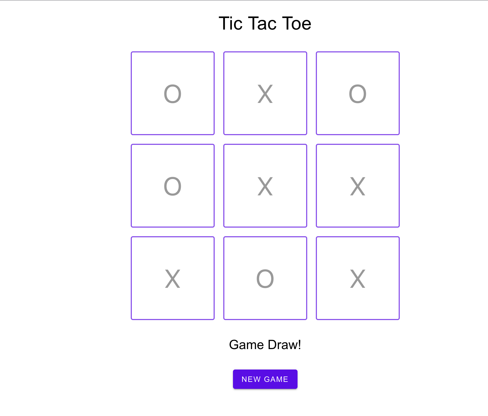
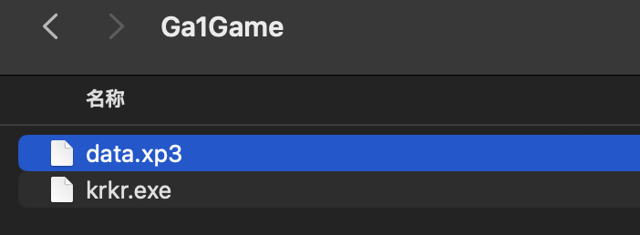
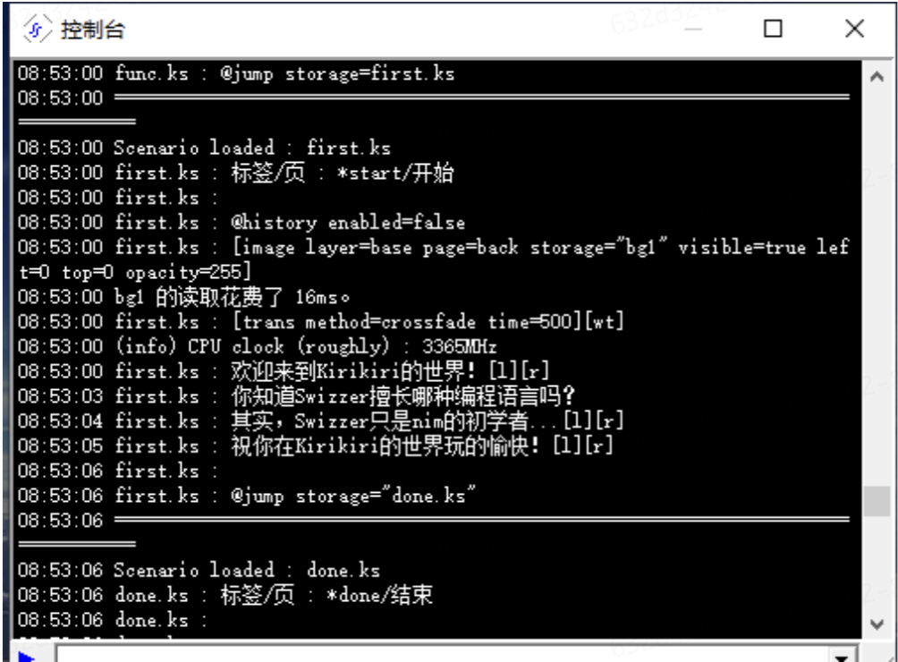
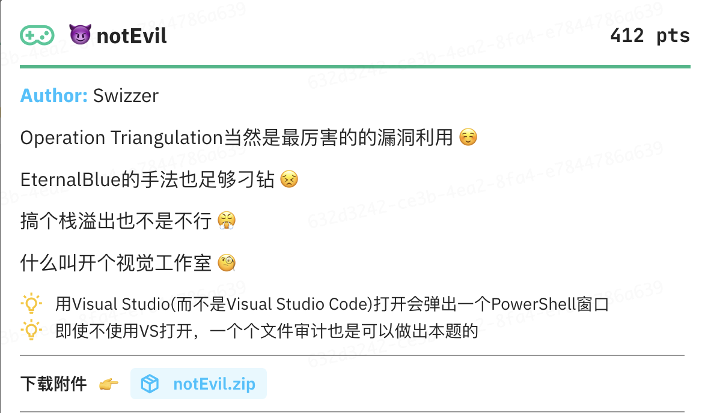
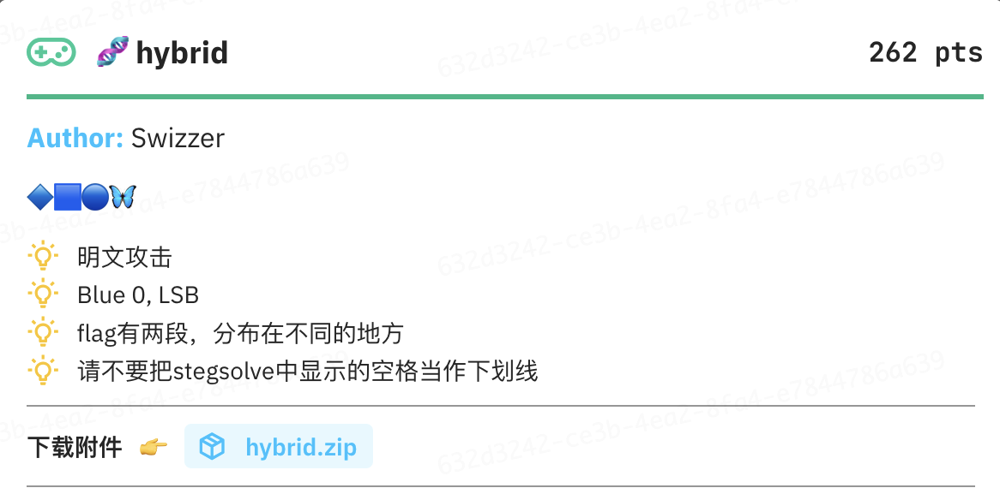
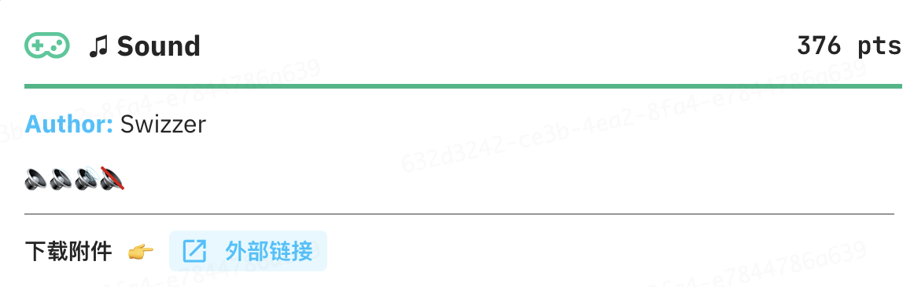
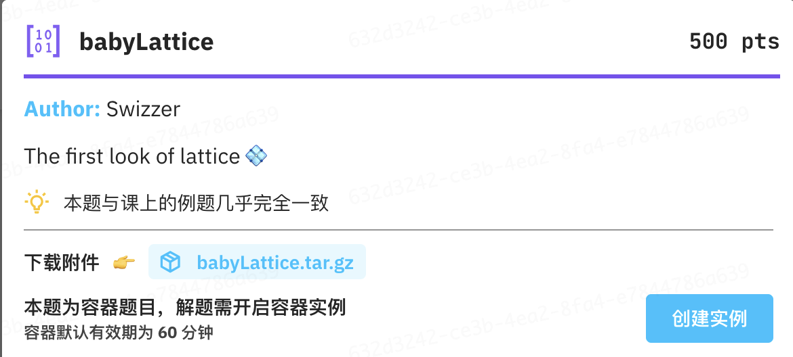
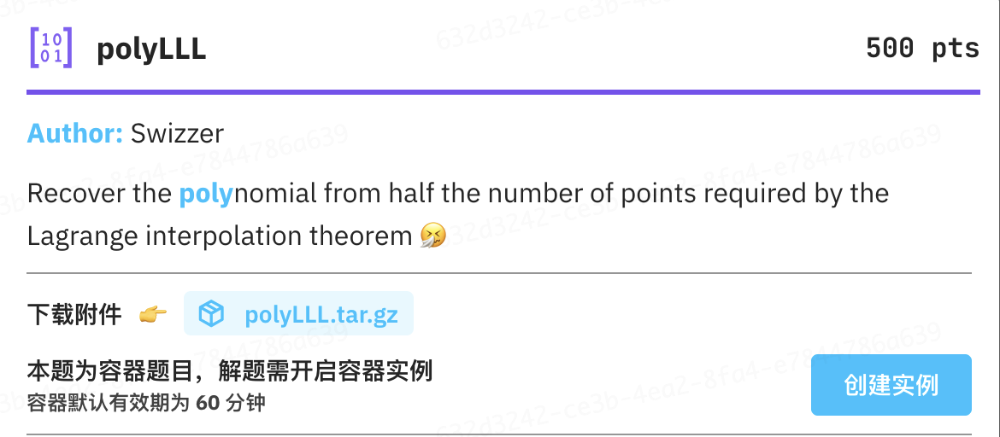
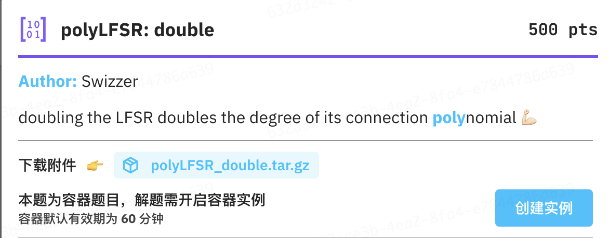
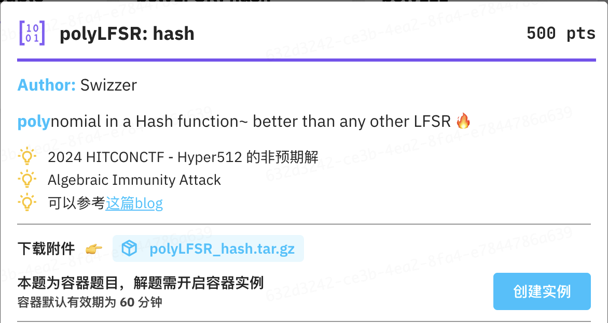

说是HITszCTF，其实是CTF课程的结课赛。只不过比赛过去快一个月了才想起来在blog上补一下出题人(我)的官方题解:P


# Misc

## 🚩 Checkin



一个简单的井字棋游戏，常规地下最好的结果也只是平局，但是赢过AI才能获得flag。

因为棋盘状态完全存储在前端(抓个包就能发现每次下棋都会把棋盘发给后端)，所以BurpSuite改包/curl直接发假请求等等方式都能让后端认为用户已经获胜从而吐出flag。

## 🎮 krkr



kirikiri引擎写的一个只有两个场景的小玩意儿(两个场景，指`first.ks`和`done.ks`)。对kirikiri引擎熟悉的人(或者问问AI也行)会知道kirikiri的数据在data.xp3里，选择GARBro解包xp3然后去ks文件里就能看到flag。

不知道去哪里找的话，在游戏中打开控制台也能看到:



## 😈 notEvil



考的就是[Visual Studio .suo文件反序列化漏洞](https://crackme.net/articles/resln/)，当然微软认为这不是个漏洞。

> It's a feature

附件给了完整的VS工程，里面写的Payload会在打开工程时唤起powershell然后向`%USERS%\Public`下写入flag。预期解之一是检索到类似的手法后去`.suo`文件里base64解码，就能获得flag；之二则是在看到powershell弹窗后意识到这一点，用行为监控工具去追powershell干了啥。

这题的难点在于`.suo`文件打开工程之后就会被覆写，如果选手没能意识到这一点，就只有一次机会做出本题。

> 当然要是选手完全不打开这个工程那也没辙

## 🧬 hybrid



明文攻击+LSB隐写+git历史记录检索，没什么可说的。

## ♫ Sound



题目分了两部分(我本来不想套娃的.jpg)，第一部分是音量被放缩到非常小的mp3，用脚本把音量放大后就能听到语音播报的ASCII数字，是为flag前半。

> 这里的灵感来自今年的数字中国决赛，有道题需要STT识别敏感信息。

当然就算不做处理直接用[Whisper](https://openai.com/index/whisper)识别也是可以的。

后半部分是两个听感几乎一致的wav，反相相加后能听到DTMF，用[dtmf2num](https://github.com/DynamicDevices/dtmf2num)转一下就是flag后半的ASCII。

# Crypto

## babyLattice



```python title="chall.py"
from Crypto.Util.number import * 
from secrets import randbits
def getRandSum():
    res = 0
    for _ in range(64):
        res += randbits(1)*randbits(192)
    return res
def getPrimeSum(Primes):
    res = 0
    for i in range(64):
        res += randbits(1)*Primes[i]
    return res


flag = open("flag.txt", "rb").read().strip()
m = bin(bytes_to_long(flag))[2:]
Primes = []
for _ in range(64):
    Primes.append(getPrime(192))
out = []
for c in m:
    if c == "0":
        out.append(getRandSum())
    else:
        out.append(getPrimeSum(Primes))

print(f"{Primes}")
print(f"{out}")
```

很简单的格，跟课堂上例题相比只改动了getPrime()的bits。为了准确起见需要BKZ。

```python title="solve.py"
from Crypto.Util.number import *
import ast
from sage.all import *
from tqdm import tqdm

with open("output.txt") as f:
    Primes = ast.literal_eval(f.readline())
    out = ast.literal_eval(f.readline())
res = ""
M = Matrix(ZZ, 65, 66)
for j in range(64):
    M[j, j] = 1
    M[j, -1] = Primes[j]
M[64, 64] = 1
for i in tqdm(out):
    M[64, -1] = i
    L = M.BKZ()
    for vec in L:
        if all(abs(c) <= 1 for c in vec) and abs(vec[-2]) == 1:
            res += "1"
            break
    else:
        res += "0"
print(long_to_bytes(int(res, 2)))

```

## polyLLL



```python title="chall.py"
from functools import reduce
from secrets import randbelow, choice
from Crypto.Util.number import getPrime
from Crypto.Cipher import AES
from Crypto.Util.Padding import pad
from hashlib import sha3_256

flag = open("flag.txt", "rb").read().strip()
nn, n = 512, 256
p = getPrime(256)
points = [randbelow(p) for _ in range(n)]
coeffs = list(choice([-1, 1]) for _ in range(nn))
results = [reduce(lambda acc, c: (acc * k + c) % p, coeffs, 0) for k in points]
key = sha3_256("".join(str(c) for c in coeffs).encode()).digest()
aes = AES.new(key=key, mode=AES.MODE_ECB)
print(f"{p = }")
print(f"{points = }")
print(f"{results = }")
print(f"ct = {aes.encrypt(pad(flag, 16))}")
```

改编自ACTF 2025 - AAALLL的非预期解。

最直接的想法是构造

$$
\begin{bmatrix}
    x_1^0 & x_2^0 & \cdots & x_{t}^{0} & 1 & \\
    x_1^1 & x_2^1 & \cdots & x_{t}^{1} & & 1 \\
    \vdots & \vdots & \ddots & \vdots & & &\ddots \\
    x_1^{n-1} & x_2^{n-1} & \cdots & x_{t}^{n-1} & & & & 1 \\
    y_1 & y_2 & \cdots & y_{t} & & & & &1 \\
    p &  &  &  \\
     & p &  &  \\
     & & \ddots &  \\
     &  & & p \\
\end{bmatrix}_{(n + t + 1) \times (n + t + 1)}
$$

这样的格，但是会因为规模太大而规约不出来。我这边是参考[这里的Remark](https://blog.tanglee.top/2024/07/15/HITCON-CTF-2024-Qual-Crypto-Writeup.html#break-alternating-cryptosystem)做优化后用flatter规约。[鸡块的思路](https://tangcuxiaojikuai.xyz/post/d21bb624.html)应该也可以，不过我没有尝试。

```python title="solve.py"
from sage.all import block_matrix, GF, ZZ, vector, matrix, save, load
from subprocess import check_output
from re import findall
import os
with open("output.txt", "r") as f:
    exec(f.read())
n = 512
t = n//2

def flatter(M):
    # compile https://github.com/keeganryan/flatter and put it in $PATH
    z = "[[" + "]\n[".join(" ".join(map(str, row)) for row in M) + "]]"
    env = os.environ.copy()
    env["OMP_NUM_THREADS"] = "8"  # macbook上控制线程数量, 避免调度到小核上
    ret = check_output(["flatter"], input=z.encode(), env=env)
    return matrix(M.nrows(), M.ncols(), map(int, findall(rb"-?\d+", ret)))

def modulo_reduction(M, p, verbose=False):
    """ Perform LLL reduction on the matrix M with modulo p. 
    An optimized version, see this blog for more details: https://blog.tanglee.top/2024/07/15/HITCON-CTF-2024-Qual-Crypto-Writeup.html#implementation

    Args:
        M (matrix): the matrix to reduce
        p (int): the modulo
        verbose (bool, optional): whether to print the debug information. Defaults to False.

    Returns:
        matrix: The reduced matrix
    """
    n, m = M.nrows(), M.ncols()
    if n < m:
        Me = M.change_ring(GF(p)).echelon_form()
        delta = Me.ncols() - n
        zero_mat = matrix.zero(delta, n)
        pI = matrix.identity(delta) * p
        L = block_matrix(ZZ, [[Me], [zero_mat.augment(pI)]])
        if L.rank() != L.nrows():
            L = L.echelon_form(algorithm="pari0", include_zero_rows=False, include_zero_columns=False)
        L = L.change_ring(ZZ)
    else:
        pI = matrix.identity(m) * p
        L = block_matrix(ZZ, [[M], [pI]])
        
    if verbose:
        print(f"Starts to do LLL reduction with dimensions {L.dimensions()}")
    try:
        L = flatter(L)
        # L = L.LLL()
    except Exception as e:
        print(f"Unable to use flatter: {e}")
        exit(1)
    if verbose: print(f"LLL done😊")
    return L

assert len(points) == n // 2
rows = []
for i in range(n):
    rows.append([r**i for r in points])

# we turn the original problem into an instance of SIS problem
M = matrix(GF(p), rows).T
# we use LLL to search the short vector in the kernel space of M
ker = list(M.right_kernel().basis())
sol = M.solve_right(vector(GF(p), results))
print(f"ker: {len(ker) = }")
M0 = matrix(ZZ, ker + [sol])
L = modulo_reduction(M0, p, verbose=True)
save(L, "./L2.sobj")
"""
2 candidates of the key
"""
L = load("./L2.sobj")
for row in L:
    if all(num in [-1, 1] for num in row):
        print("".join(str(-c) for c in list(row)[::-1]))
        continue
for row in L:
    if all(num in [-1, 1] for num in row):
        print("".join(str(c) for c in list(row)[::-1]))
        continue
```

```python title="get_flag.py"
from Crypto.Cipher import AES
from hashlib import sha3_256

p = ...

sol1 = "..."
sol2 = "..."
key = sha3_256(sol1.encode()).digest()
aes = AES.new(key = key, mode = AES.MODE_ECB)
ct = b'...'
print(aes.decrypt(ct))
```

## polyLFSR: double



```python title="chall.py"
from secrets import choice, randbits
import string

MASK1 = randbits(64)
MASK2 = randbits(64)


def pad(msg: str, n=384):
    table = string.digits + string.ascii_letters
    l = "".join(choice(table) for _ in range(n))
    return l + msg


class LFSR:
    def __init__(self, n: int, key: int, mask: int):
        self.n = n
        self.state = key & ((1 << n) - 1)
        self.mask = mask

    def __call__(self):
        b = bin(self.state & self.mask).count("1")
        output = self.state & 1
        self.state = (self.state >> 1) | ((b & 1) << self.n - 1)
        return output


class Cipher:
    def __init__(self, key_pair):
        self.lsfr1 = LFSR(64, key_pair[0], MASK1)
        self.lsfr2 = LFSR(64, key_pair[1], MASK2)

    def bit(self):
        return self.lsfr1() ^ self.lsfr2()

    def stream(self):
        while True:
            b = 0
            for i in reversed(range(8)):
                b |= self.bit() << i
            yield b

    def encrypt(self, pt: bytes):
        return bytes(a ^ b for a, b in zip(pt, self.stream()))


key_pair = [randbits(256), randbits(256)]
cipher = Cipher(key_pair)
msg = pad(open("flag.txt", "r").read().strip()).encode()
enc = cipher.encrypt(msg)
print(f"{enc}")
print(f"{msg[:16]}")

```

可以知道两个LFSR xor之后还是一个LFSR，所以需要想办法恢复其初始状态。因为未知数过多(state和mask都是未知的)，所以直接建立方程组求解不太现实。这时可以使用Berlekamp Massey算法去求出新的这个LFSR的特征多项式。

因为给出的明文不够长所以需要想办法拿到足够多的密钥流输出。注意到所有明文都是可打印字符，所以MSB一定是0。也就是说，每8bit都能拿到1bit的密钥流输出。把原本的一整个LFSR看作线性变换 $A$ ,那么我们其实相当于可以拿到足够长的 $A^8$ 的密钥流输出，求出的特征多项式也是 $A^8$ 的。 $A^8$ 的特征多项式是 $A$ 的特征多项式的因式，而 $A$ 的特征多项式可以知道次数不超过128,所以小爆一下就好了。

```python title="solve.sage"
#!/usr/local/bin/sage
from sage.matrix.berlekamp_massey import berlekamp_massey
import re
import ast
from tqdm import tqdm
F = GF(2)

def bytes_to_bits(byte_array):
    bits = []
    for byte in byte_array:
        for i in range(7, -1, -1):
            bits.append((byte >> i) & 1)
    return bits

def bits_to_bytes(bits):
    byte_array = bytearray()
    for i in range(0, len(bits), 8):
        byte = 0
        for bit in bits[i:i+8]:
            byte = (byte << 1) | bit
        byte_array.append(byte)
    return byte_array

def crack_lfsr(V,initial):
    l = len(V)
    bits = initial[:]
    for i in range(len(bits),len(enc_bits)):
        prev = vector(F,bits[-l:])
        bits.append(int(V.dot_product(prev)))
    decrypted_flag = bytes([a ^^ b for a,b in zip(enc,bits_to_bytes(bits))])
    return decrypted_flag
    
with open('output.txt') as f:
    enc = ast.literal_eval(f.readline())
    gift = ast.literal_eval(f.readline())

first_16 = bytes_to_bits([a ^^ b for a,b in zip(enc[:16],gift)])

enc_bits = bytes_to_bits(enc)
R.<x> = PolynomialRing(F)

B = [enc_bits[8*i] for i in range(len(enc_bits) // 8-1)]
minimal_poly_factor = berlekamp_massey([F(i) for i in B])
polys = list(R.polynomials(max_degree=128-minimal_poly_factor.degree()))[1:]

for poly in tqdm(polys, total=len(polys)):
    candidate_annihilating_polynomial = minimal_poly_factor * poly
    V = vector(F,candidate_annihilating_polynomial.list()[:-1])
    possible = crack_lfsr(V,first_16)
    try:
        decoded = possible.decode('utf-8')
        matches = re.findall(r'HITCTF\{.*\}', decoded)
        if (len(matches) != 0):
            print(f'Found likely flag: {matches}')
            print(candidate_annihilating_polynomial)
            break
    except:
        continue
```
## polyLFSR: hash



```python title="chall.py"
import secrets
from hashlib import shake_256
from random import SystemRandom
from uuid import uuid4

MASK1 = 0x77E3816DD9E3627340D7EE76204ED9F9
MASK2 = 0x512E5CEC93B9AE8D6E28E2AB78B8432B


class LFSR:
    def __init__(self, n: int, key: int, mask: int):
        self.n = n
        self.state = key & ((1 << n) - 1)
        self.mask = mask

    def __call__(self):
        b = bin(self.state & self.mask).count("1")
        output = self.state & 1
        self.state = (self.state >> 1) | ((b & 1) << self.n - 1)
        return output


class Cipher:
    def __init__(self, key_pair):
        self.lfsr1 = LFSR(128, key_pair[0], MASK1)
        self.lfsr2 = LFSR(128, key_pair[1], MASK2)
        self.lfsr3 = LFSR(128, key_pair[0] ^ key_pair[1], MASK2)

    def bit(self):
        x = self.lfsr1()
        y = self.lfsr2() ^ self.lfsr2()
        z = self.lfsr3() ^ self.lfsr3() ^ self.lfsr3()
        return shake_256(str(x + 2 * y + 3 * z + 624).encode()).digest(64)[0] & 1

    def stream(self):
        while True:
            b = 0
            for i in reversed(range(8)):
                b |= self.bit() << i
            yield b

    def encrypt(self, pt: bytes):
        return bytes([x ^ y for x, y in zip(pt, self.stream())])


pk = list(uuid4().hex)
SystemRandom().shuffle(pk)
pk = "".join(pk)
flag = open("flag.txt", "rb").read().strip()
key_pair = [secrets.randbits(256), secrets.randbits(256)]
cipher = Cipher(key_pair)
gift = cipher.encrypt(b"\x00" * 96)
print(gift.hex())
ct = cipher.encrypt(pk.encode())
print(ct.hex())
input_key = input("🔑 ").strip()
assert input_key == pk, "🔒"
print(f"🔐 {flag}")

```
改编自 HITCONCTF 2024 - Hyper512,只不过原题考察的是Fast Correlation Attack，这里考察的是Algebraic Immunity Attack。

完整的解释可以参考[tl2cents佬的文章](https://blog.tanglee.top/2024/07/15/HITCON-CTF-2024-Qual-Crypto-Writeup.html#hyper512)，这里略去不表。

> exp也是抄的tl2cents佬的

```python title="solve.py"
import os
import ast
from sage.all import *
from tqdm import tqdm
import secrets
MASK1 = int(0x77E3816DD9E3627340D7EE76204ED9F9)
MASK2 = int(0x512E5CEC93B9AE8D6E28E2AB78B8432B)

with open("output.txt", "r") as f:
    gift = ast.literal_eval('"' + f.readline().strip() + '"')
    ct = ast.literal_eval('"' + f.readline().strip() + '"')
gift = bytes.fromhex(gift)
ct = bytes.fromhex(ct)

    
class LFSRSymbolic:
    def __init__(self, n, key, mask):
        assert len(key) == n, "Error: the key must be of exactly 128 bits."
        self.state = key
        self.mask = mask
        self.n = n
        self.mask_bits = [int(b) for b in bin(self.mask)[2:].zfill(n)]
        
    def update(self):
        s = sum([self.state[i] * self.mask_bits[i] for i in range(self.n)])
        self.state = [s] + self.state[:-1]
        
    def __call__(self):
        b = self.state[-1]
        self.update()
        return b  
class CipherSymbolic:
    def __init__(self, key: list):
        self.lfsr1 = LFSRSymbolic(128, key[-128:], MASK1)
        self.lfsr2 = LFSRSymbolic(128, key[-256:-128], MASK2)
        self.lfsr3 = LFSRSymbolic(128, [a - b for a, b in zip(key[-128:],key[-256:-128])], MASK2)
        
    def filter_polynomial(self, x0, x1, x2, x3):
        # x0*x1*x2 + x0*x2 + x1 + x2
        return x0*x1*x2 + x0*x2 + x1 + x2

    def bit(self):
        x,y,z = self.get_xyz()
        return self.filter_polynomial(x, y, z)
    
    def get_xyz(self):
        x = self.lfsr1()
        y = self.lfsr2() + self.lfsr2()
        z = self.lfsr3() + self.lfsr3() + self.lfsr3()
        return x,y,z
    
    def get_yz(self):
        y = self.lfsr2() + self.lfsr2()
        z = self.lfsr3() + self.lfsr3() + self.lfsr3()
        return y,z
    
    def stream(self, n):
        return [self.bit() for _ in range(n)]
            
    def xor(self, a, b):
        return [x + y for x, y in zip(a, b)]

    def encrypt(self, pt: bytes):
        pt_bits = [int(b) for b in bin(int.from_bytes(pt, 'big'))[2:].zfill(8 * len(pt))]
        key_stream = self.stream(8 * len(pt))
        return self.xor(pt_bits, key_stream)
    
key = secrets.randbits(256)
key_bits = [int(i) for i in bin(key)[2:].zfill(256)]
br256 = BooleanPolynomialRing(256, [f"x{i}" for i in range(256)])
key_sym = list(br256.gens())
print(len(key_sym))
# cipher = Cipher(key)
cipher_sym = CipherSymbolic(key_sym)

pt = b"\x00" * 128
ct_bits = [int(b) for b in bin(int.from_bytes(gift, 'big'))[2:].zfill(8 * len(gift))]
print(f"useful bits {ct_bits.count(1)}")

# check if yz_list.obj exists
if os.path.exists("./yz_list.obj.sobj"):
    yz_list = load("./yz_list.obj.sobj")
else:
    yz_list = []
    for i in tqdm(range(len(pt) * 8)):
        yz_list.append(cipher_sym.get_yz())
    save(yz_list, "./yz_list.obj")


eqs = []
for i, bit in enumerate(ct_bits):
    if bit == 1:
        eqs.append(yz_list[i][0] + yz_list[i][1] + 1)

def all_monomials(x1s, x2s):
    d1_monos = x1s[:] + x2s[:]
    return [1] + d1_monos

def fast_coef_mat(monos, polys, br_ring):
    mono_to_index = {}
    for i, mono in enumerate(monos):
        mono_to_index[br_ring(mono)] = i
    # mat = matrix(GF(2), len(polys), len(monos))
    mat = [[0] * len(monos) for i in range(len(polys))]
    for i, f in tqdm(list(enumerate(polys))):
        for mono in f:
            # mat[i,mono_to_index[mono]] = 1
            mat[i][mono_to_index[mono]] = 1
    return mat
x2s = key_sym[128:256]
x1s = key_sym[:128]
monos = all_monomials(list(x1s), list(x2s))
print(f"[+] total equations {len(eqs)}")
print(f"[+] total monomials {len(monos)}")

mat = fast_coef_mat(monos, eqs, br256)
mat = matrix(GF(2), mat)
B = vector(GF(2),[1 for j in range(len(eqs))])
mat = mat[:, 1:]
print(f"[+] {mat.dimensions() = }, {mat.rank() = }")
try:
    sol = mat.solve_right(B)
    print(f"[+] solution found")
    print(f"[+] solution: {sol}")
    ker = mat.right_kernel()
    for v in ker.basis():
        print(f"[+] possible solution vector: {"".join(str(c) for c in v)[-128:]}")
        print(f"[+] possible solution vector: {"".join(str(c) for c in v)[:-128]}")
    # break
except:
    print(f"[+] no solution")
"""
get flag
"""
import secrets
from hashlib import shake_256

MASK1 = 0x77E3816DD9E3627340D7EE76204ED9F9
MASK2 = 0x512E5CEC93B9AE8D6E28E2AB78B8432B


class LFSR:
    def __init__(self, n: int, key: int, mask: int):
        self.n = n
        self.state = key & ((1 << n) - 1)
        self.mask = mask

    def __call__(self):
        b = bin(self.state & self.mask).count('1')
        output = self.state & 1
        self.state = (self.state >> 1) | ((b & 1) << self.n - 1)
        return output


class Cipher:
    def __init__(self, key_pair):
        self.lfsr1 = LFSR(128, key_pair[0], MASK1)
        self.lfsr2 = LFSR(128, key_pair[1], MASK2)
        self.lfsr3 = LFSR(128, key_pair[0] ^ key_pair[1], MASK2)

    def bit(self):
        x = self.lfsr1()
        y = self.lfsr2() ^ self.lfsr2()
        z = self.lfsr3() ^ self.lfsr3() ^ self.lfsr3()
        return shake_256(str(x + 2 * y + 3 * z + 624).encode()).digest(64)[0] & 1

    def stream(self):
        while True:
            b = 0
            for i in reversed(range(8)):
                b |= self.bit() << i
            yield b

    def encrypt(self, pt: bytes):
        return bytes([x ^ y for x, y in zip(pt, self.stream())])


ct = "..."
c = bytes.fromhex(ct)
k1 = int("...", 2)
k2 = int("...", 2)
key_pair = [k1, k2]
cipher = Cipher(key_pair)
gift = cipher.encrypt(b"\x00" * 96)
print(gift.hex())
ct = cipher.encrypt(c)
print(ct)
```


