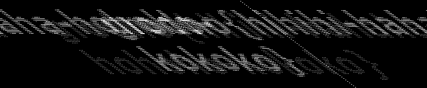
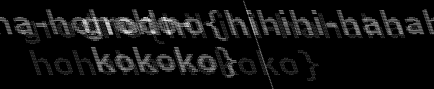
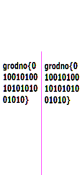
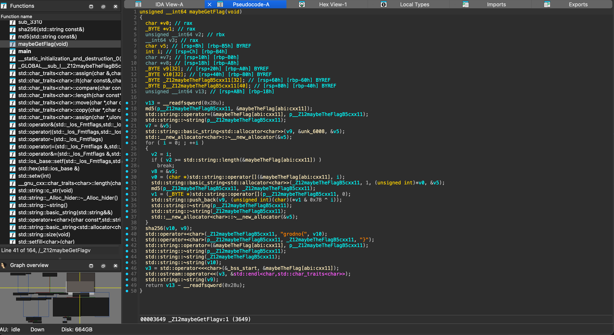
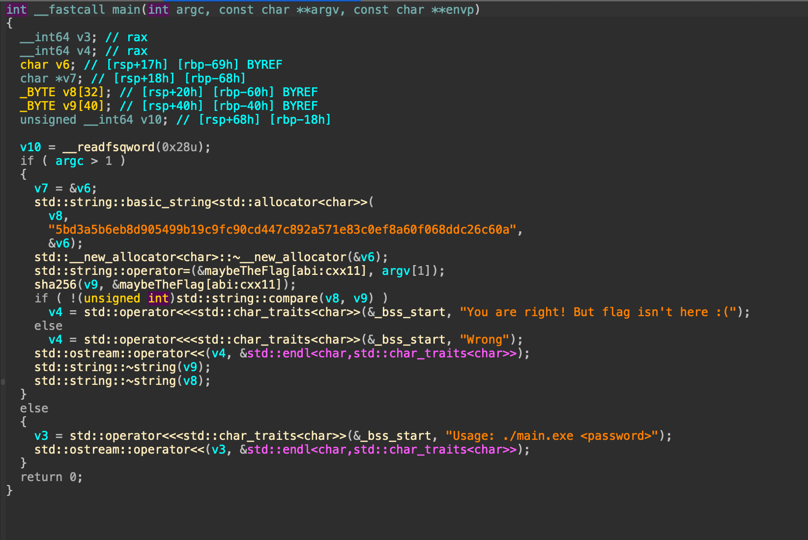

import {Aside} from 'astro-pure/user'

🇧🇾某不知名学院办的类似新生赛的东西。去年跟@cheng_xing打过一次刷榜到rank #50+，今年solo参赛，被迫重回Misc老本行...

> 大部分靠Vibe Coding，最后居然还混到了rank #31

因为做出来的题目实在是太多了所以只挑一部分我觉得有意思的写一下吧。

# Misc/Stego/Forensics
## Uncommon text

[附件](https://pic.swizzer.cc/2025/07/1610c05ddb1fcd582310a1c81708509e.docx)是个docx，打开后是一串呜哩哇啦的俄文。看不懂俄文，没关系，office文档都是zip压缩包所以可以直接解压，先解压看看——不过解压后把文件夹翻了个遍也没找着flag。

走投无路的时候看到题目名字`Uncommon text`，想到说flag或许其实就在那一串俄文里，这时候我突然想到之前刷到过一题(不记得出处了)会用拉丁字母代替西里尔字母，检查了一下这段发现确实有类似的手法。

```txt
Стeгaногрaфия, кaк иcкуccтвo скрытия инфoрмации, зapодилacь eщё в глyбокoй дpевноcти, задолго дo пoявления coвpеменныx тeхнoлoгий. Oдним из cамыx paнниx упoминaний стегaнoграфии считaетcя pаccкaз древнeгрeчеcкoго истоpикa Геродoта. Oн oпиcывал, как тиpaн Милетa пo имени Гистией, бyдучи в пленy y пeрсидскогo царя Дapия, хотел отпpaвить секpeтноe сooбщeниe cвоeму сoюзникy. Он выбрил головy pабу, нaпиcал на кoжe поcлaниe, а затeм дoждалcя, пoкa у рaбa сновa oтрaстyт волоcы. Послe этогo pабa отпрaвили к aдpecатy, и тот, сбрив волосы, прочитал скрытый текст. Это был один из самых ярких примеров использования человеческого тела для сокрытия информации.Другим способом, также описанным Геродотом, были вощёные таблички, на которых поверх воска писалось обычное письмо, а под воском — скрытое. Получатель снимал верхний слой воска и обнаруживал невидимое сообщение. Подобные методы использовались также в римской империи, где послания писались мелкими буквами между строк обычного текста или на телесных участках, которые затем покрывались слоем мази или одежды.В Древнем Китае и Индии использовались свои методы. Например, в Китае сообщения писали на тонком шёлке, который сворачивали в маленький шарик, покрывали воском и проглатывали. После доставки сообщение извлекали. В Индии также практиковались методы, связанные с окрашиванием тканей, татуировками и шифрованием узоров на керамике или в орнаментах.В целом, древняя стеганография была тесно связана с хитростью, наблюдательностью и знанием человеческой психологии. Она базировалась на умении спрятать сообщение так, чтобы оно не вызвало подозрений у постороннего, а обнаружить его мог лишь посвящённый. Эти принципы остаются актуальными и сегодня — даже в цифровом виде.
```

里面有一些像是`р`->`p`的替换。把没被替换的西里尔字母当0,被替换为拉丁字母的当1，搓个脚本解一下：

```python title="solve.py"
# -*- coding: utf-8 -*-

original_text = """Стeгaногрaфия, кaк иcкуccтвo скрытия инфoрмации, зapодилacь eщё в глyбокoй дpевноcти, задолго дo пoявления coвpеменныx тeхнoлoгий. Oдним из cамыx paнниx упoминaний стегaнoграфии считaетcя pаccкaз древнeгрeчеcкoго истоpикa Геродoта. Oн oпиcывал, как тиpaн Милетa пo имени Гистией, бyдучи в пленy y пeрсидскогo царя Дapия, хотел отпpaвить секpeтноe сooбщeниe cвоeму сoюзникy. Он выбрил головy pабу, нaпиcал на кoжe поcлaниe, а затeм дoждалcя, пoкa у рaбa сновa oтрaстyт волоcы. Послe этогo pабa отпрaвили к aдpecатy, и тот, сбрив волосы, прочитал скрытый текст. Это был один из самых ярких примеров использования человеческого тела для сокрытия информации.Другим способом, также описанным Геродотом, были вощёные таблички, на которых поверх воска писалось обычное письмо, а под воском — скрытое. Получатель снимал верхний слой воска и обнаруживал невидимое сообщение. Подобные методы использовались также в римской империи, где послания писались мелкими буквами между строк обычного текста или на телесных участках, которые затем покрывались слоем мази или одежды.В Древнем Китае и Индии использовались свои методы. Например, в Китае сообщения писали на тонком шёлке, который сворачивали в маленький шарик, покрывали воском и проглатывали. После доставки сообщение извлекали. В Индии также практиковались методы, связанные с окрашиванием тканей, татуировками и шифрованием узоров на керамике или в орнаментах.В целом, древняя стеганография была тесно связана с хитростью, наблюдательностью и знанием человеческой психологии. Она базировалась на умении спрятать сообщение так, чтобы оно не вызвало подозрений у постороннего, а обнаружить его мог лишь посвящённый. Эти принципы остаются актуальными и сегодня — даже в цифровом виде."""

LATIN_HOMOGLYPHS = {
    "a",
    "e",
    "o",
    "p",
    "c",
    "y",
    "x",
    "A",
    "E",
    "O",
    "P",
    "C",
    "B",
    "H",
    "K",
    "M",
    "T",
}

# Represents binary '0'
CYRILLIC_HOMOGLYPHS = {
    "а",
    "е",
    "о",
    "р",
    "с",
    "у",
    "х",
    "А",
    "Е",
    "О",
    "Р",
    "С",
    "В",
    "Н",
    "К",
    "М",
    "Т",
}


def decoder():
    cands = []

    for char in original_text:
        if char in LATIN_HOMOGLYPHS:
            cands.append("1")
        elif char in CYRILLIC_HOMOGLYPHS:
            cands.append("0")

    res = "".join(cands)

    if len(res) % 8 != 0:
        padding_needed = 8 - (len(res) % 8)
        print(
            f"\n[!] Warning: Binary length ({len(res)}) is not a multiple of 8. Padding with {padding_needed} leading zeros for decoding."
        )
        res = res + "0" * padding_needed

    try:
        ans = bytearray(int(res[i : i + 8], 2) for i in range(0, len(res), 8))
        flag_dec = ans.decode("utf-8", errors="replace")
        print(flag_dec)

    except Exception as e:
        print(f"\n[!] Binary decoding failed: {e}")


decoder()
# [!] Warning: Binary length (603) is not a multiple of 8. Padding with 5 leading zeros for decoding.
# grodno{1nV1s18L3_L3773RZ}
```

我最初没有做padding所以解出来大概只有flag prefix，后面就全是错误，问了下AI才想到说要做额外的padding check xD

> 主要是国内赛到了转0/1这一步之后就直接出了，很少有需要额外操作的，还是惯性思维了

## Lonely Squirrel Blues

[附件](https://pic.swizzer.cc/2025/07/276376761df8c964d9b6579320c48133.gif)是个gif，但是只有5帧，时间轴里基本不可能藏什么东西。

我之前对gif一直有一个想当然的误解，以为每一帧都经过了有损压缩所以没办法LSB隐写。做这题的时候去查了资料才知道说gif的每一帧其实是无损压缩的位图(调色板+索引)，甚至每一帧都可以有独立的调色板(如果没有就fallback到全局调色板)。这样的话就有办法提取出每一帧然后 check LSB 了，这题搓个脚本提取帧出来之后拿去zsteg就能在每一帧里看到flag的一段。

```python title="extract.py"
from PIL import Image, ImageSequence
import os


def extract(gif, output):
    os.makedirs(output, exist_ok=True)
    with Image.open(gif) as im:
        frame_number = 0
        for frame in ImageSequence.Iterator(im):
            frame = frame.convert("RGBA")
            frame_path = os.path.join(output, f"frame_{frame_number:03d}.png")
            frame.save(frame_path)
            print(f"Saved: {frame_path}")
            frame_number += 1


gif = "Squirrel_plays_the_banjo.gif"
out_dir = "frames"
extract(gif, out_dir)
```

## Rainbow in White

[附件](https://pic.swizzer.cc/2025/07/713211e0dd9eaad71def20bfece79b40.bmp)是个看起来纯色的bmp。

> 出题人你是真喜欢bmp啊

bmp在色深比较低时(256色或以下)会用调色板+索引的形式存储像素，这题的附件拿到手之后打印一下所有像素的值就会发现它们其实并不相同，看起来纯色只是因为调色板写成了纯色。因为像素里0和255居多，所以随机挑一个染黑，另一种染白：

```python title="process.py"
from PIL import Image


img = Image.open("RainbowInWhite.bmp")
pixels = img.load()
width, height = img.size
new_img = Image.new('1', (width, height), 1)
new_pixels = new_img.load()
for y in range(height):
    for x in range(width):
        if pixels[x, y] != 0:
            new_pixels[x, y] = 0
output_filename = "location_based_image.png"
new_img.save(output_filename)
```

然后可以得到这种图片



不是不能做，但是稍微再处理一下会更好。问了问Gemini Pro，得知这是一种名为错切变换的东西，再让它写个脚本：

```python title="solve.py"
from PIL import Image
import os


INPUT_IMAGE = "location_based_image.png"
SHEAR_RANGE = range(-20, 21)
OUTPUT_DIR = "unscrambled_results"
try:
    scrambled_img = Image.open(INPUT_IMAGE)
    scrambled_pixels = scrambled_img.load()
    width, height = scrambled_img.size

    print(f"加载图片 '{INPUT_IMAGE}' (尺寸: {width}x{height})")
    print(f"将尝试 {len(SHEAR_RANGE)} 个错切因子...")

    if not os.path.exists(OUTPUT_DIR):
        os.makedirs(OUTPUT_DIR)

    for factor in SHEAR_RANGE:
        if factor == 0:
            continue

        unscrambled_img = Image.new("L", (width, height), 255)
        unscrambled_pixels = unscrambled_img.load()

        for y in range(height):
            for x in range(width):
                source_x = (x + int(factor * y)) % width
                pixel_value = scrambled_pixels[source_x, y]
                unscrambled_pixels[x, y] = pixel_value

        output_filename = os.path.join(OUTPUT_DIR, f"unscrambled_factor_{factor}.png")
        unscrambled_img.save(output_filename)

    print("\n处理完成！")

except Exception as e:
    print(f"{e}")
```



还是叠在了一起，不过姑且可以猜一个`grodno{hihihi-hahaha-hohoho-kokoko}`，交上去就对了。

## S = H * W ?

附件就不贴了，总之是个bmp，考虑题目名和题面应该是需要修改宽高。bmp文件头一般54 bytes，所以按 `像素数 = 文件字节数-54`口算一下像素个数，再分解因式得到所有尺寸组合，逐个改掉就好。这题正确的尺寸是347x165(HxW)。

最后还需要把颜色模式从8 bit改到24 bit(灰度->BGR)，然后就能看到



## *Write Comments

逆天主办方，上错附件了直到最后5min才更新题目，我就说按照题面写的exp怎么一直提不出来flag😡

因为比赛结束了我也没下载正确的附件所以只贴个exp：

```python title="solve.py"
from PIL import Image
gif = Image.open("python_code.gif")
hidden_data = gif.info.get("comment", b"")
print(hidden_data)
open("comment.zip", "wb").write(hidden_data)
```

# PPC/Crypto

## all the challenges in PPC

PPC大部分是破解MT19937，用[gf2bv](https://github.com/maple3142/gf2bv)下去一把梭。我是直接改了之前写的[gf2bv的板子](https://blog.swizzer.cc/posts/mt19937/)然后一股脑解完的。

> PPC的压轴难题甚至是直接抄袭的 TPCTF 2025 原题，`Randomized Random`

## More than Ascii85

这题是Crypto里一个猜谜的古典。当然现在我知道它的编码方式姑且可以称之为base90，不过当时是靠手搓脚本解出来的。

直接放exp吧：

```python title="solve.py"
import sys
from typing import Optional

CIPHER = ";Ibge=6Sb+;_TAM9sZoF>P'Vo9s[Bn=Le:4=5L7];wD_89s:NZ:]OHr:]p.j9Dj!D=c>7%;wD_V"
FLAG_HEAD = b"grodno{"
BASE_MIN, BASE_MAX = 86, 94


def decode_asciiN(block5: str, base: int) -> bytes:
    v = 0
    for ch in block5:
        v = v * base + (ord(ch) - 33)
    return v.to_bytes(4, "big")


def decode(cipher: str, base: int) -> bytes:
    out = bytearray()
    i = 0
    while i < len(cipher):
        chunk = cipher[i : i + 5]
        i += 5
        if len(chunk) < 5:
            padded = chunk + "!" * (5 - len(chunk))
            decoded = decode_asciiN(padded, base)
            out += decoded[: len(chunk) - 1]
        else:
            out += decode_asciiN(chunk, base)
    return bytes(out)


def brute(
    cipher: str,
    base_min: int = BASE_MIN,
    base_max: int = BASE_MAX,
    flag_head: bytes = FLAG_HEAD,
) -> Optional[tuple[int, bytes]]:
    for b in range(base_min, base_max + 1):
        try:
            plain = decode(cipher, b)
        except Exception:
            continue  # 字符超出范围或溢出
        if flag_head:
            if plain.startswith(flag_head):
                return b, plain
        else:
            return b, plain
    return None


def main():
    cipher = sys.argv[1] if len(sys.argv) > 1 else CIPHER
    res = brute(cipher)
    if res is None:
        print(f"[!] 未找到符合条件的进制（{BASE_MIN}-{BASE_MAX}）")
        return

    base_found, plaintext = res

    print(f"[+] 找到进制  : {base_found}")
    print(f"[+] 解码结果 : {plaintext.decode(errors='replace')}")
    if plaintext.decode(errors="ignore").startswith("grodno{"):
        print(f"[+] flag     : {plaintext.decode().strip()}")


if __name__ == "__main__":
    main()
```


# Reverse
大部分都是py/pyc，简单逻辑扔给AI都能做。

## More than a warm-up
这是唯一一题复杂一点的，flag校验逻辑的后半在一段dead code里，跟2024年广东省赛一个德行，好在这题没strip，函数名能看出端倪。be like:



flag校验逻辑的前半是这样的：



硬爆hash根本不可能，所以我直接用rockyou字典爆了一波，能拿到正确的输入是`Filitoni2`。后半的一大串hash扔给AI，能吐出来一个生成flag的脚本，直接跑就有了

```python title="solve.py"
import hashlib

def md5_hex(data: bytes) -> str:
    """Computes the MD5 hash and returns a lowercase hex digest."""
    return hashlib.md5(data).hexdigest()

def sha256_hex(data: bytes) -> str:
    """Computes the SHA256 hash and returns a lowercase hex digest."""
    return hashlib.sha256(data).hexdigest()

# Stage 1 Result: The correct input password
password = "Filitoni2"
print(f"[*] Stage 1 Password: {password}")

# Stage 2: Use this password as the seed for the maybeGetFlag() algorithm
print("\n--- Starting Stage 2 Analysis ---")

# 1. The algorithm starts by taking the MD5 of the seed.
#    In the C++ code: md5(_Z12maybeTheFlagB5cxx11_1, &maybeTheFlag[abi:cxx11]);
seed_hash = md5_hex(password.encode('ascii'))
print(f"[*] MD5 of the password is: {seed_hash}")

# 2. This MD5 hash is now the string that the 'for' loop iterates over.
intermediate_string_2_bytes = bytearray()
for i in range(len(seed_hash)):
    char_to_hash = seed_hash[i]
    md5_of_char = md5_hex(char_to_hash.encode('ascii'))
    first_char_of_md5 = md5_of_char[0]
    
    # The same transformation: (char & 0x7B) ^ i
    new_byte = (ord(first_char_of_md5) & 0x7B) ^ i
    intermediate_string_2_bytes.append(new_byte)

intermediate_string_2 = intermediate_string_2_bytes.decode('ascii')
print(f"[*] The new intermediate string is: {intermediate_string_2}")

# 3. Calculate the SHA256 of this new intermediate string.
#    In the C++ code: sha256(v8, p__Z12maybeTheFlagB5cxx11);
final_hash = sha256_hex(intermediate_string_2.encode('ascii'))
print(f"[*] The final SHA256 hash is: {final_hash}")

# 4. Format the final flag.
flag = f"grodno{{{final_hash}}}"
print(f"\n[+] The TRUE Final Flag is: {flag}")
```

<Aside type="note" title="Swizzer秘谈">
就普遍水平而言，国内的Crypto手应该比国外的强——连UofT的队伍都在PPC的最后一题(事实上是 TPCTF 2025 最简单的一道密码题)上卡了足足24h+，而TPCTF当时这题都快被打烂了...

Misc里有几个ZKP，解题方法没什么新颖的，基本是朴实无华的爆破/求解DLP，不过还是从其中一个学到了Sagemath的discrete_log()函数是可以指定bounds的——而且可指定的参数好像还挺多，感觉很黑科技，有空得好好研究研究。
</Aside>