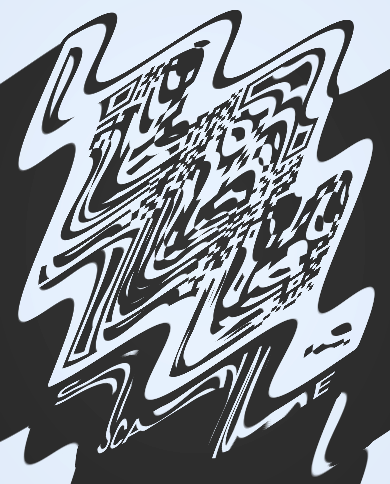

惯例先贴队友的WP:[smileyCTF2025-DNA(reverse)](https://let.doctxing.win/#/blogs/ctfreverse002/)

import {Aside} from 'astro-pure/user'

## Misc

### Project Holoswap

```python title="server.py"
import base64
import io
import os
import numpy as np
import absl.logging
import warnings
from PIL import Image

### Suppress tensorflow warnings and import
absl.logging.set_verbosity('error')
warnings.filterwarnings('ignore', category=FutureWarning)
warnings.filterwarnings('ignore', category=UserWarning)
os.environ['TF_CPP_MIN_LOG_LEVEL'] = '3'
os.environ['XLA_FLAGS'] = '--xla_hlo_profile'

import tensorflow as tf
from tensorflow.keras.models import load_model
from tensorflow.keras.preprocessing.image import img_to_array

tf.get_logger().setLevel('ERROR')
### End

def load_image(img):
    if img.mode == 'RGBA':
        img = img.convert('RGB')
    img = img_to_array(img.resize((96, 96)))
    img = img.astype('float32') / 255.0
    img = np.expand_dims(img, axis=0)
    return img

def calculate_l2_norm(image1, image2):
    return np.linalg.norm(image1.squeeze() - image2.squeeze())

try:
    model = load_model('./model.h5')

    original_image = load_image(Image.open('./gura.png'))
    assert np.argmax(model.predict(original_image)) == 5

    image_data = input("Enter the base64 encoded image data: ").strip()
    input_image = load_image(Image.open(io.BytesIO(base64.b64decode(image_data))))

    prediction = model.predict(input_image)

    if np.argmax(prediction) == 9 and prediction[0][9] > 0.999:
        if calculate_l2_norm(input_image, original_image) < 0.9:
            print("Detective Amelia: That's *definitely* not me... but close enough.")
            print(f"{os.getenv('FLAG', '.;,;.{.;,;.}')}")
        else:
            print("a")
    else:
        print("a")
except:
    pass
```


> 图片经过了压缩，直接下载这张图获得的大概率不是原图

要求传个图片让模型错误分类到指定类别，并且攻击图片和原图的l2 norm不能超过0.9。因为限制很紧所以对抗样本攻击时步长不能太长，甚至轮数也不能太多。在此基础上我还额外做了梯度归一化（l2 norm），然后再乘以步长以尽量减少对l2 norm的影响。

题目给的并不是原本的`model.h5`，而是把architecture和weights分别给出，最初因为本地的tf版本不对在加载模型这一步栽了跟头，没抢到前三血QQ

```python title="solve.py"
import os
os.environ['TF_CPP_MIN_LOG_LEVEL'] = '3'
os.environ['XLA_FLAGS'] = '--xla_gpu_cuda_data_dir=/opt/cuda'
import tensorflow as tf
import numpy as np
import json
from PIL import Image
import io
import base64

tf.get_logger().setLevel('ERROR')

def load_image(img):
    if img.mode == 'RGBA':
        img = img.convert('RGB')
    img = img.resize((96, 96))
    img = tf.keras.preprocessing.image.img_to_array(img)
    img = img.astype('float32') / 255.0
    img = np.expand_dims(img, axis=0)
    return img

def img_base64(img_array):
    img_array = (img_array * 255).astype("uint8")
    pil_img = Image.fromarray(img_array.squeeze())
    buffered = io.BytesIO()
    pil_img.save(buffered, format="PNG")
    return base64.b64encode(buffered.getvalue()).decode()

def l2_norm(image1, image2):
    return np.linalg.norm(image1.squeeze() - image2.squeeze())

def attack(model, original_image, target_class=9, alpha=0.05, iterations=300):
    adv_image = tf.identity(original_image)
    adv_image = tf.Variable(adv_image, dtype=tf.float32)

    target = tf.one_hot([target_class], model.output_shape[-1])
    
    print("[+] 开始生成对抗样本 ...")
    for i in range(iterations):
        with tf.GradientTape() as tape:
            tape.watch(adv_image)
            prediction = model(adv_image, training=False)
            loss = tf.keras.losses.categorical_crossentropy(target, prediction)
        
        gradient = tape.gradient(loss, adv_image)
        
        # 使用归一化的梯度
        gradient_norm = tf.norm(gradient)
        

        if gradient_norm > 0:
            normalized_gradient = gradient / gradient_norm
            # 沿负梯度方向更新图像
            adv_image.assign_sub(alpha * normalized_gradient)
            adv_image.assign(tf.clip_by_value(adv_image, 0.0, 1.0))
        
        if (i + 1) % 50 == 0 or i == iterations - 1:
            pred = model(adv_image, training=False)
            conf = pred[0][target_class].numpy()
            l2_dist = l2_norm(original_image, adv_image.numpy())
            print(f"Iteration {i+1}/{iterations}: Confidence = {conf:.6f}, L2 Norm = {l2_dist:.6f}")
    
    return adv_image.numpy()


def load_model(arch, weights):
    with open(arch, 'r') as json_file:
        model_config = json.load(json_file)
    model = tf.keras.models.model_from_json(json.dumps(model_config))
    
    model.load_weights(weights)
    
    model.compile(optimizer='adam', 
                  loss='categorical_crossentropy',
                  metrics=['accuracy'])
    
    return model

def main():
    arch_path = './model_architecture.json'
    weights_path = './model.weights.h5'
    original_image_path = './gura.png'
    model = load_model(arch_path, weights_path)
    original_image = load_image(Image.open(original_image_path))
    
    original_pred = model.predict(original_image)
    original_class = np.argmax(original_pred)
    print(f"原始图像分类: {original_class} (期望: 5)")
    
    if original_class != 5:
        print("[-] 原始图像分类不正确，检查模型加载是否有问题")
    
    adversarial_image = attack(
        model, 
        original_image,
        target_class=9,
        alpha=0.03,      # 使用较小的步长
        iterations=50
    )
    
    adversarial_pred = model.predict(adversarial_image)
    predicted_class = np.argmax(adversarial_pred)
    confidence = adversarial_pred[0][9]
    l2_distance = l2_norm(original_image, adversarial_image)

    print(f"对抗样本分类: {predicted_class} (期望: 9)")
    print(f"类别9置信度: {confidence:.6f} (期望: >0.999)")
    print(f"L2距离: {l2_distance:.6f} (期望: <0.9)")
    
    base64_img = img_base64(adversarial_image)
    
    print("\n生成的Base64图像数据:")
    print(base64_img)
    
    if predicted_class == 9 and confidence > 0.999 and l2_distance < 0.9:
        print("\n[+] 生成的图像满足所有条件!")
    else:
        print("\n[-] 生成的图像不满足所有条件，Swizzer")

if __name__ == "__main__":
    main()
# 1/1 ━━━━━━━━━━━━━━━━━━━━ 1s 1s/step
# 原始图像分类: 5 (期望: 5)
# [+] 开始生成对抗样本 ...
# Iteration 50/50: Confidence = 0.999910, L2 Norm = 0.700807
# 1/1 ━━━━━━━━━━━━━━━━━━━━ 0s 23ms/step
# 对抗样本分类: 9 (期望: 9)
# 类别9置信度: 0.999910 (期望: >0.999)
# L2距离: 0.700807 (期望: <0.9)

# 生成的Base64图像数据:
# ...

# [+] 生成的图像满足所有条件!
```

最终得到的数据长这样:

```txt collapse={1-1} title="img_base64.txt" 
iVBORw0KGgoAAAANSUhEUgAAAGAAAABgCAIAAABt+uBvAABNz0lEQVR4nD392ZNkaXYfBp5zvuVuvkeExx65V2ZlZWVVd1VXL2iAZGNpkAAhUCIpijQbM42Njdk8jelJ/4CeZDZjNg8yaWyMozGjRpwRJJANglgajW6gFxS6u7auJSv3NSJjD9/v8i3n6CGq4f7gfq+5P/h373eW33Ic/9v/2/9ASIr0+sZ6lqaz2SwGv7a2hihGaxFh5jwrXuy+AKCtze15Oe33+oASY7RWhRDquu52uixIREqbEDhG55zv99veedJJjGwNusZ7V/e63aaqrbUx8F/+5V9+5Z2vDIerveGyViqGRmnFHlyEJ0ezBy/HLxt5+vz5fG93tZeTxp2djaVej0EiSN00MYomFRp37+69C1evJqnVpLY31jqZOj18+fO//qvlbve1a9cQ6c9/8FfrVy6/9Q/+gcoyChB9k2iC6PaePV7ud1+9fpUkJDYxBAKMiOW8RsKDo8PhcFVrrZVSWllEYhYRUEiRWSMiIgKSIkA0xi7mixBDjBxi1IqICAAIKYYQmI0yACCARBgZCbGpmzRNvLAoEEAEMErVZWlNwiKk1M2bN999991/8Ou/sby66n0wNtEQAwEH3hj2T+fVi2fHW6sru+Pju3fvfvNXf42UCcykQAHUZckMKk3qstze2Rn0u4PBUqtIuSk/+cWHuw8f3Lzx6qvXrrbzzDv/2//wt+49ffbo7p3B+ppikhiBo6sXw0G/VaSz6bTfbREKkEKAuiptks6ns7wobGK1VlpY0lZKhEaTRkKD2ihiARBQSimKzFmWHR+fVlUtACFEmxhmFhFtNLPUdWVbFolERFi0VrHxVVllaaKAQEAEFAmRLhdlmhSeWUj3V9f7L/f/6oc/WFpa7g56qKSpgra2pVVdu7WuPRvY+0/3jvZ3v/Llr7S7XSQEo1g8NLWOXid5qN3qynK72+30uiBQzU5/9IPvZZre/tLtKzuX0ixVSqExV9uX0jxtgGfVfFE3qUlEPAefpykBt7KsSBMRgBiFQaJSma5D02p3tdLaGN00LjEGiYRBKRQiJcgIwoAoLCIxZlkuwHVdGWu89yIpCERmpZVN7Nnxabc7IBRmIK0gRiHUSOWiSvICCDAGbZQwIGDd1JQmEoKy9vUvffl7f/rHf/LdP/29f/i7eTtFqxQyGKUdD7u5V5uPHz/pdIqlzdVQh1avxSIcRTFYhZ1Oa2Vp2RoLCN75o4MXP333h6/fuHb98s5wsAyg0zQJMSqjeu0cTDw7G7395msxAiOMR7P5bPLxpx/+vW9+M88SAQCRunaKVFZkVVkrpdMkQUJKkhSJrFGaEAmEhUMUAVIKiUSIGQEwSVJr7WI+lSh1XaEIgiBi8DFN05PTEyTyngExsVYYmFlr3TjHHCRGIkQkFjJpNp3PIHJqUtK66PfeeudrBy8Pnjy5Pz49U4wsMJ/X5xfKgiIfr716dRHmoBhQsIEUDJNpDVaGyyuddqGAwdcf/vRH3/2j79y6fu3Va1eX293MqASZgBGFLIqFfr+jwUFT5gnkFlcGRadIX7l0sZxOAgdhYResMTo1gNA0Tafd1ppiYCKlEVAprQhJkTIaRJTV7LipI2lUiAhECltFMZ8vnPPVvAJApbVSWkDSNIuRZ5OJTRMO0Tlv0oQAFmWltRIWFEBFAhijaGV845vG18IchJBu3HpVKzk+PCrHo+P9PUZVtLLALAiHL15WZaW11ihkMCEDweeJHa6srK6t2zwlRaGu/uyPvvPZR+995c3br1y+tNzvFa12qJ1R4Ku5Vry81EqMQoydopienUCMCoGYM0urw8HxyVFoXF3XqEhZjYh15RNrkyxBRK2RFItVWhsjghwjaRCNAiQogBxdRAFtVPCx1WpHjo2rF9W8qR0AIKIIaqWWl5f2dvcUEiJwjIooL/KqrpXSAl5ZVoQgrHKLick77do1pNVwuJJmhp3/5//0nz56cBdjE71/+OTRyekcmEjw0aP7nV6n08oVoSXNXHU76fpwpVdkSkEMeHR49sff+c749OAbb395a315tb+cJmmMbKxG5ixRrdwAh+Aqq+3a+tp0OpXgJHproJ3niU47rc7uy700z8AoAeQQtYK8yACAOYoAIaJWShEJQQghBvZNEIlklLAQgUpIaQoxFq0WErmmqcrKBxejRGYAIU3LK8vHpydNXRlrtVZVWSfWKlI+eN94EAku1mUgwcic5+3GN5EDC1sQUrI6XP7m17/6wYfvcXDdtL2392L32ePne7tns3m7VdTzev/pHsbY73SHy8vWaqUUCD5//vx//V//cD6f//q3fv3WzRvra8u+KX3jAAi1IQ1FbtNcKYTEJkjEgkWrM5vMkAUFAEGENzbXq7oejUbAzMIMYKwREY4CQMEHEgGbWEUILNoopcloIQFEQiIE8rWACBEYo5RSIQQAGE3G1lgCkMjVwnc6A980i9lMAFkkySwStjut8WiEJinLoFJj25ZrpwC10UYlvpznCaaomunM1fNLO1vDQe9nf/tDcOXF4QrGePfOHVTKpJlBuLSzNVjuLi8tpWkamQOqpy/2/uiP/6MIvHLzdZu3hmvD4cpyCI1WSFoHIDGpbmUICMACJIDKJO1Ob1E3LCTKKGttliFSr9s/PjnzUSIAac0CyACBkUSREAAgEANog8KCgjEyIitGZogCROdnUGvqdNtlvVBEVVk23hljOUYANsYYbU/OzlBYKRVc8D4UedE0ThFE4BiZg9jMKmASWV1bnc5nwTWkqddrj05Oup3W+urq5nDlx3/xnfrsYGd7++jkpNVbipG0SZYHS6srQ2NNaLxSyf1HT7731z9aWt/srW8tGKughAxplaVmMV8AiE2zJEtJW1QqAEZgBAEArW1kaIJDBAAs8qKum8Fg0LhmUVUEiAiEIBop0dF55zwBiDEaFIIgEqHGCMwiSEAKhIGImBkRGLA36Nd1rY2ez+d1XQsAKt00ThtdFMXJ8cn5/YWIHDlJLCmsa88RmtJpZYQFEXVi+suDolWcnJ6wprTVXtTNvKy6y8tFlrx96/KHP//Ld3/8V5NZiablIekur6xvbqGhwD5W/v2f/uxnP/9Ff3U7moKznm6tfnjv8adPngVU7d4SoQhHHxqVmygQQDNoBmIEJEhaqU7tomwiAyAJgNI6SdJOu3NyfMxREIQFgAFEgDQpQwKgjSYGbZS2pJWOQVgwRhHPHAOSQiAkYuFWURhjnPPee9fUMcYkTZz3McT+oN9453yIIWqjSVGIsVW0x6OJNXZRLozR3gdFyupEBNbW11/uH4bgRav+YPnl4Um31SOE7c312zdfmUyOY2zy1CwP+5vLyyRQziZPH9/94IOfzqezXruopvO8P1zavBDTIh9svPveZ3tHExclb7cb1xR5GkUciAAQACEQAIsAQJEXZVUCAjMjYl4UVV2tra4tFnPvXIwCAN45AJAYvfOEAEqRREFBElSEAOK9R0JljPPMzKJQABhEJ3bQX5lMZixSVhUgEBJLDDF0uu0QfFmVSCgASOSd7/U7ZblIramrsilra7ROTJbZGEO724kAZ+O5i9JeWh5XdQWYd5amVXnx6uVvfPXNjZU8L/xwOde+3nvw+YMPfjY/2jdpIzBezpIvv/rahZ0da3JVdHR7oNvDH//8TsOWbI4UY6hUFJLzjQUaABmAGRHSLA+RY2RCVISp1RBjYtSg3zs7O1EEi/lMgKraeR+Pjk9IRJAIEJkZCQAQAUIIWitjTQjBeU+oABFEEHC4ulpWNUeezWbn3wLEyDHPcmEZj8aKVAwREQFRKyvC0XsFdHZ6UrQKRIWKrCGtYWl17cXhYe1F2dQk+bPdg8Fwbe/4TJReXup2C0nCaPT4w59//4/2P/95TwU/Pd57cm97ffj7//DXv3LreptQK7LGUJqrfHnc0L3nhyazKytLpyeHAj4hIAFkQBERIUJA1Ea1i2J0NiKCGCMAFq28qquNtfXxeDyfL5xzIgKIVV1Np1MSARABBGbhCERERM5HBiSlfYw+BAAgRARk4V6/m+d5UzWL2TwGjwREyBxNktoknUzGzBERhEUppayyaXY6Gg2We9PJmENMEivMiOQiDJZXzibjqipFQXew+vLwFG3RsD4ZjTGBb3799TcvdP7+q6v/2TeubaXV33z3D3h+/E9+97d31paUrzZa+rXN/nIa0AeTtFpLm7o1/ODOg7kHk+reoOPmc4iBBJQAAAOyEDIAAXQ7RV0thIFdRGCrETgo5G7RevF819q88SFG3j84RmMJzyM3CgATASEqUgjMDEKKkUJAOP8QgPiYJGZpeeC8c42vqkprQpQYvVKYF63FogohKK3O15QAW1k+mYwHg6XIXLvKJhaIEAEC51kqQCejaeOh1W03wR0cH3cGw7PZXNhvDQcX1/udxD9//OnZ0bPf/rWv3ri4ujnsJuIXowOLYaVQO/08Uy7Uc5Uk/c3NqZMP79xvBNqd9mI2C40HBlAgAOd7jVkAQSGlSeJDYzONhK4JVum6rgdL/bIqXXBW24Pn+6dnZ0ZrIqURUQiFRYnSjG2TluN5DOAiMmWz0rEgCiTaiPcsbm1rCACz2aSsFoicJOR9DYStdrsJYTKbgyilSCmVpGm32y7nM6VosNQdjcYAJMDAIaGYaMiz1uHxKHowymY6efbkWXswnE1drFEhnp4c/cF3/vDu/svf+Wf/6de/+tUrq6svHt3pZvr5s/u7zx4MCnN5tX374qClFj7MbLd18fXXfvH4yd7JRDBpdQeNDw5AAAEwcgQGhSAiWus0S2ezhQCJkMlSk+ZVFZK0lact7+J8On/v/Z9Xi9KCJQQGlOgFkM6f1igECTGQMki6rr0PzEISJTHau6rdLjqdjvdhMpoCELOwsDFGG6O1qWuHiFqbJEmVUstLy8LR1eXG+sbp6VkMTinSWhmFlqDf7rzc32+a0NTN0vLSk+fPIVhXQ2iaz97/5Lt/8uebm1v/+Pf/SdHr95a6g5V+4qUaj/p5eufz9z/56V/ND56sZ/Hty6urLeDyLCuyvDW49+C5j5jnnRgBgQEgSFRaiwAKoIAgGGMQkTniL8tApe1kOun3B0eHhx//4sPEWsVktSFCJgWoFCrFAKIBrPYxMkcRzhPbeFc7ZlDKWp0aBMqzYnlpLQY42D8Mga21EkVrY5OECOqmROA0NUWRW2O77VaRt/b2D1fWVzk00/FIKSOomjpw5JV+dzGbn5yNyiZ2ustVGU6OTqzK/uI/fvezD3/x9a+89eXX30iyxOY5FCbt5it5appFJ6GN5fb6MJ8dPzy9/8GgOfr6xcFrqwVPz7gJz58fjMYNAxhjwJfCDSEyAFIAZAARAWM0KXLeA5ynOsmLbDqZFkW2v/+yqqq19XVjaVHOCEkISAFCRAZmYFI6AMcYm7pKssT70DQhBERFipQw2NQOV1YAaD4v66pxNaNQmiRZlrFEDgERkEgpZRSRpotXrjx68lSRGg5X9l/uGQshiLZWIVmjU0V7h6dlACews3Px008//+EP/vr46OxXv/Wtzc0ta40hQ9YKESoqukmnk2nNikKrY27fvLw1bKEb5eXxhnE313vrnezOxx//xV/+AAzYPAEkiYEAAURQ4AtoE7QxWmthFgQWABBCZGEQ7PV6/V6/1+7ZxDrfnLdTXmlUBpUAIhirBbl2ZQgNCmRZMZs71jZGRFBZljfzenk43NzaPj48PT0a53nLR0jzVpFniOBDJcCuaTgwoooSty/vTMr5aDq9eOHC4eFhXbFCZCFUmChptdIXh0ej0s3qptXu/PF3/n0M4Zu//pvd1U2TFTrPUCsJzB6ENKaJLfL2UjdtpbOy1HnaGi4tDwfWTVvz4+z48ZCmb96++rNf/Px02kRB0BbAgAgBABsABXBeLEOSJMIgAqgQiYhIEc0Xi1euXSdArclqC1HIprkIEpFWhIpQWzLaWLNYTEFkXtat1mA6dz4oAa0Tk+dFnuetItva3hCR3d0XwbNW2lqtFGlDtXPCHEOMwDa1gqiTpNPpnhwe9HtdVHR2cmosuCZUC5cmutPuHB6PZ5U/Hc/f//DDjeHgna+8MSkrnedsESColNCC6hcIYtqp6mhlrJASAskK1eklWdrrdnq5Xu+anaXs2kZ7e5D+4qc/0gQEBMoiKmBCBAAQAUEAAa0VaQIBiSwsqMFYU1Vlu902iY3MVmtSRKgyH1FrNFYZm1iTapPY1M5mU63NYl61OgOBtGpYmTTJW61OkSTWGLqwvbG6uvLo8ePFdA5MEpgQrTYcfFWVNjFV2aBgEPIhXLi4dbB/4Fi2L1x4+uSZ92CMdk0THHc6vYB4MivvPnx+fDJ64/VrGB0iuoYFNSjlmwUEx+MKtRFl6ib0V5eKTsexdoEQDbT6vDSwK/18td3rwY3V9F/9xlfdwdNmdKJQEYAIBBEQZg4Acp7LEJEARRgEBEBCLLJEKaxdORwOy0WJSimtKLDygYMICGplsizPW0UrbzehIasbJ6hSZfOqYmMLoxIg1epkgqHVym/cuH5ycnJ8fBKjF2GjSGsy1pRlldi8XFQNgDHKKLW2ujabjb1321s7Lw9ezmdl3TQxRBbu9bqA6sXLw4dPn//mP/z2oNdhV4qPR8en6rxdZhYJZLVEEUCTahaJjKSs1amgATLIENM06bSXB0vL3WzQUpc2h0/vfQ4iABIBkUiQScXzI0RAOX8F0gQIqFSaJCyxruuVlRVEMNbGGIlUtmhi7aMoNIm1xljSvV6/XtSL6SzL8oOXZ63u8tnMzUsXhJhRgLRBk8i1q9uDXuvF7jMijDGioiLPgwt19Gg1c/RN4AiI0u+2q0U1Gk+zVotQRqfHEqPSRCBGa0tq99mzlY2NJGuRFm3RRy8s6CQ61kWKmY6aIVdMqEEjIouTphJkFmaBEAXIEqWqt0ytgeku9VaWp9NJnE0wgkIQgAgRWJAQEM/hMq3VOTaGiBJFGwsRNCmlVZplIhFAyCS5c76qHSuLoDgyMGVJkef50fFxu1WMZ9PIZjyuSyeVQyANKIqIANrt4sb1K6dnh4tqLhLrqtJGI2EI0bto03Q2nRBijGyVKYri8PA4hNDpdg8ODoDlvKcxxhSpIeSs3StrZ9NMgK1Si9k0RiDQbtZwRCYUFCQSRFEUqnnLALi5eOea8vmLZ810BmQBkPJ+0lpOuwNQNJqMgcC5iIQIhlGdRyA8B2UQiQjpi1AtLIAgIoTU6XbOu3+ymW1CnCwcMwIKQkRlsqLo9vpPnz3JMts05WSyALTPd89qBwwa0eokJa3TIr1x8wYxT89OAbFqyqJoK6V94znGVqs9nc5EgAMT6TxvHR0deheXer2XL194V4cQY2RtdJ4Yo8hm+dQFY7NW0dZWMXtQEoWNMYhaKxM5kIhNUuRQTycmLtzp3un+83//B/8z1E2WJFKWEAAgFVv0lzY6g6XRYszilIGqbiIoAIuC8MvHOTeKDHR+rOiXnTa32wUiKaV1kigGXFSu9hBTANQgIkK93sA3D8bjo6VBa380RtGn4/J07Lstm6SG2TGhVmZza+PCxZ3D/QOF7EPIW0WSZK4J3vtuux2DWyymSZZ5H9I8O93dj77pdLvTyXS2mGZ5BqBd7RKtDVHwUmsgnTI37SKrmmlTVUlqUWkggMDoqazL2dm4Kl2Cejoeff7wyb//kx/MaqcC3bt7d7DcHg5Xu72VpaUBimwsLe0dHsf5wnSLIk04giAwIsp5jP7lOp2HcQBSSmntnQORxNoksSCgrRZtaVq68cL1W0WqFIAQylKvm1tzuPd0dePm8/0Tk/an83h4Vi/3CmsUClpjULhoda5cv/bzn77HAXwdilZqk7Re1L5uJHJq7dnx6frGuvPSynvj8ed1VeVZJixnp6PNPBfhuqzzRJOwc0GsRmNzQykqYxLNTBLFEbIpF5PxZOyapshb1Wh69xcPP/jo04e7z87mFRM9vPvfp3ne7bT7rez6pZ0bly/dun4zK4q2r2k2Ag2SSFQGUaEgIoIICAjCeeoHBGBQRKSwaepzQD7P0qoqNWFMEjM5np2MZltrA8+QKFSailZrud89efniwsVXCbyAzBo5Pq1Hg3qpl2syZDg2ldZ6OFzf2tzy3jvXaKWyPK/nTQi+cU2W2sPjg6bpE9p2t+fqcnx2OlzbKFr56enJpUsX52XtfN0q0uBdiBw8Qmq0kdHpQX/QguggKiTZe/aoaUKvv5Inrb/4k+/+7Y8/1LY99dnItSY1MgRFMqvK49E8I9p98Pizzs8+2tpKE51mWTYYvPWtb9/6yte0NQyAv9xdHJkUCuA5eyWIIKJI+RAQUVtdFMVisdDCTbdT1OHw5eHZlZ2tlHRiRCSk1mysb7x49Deunvb7xfPTMdrhwWm1UpytDdJeT4fQgKAXTov28tpGU9flvFSIqU0AoGl81ZSKMNR+cjoquktI1C5a+y+er6yu9wdLZ6dnIuC8843LjIHIIhCEHUSTpnES0tQqTePx8dy5oruy2hp8+vEnf/kn35uOytZg47NnJ0l3+8KX37yaJAcvnx49ezCbnqDm5dWVGxe3tork6N4HkkBosm//3u9eeucdREWNCyw6zc9RQVQI8MsVO38LYo0GZu+9TZIsz7TWGhlaeQESR5Ozsm5ckbAQsk+SJLE2z9LR4cv1jWtPXp4YszyblwdH4eisnxaFBk61jb4xSvkQF94v6poFNCJzrL1zdckESDgen6WtTu2qlUHv+OUeh6bb6xzuvQiuYR9j8FoZUsDMkRkUqERFjtroxy928yJf2758Opr+P//1/+eDdz8ghrMFQ4aXbn1z49KbAawYufTKax+9/6PDF0+Pzw5nnvqbl3/773/jx//b/OjZva2draXVIWoUUoKUoBJmIPoCIaJf7jWAcxmCTSwg1HWd5KmKylqrGxe11u1Uz2ZnuweHnbzoGlBKAZBNk063XVeTnZyXM386P1TYPp5UT4+m7eWkg6CBkcUvSophMaujYOQGmdMkER9ijBFUkuSnp6Pl9aAgGogaQzOfdZKUGx8b55sGAM97xtrVUijgRgEBx7PxNFteWt3Z2d89+H/83/+7p88OJpPF0bSKyfJXf+3tYvlWzZkPjQn1b3/7G4t64oi768PJ6f7uySjo7LU33j7Zf7G8sh44cpRotBIFIIDC5+wK4XkI+iJiIwihiGilate0YgTidq+lXe1smnWK/OGT5yeno5PepAVZJ1dGqaIo2q0Wx0b7ybWt/vOf7apso6nt093TVguuXuxVfpJRDJUzWoWmWVSlqypKlALkEBm1Qsk63cmzF9VingK3263F6HR8eJT3e3liZ9NZRGJhhTGUZdoNrhpdemOrm7qzVtbvdIc7Fz766Bf/w3/3//rs00dZe+hsr1F6uHVFFyvjsklE7n72wWK61+7rilSpctB8WrnjRT3z4eKli/dWVze2NyOgZ48chakRsBrVOQYmgAhyDsKDgOB5v6+NjtGTwhgwsYlmH1QC68Mh+k/Hs8XpbLFUUJYXoSyTVGulRWIzPd1e2e636Gg+QTPYfTlLE7Bahh3RimOkzBSL2cRgPDo62rxwWZskghZCRjBWG6tOD06214cmy7UxrpwV7bSVFQeHB53h0GgbI2uppRql1lzYGLrTJ51Oe3VrY//Tz/70f/63j+/eu3HrjfXLb73/+TOsXlJaTBYnzehovlhMz1766uj+w8+Ht7/69s7lZnJ0Np2ozlLNsZWYtZXu9vYFR9rXi1beAvIEigHwi62F5+lLRAAAQYgEEBSpuq7PwVmTpqSIQojDdqdTdGfTclbOR7WP1pIlTagALFEsp2F2evvGFsQJiTRV2NsfP9udcLCiEucrMtQ0dT9v7x0dV1UlSQLAxCghgsS1leXnz5/4pkFREUlpaqaTLNXj8YhDYG6MYRUrmR7cun7BGql8PVxdDZPFhz/5m/1Hj65dvvCv/tX/YTBcX9nYvP3lt4bD9cPT/ZPp8c6Ni93tQWfQfbT3zCPodt4aDi/fuv3qG7cHa8NRXa5ubHU2LyTtQVOGUIUQYwAAIPwCoZbzHXa+vwABBIRFWRViOIdEQIRIAQeXGbOztT6djCezeu90NJrX88YFjnlRJAp7FqvTZ1vDYrVrm/kpCZ9Oyyd7h0/3TyIkAAmh1UnSGvS8l8dPn1OiWLHykLDRSrc7vfnZ6Pmzp2ByxlRLcPNZq20VskQH0RvkbkFLOd66uhH8Im0V2dJgMp0/uHvPgv7n/+yf7Vy6uL6+fv3qjUFvWUDmdXn1zde2Xn9l/fbt/PLW0tUtNl6UpyTJlnvbF7eX14dTrTZu3obeWtZdUaKN1ixJZMVfVIXnUfp8jfh8zwEwopwLw5ijIsURtHC0hgTj5fWNd3/xYLZYmFQdLurNrrI20cY0zmGIuRWpTm5dXz+bvCgdKTBHZ7P7T2CpnbZS9k3Z6/ZLV/fb7We7L7rdvkkTjlFRwoG1Ustry4+ePOosryRpFqNLMmQPVlGsfV5kBy8fLvXNyuqw3zHKSioFIj59+uxsNPnar/3qrTe+HIr2hSvJo4NPjseTT+7du/bmWxtXL7s8vfDajRuvX1gdLq2ubtQR5ws5O3w2nR6hutheHq4Ml8EkCowfTcFjkmH8oomHL/LW373KF50HIGqtQLhxjUkSFNEAAgLCfnmlu7O1MptNsn735dm0a7tFYW07q44DxrAxXDloppuD9U5eP777rPHtGuXkkI4Pnr6y1RouFzdv3BSFRSuF0JwcvuxduFKHBrWOAnWQtdX1k8PD8WiSZGliq0Rh5RqDDMHFhhfj4+3N5ctXtq2RKE5nRpSZzMe99fU33vmG7fTz3urlTvrp89P9H/0Ui16jjEOTqBQzvLizvr5SkEfjQRys9YYX8ipH0Os71G2BByYJIbL3aJO6dirVRhOBEHwRm7+4lUAJgAhrpZ0Li3mZ5x1C1ForHzwEsEW6vbT003uPOutbh4eTzU7RNbZo9Y6jr108fPnis93jO0+Pq2TdL6Ymv9pK+zoTLNqSJGm7BQJFkmGEbl6cHL68fvHKoi7RGIVpVVZCtDRYms/nw06CACJBIxnyGOpq7m6/fnNtvZcWrRhrIkab8rT0jXvr69/YvH4zX1qFJAkRvvm1N+88vI/F0t3nh6cnZ6u97kpvJe8mSqSlxSzcyeHJMs63l/Jcic06CCAGIDSkOErUEomcrwNkaaJQ+LwEknM++TzZx8iKyPmmLKsYAiVaC4CyShRoLdcurX/88IE0vo44rcIJlsbXzw52Jy+OL6wvv/XaG5evYL528e7z+X/43l2Tq8C0mMliGVudZUTRIP1Ob/f5M6jq06Pdta0rk3mZpug9B5beoLv79Nl6e/2coawX8+Fg9ejs5OKVnY31ockoKEQSFQ00jFa/+vrrwys3TKcPZEBiRnBtLfk//hf/aBrSn7x/56d3nmTLS1sX1qGSajzCUFWHe/7J09vbm6/vXLEagUIQIBTSwsSB2KjYzKoQVJKkEVHh3907cM6qwxcZDdOseHnwcnVtwxitvTC40O622YeVle72yuD50Ulvee3e/aflamuzq1e2d7Zl+UuvXm4vb5xMZk+O9y6vX3plq/vZk5emN7DF0uHB7EE+Xnl9aV5P+kurqU7Gi/lifFYNVphMyeiaBkWNz6b93MxPDlcurhqrg3Ca6jzHVpHY1IIRCl6MlQioAJVau3jBdFtgTHSsSRREAXN52D+YNtvdZLre87NR9fT+AUxNfbbWKi4td1957Uq/10mtiMYgAMAKQFgY0IeYMIYognIuEjzHhAAERQSAgYFBKy2ImnT0cTqZ5vkKgVBTxVDH6Hym6PXrlxfTY5CIYK0ddAdbq5uX6ihCRCyDrOhabcP0K29carcanh/F6fzkVH10f3Y80gE7DavtSxeDmxqsJ4dPU4xuPkaI2pDVuNyxEBcI4hs/L6ullf7OhbXllYIVeQ8AighCihVHcbXpp7GZQZyTagSZBCQGG+BiN/2dt1/79o2Ny2Fff/7z3u5n76y2/sHNV29cuLixutrqd4PWNUfBAOABFJFmUTECgPY+AivX+PPaB0R++QaAkVkANKIiMkRmOp5ELzrGCMSBPSnLdbmzvT5s581img6WxmVzWvnM5I5MUnTTPIuRrwyXP368O1y68M23rv34bz6i6vR0WixK+e7ffPzrv/IGLGYbmzvrmzsYgw5usv+ktbJTO49KttZWhnkYH0VFqgxuuNLP+t08IFgSF3SWgIpxvDDLBWbIlWDTIKKvweQtEQZGJQgxTs7Gx4cvzfz0m69ub68NihSw00aTAYNpF0IYSSk0AF6jQQGJXyA/COCaYFvQOJe3svPC55c10XmqghijJg0IRFTV9Xy+oHpRc5C6rJMEASVLzZduXh4dv2gW9WRejqvgKHOYCBk0yqZquZevD9rUjHdW87VeyHFu/Qwj3Ht08vG9XTTp8dnp5sVrMeLFreW4OI3laSvhTGO5mC7121vbG0VeTCbTq9dfAQ1kjDAIRoweA2ilYdyYiJq0eFFKQeVhMatODufHu35xMj19+vkv/mYx3bv56uq1SyudtR6TQqJzuZiAEmUUKJFogiLR4BUAgUSjBQjqxqGmpqnl7/L6+doRxMACIszCrLWOMYrA8fExed+kWX52MosuBmAO7tUblwrFAuw9jBfNTDBEKQNHJUQRCrW+1skyOXz62aXVzpu3ti8uETXH0TU///ju85enjpNOf6hN2kqTXsvW40NpZnU5FlcqQ51OSxvVX1ruLXdFAiYWjFIovnEgARITfYDaSwhaovhokGO5wGZOsa5OjqmpXru6fXVjaHyjsJGwAKy5LkE8GsVaS0QClYBFUMDqvKkQBGV0ZI4SFCnvPIiInFMeiIgCdC5yJSKOMU3TpmmUwtF4TE3dGGNEx9m89IEj+047vX3z2mwyrptmMi+rOlZ1qF1NCXGhK+WoUL0CE1d+5a03cxW+8Xo/5aca5ovZ4ns/fP90yvMqKpPWLlzYvqgwQFhEN+32ishgOt2l4cqlyxeiDmyYhcCxWFIpComva2xrycBzFBSoHAIrpNRYcrHTzi1iYWxuCKoFVJPmcB+bEVdnuBjJbEK+IWEB44WAtAAwYLAmEIlWjWs4RqV1iFEAz4VRCAAsABLDF7ImRNJKSWQRBEby3pV1lajsdDxBa3yI6JubVy9gXAC68dlsWsYKKIiqvCxqR0apdt5L9d/7e18tp6eaFnW5/6vvvML+EKUqZ4t7D55HMO2l4WRa9vuDi9sb0ixCOVsZ9vIiCezBYJpbH0OaaEEBUhAZODKDThQwOxdMSwsAioB3EIOvm9SaOKtQIruayzIBgKa24mO5kGrm5xM3n0oMQIhfNOjn1A6ct1sC4IMnVIgYmeG8U0UAYCAUwHO1WYyeiELkKMp7tklKghyCX1pd3j84nldOEKNr1lf6r15ebiaHNrGLMp4t6HTBytg0T0IlCkza6b48Oey20k6eusY9e/Lw8PmHB09+Vk1OPvv4k4fPnk+beDirnu8ftfJsc7iEUHdbOeWpTk2gEqw3IKEMjOIQPAIYTYolArGoiFJGUcgWGQVi0AgArBMw6LQKihF9xNJj7azXUMUwnyipkCPIeW91XtUwkfgmGEWpNuOzuTIpiBHGyAwiiIzAwISAElliJIIoMcnaKi3KJpq0pdut/Oz0eLC00h8M9vcPNoYr3aUei7t94/K9pz8mcSHoIPZoUhOQm5V5mk/ORh/dubO2svli9+D7P/5bVp1PPn/64M79pc1X0nwQ2P/o3fcfD4uVlH/4/e8vLxev37xx5cq1rN+NgZVWDKhiRFEIiCKsCSKAF1GIxMKCIqAIPcu5Hp6BACHE0ASOngDEBYpAKkgkyjT5KCoixfOMRMARSIBRKRBwvlGAiDieT/v9FScx+CjMTCKMIkgkIOiCzyELHBMklpAntql9CFFbZVw9mS7KrZ2djz/4edeaqTHdXm9jdfjma9c/evBybWNLtHp5eCosrSRx0+mz+w+SYP/8P/7Fh58/OZiUD3cP2/3NnetvbVx6Le+sePFNHFFrCRO9t9j9ePfF8yn9J4PNQYktqyAECzkEwHOKHERpj4bECDY+BgFLqEkCgwhEhiiIAAo5IGliIYkMmoQjOEEj4iKgCCkABUgAIMAI6EQZAWIRVzGo0aQ82H+5sb4VmZvQAARmCMqCxiigWFwMEZgBUQFVVQJOKEQ3J20MIoxOT9vtdrvbPTk+nk6mIoQM79y+mWspxyedTvflyUloHHh/eHD86aef/3//7f//h+++71WKWbtCdefZ86K/mneW88Fyf2Vj2sikketvfW1K2cs6/f7HL/71v/v+Dz984KLhiCDqHNET/oLjFB+xYQFAhSAgXgiR6FxmBCiCLGRIQEiTsgoYVKKQCEpGAEANpMUYQCVIX5gHECOgcIxN1W63nr/Yi84rayCyixGZfYwRMQKSACsIzsXIDEgIEp2wyzIbm5qSxIrw7PTE182VnUu+8fPRfDqeYIipoa9+6dXJyUuyZjqbN1Vzcnj87/7jH/+bP/zOwWSh291vfvvbN976csxNTI3ptEzRakSe7B8eHJd//ZMP/6//9X/9cP9w69Y7l7/8rZeL/N3P9w9LF1EFaISYbQyJSB5BRYgMgqATVBYZCH8pSUEExi80TiJKI0aQJooCRIAcY4ZCQpZIEygFRCgEgigEKIAAisqqSrTeffqsU3T43B7I0bN4ZsciABHRe2gaT9rUIQroKMDCREoENIh0O90HD57U8+mg19/c2n7x9Lk2mhTmvd7rr1x8/OjhyfEBkD46PF5vq0F/vap8e6D/2b/8l93tiwubvPmld+493BuPTnWyd1L5uecLr13vdfN3f/AfsOhA1nrl9puuvBn82YvRfK23jNEhMiIBMEtUBKC1BIyO0aDSKvhIiBj47+4EIASOEpEQIFHoQDSBFyRAo0QRJIa0BSRBwi8wQ0QQV5XGmsV4VM/HenXNkio5CEMdMYqgZatIAwQfat+QUr5qqI8uRCDbeFbKaFA4WFniu/dHp2dFq7Nz6dLRwfHp6AwNbVqd6fbX3nrju9//KSA+e7F75e2bpHRs4rWLl69c3Pat/OrVy6NjF+bZvfsPAjtvi97OhQu3btos+VqG89PTC69e3ri2keh8796He6PR9Z1B1yTonQmomPEcsFIoSmFkbiIhoALg80URYPkl2YdgEIyGKCCICoAVZFpAgzaoDCg8d+WCkCAqjCAwLmuT5dPdl4OiQBFr7GzuOICPFEUVgQkiGYquAY/VvIIQkalsJOhMiWEAMmkKgK12e3//ZfTOGPvK9esuuMVi8eLFM1+VWytLr75yuamq0dm0bKI4n2p8/fVbxiaddvb69Ve+8qUvrQ66vXZ6dnY0r+a3b9/SmSlZBusXb3/9V7709a+urS73B0luBEIN7DhEBiZQyIIGMdFicjApZVYXKgrDeSIDwHOrBSIogvNUzwiaUCMo5NQSIVo6P0OahBBRIgGei28lsEA1L+ez6Uq7bUTYS2y8j1B78UGiY/ERBJyLRpn5aEaokHTdBA6SWBtD0Hk7dz5cvHz5Rz/46ytXrydF1urlb751+9O7d9jx02ePLly88fWvvFWf7H/wyV+//uoljbi6NNjc3jFpNui0bct86dYOhG+zwSmbp6eTR/cf7VxRpttROumvbijQFCoYHWaTJ9cubHdVTewVai8ONSEQmBzTHhmSeh6nDjQKgCjAKMIAgIDnmCegUeAkuqjIcgxoDBCIsqiUKIpAClEiRgV4TrRV5fj01E1GGqTda++OKu/qsqpQ6YAqhugCW006yHy+YInzxRS10gab2bRlNTbzltW60+uOxtO11VWb2I8+/vDXlv5ep5UqLb1ef/fF83Rje//li6Ul/62//6v/v+e/+PCjO6t5vtwqbORukac2CcG1c/21r99Oe717zw8HO1d/8vMPHj+621kZZkUufbN/8sgfPfvypeF/9mvvDHNPi0WSZRIJFMQYQZNJTADlak4TrXqWF+UXvhACUYgsolAYhCE41gpJm9gEpRSEAEXGzpFNhJQ2FgBYoQUQhSHA6Pi0mU9ODg7evHZFlHYH4+CcnMuoBHwMjrIalEb0ITTOIUin3wGO0kwVK1Q2VE6HCGlSZEl+/caNO3fvPXv+9NUblyOHbrf1ox8+WWr3E5WcHh5m62u/9Vu//+GPvrtpc+386PnTm7dfB+ej1mhFg//q7cuvXr1QgvKLrUR5VIrd6Onf/tnFXvIrr+68tl50MRTBC2hoDCnNFAk9KeIgQk40BhEOEUQoCuEXeCiAcBAkRGM0QXSBBJS17AKRwSikLWiryAQODGwUALMoCl4Oj47cyelyKy263TpyDEGcj5HRskBomli3jUaqgpRVzcKurtbWVzBWe48+UsGxUhc3L2uOnOfZdDR7/fXXvcQnTx5e3Bm2O+2lpeWVleGTZ8/LRX3pwsUnz56srQ+/+Rv/6MM//d+K3uD540f2e3/x9m/+Vmd1qZYYQtQQV3JbNv533rn+5qW1O3fu7j87fvPtV9+4vNZS0SIbFcUxIAFxqEtMCRVAYDJMGoxRws7XUQPgF5oLAAEhVAjRCypErTRCrIMgUGKx8mAIFEEIlCTMymhFiFGEorzcP3DOKYxrq5u21apnZfTBNbV4h2KCoBOpvSRWoHTON3VdcYxJkpyeHBYGdzbWu+3u6XSsE2UxVQez/bXhytUrO+1Cvff+e7/+938dQ3jl0tWT09HLw/1ZOXv99dv7R6fDlUH70mtvb19cNnC2t/fen//J7Xe+Umyt2TQTiNCULd8cHxz4w6M3iuwf/8bbSYwGFkowCFSzkGhNCUqoVE4RPIACzwiCrKInFVwSURCZmeiX8qbzuthiDDGUwZqEDLm6StKUo2AgIYTIGEFbjQLRR1CmXJTPHz/JU7W+uZl1c8gMlTCajE9OzjjJlbau4RhU04RoLDfNudYtyzKQMD496GRFr8jPTncxRC0cizRrnGuaptfrDIf98U/Gdz+/e+vGa91O5+XB4frq5sno+OfvvXfz1u3Tyay9daGnolmcXVteqmflwcPHG0Z0Owemk6MjE8JidLreSre31skqGI8l+Ej4BSp4rjFhgUZUy3BAAPFVJVPPEpq5y3st01ISQOBc8/3LNRIgbSzGczjZ2Fwah2k+OjzSHdseDjiyEokxikpQ+OGTR9E3K2sb7Xba6nZBQVmVDx7cu37rDdKkgBiJz20qiK5povdVVQ8GPY3gy7pd5Pv7LxXUSpA0ErAUeXFweNBu54H97/2Tf5rk+fHx0YXNTaVM0i4sJalOPv/088nZ2CbZqI6+0zsWO7h8+eKrVzqk1NlZVp5tZmar17+4sbmy1AEbsRoHiYzoGvblVFMDHLkREI06h5pIWAEaDlDNw2QCfkG+FhdAQIThvJ6NgIIIGGNEUAqIfaDAo9Hk7p2P/6f/5d88f/EcIiMEiAGNJYUHB8dHx8fb68O11WXUBrJUfPPixSMnzqSpYoUM3otzkWLksvHzKjRBouQ2800oy8V4Oh/N5vNZ0+ktEyKyhM2tjSdPHic2YyZj7be+9a12Kw/Bvf3lL0XmvF2gUFHkk/Hk88/vkU0aTrPh2ovp9PHB2dm8tkkOEY1WIQQiSpUO42lZl875EEQp9I3DGBEENRJhWEQQij5KZNQqGWTt9UFvvac0cGQSQQZhlIAIEIOIF8MUaleeTPYfPL7/wftJ2Zw8eTbdO2DvgBQxnqsR5rP5wydPunlx9ZVrIbh2ryOI9Xz85MmTb37jV2fTGSDEKK6Rpgq+DtE3Ibi6CXnWRuSz08NHDx7tvdy1Cq9fv7G1NtS190jU6+RVNT86Pu0uD0Yno5UrO7dev3X/4YOgcWdn7fHDZ5PpNAeTJoljfvzoRb9tR9quryx7g89LP2Eq0sTUoWUQfPATh6QFyBiq5nMBtqn5ux6VWQRFglI2DcTqnPGNIkxCqFhACBQCgFcKAkjtfVOeHh+10gzr+rOf/Kg8G+ev3Z5+9OmaYMsmQAReSWa4ql/sPc8yffPaVWY2NiWrBOPju49Tk2ytb5zNPXMEoCp4QUKDjQ/z2gfgIjOo9d6j3flivDNsvf7a9QJFminVTR1iEMRLFy9++tmdouh470fTmU7N9ZvXEeXs7GR1bWgTw5Gb4FJrQenRonnwYvdPvv/Xn95/Mlm4ifOTKi68Pzo+W5SLJkrto/f+YG/v9Hg/hNqmFlMrCL52hNHkmpDZBSUYGDiw5xiBARWTYo7RO1BEDuK8LE9Od+88ePeP/vT4k3uTh0/M6XxDp4f3Hmy22rcuXS5sgs4zEjmZLsq6al69eiVNs6apkyIHBaEsn+8dXLtyPUnSsqwEwUn0HNHqqqydcyyOxVuNoVk8f/DJla3lL12/oUlJXdbVXHvPkeumKq9eu/ZHf/RHL589HwyXDvb221cu28Reunj5ez/40epwa2W4tvf0WSvLNFHQJi8GjJmQ+clPf/rG5fXLW0NfFLUCS7FsUBtCYFtxK9OtzprOLIGwd0HIJhqIQ1npTgGNJ4+WEM6HoABKcBgArY5kRqcnB3cePfzFJ2++8YY+G21WsHjvM0mz1zqrpImMDiGMNVhrhBCMqRbV2XR645VripRzTZplYAxAuPP53aXhWq+/XLmgtCyaOlJe1k6RpQQhxGo+zxUO2vlP/vI720vmazcvooNyMgux4eD1aDLpd7oI0LDrtLsP7j94Z6kvCM9ePFvf2DBpsr6+PhnPldKN85PxxCYpGn02m6nEKtcaDtdm0/mgdeXqha3oK6PJN57FJwaN5VZh+Ry/0AgIRiFoBAWKKDQLnWbsAjggrTgygiLUHNzp8R6zmAAP/uZnh48f/83zp5c3N9eLtK9TnRjU5AMo0rqTZ4nq9QdV8OIWpwteX11PkgwBfF1jnqPw4cv9g8Ozr375bVFa15H5wAMLctM0iQJMDUqo55Pltj16cffCoPXVVzaSZr6Yh2beEDTMXk9G0yLNMpMwh62Nrc8+/+zChQvLS0uT0VmeF8urayvDlflsN0uLvNVu6nI8nrYGPdI6csyzZKbtdLJ4/+O7/URf3hkKc+NdojMFzC2OKKgQiACIlEaSGIMIIylKdHA1UqoSjFUFOkH2i8ls79HTd//q+5ut5TxSeLJ7vTscbi6RgU4rj8xg0GSaogRlZuLS4TpqNZ/OG9cMLlwtisJHJA0mtcBcT2f3P3nw+mtv2rzIO516di4qpcWiIsk0xRjDwk+9r1AkbRZvvXZFjU/np0dOQVlXmpkJ9HSyGC4DWgbEzc3N+/fuff973/+tf/Ttbqf99OmTot3eXFt//PCFIHY67RopyRIW1gqZmQO3e8tHs0Uj5qef3DFaba8NskRbVMLiophWzsLMHAWUIJA6n3CFSjFiYG+wEbSU2N2nz+/du7vWWzl+/PT04bPg99uEl9bWV1aWtVZZaiP7rNuKQZoQdZIFjXOR7QubtfcGoLW1nWZZBKUMeImGCFzz5MnTrbXNjfVtzHRsXJKlRumy9t4LkAFGDTQfnWFY5Fpvr/dmp/vzZ3sqBm8kkOjMDJcG+mw8LWunIbbaqSjc3N748KNPD4+O5jMz6HefPXkSAzBA4IDaMDKi5EY3i4VSOiit2oXtdg/mU5v333uwq4y+sNqLUAEqkiSioBhtFCiNljh6ZgAgIhQPhq1W2vlgsswk5vD46M77H8rhOI2QQ9xcWl1dX1MJtpJMqLFJ3tQNCpnc1MjHoV6/cUP1BspgmubcaQkrUsrVTiVAHE+OzrpFZ3Nrm43hEFRiXFWrVFf1nMFK8Cxis3xxdFwo17ZhOp+OX+5a8UYrMHp5eTAYDCA47SKcjEe9ndXgfJKYC5cu3nvwaHV16OvFwf7+9oVLB4cvnXM2LazRi3OSIXqrtQsRDRFQ0uqWVdPo9GhRffxk12RmY9iJXCMoBEWg4NzU5qMoRVoBnQ9G+8IRQEASeHV1/T//F/9ifno6vv/04c8/nB4c25VuyJTNUkesdVZyUJnxHhaNxJ69fvuW7S17YlKKtIbaOaOtsEkscXV0dCy127ywDdpAQJUYFk+kjNYMLsSoFFhNXNfzs4PhptGxPD3cF2GV6DxrL62to1GeIlijdVGcTmbDWXu5m7Nwu11sXd765M4v/vN//s/v3/382dOHG5sX3nqn++knn/vFwhpi53S75YABQQdmBpNZtCaiblS6NyX3+d438/Zyq1DgQDiSEGo0BhEJCJRiH4kIEEVJEEaNDIEAiLC71O98Y3nnjRsne/tne/v1dB4YFSIHjsREqFtZ2m+vXNg2Gxvn1DojoAimNqXE+WCtPdzdn82nVy9cAqVEABOKwDFEm+gktdXRzCvDDDqzs+muL8dL+dbB02fz6WhzfXVzuJYVRWBVsViT5f2ebnWWjo/2RpNpO7NaUeB469atP/3zPzk5Pr51+/XhyvLnn94VlXztnbf3nz9/eO++gDjXMGidWlc1dVUraztFS5B01nbsn7w8dfV7v/71Lw/a2qSokKILBBGQADA2nhSB0gqAQRh8DBFAmCG1CgjrUOrCDF65tHT9ClUss5mbTuu6Fgg2tbbdUlmGqYUYgwBaI4SByCL6pjY6O3jy+Pjw5SuvXIYilXheklMUb0wiHCRqoFRRAsEXFh7c/6SwsvfsMfrZa6++0mm3E5MEAda2aBW6lUurpcVmVROni+rkdJTtbCBRJyuGK2t3PvtsfX1teXX4Tqf7h//LHzy6c+fGq7dvv/Hm4f4RaVnU9XQ2my7mhnQ7sawVMkSBIsnZ1Pce7/nyp7/7W98YGEsUVHI+iwgkMhBgomPtvDAiaqu0Op/SIsEFiJJYUiwBBX0AQhh0kkEv8UGQUUQ0oiBqJUgIAERRodGGgZQ2J8+ePbv/4Nbrr6Z5R1hA0flVCS5qqzGAtVkAV1c8LFScHj6+97Nrm92Vi5cvb99MlSilgEFEqyLV3R60clBEJ5N5IDNe1NOyms9KEJovFm+8fvv4+HQ6maTWpkmyvLzy4vmzB/fvPnr6dDSfNk0AQCJV5EW317OZiex9DAqpqhsgYp082j/51//2D49mTpKC0XgfAwsaE1HYBY6RFKKC6IN3wVUhuiiAAqBERVCKAbSOmsQoMCpqEoWSWDAKDAkqUIqMZhEAHQAg8vTw4L2f/fTGK9eKXlcCAxOgBB8CR51YEIgsglTPK40RyqPv/sH/++JK+1u/8s7lne0iSwTRhRiVTfp901+SogCjQSHtn05Mmh8cjYDM4f5hvWhQdKvd6+ad/d2Xwcc0MTZJp/Py4OiUSM9mi3lVNSGgMlmWKiUMmLfaSMQSlaaoCSz6xI4x+W/++//xbz99MCojpG1G66IAajRaZ8YAaRGMggxWkdFKG03WCKgQBFgAlVZaIgMHIiRrUAFGABfBewgRkBA1RG1VNtp9+bc/fve1W68mRRrKBWoQAHERmFEiCTKLAM0XjfeL+cmzz9/77r/4nW/8l//k91ezvJWoqixRaUwL6vSgtwR5G7VGYWChReUZNQO8PDwErY8OjwgAQG3t7By9PODGQYRO0e71es57BiRlADSStplRikJg3zhh8U2ttebIQBhExNi0s+Ig/fG7H//kZ5/df3QwrwVVLqCrqnYuxBBYGEmUFgkxuhAq39Q+KETEKIjBB46/pHyYgWNwABGshUQLfZEEtTLTk+kP/+rHKysrg6VlSlNKkjBvoGpE2BqjBTEKKe0jvNx9Mj94xOPn/8U//o1rF4exPEk0x+issRE0pR1q9zHL0GgAEiEkpAAYgFCnHNV0Mgek/b0DEgLSeav1+MFDYPbeZXmxdWGnCVGnqSgKMXrnhUUbk6dpYoxRSs4JUiCJxlKqIucmI+o8fHzyg79673s/eO+DD++Opw2wUWgAhARIBCKcM+paU2INByGtRSsXo48eJIIEECfiSCEoRIghhgARELQit2j+7f/4bzKdvPrqTSHaPzmdeV/HABzBxVBV7B2yuNo9fLH77PnDdTP/x2+/spQiRZ9203k1dc57Qcraqt2HtBBUwgAKMUmjyrWyyWgyv7Q8FL+YlXWvyGPg0enZcKWnxO0fHXe6L422eZ5fvHjhg48/tWk7RLFWaaAQvHCMCOyD8z6EYJSWBhQiMte+SZOMQfsQkOzZuHz67L2fvQf9VrK1tryy1G5Z3S6KtLBGtBhkVEIKlIlagQgopYyKHCFERQaFmQHFIypNCERhUY1OZ3/yFz+Kkd9++22lMBLu7R+UVXNh51LJQAEjoUnSahGfvtj9/M6H2s2++qXL6x1Bv2hc2UjUmtBYk/dUtw/tFigNkUEjgNSOUStttWoWfhHpjeuv+ZPnp6OTleWl6fjEWMxT2+0v3bl3nwWTzK5vrISPXAJcVY2lAlESpRDBuQiIDAJKgULBGMAb0gTI4AUDIAaJHgzYfLyYTKaLu/cenuw9unZxY6WdWQVK6cSmjlmbNGn3dJIUvV6St7J20SlaKvCg0yGFxmoBRhVRkCfV3pOXv/jkHtf17/zOfzJY6XoR4ri2uvIXf/3B6vP5zuULEUAnyfHx4dHxYnayN3n86a/cXFtKIEyPADUDgSIPuWn1VK8HWQYSARASBQCClFgFIlogWKun8yqC+tJbX/nw3R8cHx/0+t3x2OjhkhJIbPbBhx8vD1eyPM0SA8BpmhpN4GNoPCpA0iE4Fjl3DSKyUTrEaDPrp1Mk9MGZJEdCjiKC5XyCvr566WI30xx9Vdfa6NlkUi0qj2iz9njRdJaH5+MygChBXRizNVzpd9v9rm61ch157/nLF7snuW1dfv1L25cvnsuCCHip071988Zf/uSD+8+fp+3+rG6SNDesTTMftvXlYQ/rsbEgDDWIzrKi2zedPpMlawTx/FqCCCqjQgBCvdzr7u3tYoDDw9Pk9cuvv/Xmpx/8/OTs2HmvUJaWB93+4NKVa5P5tNPpJokt541RNkJMNGGRVHWjiNIicUc1MCuEyXyOiMbm8+milQ+8jwCiUQVX61hVi5Mu+eXlFnCjwDEIKKNsGkOTppKZxCR5E2F1bT0t2gDQHvQ5yP1PPx0fnWwtDc4UZ4YSraMoY7P2xsalW2/MQmxZxTF6domB21eGG+u/+bcfPdodLbJWN1SzK6sdGJUXVja1K4mlqVkUJK2OSVo6TRkIrOUgoEGAFQIS4bmlLEadGhp0OuXMnYynn92999vfutVrJ598+N7u/vGimrOEXn9pfXuzv+h/+P4v8iSbn52CRbI2gJCwgDjvRDBNE61EozLGllUFgNZm0QdhiNGX5aStoZqdraQqI6uhIYogDEhRKY7ivUMAYwwqVbQ73sW0UMKc6ES17Ftffeflowfzo+Oi3bam1fgmoKhu6+Jrt9joNCkaV2qtC9uqXOV9Mzs+Wu/nXoSy5JXXt7vu6Gh01k/b7BpRSiUJaAs2Y02RJfrGj2tRCEopawhIERljQClQpFsJzQi1SUbj8nReHoya7YvbrcI8fvz0/t0Hz148PZtOtlcvpmnCSZKQImF2FeWpEERATBJ2PjYuuIZdoFwDstJam6SZOUISIOBomafHRwW5jMCKQ/aogAhDEJMojlErg4RpliVJXk/LyWzR6g3TNDc25SioMMlzGfSOJ+XUc2aJitbNN79slweotG9KTRRDrD0kaUtYtjY2u2V45dpFY0xb+zs/+nS9Ja1M11UoI3Ngm6p2UYBNFywQPGkTmqgwNouanQPhxNq8KCDL9fj0oJu2YsCyrp8fHO8enq1114crK71O7/or1z/+7NP795/8/GfvXty5tLm9euXapaXe0uef3/GhSbJ2WdWRI51bHiQ2zvWW++VuqZWOrtGKEk3gqwTDwZPHG4O8nxBJnWjxLp7rOxAAYuTolSKjKbMmKTJaVIqMECpjNFKS2ucvHu/uPWfnV9e2Br2lk8ODyWhyPUlK5xMFShtgUVoJK2DQOksMdjqp901K/sXdj4owbedmcna88NDuL3d6vbzbpVamkyLLctAkIaBnIBFAdF6aalHXR+OxPz7U1clxtqoTbb1Jp5X/5P6TVzZXszaZzPYS/Su/9qtfefur7/7gx75xDDKv5lnLvvO1rxyfTZ/s7tnEZMYsprNqsVCotra3jw6PUpu42hMK+9poOxnvz092L60PBiliUxP6wKK0coKERhsUAIUECFmSFll2PoGtDMEztIoWhyjKa8DlXrtyzWf3H97+UnvzlWvZaLKYL3pLa4mxiNi40pJJhZyvgTRoVdVVpnj/3mcHDz7pZ3J2NMGks7G5U3T7Os8wLyRPwBg49xhawswIRwKATCPlLUELwTUNLbXMYnSqIBqNLsDe4eze4736C7ciKpEsNXme3Lh1/atf/8rmxvqdO3fu37sfg9/ZuZCnrcl4Mp2Nx5NRq90+Ox1pRRxYK4HQdFtqdvLcTw4uDDttg+y9VmKVFhABUqSiMADFyEppDWI0KYpGK6WVIpUlmTVahDViAmAQC5tYo0lR3TSbWzvzeV3OamHwwSUqR8EoPlVWIwpzovDZvTt3P3kfXSU+DoZrFy5daXUGOs1IG0AQRACKhKwUKOMjC5KQBkIhFbS2Js1aPb3UzicvD9AWqHKBZLrgH/z0/Z3t4Xpbp0qYoyaV5QkoIeKLFzdtZvZf7i9cYGWMMplNYpOOqpPpdJrnuWscc4hN1U7g8OU9bKYXhv1CAZEAKQkS2FM4H/UuLBg15L1uOZ5aZbLUArFw1EprrRURGYpRkGA6PRNXrSwvn+Uzni1YK4lRWe1DE2Ikk0QKiGRYsYiEqA2d7O/+7Cc/urjSvbyzU6SokxRsygpQo2gFRp+P8QAEZuBzmYQgCAooEUWAyKIU0O/93m+vrfTLyWFimBAj48k4/Jv/6d/NS+dD1KRFQBToRDG7NLWDwVJVV5ooTxISsDZJTGq0HfQHWmlFQsCWeDE6aifhlQurOXqNQbFHZlDISKgRhQxRkhibZufh2RqjlLYmQQ1aQbvIENkhYkJlPS/LeWKVBellWXA1IU6qKSlV1/X5f1X4EBTpOgQBMImK9fTFozvvvHH9y7dupJmlJEVtRSmTWkg0pBqsRqW/GLZECHg+5ffcwoHITMyMCplofWPw+7/7bRPq6f6LwhIL66T97PD0P/zZ96o6RBcic5rli3mptAaC/mAgQHI+BziGEFyIzjVVnlgIwc1LKeuT3WeaFzuDHpbTTAlxRBaFEVhIKSCNCokwzZJOS1tiIjQ2FZ0KJAow0ZinSZIkKEEbNRodc3TGKi9uuDZYlNOAsRY3c+WsWUR2ikQZXcWgkiKiGp+dfPSzn1xaKba6NlRnoZkHgbFvgkSx54JGBYigUAiFgEBIBM/VSOeqElQixECCimJ01y5v/J/+y3+Zked60sls6SrbHtx78OLPvvvXZe2EJctb48kshqBQizApEhThqDRFZu+c1toobQhSi74ar/WLrZVBmI9To4SREJAjhvPREKSUViaxaaJSUySpBGcItLWCShQBUpJYoykvUhEGiKOz03YrQWSRmORKpKl9DUhlVS7KOSDH6Agg04bZN9XZ3Y/fm52+PD14MRsdhVALgYsBtTWtDigCo4UUaP2Fyxnwi5Fd9EtzFJIAMML534CQNcaFcPPa9n/1f/k/X1ztsRulRkems0WYN/id//Bn+y+PTJadjM6UUsycpKkIWWWZIyGCcFUvjLUIELnBZq7jYtjJYjVPjfIhRIUMBCgKGSRoLWK0znKdt4xOERHQG6tIEWqKLAKktEZCpUAUOOd8tegk1mAkBF9Vg347+DlFb4TL6ch7p4ziAITA88NfvPsXfr6/0kvzzEZBRlapNXlqrEFgIAukgDQAAigUpYToC6WNAAASIQoh0Pk0BkByoTaKNMGFrdbv/uavXRwOCEPRaqm8d+fJ7vrFnR+/+7d7zw5GR6P5vETSEHE2mwoICgszCoTA/aWBAKNzrpxwPU3BZYgCmCiFLIwAAMxCGjWpNE2sTZIsJa2YyAc2iUFgOtcmAhCRNhiZjdKL+SIjQu+1Ml4awrjS7sRFbWIwiuaThSKMnrMUF8cvPnnvRynXG/32oMjTLEmLPC96aZpamxRFC00CxgDR+Q/HyF94er+wHP5SX30eiAgBCQQpVYYlAmAMuDm0X3vrRkqASJgWh+P553efXLx0+fTg5Omj3b/58c/q0rNnDWQQFQmLL13JCEmeC/u6mY6Od1PFShyCU1E0KMVsWECRaK1UapO00DbVSiMpUL5BVCmBJSLiaEQsErIiocQoEJ6Npq2sRYyRKYSQp6ZIbCdLfOWhitWs8U4STeMHjx6//+6KwVc2hhtLy8OlYbfTT4o2JRmagjABlQFZIIpEopQACRIAn18SATmfY8YIESVoERKgEENFjKwVsYAmsQTXr2xev3ppUVVZ3s67g/2Tk7oJS73Br33zVxeL6v6DB0fHJ6QUs2cJwLxYlKhVYq0Ij85OEq2NwhC9FiBQwZ8b1yJE0kRk08SmJk2IlCIkQmUIySAaACBhq78YfwAgWZoG56tynplEaVO6OtFWsRiDg86gqeaoKEhwNd779N7jp/eG/Xx7pd9JbUKKEBGUTSxpQ8qCTgGJBYA0kBKFX+jxEYUQEYWIQSKJgDAhCDCID6Fsmv8dO7eqSFuEkcIAAAAASUVORK5CYII=
```

## Rev

### fORtran

IDA打开后无脑复制伪代码喂给GPT获得简化后的逻辑:

```c
void generate_output() {
    char key[64];
    int sum = 0;
    int state;
    int output[28];

    // 1. 读取密钥
    print("key:(A)");
    read(key);

    // 2. 验证长度
    if (strlen_trim(key) < 24) {
        print_error();
        exit();
    }

    // 3. 计算ASCII校验和
    for (int i = 0; key[i] != '\0'; i++) {
        sum += key[i];
    }

    // 4. 生成28字符序列
    state = sum;
    for (int i = 0; i < 28; i++) {
        state = (4919 * state) ^ 0xDEADBEEF;
        output[i] = global_array[i] ^ (state & 0xFF); // 取低8位异或
    }

    // 5. 验证并输出
    for (int i = 0; i < 28; i++) {
        if (output[i] < 32 || output[i] > 126) { // 非可打印字符
            print_error();
            exit();
        }
        print_char(output[i]); // 输出有效字符
    }
}
```

不知道在干嘛，我选择直接z3下去解:

```python title="solve.py"
from z3 import Solver, BitVec, Extract, sat

dword_4020 = [
    0x000000BF, 0x000000F3, 0x0000003B, 0x00000025, 0x000000B3, 0x0000002F, 
    0x00000097, 0x0000001A, 0x000000D9, 0x000000BF, 0x000000AA, 0x000000A2, 
    0x000000A6, 0x00000055, 0x000000C4, 0x000000CA, 0x00000015, 0x00000090, 
    0x00000093, 0x00000051, 0x0000008B, 0x00000034, 0x00000041, 0x0000006E, 
    0x0000000B, 0x00000024, 0x000000F1, 0x000000BB
]
dword_bytes = [x & 0xFF for x in dword_4020]

def solve_flag():
    s = Solver()

    states = [BitVec(f'state_{i}', 32) for i in range(29)]
    
    s.add(states[0] >= 24 * 32)
    s.add(states[0] <= 64 * 126)
    
    for i in range(1, 29):
        s.add(states[i] == (4919 * states[i-1]) ^ 0xDEADBEEF)
    
    outputs = []
    for i in range(28):
        byte_val = Extract(7, 0, states[i+1])
        char_val = byte_val ^ dword_bytes[i]
        outputs.append(char_val)
        s.add(char_val >= 32)
        s.add(char_val <= 126)

    if s.check() == sat:
        model = s.model()
        

        init_sum = model[states[0]].as_long()
        print("[+] Found solution!")

        flag_chars = []
        for i in range(28):
            state_val = model[states[i+1]].as_long()
            byte_val = state_val & 0xFF
            char_val = byte_val ^ dword_bytes[i]
            flag_chars.append(chr(char_val))
        
        flag = ''.join(flag_chars)
        print(f"[+] Generated flag: {flag}")
        
        return init_sum, flag
    else:
        print("[-] No solution found")
        return None, None

if __name__ == "__main__":
    init_sum, flag = solve_flag()
    print(flag)
# [+] Found solution!
# [+] Generated flag: .;,;.{t00_e4sy_h4h4_f0rtr4n}
# .;,;.{t00_e4sy_h4h4_f0rtr4n}
```

诶嘿，z3还是厉害啊~

### *Liquid Glass

题目给了个网站，允许你上传png图片，然后有个WASM会把你的图片做某种妙妙变换。以及附件：



> 迫真液态玻璃
> 
赛中一直在看Crypto的几题没看这题，然后下来之后靠Vibe Coding搓出来了XD

跟GPT的一些对话：[WASM Disassmbly](https://chatgpt.com/share/684ddbcf-1e64-8007-ab82-8f32479204ac)&[UV Warp Reversing](https://chatgpt.com/share/684ddbf6-b5e8-8007-90ac-9a6cc397233e)

最后恢复出来长这样：


## Crypto

### saas

```python title="task.py"
#!/usr/local/bin/python
from Crypto.Util.number import getPrime as gP
from random import choice, randint
p, q = gP(512), gP(512)
while p % 4 != 3:
    p = gP(512)

while q % 4 != 3:
    q = gP(512)

n = p * q
e = 0x10001
f = lambda x: ((choice([-1,1]) * pow(x, (p + 1) // 4, p)) * pow(q, -1, p) * q + (choice([-1,1]) * pow(x, (q + 1) // 4, q)) % q * pow(p, -1, q) * p) % n

while True:
    try:
        l = int(input(">>> ")) % n
        print(f(l))
    except:
        break

m = randint(0, n - 1)
print(f"{m = }")
s = int(input(">>> ")) % n
if pow(s,e,n) == m:
    print(open("flag.txt", "r").read())
else:
    print("Wrong signature!")
    exit(1)
```

基于RSA的签名伪造，不过n没给。题目提供的oracle会把你发送的数字分别在模p和q下求平方根之后随机正负号然后CRT输出，所以可以知道 $f(x)^2 ≡ x  (mod n)$ ，多次输入同一个数然后gcd就有很大几率恢复n。

并且还有 $f(x)^2 ≡ ±x  (mod p)$ 和 $f(x)^2 ≡ ±x  (mod q)$，所以寻找两个平方根 $a$ 和 $b$，满足 $a ≠ ±b (mod n)$ ，计算 $gcd(a - b, n)$ 就能分解n然后伪造签名。

```python title="solve.py"
from pwn import *
import math
from functools import reduce
import re
context.log_level = 'debug'
r = remote('smiley.cat', 34987)

x = 4
non_zero_d = []
roots = set()

print("[*] Recovering modulus n...")
while len(non_zero_d) < 10:
    r.recvuntil(b">>> ")
    r.sendline(str(x))
    resp = r.recvline().decode().strip()
    try:
        num = int(resp)
        roots.add(num)
        d_val = num * num - x
        if d_val != 0:
            non_zero_d.append(abs(d_val))
    except:
        print("Failed to parse response")
        break

n_cand = reduce(math.gcd, non_zero_d)
print(f"[+] Recovered n: {n_cand}")
print(f"[+] Bit length: {n_cand.bit_length()}")
print("[*] Factoring n...")
while len(roots) < 4:
    r.sendline(str(x))
    resp = r.recvline().decode().strip()
    try:
        num = int(resp)
        roots.add(num)
    except:
        break

roots = list(roots)
p_cand = None
for i in range(len(roots)):
    for j in range(i + 1, len(roots)):
        a, b = roots[i], roots[j]
        if (a + b) % n_cand == 0 or a == b:
            continue
        g = math.gcd(abs(a - b), n_cand)
        if 1 < g < n_cand:
            p_cand = g
            break
    if p_cand:
        break

if not p_cand:
    print("[-] Factorization failed")
    r.close()

q_cand = n_cand // p_cand
print(f"[+] p = {p_cand}")
print(f"[+] q = {q_cand}")

phi = (p_cand - 1) * (q_cand - 1)
e = 65537
d_val = pow(e, -1, phi)
print("[+] Calculated private key")

r.sendline("exit")

resp = r.recvline().decode().strip()
print(f"[*] Received: {resp}")
m_val = int(re.search(r'm = (\d+)', resp).group(1))
print(f"[+] Challenge m: {m_val}")
s = pow(m_val, d_val, n_cand)
r.sendline(str(s))
print(f"[*] Sending signature: {s}")
resp = r.recvline().decode().strip()
print(f"[*] Result: {resp}")
if ".;,;." in resp.lower():
    print("[+] Success! Flag found.")
else:
    print("[-] Signature verification failed")

r.close()
```

### never enough

```python title="task.py"
from random import getrandbits
from Crypto.Cipher import AES
from hashlib import sha256
danger = 624*32 # i hear you need this much.
given = []
key = ""
for _ in range(danger//20 - 16): # should be fine if im only giving u this much :3
    x = getrandbits(32)
    # we share <3
    key += str(x % 2**12)
    given.append(x >> 12)

key = key[:100]
key = sha256(key.encode()).digest()
flag = open("flag.txt", "rb").read().strip()
cipher = AES.new(key, AES.MODE_ECB)
print(given)
print(cipher.encrypt(flag + b"\x00" * (16 - len(flag) % 16)).hex())
```

一眼MT19937，板子下去立马能出。

```python title="solve.ipynb" collapse={1-2}
# %%
out = [460740, 510430, 449840, 653759, 349011, 404684, 565671, 151336, 476305, 497936, 41763, 941189, 388293, 588119, 945336, 802349, 728358, 42797, 304426, 638246, 1028695, 170118, 6618, 450537, 966644, 114144, 1015799, 431061, 242512, 361277, 929693, 876685, 667250, 286513, 855131, 227404, 1028552, 802960, 678698, 609056, 344877, 128798, 491943, 825669, 836993, 163687, 382325, 617036, 149687, 1024458, 395036, 123044, 588199, 366734, 618995, 123233, 621065, 246612, 380212, 929271, 715144, 820916, 759118, 1034076, 275722, 215204, 737922, 341367, 362282, 548568, 623808, 702486, 1043666, 427353, 20473, 176843, 767153, 826681, 334516, 761649, 198828, 523732, 955349, 496077, 582800, 315924, 571663, 114097, 288178, 369505, 416278, 690975, 333172, 964798, 170195, 453282, 650511, 949879, 22810, 627154, 93691, 67288, 574007, 704689, 833929, 545611, 215912, 553130, 16226, 60995, 830127, 386613, 405177, 596107, 657547, 500645, 566278, 404330, 569691, 901032, 622287, 199920, 546426, 346823, 387319, 176830, 903409, 767296, 61239, 872690, 479067, 375777, 1008156, 123524, 304932, 688431, 668942, 157891, 638507, 86987, 368570, 405220, 710891, 479436, 560974, 236112, 850417, 250958, 137845, 637518, 347027, 25265, 902081, 756062, 112961, 512605, 917275, 904862, 233169, 486928, 98543, 767822, 457250, 853509, 276601, 902297, 817530, 160601, 628865, 366681, 734127, 260478, 526614, 1042808, 884815, 951201, 644267, 642657, 824688, 643170, 577762, 785312, 585031, 213492, 635617, 980073, 400845, 294855, 761226, 564594, 30887, 164533, 499814, 40920, 187431, 290994, 223618, 307085, 857841, 1030076, 1021152, 433340, 670999, 76424, 564484, 698791, 846564, 456570, 269679, 200894, 92968, 596021, 792314, 570446, 818115, 62244, 311011, 234374, 520523, 160383, 727239, 528551, 457544, 72261, 999556, 250466, 351690, 788758, 657142, 134996, 64356, 108055, 898728, 145171, 466296, 699960, 578755, 482317, 1044448, 461178, 77644, 982099, 174272, 147970, 465941, 477858, 104579, 563469, 209831, 288799, 211571, 891028, 254850, 925679, 932755, 126578, 953042, 825695, 423755, 787244, 759375, 555333, 216755, 50593, 157586, 482514, 204373, 993000, 80608, 764665, 999634, 384528, 957767, 182036, 294697, 520003, 83362, 390857, 80971, 1012545, 391026, 5133, 194522, 430823, 550214, 699001, 52657, 127145, 598327, 568226, 899942, 849944, 556225, 278347, 609270, 427120, 858771, 332591, 12800, 831169, 626251, 835108, 766002, 603263, 270006, 170634, 36734, 661232, 97318, 188682, 1004591, 738182, 433599, 445596, 153587, 999913, 852616, 90814, 589942, 302888, 835884, 951769, 32939, 553223, 784938, 272637, 1008360, 870222, 258360, 59913, 119277, 893131, 530467, 342095, 940593, 413878, 939828, 783360, 634197, 403415, 287835, 791613, 683346, 844964, 1034575, 727399, 287797, 654034, 53471, 739461, 105046, 452300, 164145, 347109, 89072, 190880, 421853, 222190, 860745, 45637, 842471, 953558, 352527, 533999, 813895, 334927, 516717, 42802, 990139, 343731, 149906, 689806, 613601, 637494, 736229, 439047, 726010, 1017684, 670902, 921587, 36228, 704331, 701175, 644486, 505880, 451505, 87102, 453460, 166430, 333989, 445133, 244451, 482094, 821731, 43372, 234629, 779356, 370260, 715065, 564539, 262773, 945737, 893778, 641237, 983848, 1040291, 929548, 116904, 282961, 196142, 759790, 592158, 937947, 1017961, 562427, 902020, 81202, 223378, 719458, 802553, 535816, 453260, 1046793, 843952, 939627, 292428, 137861, 82269, 244851, 956104, 100875, 881487, 48186, 799112, 58214, 349187, 685898, 121673, 674040, 757033, 1033625, 466079, 508116, 284755, 202191, 792885, 224003, 688244, 187116, 552046, 890512, 71339, 923936, 838226, 362946, 372054, 1042319, 187051, 188258, 374678, 344775, 1021919, 842849, 809968, 47367, 526472, 511030, 122155, 176259, 565722, 33617, 909106, 303700, 357029, 642618, 21630, 206327, 697286, 316252, 143594, 966689, 262069, 78857, 371731, 986473, 61442, 247178, 677525, 156730, 668178, 50439, 576232, 701111, 756947, 85217, 222477, 323553, 665382, 272366, 791336, 989193, 1038568, 848837, 215483, 847691, 202495, 558697, 271933, 596977, 970669, 143980, 729628, 118373, 718549, 554870, 556265, 131565, 245785, 616439, 187063, 426237, 555588, 353176, 783445, 297832, 375034, 544926, 760215, 1016779, 689353, 640048, 275456, 8629, 123245, 559288, 304978, 789829, 181335, 713234, 939987, 714471, 357366, 492186, 215286, 761475, 836393, 1045012, 463670, 111387, 203578, 379209, 273225, 68165, 690416, 821522, 18320, 96543, 678620, 1008629, 722989, 1023060, 618941, 64782, 82970, 158842, 676480, 640585, 780693, 710326, 192312, 965181, 566161, 746519, 526994, 70282, 724631, 1044156, 75396, 53297, 203217, 849129, 692419, 699645, 443421, 174098, 685068, 709717, 950377, 183823, 939517, 960059, 286272, 393333, 545821, 776406, 73708, 650992, 878060, 671058, 418475, 337867, 635843, 679038, 564023, 755111, 1033770, 90351, 349166, 7439, 826001, 60722, 950275, 824860, 789057, 407624, 54378, 173426, 340667, 57529, 566283, 564292, 214923, 796815, 142450, 1035873, 210654, 534509, 88457, 110429, 224628, 102545, 956228, 472365, 722077, 383511, 186408, 40520, 398044, 191129, 57476, 416822, 188061, 216041, 969731, 11356, 112328, 1014991, 422715, 455941, 693327, 1021394, 156539, 703475, 79267, 770137, 425587, 934535, 549051, 296081, 74458, 248184, 707726, 687061, 110046, 736731, 790728, 430172, 58056, 312640, 969217, 956689, 819257, 682385, 23405, 951756, 482828, 781488, 662103, 1030684, 91234, 848083, 366663, 25160, 665051, 366842, 957310, 476440, 331029, 407367, 302672, 232105, 619847, 291493, 23091, 807587, 1039253, 339016, 328887, 124919, 787788, 726218, 1038674, 385495, 854631, 502072, 488413, 16469, 686977, 408849, 819639, 1046150, 917000, 930587, 649538, 346516, 1016021, 219552, 902102, 370687, 640324, 822138, 219019, 200164, 366380, 951625, 30743, 937030, 886654, 341625, 822226, 21377, 520981, 468636, 414197, 960807, 37352, 713145, 406475, 678393, 756049, 36787, 433198, 277161, 461337, 684585, 979789, 168634, 72884, 399095, 850964, 793808, 562419, 993586, 667227, 342278, 344519, 858740, 887797, 442587, 100072, 1030354, 548398, 852046, 5317, 191859, 245988, 15813, 600606, 262, 108497, 602709, 494330, 855311, 1030225, 979607, 122214, 946348, 788723, 48890, 992409, 128277, 371067, 731017, 52593, 1035441, 762977, 833742, 193335, 115591, 46492, 1034608, 24375, 538549, 630862, 687449, 27601, 841870, 251589, 987043, 267591, 643000, 479939, 1007837, 607330, 819765, 325882, 893262, 581491, 1023258, 537530, 508691, 292019, 302776, 909634, 567748, 872878, 878935, 416160, 884092, 610107, 87839, 984643, 349164, 632749, 61942, 163472, 708422, 847952, 1024238, 1046010, 332581, 657916, 335952, 661726, 315940, 589686, 792734, 694954, 404890, 603480, 703950, 107407, 447267, 469811, 110619, 543800, 543353, 307912, 575213, 587564, 688533, 746265, 228462, 372023, 599434, 438009, 282355, 744037, 179161, 810569, 520598, 245757, 358733, 990715, 325829, 214496, 47196, 943273, 225979, 299022, 874584, 387663, 108256, 348618, 66763, 111761, 483045, 312192, 743810, 675324, 295233, 533878, 122933, 744291, 803234, 935159, 348121, 940242, 314494, 302370, 254107, 561173, 109351, 833983, 740850, 807471, 679769, 6695, 64917, 512946, 877533, 172034, 357869, 942471, 370023, 139048, 744120, 767300, 48370, 773175, 367474, 158381, 788297, 379954, 693531, 196261, 599776, 698490, 453021, 570466, 935069, 581249, 868828, 965816, 311034, 208769, 255799, 646363, 839114, 842699, 355645, 783632, 264853, 906246, 644013, 959968, 844301, 141260, 47760, 743209, 1024058, 699185, 893651, 702841, 544876, 816304, 345500, 950088, 545485, 705316, 972089, 930117, 484894, 515648, 533391, 227812, 549779, 840799, 396226, 603829, 838531, 99857, 659667, 664066, 687482, 743635, 895338, 168574, 1016165, 673024, 366373, 991950, 523942, 657538, 1045864, 33297, 306379, 62337, 418301, 338750, 152830, 292783]
print(len(out))

# %%
from Crypto.Util.number import *
from random import *
from tqdm import tqdm_notebook
from sage.all import *
n=982
D=out[:n]
rng=Random()
def getRows(rng):
    #这一部分根据题目实际编写，必须和题目实际比特获取顺序和方式完全一致，且确保比特数大于19937，并且请注意zfill。
    row=[]
    for i in range(n):
        row+=list(map(int, (bin(rng.getrandbits(32))[2:].zfill(32)[:20])))
    return row
M=[]
for i in tqdm_notebook(range(19968)):#这一部分为固定套路，具体原因已经写在注释中了
    """
    referennce:
    糖醋小鸡块 2025/1/21 20:26:51
    这部分代码相当于取了一组线性基

    糖醋小鸡块 2025/1/21 20:26:56
    因为mt19937是线性的
    """
    state = [0]*624
    temp = "0"*i + "1"*1 + "0"*(19968-1-i)
    for j in range(624):
        state[j] = int(temp[32*j:32*j+32],2)
    rng.setstate((3,tuple(state+[624]),None)) #这个setstate也是固定格式，已于2025.1.21测试
    M.append(getRows(rng))
M=Matrix(GF(2),M)
y=[]
for i in range(n):
    y+=list(map(int, (bin(D[i])[2:].zfill(20))))
y=vector(GF(2),y)
s=M.solve_left(y)
print(s)


# %%
print(len(s))
print(M.rank())

# %%
G=[]
for i in range(624):
    C=0
    for j in range(32):
        C<<=1
        C|=int(s[32*i+j])
    G.append(C)
import random
RNG1 = random.Random()
for i in range(624):
    G[i]=int(G[i])
RNG1.setstate((int(3),tuple(G+[int(624)]),None))

# print([RNG1.getrandbits(16) for _ in range(75)])
print(D[:75])

# %%
danger = 624*32 # i hear you need this much.
given = []
key = ""
for _ in range(danger//20 - 16): # should be fine if im only giving u this much :3
    x = RNG1.getrandbits(32)
    # we share <3
    key += str(x % 2**12)
    given.append(x >> 12)


# %%
print(key)

# %%
from Crypto.Cipher import AES
from hashlib import sha256
key = key[:100]
key = sha256(key.encode()).digest()
cipher = AES.new(key, AES.MODE_ECB)
ct = bytes.fromhex("c8a6c38be0ec97bc32df34e0df6e5d7b64a1dc238b0e5019a728c2b7c8fbdab22393c7177dad868294557cc22ab5855989b7ff61b74e4beb4c5070bc0a390ab7902d347c04c33aa5ab0c5b7cb38d7898048de44e94671e78ea3c55c24031505499301fb5edbd3c2790e0d6d91afae53f4fc1f891ca48c79fcdd8ccd4fb4c874a")
pt = cipher.decrypt(ct)
print(pt.decode())
```

### *a special place in reality

赛中没看，扫了一眼像是个CRT，等复现。

<Aside type="note" title="Update">
确实是CRT，参见我的[这篇博客](https://blog.swizzer.cc/blog/%E5%88%87%E9%A2%98-202507/#smileyctf-2025---a-special-place-in-reality)
</Aside>