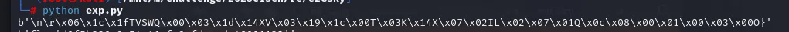
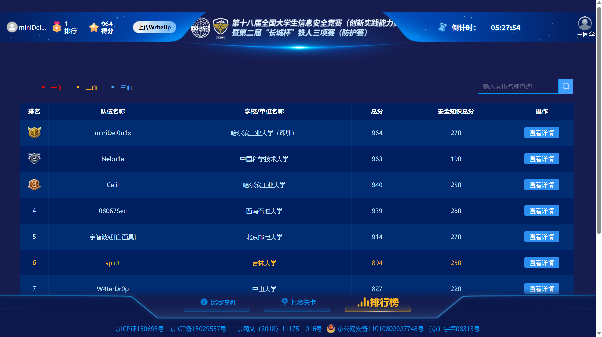

虽然往届CISCN多有烂活，但是像今年这样强制要求集中参赛还得统一双机位录制、连离开座位都要线上申请的烂活，似乎还是历史首次。至于解题更是限制颇多，甚至不允许使用大语言模型...

<!--more-->

## Crypto

### rasnd

前半部分经典套路，x1和x2均可爆破，然后就能两个方程联立消去p得到一个关于q的一次方程f(q)，接着gcd(n,f(q))就能获得q。

后半部分给的hint事实上就是 $(514*p - 114*q)^{-1}\bmod{n}$ ，inverse()然后解方程就能获得p，q。

> exp

```python
#!/usr/bin/sage
from Crypto.Util.number import *
import itertools
from tqdm import tqdm, trange

hint1 = 
hint2 = 
n1 = 
for a,b in tqdm(itertools.product(range(2**11),repeat=2)):
    q = GCD(a*(hint1+0x114)-b*(hint2+0x514),n1)
    if q != 1 and q!= n1:
        print(q,n1//q)
        break
q1,p1 =q, n1//q
c1 = 
d = inverse(65537,(p1-1)*(q1-1))
print(long_to_bytes(pow(c1,d,n1)))
hint3 = 
n2 = 
gao = inverse(hint3,n2)
var('p2 q2')
eq1 = 514*p2-114*q2-gao
eq2 = p2*q2-n2
sol = solve([eq1,eq2],p2,q2)
d = inverse(65537,(p2-1)*(q2-1))
print(long_to_bytes(pow(c,d,n2)))
```

### fffffhash

2023 DownUnder CTF的原题，同时也是去年CISCN考过的考点。原题有MITM和格两种预期解，不过这题长度比较长，MITM大概是很困难的。

所以直接套用DUCTF的官方的格做法就好了：

> exp

```python
from Crypto.Util.number import *
import itertools
from tqdm import tqdm, trange
TARGET = 201431453607244229943761366749810895688
h0 = 0x6c62272e07bb014262b821756295c58d
p = 0x0000000001000000000000000000013b
MOD = 2^128

n = 16
M = Matrix.column([p^(n - i - 1) for i in range(n)] + [-(TARGET - h0*p^n), MOD])
M = M.augment(identity_matrix(n+1).stack(vector([0] * (n+1))))
Q = Matrix.diagonal([2^128] + [2^4] * n + [2^8])
M *= Q
M = M.BKZ()
M /= Q
for r in M:
    if r[0] == 0 and abs(r[-1]) == 1:
        r *= r[-1]
        good = r[1:-1]
        print(good)
        break
inp = []
y = int(h0*p)
t = (h0*p^n + good[0] * p^(n-1)) % MOD
for i in range(n):
    for x in range(256):
        y_ = (int(y) ^^ int(x)) * p^(n-i-1) % MOD
        if y_ == t:
            print('good', i, x)
            inp.append(x)
            if i < n-1:
                t = (t + good[i+1] * p^(n-i-2)) % MOD
                y = ((int(y) ^^ int(x)) * p) % MOD
            break
    else:
        print('bad', i)
print(bytes(inp).hex())
```

这题还拿了个二血XD

### *LWEWL

铸币了，后半部分的RLWE当天上午就解决了，结果前半部分的LWE因为没注意到两个pubkey的线性关系所以一直纳闷怎么在一个1124x1124的格上做LLL，还尝试了一堆黑科技和数学操作——结果当然也是不成功的，于是当天下午就直接把这题全盘扔给新人去看了XD

> 还是要认真审计代码

贴个Astrageldon师傅的代码(略有改动)，RLWE的思路跟我的比较像但是代码比我的美观多了QQ

```python
#!/usr/bin/sage
a, b, f, rlwe_modulus = load("rlwe_ciphertext.sobj")
rlwe_dim = 64
names = ','.join(['x'] + [f's{i}' for i in range(rlwe_dim)])
P = PolynomialRing(GF(rlwe_modulus), names = names)
x = P.gen(0)
a = sum(a_*x^i for i,a_ in enumerate(list(a)))
b = sum(b_*x^i for i,b_ in enumerate(list(b)))
f = sum(f_*x^i for i,f_ in enumerate(list(f)))
Q = P.quo(f)


s = P.gens()[1:]
t = Q(sum(a.monomial_coefficient(x^i)*x^i for i in range(rlwe_dim))) * Q(sum(s_*x^i for i,s_ in enumerate(list(s))))
tl = t.lift()
tm = tl.monomials()
tc = tl.coefficients()


L = zero_matrix(ZZ, 2*rlwe_dim + 1, 2*rlwe_dim + 1)
for c, m in zip(tc, tm):
    j = m.degree(x)
    i = s.index(m // x^j)
    L[i, j] = c


for j in range(rlwe_dim):
    L[j + rlwe_dim, j] = rlwe_modulus
    L[j, j + rlwe_dim] = 1
    L[2*rlwe_dim, j] = -b.monomial_coefficient(x^j)
L[2*rlwe_dim, 2*rlwe_dim] = 1
```

## Re
### ezCsky
IDA跟BinaryNinja都反编译不了，识别了一下貌似是M Core架构(什么偏门的Motorola处理器)

Google到相关企业给的开发手册，对着手册嗯看汇编识别出RC4，.rodata段里找到密文，key应该是strings里的`testkey`

但是直接解密出来是乱码：



因为最后一位是对的所以猜一个逐字符异或：

```python
from Crypto.Util.number import *
def KSA(key):
    """ Key-Scheduling Algorithm (KSA) """
    S = list(range(256))
    j = 0
    for i in range(256):
        j = (j + S[i] + key[i % len(key)]) % 256
        S[i], S[j] = S[j], S[i]
    return S
 
def PRGA(S):
    """ Pseudo-Random Generation Algorithm (PRGA) """
    i, j = 0, 0
    while True:
        i = (i + 1) % 256
        j = (j + S[i]) % 256
        S[i], S[j] = S[j], S[i]
        K = S[(S[i] + S[j]) % 256]
        yield K
 
def RC4(key, text):
    """ RC4 encryption/decryption """
    S = KSA(key)
    keystream = PRGA(S)
    res = []
    for char in text:
        res.append(char ^ next(keystream))
    return bytes(res)


c=[0x96, 0x8F, 0xB8, 0x08, 0x5D, 0xA7, 0x68, 0x44, 0xF2, 0x64, 
  0x92, 0x64, 0x42, 0x7A, 0x78, 0xE6, 0xEA, 0xC2, 0x78, 0xB8, 
  0x63, 0x9E, 0x5B, 0x3D, 0xD9, 0x28, 0x3F, 0xC8, 0x73, 0x06, 
  0xEE, 0x6B, 0x8D, 0x0C, 0x4B, 0xA3, 0x23, 0xAE, 0xCA, 0x40, 
  0xED, 0xD1]
if __name__ == "__main__":
    # with open('./ezCsky','rb')as f:
    #     data = f.read()
    key = b'testkey'  # 加密key
    m = RC4(key,bytes(c))
    print(m)
    m = list(m)
    i = len(m)-2
    while i>=0:
        m[i]=m[i]^m[i+1]
        i-=1
    m= bytes(m)
    print(m)
    print(len(c))
```
然后就出了。

### dump

单字节加密，直接当古典密码做就行。

> exp

```python
import subprocess

program_path = "./re.exe"  
visible_characters = ''.join([chr(i) for i in range(32, 127)])  # ASCII 可见字符

try:
    result = subprocess.run([program_path, visible_characters], 
                            capture_output=True, text=True, check=True)
    program_output = result.stdout.strip()
except subprocess.CalledProcessError as e:
    print("Error occurred while running the program:", e)
    exit(1)

if len(program_output) % 2 != 0:
    raise ValueError("Program output length must be even to map pairs of characters.")

output_mapping = {}
# 把所有可见字符喂进去构建出的明密文映射字典
for i in range(0, len(program_output), 2):
    output_pair = program_output[i:i+2]
    key = visible_characters[i // 2]
    output_mapping[key] = output_pair

encoded_string = "23291e24380e1520370e0520000e37121d0f24010139"

decoded_string = ""
for i in range(0, len(encoded_string), 2):
    encoded_pair = encoded_string[i:i+2]
    
    for key, value in output_mapping.items():
        if value == encoded_pair:
            decoded_string += key
            break


print(f"Decoded String: {decoded_string}")
```

## Misc
类别虽然标了Misc但是今年的Misc全是类似取证的玩意儿。

### zeroshell系列

流量包是队友分析的，略。拿火眼之类的取证工具能从虚拟机磁盘里提取出来`.nginx`，此为`zeroshell_4`。

IDA拖进去肉眼搜索字符串就能解决掉`zeroshell_3`&`zeroshell_5`。

### WinFT系列

火绒剑打开观察外联+VirusTotal扫描`flvupdate.exe`搞定1。

2的启动项是计划任务里那个`\DriverUpdates`，火绒剑看得不太方便，用Sysinternals里的Autoruns工具扫描看得更清楚。

5可以从流量包里提取出`server`&`client`两个文件，010editor看了看感觉应该是一个压缩包的两部分，拼接起来之后从虚拟机里找到一个同样大小的Everything_xxxxx.zip后打明文攻击拿到flag。

## 结语

因为社团的安排，今年没能在一队a题，而是到了二队带带新人。唉，密码！要是复赛有密码题大概也不至于进不了一队吧（

上午拿了fffffhash的二血后最高排名来到了全国第一：



可惜LWE没出，下午嗯做逆向导致最后一堆取证也来不及做了，几个简单题没拿到手。不过勉勉强强挤进前400，复赛大概有望吧。

赛前作为练手打了个印度佬的niteCTF，跟队友keyboard合力拿下23名。赛后在Discord server遇到了[正规子群](https://ctftime.org/team/365958)的OV3师傅，
因为一直是他的忠实读者，如此难得的机会就加了对方的Discord好友。

于是顺便也被邀请加入了正规子群（

大概是本科最后一次CISCN了（如果未来不延毕的话）？比起以前实在是顺利太多。
社团、课程也都逐渐有了起色，Del0n1x能在一个没有网安专业的学校开花，多有困难，也不乏幸运。

自己因为一直心心念念数学顺理成章地做起密码，现在也算是有一点水平；从隔壁电信学院抽卡出了SSR级别的逆向手；队长和副队长分别在pwn和web上颇有研究。
初次启航的战队，就这么奇迹般地凑齐了所有方向，而且每个方向都有一定的竞争力，无疑是幸运的。

2024.2初次成军，今年前前后后已经进了四五次线下赛，也在鹏城杯的赛场第一次拿到了比赛奖金。

未来，Del0n1x会有更好的成绩吗？


