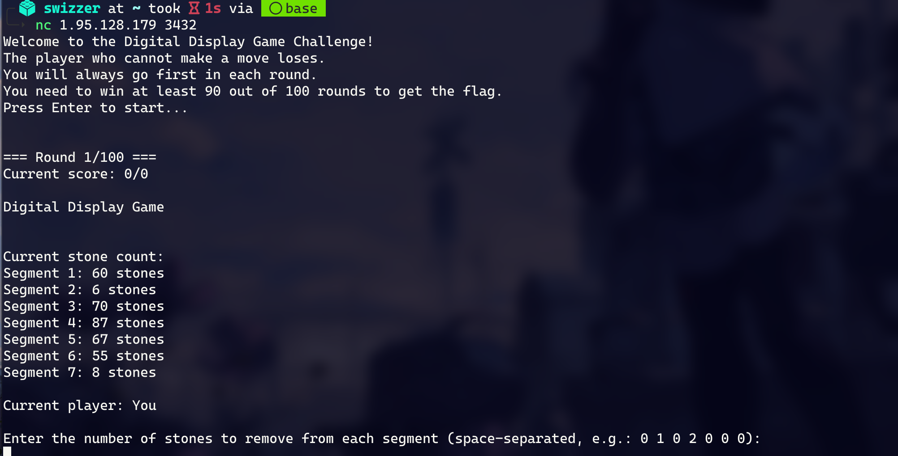
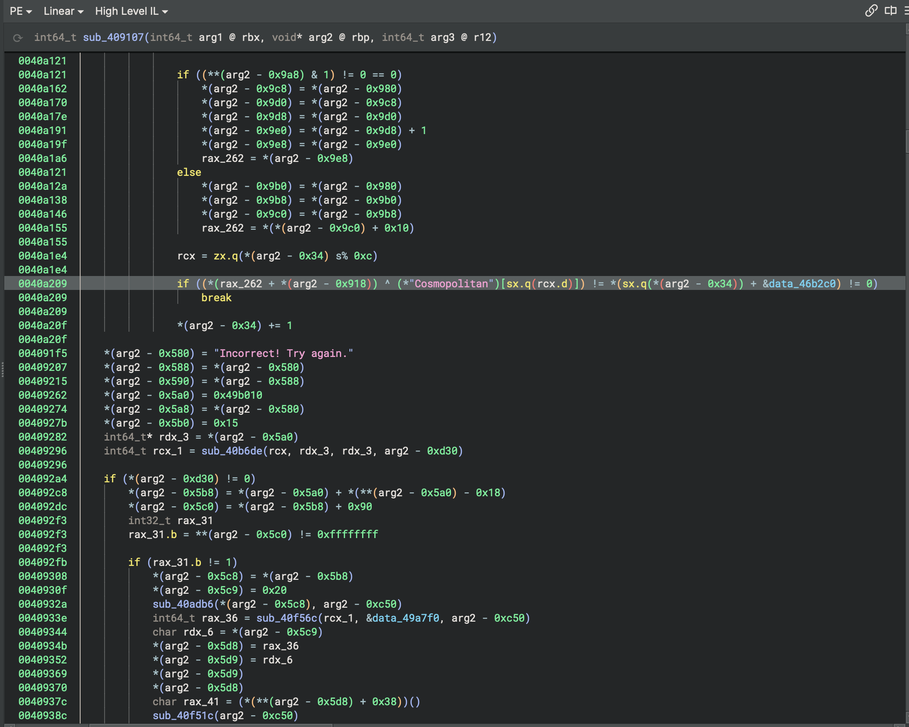

听说TP=Thu+Pku，但是题目质量有点名不副实...

<!--more-->

# Crypto

## randomized random

> chall.py

```python
# FROM python:3
import random
with open("flag.txt","rb") as f:
    flag=f.read()
for i in range(2**64):
    print(random.getrandbits(32)+flag[random.getrandbits(32)%len(flag)])
    input()
```

一眼MT19937,拿到足够的bit恢复初始状态就行。抄[huangx607087师傅之前的exp](https://huangx607087.online/2021/07/10/Explore-MT19937/)直接就出了。我这边是每轮交互取高8位，交互5000轮左右可以构造出一个满秩矩阵。后面的求解过程，在M4 Pro上大概需要3min，使用内存11G左右。

不过，既然MT19937在GF(2)下是线性的，我猜用maple佬的[gf2bv](https://github.com/maple3142/gf2bv)去解大概也是可以的？挖个坑，过几天试试看。

# Reverse

## stone-game

MacOS的可执行文件(还好我是Mac)，直接die检查看不出是PyInstaller打包，但是拖到BinaryNinja/直接执行，就会发现这是个打包后的可执行文件。

pyinstxtractor解包后拿去PyLingual反编译，能拿到stone_game.pyc的反编译结果，但是game_logic.pyc没法成功反编译。

总之先nc连接到题目：



直接上手玩很容易触发`"Invalid move! Remember you cannot form cycles."`，考虑到题目的7个Segment，猜测可能是7段数码管(连我都佩服我的脑洞)——每次取stone时，每段上的stone数目如果为正数则相当于对应的一段数码管亮起，并且不允许亮起的数码管形成圈。

Rev->Misc，写个脚本陪AI玩玩，发现AI好像每次只会取走1个石头(or not？反正很笨就是了)，那就直接一把梭吧。

> exp.py

```python
from pwn import *
from tqdm import trange
conn = remote('1.95.128.179', '3316')
log.level='debug'
conn.recvuntil(b"Press Enter to start...")
conn.sendline()
for _ in trange(100):
    conn.recvuntil(b"Current stone count:\n")
    res = []
    for round in trange(7):
        res.append(int((conn.recvline().strip().split(b" ")[2]).decode()))
    print(res)
    ans = str(res[0])+" 0 0 "+str(res[3])+" "+str(res[4])+" "+str(res[5])+" "+str(res[6])
    conn.sendline(ans.encode())
    conn.recvuntil(b"Current player: AI")
    conn.recvuntil(b"Current stone count:\n")
    res = []
    for round in trange(7):
        res.append(int((conn.recvline().strip().split(b" ")[2]).decode()))

    print(res)
    ans = "0 "+str(res[1])+" "+str(res[2])+" "+"0 0 0 0"
    conn.sendline(ans.encode())
    conn.recvuntil(b"Current player: AI")

conn.interactive()
```

## portable

原程序用的是[这个项目](https://github.com/jart/cosmopolitan)编译而成，但是知道这点也没什么用:P

总之这个程序在Linux上能跑其实是有个ape loader把自身按某种妙妙操作处理后map到内存里然后再跑的。队友尝试用radare2去dump，不过也没得到什么有价值的玩意儿。

直接静态分析的话，IDA根本看不到有些字符串的交叉引用，动调又隔了个loader，怎么想都不像是一个300+分数的题目应有的难度，所以我还是选择BinaryNinja嗯看：



嗯，找到字符串后直接就能盯帧出来这一行，循环xor一下就出了。

最坑的是data_46b2c0的最后有几个0x00,前面有个对flag长度的检查，需要长度为72,data_46b2c0的长度也是72,按理来讲0x00也应该在解密时算进去；但平台的flag是不包括这一串的😓

把正确flag喂给二进制文件也不会提示正确，不确定是不是kitty terminal对字体支持的问题。

