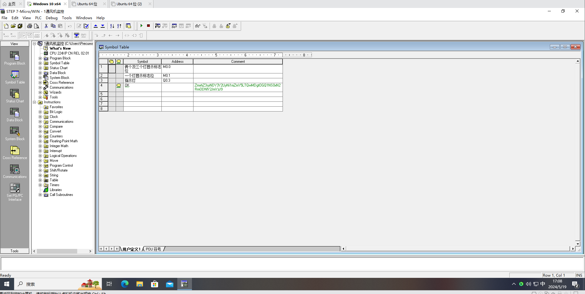
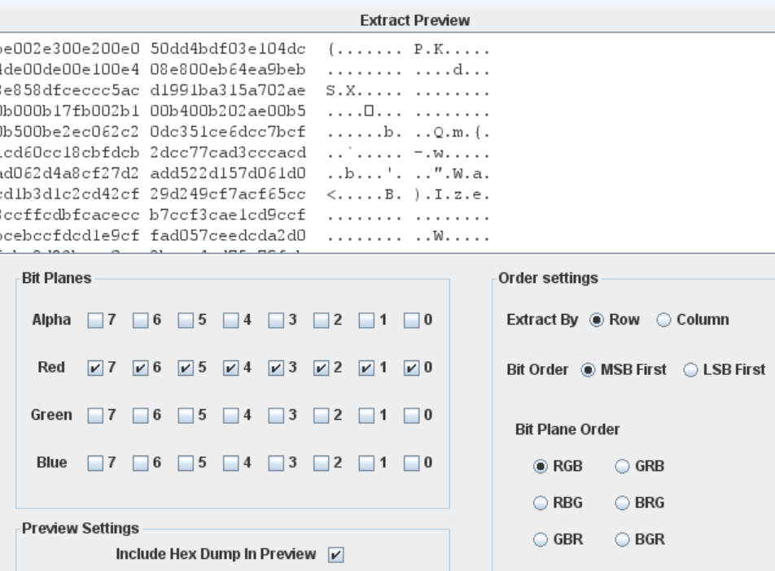
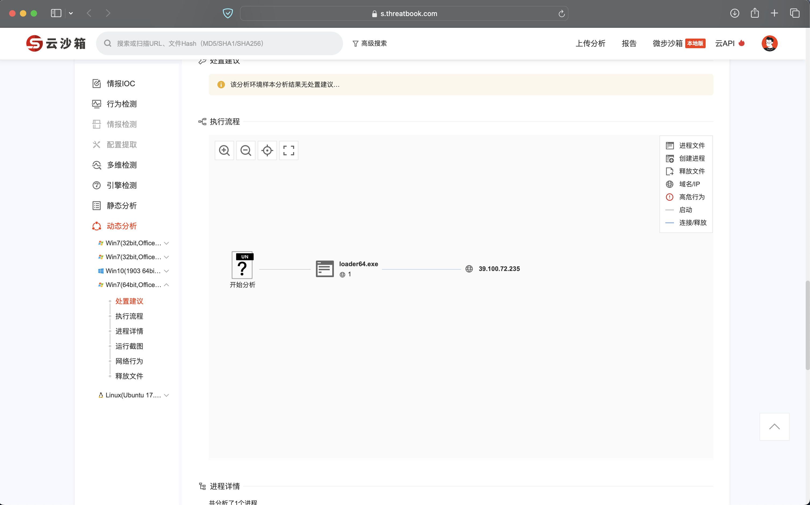
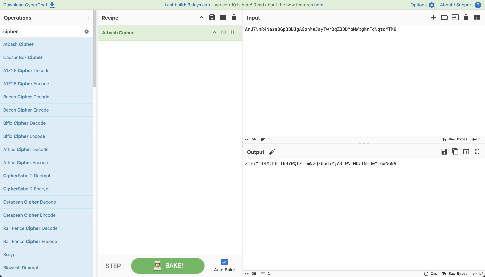
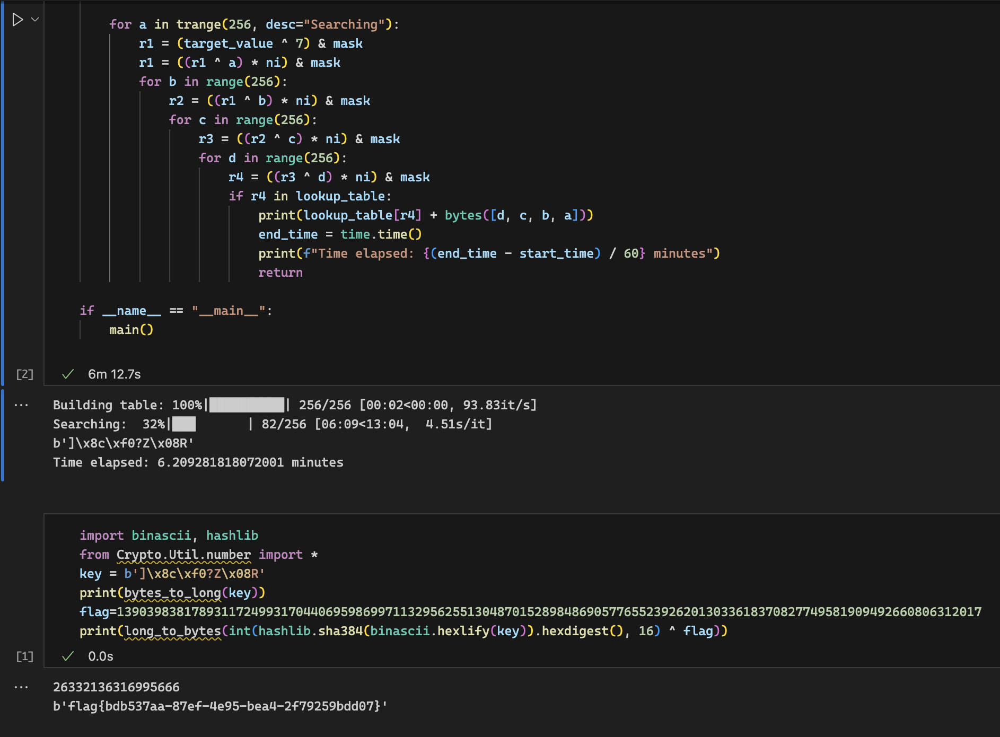

题目的附件在探姬佬的[repo](https://github.com/CTF-Archives/CISCN2024)里可以找到，就不再额外说明题目了。

# Misc
## 通风机

TriID识别出是Sybase iAnywhere的database，不过似乎并不对。Google了一下基本都指向Siemens的S7-200 Program，随便找了个[下载站](https://plc4me.com/download-step-7_v4-s7-200-siemens-plc-software-real-100/)下载安装。这里建议装在虚拟机，毕竟我对于这类下载站都不很信任，并且这个上古软件本身就很脏...

安装之后也并不能直接打开这个mwp文件，找一份mwp文件对比一下+各方搜索，确认是文件头缺少了3字节。添加上`47 4A 4B`之后正常打开，在Symbol Table里有



base64 decode即可。

`flag{2467ce26-fff9-4008-8d55-17df83ecbfc2}`

Update: 复现发现直接binwalk -e分离文件后strings就能拿到那串base64。这个套路我本来还挺熟悉的，结果赛场上还是太路径依赖了...

## 盗版软件

很神奇的题目，解压得到一个dmp和一个exe。最初直接010 editor人肉盯帧dmp文件找到了个`www.waodown.com`，交flag碰壁数十次之后觉得应该不是这个域名...后来和队友头脑风暴了半个小时，想起来头天晚上复盘前些年的CISCN时用到的gimp，抱着试试看的心态将dmp作为raw data打开图像，手工fuzz了位移和宽高(unintended solution可能？抽象做法)后整出来了：


IP地址还得从exe入手，扔沙箱里看到exe运行后生成了loader.exe和一个png。对malware有经验的应该马上就能反应过来png里大概有shellcode，而loader就是加载Shellcode连接C2执行后续恶意行为的。png丢到Stegsolve里盯出来了LSB隐写：



典型的`50 4B 03 04`，zip头。让GPT搓个脚本提取出zip：

```python
def extract_bytes(input_file, output_file):
    try:
        with open(input_file, 'rb') as f_in, open(output_file, 'wb') as f_out:
            byte_index = 0
            while True:
                byte = f_in.read(1)  # 读取一个字节
                if not byte:  # 判断是否已经读到文件末尾
                    break
                if byte_index % 2 == 0:  # 每隔一个字节提取一个字节
                    f_out.write(byte)  # 写入提取的字节
                byte_index += 1
    except Exception as e:
        print(f"An error occurred: {e}")

# 指定输入文件和输出文件的路径
input_file = "1.bin"
output_file = "output.zip"

# 调用提取字节的函数
extract_bytes(input_file, output_file)
```

提取之后删除多余的一坨文件尾，解压得到.b。.b看起来很像base85，猜测解码之后就是Shellcode——你说的对，但是题目给的loader.exe压根就不是exe而是一坨0xff(或许我的附件有问题？)，我一度以为还需要手搓Shellcode loader😅

解码后的文件丢VT上一堆报毒(貌似是MetaSploit家族的？)，但是YARA规则没识别出IP。丢[微步](https://s.threatbook.com/report/file/a97946c34d2d8642820f196a54a6e8d78cf4f58a97e417be9696d7fd19e7fc95)发现已经有结果了，应该是做出来的前人传的吧：



MD5之后，提交，get。

可惜此时已经黑灯了，导致后来队友出的另外两道题只能挑一道提交，不过好在另两道最后都是50分，倒也没有亏什么分数😇

flag{096e8b0f9daf10869f013c1b7efda3fd}

## 神秘文件

和队友合力解的，硬控3h是真的坐牢🤪

细节不想写了，大概说一下卡住的几个点吧。

1. 宏里面的RC4没有密钥，且密码学工具箱不能正常解密(也可能我操作不当，欢迎交流)。(找了一下午密钥你告诉我密钥为空？)

2. 属性里的`ha?again?`是没用的

3. 第四张PPT里检查阅读顺序可以拿到Part7

4. 幻灯片母版里有Part8。其实这里直接解压PPT会发现一个看似没有用到的文本框，作为线索可以找到这个点。

# Crypto
## 古典密码

感谢cyberchef，在我走投无路的时候信手筛选了下Cipher，把第一个Atbash Cipher拖进去直接就魔法棒了🪄



## OvO

挺不错的数学题，听人说跟XY的某个Copper是同一篇Paper？不过我是没看出来，欢迎各位指教。

一个有用的观察是$e//n = rr$，这样就消去了一个变量。我们拿到的e经过了截位，并且高位信息明显跟p，q有关，所以需要想办法抠出点p或者q的高位信息。

在纸上推算一会儿可以发现，$65537 + kk * p + rr * ((p+1) * (q+1)) + 1$这个式子乘上p是可以再消去一个变量的，接下来就可以尝试多项式求根了。

如果e没有截位，那么我们拿到$f = (65537*x + kk*x^2 + (kk+2)*n*x + (kk+2)*x^2 + (kk+2)*n + (kk+3)*x) - e*x$之后直接f.roots()就可以得到p。但是e经过了截位，所以得到的x其实比p要大/小一点，不过这已经可以让我们拿到p的高位了——拿到高位就够了。后面就是简单的p高位泄露。

```python
# Sage
import hashlib
from Crypto.Util.number import *
n = 111922722351752356094117957341697336848130397712588425954225300832977768690114834703654895285440684751636198779555891692340301590396539921700125219784729325979197290342352480495970455903120265334661588516182848933843212275742914269686197484648288073599387074325226321407600351615258973610780463417788580083967
e = 37059679294843322451875129178470872595128216054082068877693632035071251762179299783152435312052608685562859680569924924133175684413544051218945466380415013172416093939670064185752780945383069447693745538721548393982857225386614608359109463927663728739248286686902750649766277564516226052064304547032760477638585302695605907950461140971727150383104
c = 14999622534973796113769052025256345914577762432817016713135991450161695032250733213228587506601968633155119211807176051329626895125610484405486794783282214597165875393081405999090879096563311452831794796859427268724737377560053552626220191435015101496941337770496898383092414492348672126813183368337602023823
# rr = e//n, rr == 331118458487559161870846961263454730639,以下的rr事实上是kk（
rr = 331118458487559161870846961263454730637

def Copper(n, c, e, rr):
    R.<x> = PolynomialRing(RealField(1024))
    f = (65537*x + rr*x^2 + (rr+2)*n*x + (rr+2)*x^2 + (rr+2)*n + (rr+3)*x) - e*x
    f = f.monic()
    res = f.roots()
    if(res):
        return res

res = Copper(n, c, e, rr)
for root in res:
    p_hi = int (root[0])
    PR.<x> = PolynomialRing(Zmod(n))
    ff = x + p_hi
    roots_1 = ff.monic().small_roots(X=2^200, beta=0.3)
    if roots_1:
        p = int(roots_1[0]) + p_hi
        q = n//p
        e = 65537 + rr * p + (rr+2) * (p+1) * (q+1) + 1
        d = inverse(e, (p-1)*(q-1))
        m = pow(c, d, n)
        print(long_to_bytes(m))
```

嗯，exp里的Copper函数其实不是CopperSmith，之所以叫这个是因为是从CopperSmith的板子改过来的，我懒得改名字了（轻喷qwq

## *hash

python 2.7内置的hash是魔改了一点的fnv hash，问问GPT就可以得到实现细节。爆破的时候使用中间相遇的手法，可以大幅降低时间复杂度。

因为赛场上没去翻源码又理解错了GPT的回复，以为输出前异或的是bit length，所以最后与flag失之交臂😭😭其实Python 2.7的hash最后是与byte length做异或后输出。
```python
from Crypto.Util.number import inverse
from tqdm import trange
import time

def main():
    start_time = time.time()
    mask = (1 << 64) - 1
    lookup_table = {}

    for a in trange(256, desc="Building table"):
        x = 0
        x = (x ^ (a << 7)) & mask
        x = ((x * 1000003) ^ a) & mask
        for b in range(256):
            x2 = ((x * 1000003) ^ b) & mask
            for c in range(256):
                x3 = ((x2 * 1000003) ^ c) & mask
                lookup_table[x3] = bytes([a, b, c])

    ni = inverse(1000003, 1 << 64)
    target_value = 7457312583301101235

    for a in trange(256, desc="Searching"):
        # 这里异或的是字节长度
        r1 = (target_value ^ 7) & mask
        r1 = ((r1 ^ a) * ni) & mask
        for b in range(256):
            r2 = ((r1 ^ b) * ni) & mask
            for c in range(256):
                r3 = ((r2 ^ c) * ni) & mask
                for d in range(256):
                    r4 = ((r3 ^ d) * ni) & mask
                    if r4 in lookup_table:
                        print(lookup_table[r4] + bytes([d, c, b, a]))
                        end_time = time.time()
                        print(f"Time elapsed: {(end_time - start_time) / 60} minutes")
                        return

if __name__ == "__main__":
    main()
```



翻了一下CTF wiki，发现直接拿格子去打也是可以的，实验了一下速度确实快上不少。只能说学海无涯了。


# Reverse
## asm_re

三脚猫水平的我也只能做做Re签到了（

汇编很长，不想看的话直接丢给GPT，GPT大概率会告诉你这玩意儿的主体逻辑的位置。稍微审计一下发现就是个仿射+异或，直接逆回去就行。

```python
expected_data = [0x1fd7,0x21b7,0x1e47,0x2027,0x26e7,0x10d7,0x1127,0x2007,0x11c7,0x1e47,0x1017,0x1017,0x11f7,0x2007,0x1037,0x1107,0x1f17,0x10d7,0x1017,0x1017,0x1f67,0x1017,0x11c7,0x11c7,0x1017,0x1fd7,0x1f17,0x1107,0x0f47,0x1127,0x1037,0x1e47,0x1037,0x1fd7,0x1107,0x1fd7,0x1107,0x2787]

# 将预期数据转换为字符串
flag_chars = []
for i in range(0, len(expected_data)):
    byte_value = expected_data[i]
    char = chr((((byte_value - 0x1E)^ 0x4D) - 0x14 ) // 0x50)
    flag_chars.append(char)

# 恢复的 flag
flag = ''.join(flag_chars)
print(f"Recovered flag: {flag}")
```
注意提取目标的数组的时候调一下分组大小和端序就行。