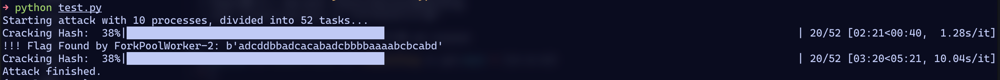
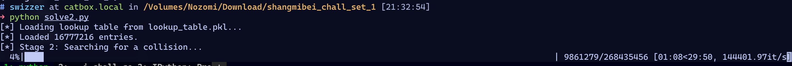
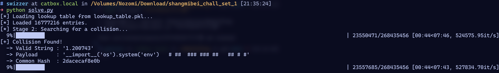
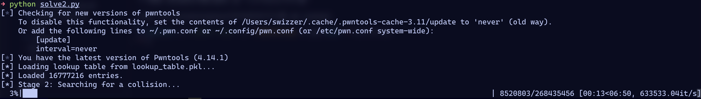
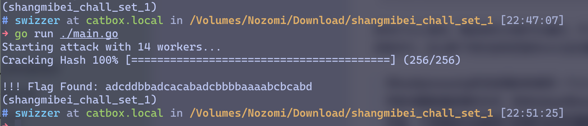
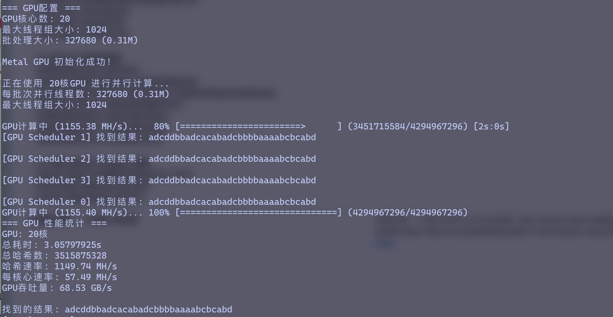

显然我不是什么HPC专家，标题搞这么大阵仗有班门弄斧的嫌疑。这篇文章其实只是记录一些CTF中在爆破时可以用到的、非算法层面的Speedup tricks，以期未来的某场比赛能加快做题速度。下文如果不额外指明，默认指Python的trick。

## 多进程

之所以单独把多进程挑出来，主要是针对Python的——因为GIL的存在，Python的多线程天生就是半残状态，如果想在Python里并行爆破什么东西，最好还是用multiprocessing写个多进程。

> 当然Python也快要迎来无GIL的版本了，说不定一两年之后这篇文章就得回旋镖了

这里拿刚过去的熵密杯的[初始谜题1](https://languag3.github.io/2025/07/20/%E7%86%B5%E5%AF%86%E6%9D%AF-2025/#%E5%88%9D%E5%A7%8B%E8%B0%9C%E9%A2%981)当例子。虽然[@adwa](https://languag3.github.io)自述Python需要300h+，但其实我本地测下来远没有这么慢。

首先写个并行代码

```python
import hashlib
import itertools
from multiprocessing import Pool, cpu_count, current_process, set_start_method
from tqdm import tqdm

set_start_method("fork")


def sm3_hash(msg):
    hash_obj = hashlib.new("sm3")
    hash_obj.update(msg)
    return hash_obj.hexdigest()


def attack(bound):
    low, up = bound

    search_space = itertools.product(range(low, up), *[range(256)] * 3)

    for i, j, k, l in search_space:
        tmp = block[i] + block[j] + block[k] + block[l]
        msg = m + tmp.encode()

        if sm3_hash(msg) == h:
            print(f"\n!!! Flag Found by {current_process().name}: {msg}")
            return msg

    return None


if __name__ == "__main__":
    table = ["a", "b", "c", "d"]
    m = b"adcddbbadcacabad"
    h = "aab05fca300811223b3b957bfe33130770fb7a6b55b030a5809c559344f66f79"
    block = ["".join(i) for i in itertools.product(table, repeat=4)]
    num_tasks = cpu_count() * 4
    total_range = 256
    chunk_size = (
        total_range // num_tasks
        if total_range % num_tasks == 0
        else total_range // num_tasks + 1
    )
    bounds = []
    for i in range(num_tasks):
        low = i * chunk_size
        up = min((i + 1) * chunk_size, total_range)
        if low < up:
            bounds.append((low, up))

    print(f"Starting attack with 10 processes, divided into {len(bounds)} tasks...")

    with Pool(10) as pool:
        results_iterator = pool.imap_unordered(attack, bounds)

        for result in tqdm(results_iterator, total=len(bounds), desc="Cracking Hash"):
            if result:
                pool.terminate()
                pool.join()
                break

    print("Attack finished.")
```



在M4 Pro上测试，看起来8min就可以遍历。不过因为我用的M4 Pro是10大核+4小核的CPU，所以Pool里开的是10进程并行。这么算下来的话单进程80min也足够爆破完成。

> 用multiprocessing写多进程的时候有一个小小的坑。multiprocessing提供了一个set_start_method的方法可以用来设置新建进程的方式，在Windows和macOS上这个方式默认是spawn而非fork，在Linux上则是fork。fork的话，子进程因为会继承父进程的全局变量和数据，写脚本的时候会很省事(特别是CTF中很容易涉及到全局变量，fork默认向子进程传递就会免去手动控制的烦恼)，但spawn就没这么方便了。macOS上可以用`multiprocessing.set_start_method("fork")`手动指定为fork，当然也可以写个`if __name__ == "__main__"`然后手动区分子进程和父进程各自需要的数据。也不算麻烦就是了。

## JIT

熵密杯这题因为性能瓶颈在于`hashlib.update()`所以Python层面能优化的不多。如果性能瓶颈在Python，就可以用上一些额外的优化，比如，用JIT优化热点路径。

以[2025 CubeCTF - Elemetary](https://blog.swizzer.cc/blog/2025-cubectf/#elementary)为例。blog里原版的攻击脚本如果用CPython跑，大概要跑这么久：



### numba

如果把hash函数改写一下，用numba套上JIT

```python
import numpy as np
from numba import njit, objmode


@njit
def _h_jit(b: np.ndarray) -> np.uint64:
    h1 = np.uint64(0x1234567890AB)
    h2 = np.uint64(0xFEDCBA098765)

    for i in range(len(b)):
        byte = b[i]
        shift = np.uint64((i % 6) * 6)

        if i % 2 == 0:
            h1 ^= np.uint64(byte) << shift
            h1 = (h1 * np.uint64(0x100000001B3)) & np.uint64(0xFFFFFFFFFFFF)
        else:
            h2 ^= np.uint64(byte) << shift
            h2 = (h2 * np.uint64(0xC6A4A7935BD1)) & np.uint64(0xFFFFFFFFFFFF)

    with objmode(result="uint64"):
        py_h1 = int(h1)
        py_h2 = int(h2)
        py_res = py_h1 ^ ((py_h2 << 24) | (py_h2 >> 24))
        py_res = (py_res ^ (py_res >> 25)) * 0xFF51AFD7ED55
        py_res &= 0xFFFFFFFFFFFFFFFF
        result = np.uint64(py_res)
    result = (result ^ (result >> np.uint64(25))) * np.uint64(0xC4CEB9FE1A85)
    result ^= result >> np.uint64(25)

    return result


def h(data: str) -> bytes:
    b_np = np.frombuffer(data.encode("utf-8"), dtype=np.uint8)
    result_int = _h_jit(b_np)
    return result_int.to_bytes(8, "big")[:6]
```

然后同样用CPython跑，时间就是原来的1/4:



### pypy

当然我在原文说的是用pypy去跑，pypy也是带JIT的，所以跑起来也不会很慢，大概像这样：



用`uv python pin ...`命令可以快速装起来一个pypy环境，非常好用。

### CPython?

CPython在3.13引入了实验性的JIT支持，不过我还没编译测试过。未来CPython全面引入JIT后，这个trick也就不再是trick了。

## 多线程

与我在用的M系列芯片不同，x86阵营的处理器很多都带有SMT(Simultaneous Multithreading)技术，可以让一个核心同时跑两个线程从而提高流水线利用率。虽然直接拿Python写多进程也能利用上SMT技术的红利，但是进程切换的开销毕竟还是太大了，如果换成真正意义上的多线程，效率很可能会更上一层楼。

回到熵密杯那题，我们用Go写一份多线程爆破，Workers数量则直接用`runtime.NumCPU()`

```go
package main

import (
	"fmt"
	"runtime"
	"sync"
	"sync/atomic"

	"github.com/schollz/progressbar/v3"
	"github.com/tjfoc/gmsm/sm3"
)

const (
	targetHash = "aab05fca300811223b3b957bfe33130770fb7a6b55b030a5809c559344f66f79"
	prefix     = "adcddbbadcacabad"
)

var charTable = []byte("abcd")

func worker(wg *sync.WaitGroup, jobs <-chan uint64, found *int32, result *string, resultLock *sync.Mutex, bar *progressbar.ProgressBar) {
	defer wg.Done()

	prefixBytes := []byte(prefix)

	for j := range jobs {
		if atomic.LoadInt32(found) == 1 {
			bar.Add(1)
			return
		}

		var i uint64
		for i = 0; i < (1 << 24); i++ {
			fullIndex := (j << 24) + i

			suffix := make([]byte, 16)
			for k := 0; k < 16; k++ {
				shift := 30 - (k * 2)
				charIndex := (fullIndex >> shift) & 3
				suffix[k] = charTable[charIndex]
			}

			data := append(prefixBytes, suffix...)

			hash := sm3.New()
			hash.Write(data)
			sum := hash.Sum(nil)
			sumHex := fmt.Sprintf("%x", sum)

			if sumHex == targetHash {
				if atomic.CompareAndSwapInt32(found, 0, 1) {
					resultLock.Lock()
					*result = string(data)
					resultLock.Unlock()
				}
				bar.Add(1)
				return
			}
		}
		bar.Add(1)
	}
}

func main() {
	numWorkers := runtime.NumCPU()
	fmt.Printf("Starting attack with %d workers...\n", numWorkers)

	var wg sync.WaitGroup
	var found int32
	var result string
	var resultLock sync.Mutex

	jobs := make(chan uint64, 256)

	bar := progressbar.NewOptions(256,
		progressbar.OptionSetDescription("Cracking Hash"),
		progressbar.OptionSetPredictTime(true),
		progressbar.OptionShowCount(),
		progressbar.OptionSetTheme(progressbar.Theme{
			Saucer:        "=",
			SaucerHead:    ">",
			SaucerPadding: " ",
			BarStart:      "[",
			BarEnd:        "]",
		}),
	)

	wg.Add(numWorkers)
	for w := 0; w < numWorkers; w++ {
		go worker(&wg, jobs, &found, &result, &resultLock, bar)
	}

	for j := uint64(0); j < 256; j++ {
		jobs <- j
	}
	close(jobs)

	wg.Wait()
	bar.Finish()

	if result != "" {
		fmt.Printf("\n\n!!! Flag Found: %s\n", result)
	} else {
		fmt.Println("\n\nAttack finished. Message not found.")
	}
}

```



4min就能出结果(啊嘞，看起来也没有比Python多进程快？不过CPU占用率倒实打实地比Python多进程低)

## GPU加速

GPU的ALU虽然只能做简单运算，但胜在ALU够多，天生适合搞并行的东西。熵密杯这题就很适合用GPU去并行爆破，不过想让GPU给你做运算就没有那么多库可以调了，大部分hash得手动实现一遍，更何况是只有🇨🇳用的SM3。[OV3师傅](https://lov2.netlify.app/golang-cgo-metal/)写了一份基于macOS Metal的CGo脚本，我对SM3、Objective-C和Metal都不熟悉，所以就不再从头造轮子了，直接拿佬的跑跑看：



3s就能搞定熵密杯这题。。。

> 所以赛场上居然真的有人现场用CUDA写SM3，还是太厉害了

不过我还是学着写了写Metal，如果你感兴趣，[这里](https://github.com/Swizzzer/sha1-GPU-cracking)是我用Metal爆破sha1的尝试。


