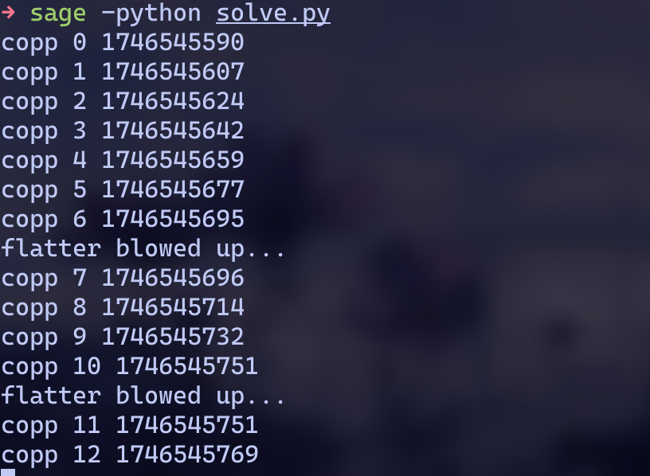
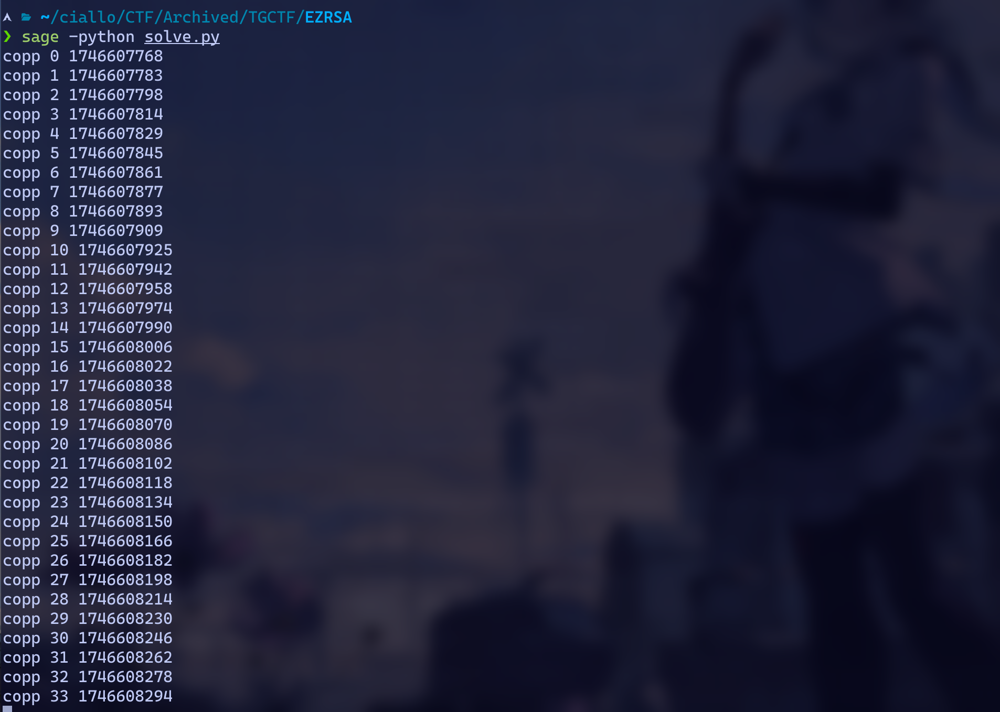
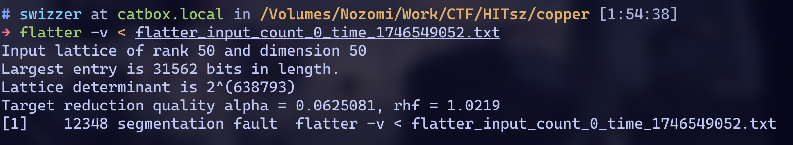
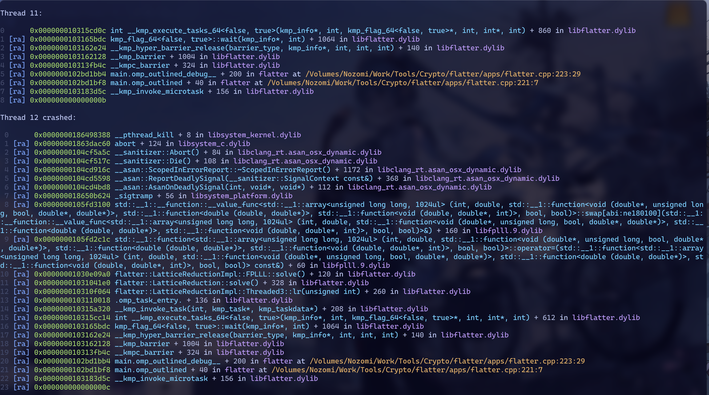

前几天看了TGCTF的一道RSA，顺带发现了flatter的某些bug😢


题目是基于512bit素数p,q的RSA，给出p的低256位，要求分解n求解明文。明显是打CopperSmith，只不过界压得非常紧。当然，原题写的比较Misc，p和q在生成时额外给了些低位的信息。

> 不过其实根本不需要那些信息就能做XD

思路就是朴实无华地爆破p的MSB，这样在CopperSmith时使用的格就会小一点，再把CopperSmith里的LLL换成flatter加速一下，就有机会在可接受时间内求解了。(当然，事后我才知道这个想法在WACON CTF 2023里已经出现过了)

> exp

```python
from Crypto.Util.number import *
from sage.all import *
from re import findall
from subprocess import check_output, CalledProcessError
import subprocess
import time
n = ...
c = ...
p_lb = ...
PR = PolynomialRing(Zmod(n), "x")
x = PR.gen()
f = x*2**256 + p_lb
f = f.monic()
count = 0


def flatter(M):
    global count
    # compile https://github.com/keeganryan/flatter and put it in $PATH
    z = "[[" + "]\n[".join(" ".join(map(str, row)) for row in M) + "]]"
    ret = check_output(["flatter"], input=z.encode())
    return matrix(M.nrows(), M.ncols(), map(int, findall(b"-?\\d+", ret)))


def small_roots(self, X=None, beta=1.0, epsilon=None, **kwds):
    from sage.misc.verbose import verbose
    from sage.matrix.constructor import Matrix
    from sage.rings.real_mpfr import RR

    N = self.parent().characteristic()

    if not self.is_monic():
        raise ArithmeticError("Polynomial must be monic.")

    beta = RR(beta)
    if beta <= 0.0 or beta > 1.0:
        raise ValueError("0.0 < beta <= 1.0 not satisfied.")

    f = self.change_ring(ZZ)

    P, (x,) = f.parent().objgens()

    delta = f.degree()

    if epsilon is None:
        epsilon = beta / 8
    verbose("epsilon = %f" % epsilon, level=2)

    m = max(beta**2 / (delta * epsilon), 7 * beta / delta).ceil()
    verbose("m = %d" % m, level=2)

    t = int((delta * m * (1 / beta - 1)).floor())
    verbose("t = %d" % t, level=2)

    if X is None:
        X = (0.5 * N ** (beta**2 / delta - epsilon)).ceil()
    verbose("X = %s" % X, level=2)

    # we could do this much faster, but this is a cheap step
    # compared to LLL
    g = [x**j * N ** (m - i) * f**i for i in range(m) for j in range(delta)]
    g.extend([x**i * f**m for i in range(t)])  # h

    B = Matrix(ZZ, len(g), delta * m + max(delta, t))
    for i in range(B.nrows()):
        for j in range(g[i].degree() + 1):
            B[i, j] = g[i][j] * X**j

    B = flatter(B)
    # B = B.LLL(**kwds)

    f = sum([ZZ(B[0, i] // X**i) * x**i for i in range(B.ncols())])
    R = f.roots()

    ZmodN = self.base_ring()
    roots = set([ZmodN(r) for r, m in R if abs(r) <= X])
    Nbeta = N**beta
    return [root for root in roots if N.gcd(ZZ(self(root))) >= Nbeta]

def copp_factor(leak=6):
    for hb in range(1 << leak):
        print("copp", hb, int(time.time()))
        shift = 512 - leak
        P = Zmod(n)["x"]
        x = P.gen()
        f = p_lb + (hb << shift) + x*2**256
        f = f.monic()
        X = 2 ** (256 - leak)
        beta = 0.499
        eps = 0.01
        try:
            rs = small_roots(f, X=X, beta=beta, epsilon=eps)
            if len(rs):
                return p_lb + (hb << shift) + int(rs[0])*2**256
        except:
            print("flatter blowed up...")
            continue
print(copp_factor())
```

一切看起来都很美好，但是这段代码在Mac上跑的时候就会出问题🤧



当然最终不影响解出原题，不过flatter跑飞这件事还是有点奇怪。报错也是最经典的segfault，怎么办呢？

## 着手复现

运行以上exp就会知道这玩意儿不能很稳定地复现，每次都有概率在不同的轮次炸掉。换个环境看看呢？如果是在Linux上，就不会有任何问题：



如果在Mac上跑个x86_64的Linux docker，里面再跑flatter，同样也没有任何问题。

选择炸掉的某一轮打印出来相应的矩阵，手动输入flatter看看：



甚至立马就炸了🤣多执行几次会发现炸掉的概率在1/10左右

总之，姑且是有个最小可复现的输入了。

## 尝试解决

### sleep(1)😆

我的第一直觉是，这玩意儿大概率跟系统进程/线程调度有关系，并且八成是多线程的锅。最简单的降低并发的办法就是每次调用flatter之后sleep一下。一轮flatter大概要十几秒，我选择每轮调用后sleep(1)。不幸的是，这样还是会随机地炸掉。

### AScan😊

至少我们得搞清segfault的时候发生了什么。编译flatter时加入`-fsanitize=address -g`选项：



八九不离十就是线程并发的问题了。在[@lov3](https://lov2.netlify.app)师傅的帮助下，去源码里找到了对应的多线程实现，简单加了个互斥锁：

```text
diff --git a/src/problems/lattice_reduction/fplll_impl.cpp b/src/problems/lattice_reduction/fplll_impl.cpp
index 237379b..aaa6e9c 100644
--- a/src/problems/lattice_reduction/fplll_impl.cpp
+++ b/src/problems/lattice_reduction/fplll_impl.cpp
@@ -6,7 +6,7 @@ namespace flatter {
 namespace LatticeReductionImpl {
 
 const std::string FPLLL::impl_name() {return "FPLLL";}
-
+static std::mutex fplll_execution_mutex;
 FPLLL::FPLLL(const LatticeReductionParams& p, const ComputationContext& cc) :
     Base(p, cc)
 {
@@ -65,7 +65,7 @@ void FPLLL::solve() {
     fplll::ZZ_mat<mpz_t> fplll_U;
     fplll_U.gen_identity(n);
 
-
+    std::lock_guard<std::mutex> lock(fplll_execution_mutex);
     // Because of a bug in FPLLL, our code segfaults if parallelized enumeration
     // is concurrently performed on more than one lattice. The following line
     // disables parallelized enumeration.
```

重新编译运行，问题解决。

## 成因?

总之先提了个[issue](https://github.com/keeganryan/flatter/issues/25)，待续...

lov3师傅猜测是fplll库并非线程安全的，但是我总觉得不止于此。毕竟，这个问题只在我的Mac上出现，而在我手头的Linux设备上都是正常的。除了操作系统的区别，还有一个最重要的区别是，Macbook的CPU是大小核设计，而我现有的Linux设备都是全大核的(如果是Mac上跑的Linux docker，其模拟出来的CPU在用户态程序眼里似乎也是全核相同的)。当然还有x86_64和ARM的架构区别，不过这就更难调试了。

如果是fplll/flatter自身的问题而非操作系统调度的问题，如何解释该问题是Mac独占的呢？进一步来说，应该搞一个x86 macOS以严格控制变量测试...

以及，log里记录的thread 12 crashed，这个线程是否就是跑在小核上的呢？

> Update 2025/05/07 19:53

在R5 5600上用[docker macos](https://github.com/dockur/macos)搭建了个macOS Ventura 13.7.5 x86_64，测试依然会出现segfault。由此可以排除CPU架构的问题。

## 后日谈

至少现在我在Mac上还是用着简单的加锁版flatter(虽然这玩意儿很大程度上影响了flatter的性能)。

顺便，在一番测试后发现，flatter的并行线程数没必要开的很大——在R5 5600x上用`export OMP_NUM_THREADS=8`控制在8线程，flatter的速度和12线程满载几乎完全一致；而在大小核设计的M芯片上，限制线程数则更为必要。M芯片的大小核设计，会导致flatter全核满载的速度受到小核拖累，反倒不如限制线程数保证全都跑在大核上来得更快。

