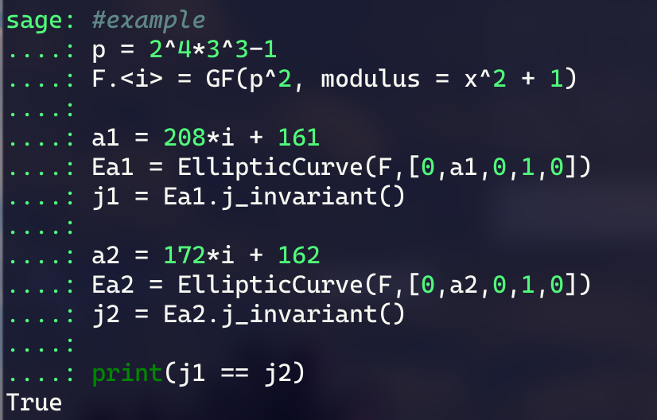
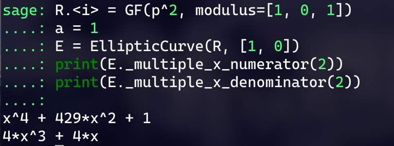

你说得对但是现在好像人人都会同源...感觉我不学已经落后了。


本文主要是借鉴[鸡块的blog](https://tangcuxiaojikuai.xyz/post/e06139e7.html)和[Triode的blog](https://triodelzx.github.io/2025/02/26/%E5%90%8C%E6%BA%90%EF%BC%881%EF%BC%89%E2%80%94%E2%80%94SIDH/)做个简略的读后感，日后慢慢补充一些东西吧。

# 超奇异椭圆曲线(Supersingular Elliptic Curve)

目前的同源似乎主要基于超奇异椭圆曲线。所谓超奇异椭圆曲线，就是有限域$F_{q^r}$上一条$order\equiv{1}\bmod{q}$的椭圆曲线。

# j-invariant

> 对于椭圆曲线来说，j不变量可以简单理解为一个判定两条椭圆曲线是否同构的值。也就是说，任何一个曲线都有自己独特的j不变量，而如果两条曲线的j不变量相等，则说明这两条曲线彼此同构。而由于同构的曲线本质上都可以看作同一条曲线，这也就说明，一个j不变量其实在同构意义上其实就唯一对应着一条曲线。
> <p align="right"> ——<a href="https://tangcuxiaojikuai.xyz/post/e06139e7.html">糖醋小鸡块</a></p>

看起来就像是一种特殊的不变量，类似流形的基本群这种东西，只要相等就同构。

验个证：



以Montgomery型曲线$y^2=x^3+ax^2+x$为例，其j-invariant可表示为$j(E)=\frac{256(a^2-3)^3}{a^2-4}$

# 同源

虽然读完blog感觉有点讳莫如深，不过我认为姑且可以把同源看作一种满射的群同态。

正式地说，一个可分的(separable)同源可以描述为：对于一条曲线E 以及E上一个子群G，都可以构造一个以G为核的映射$\phi:E\to E^{\prime}$,这个映射就是同源，映射到的曲线$E^{\prime}$就叫做这个同源的陪域(codomain)。

从这个观点来说，同源的核就很容易理解——就是同态的核空间嘛。所以同源的核自然是原曲线加法群上的一个正规子群。同源的度数d就是这个群的群阶，所以这里面的点其实也是d-torsion上的点。(这里我不确定对不对，但是按鸡块blog里的定义，r-torsion并没有要求r是满足条件的最小的r，这种情况下这个结论就是成立的)

从这点出发，我们构造同源的时候其实也可以取曲线E(0).division_points(k)里的随便一个点，生成个k阶循环子群G，然后构造以G为核的同源，同源的度数就是k。

这样得到的同源的核可以记作$ker([k])$

## 同源的计算

对于Montgomery型曲线，同源映射可以仅仅由点的x坐标的变换去表示，比方说对于$GF(431^2)$上的曲线$y^2=x^3+x$：



这种情况下，计算分母为0时x的取值就能得到同源的核里所有点的x坐标。

## 同源图

对于一个固定的$p$,我们用$GF(p^2)$中所有的超奇异$j$-不变量各构造一条曲线，在每条曲线的ker$( [ l] )$中取除了无穷远点外的所有点分别进行同源，将原来曲线的$j$-不变量作为起点，同源得到的陪域的$j$-不变量作为终点，就可以得到一个无向图，称为同源图。

按Triode的blog中的代码：
```python
def IsogenyGraph(p, l=2, vertex_size=3750, size=[20, 20]):
    R.<i> = GF(p^2, modulus=[1,0,1])

    jlist = {}
    Elist = []

    E = EllipticCurve(R, [1, 0])
    assert E.is_supersingular()
    jlist[E.j_invariant()] = set()
    Elist.append(E)

    while Elist:
        tmp = Elist.pop()
        kerl = tmp(0).division_points(l)
        for P in kerl:
            if P != tmp(0):
                phi = tmp.isogeny(P, model = "montgomery")
                E2 = phi.codomain()
                j = E2.j_invariant()
                # print(tmp.j_invariant(), j)
                if j not in jlist:
                    jlist[j] = set()
                if j not in jlist[tmp.j_invariant()]:
                    jlist[tmp.j_invariant()].add(j)
                    Elist.append(E2)

    Tab = {}
    for x in jlist:
        Tab[x] = list(jlist[x])
    G = Graph(Tab)

    G.set_pos(G.layout_circular())
    G.plot(vertex_labels=True,vertex_size=vertex_size).show(figsize=size)
```

可以求出$GF(p^2)$下$ker([l])$的同源图。

同源图揭示了j-invariant在同源下的移动路径，顺便也可以展示同源之间的复合。

## 同源的性质

同态方面的性质不加赘述。除此之外：

- 一个同源拥有一个唯一的对偶同源，他们度相等，并且这两个同源复合后等价于曲线向其度倍点上的同源
- 度为$d^e$的同源可以拆解为e个度为d的同源，从而变成d-isogeny图中一条长为e的路径(从同态的性质很容易理解)
- 还有一个比较有用的东西叫做modular polynomial，他的独特作用是用一个多项式关联了d-isogeny中互为邻居的两个j不变量。也就是说，如果知道了一个j不变量，那么可以将其代入对应度的modular polynomial去求根，得到的所有根就是所有作为他的邻居的j不变量。这为一些中间相遇提供了快速计算的便利。

# 挖坑

关于同源的最重要的结果还得是SIDH/CSIDH，这里先挖个坑，等下篇blog再细究一些东西吧。本文就当是对Isogeny的一瞥，权当预热