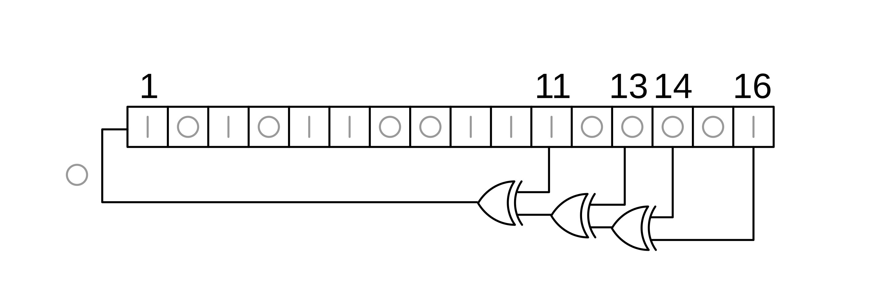

自迭代结构一直很吸引我。线性系统的递推性质天然给了我们计算上的便利；而非线性系统也有不动点或混沌之类的美妙现象，更不必说动力系统与数论等等领域还有着千丝万缕的联系，一直是过去几十年的一大热门数学领域...

~~你说得对，但是为什么LFSR的相关资料总是自相矛盾~~

## LFSR

Linear feedback shift register，流密码里最经典的结构之一。为了讨论方便，我们默认下文中的LFSR都是定义在$GF(2)$上的，并且使用XOR作为线性函数。

其实可以把一个LFSR看成一个初始的state向量和一个状态转移矩阵A，每次状态转移取向量中的最后一个分量(或者第一个分量，总之是"边界上的"分量就对了)作为1bit的输出，然后$A*\vec{state}$更新内部状态。(XOR是$GF(2)$上的加法，这确实很线性)

比如，我们定义一个LFSR反馈函数如下：

$$
a_{i+n}=\sum_{j=1}^n c_j a_{i+n-j}
$$

写成矩阵形式

$$
\begin{aligned}
& {\left[a_{i+1}, a_{i+2}, a_{i+3}, \ldots, a_{i+n}\right] } \\
= & {\left[a_i, a_{i+1}, a_{i+2}, \ldots, a_{i+n-1}\right]\left[\begin{array}{ccccc}
0 & 0 & \cdots & 0 & c_n \\
1 & 0 & \cdots & 0 & c_{n-1} \\
0 & 1 & \cdots & 0 & c_{n-2} \\
\vdots & \vdots & \ddots & \vdots & \\
0 & 0 & \cdots & 1 & c_1
\end{array}\right] } \\
= & {\left[a_1, a_2, a_3, \ldots, a_{n}\right]\left[\begin{array}{cccccc}
0 & 0 & \cdots & 0 & c_n \\
1 & 0 & \cdots & 0 & c_{n-1} \\
0 & 1 & \cdots & 0 & c_{n-2} \\
\vdots & \vdots & \ddots & \vdots & \\
0 & 0 & \cdots & 1 & c_1
\end{array}\right]^{i} }
\end{aligned}
$$

### LFSR的联结多项式
有了矩阵就可以用一些代数方法去研究反馈函数的性质，比如我们很轻易地就可以求得这个矩阵的特征多项式为$$f(x)=x^n-\sum_{i=1}^n c_i x^{n-i}$$

这个矩阵的特征多项式称为这个LFSR的联结多项式 **(connection polynomial)**。反过来说，这个矩阵称为多项式的 **Frobenius companion matrix**，下文简称为companion matrix。

容易知道一个companion matrix $A$的特征多项式就是其极小多项式。

### 周期

有限状态机想做到无限次的状态转移肯定是需要环路的存在的，所以很容易明白一个有限长度的LFSR也是有周期性的。如果一个LFSR的"长度"(状态向量的维数)为n，那么LFSR最大周期不超过$2^n-1$。

当然，至少我们得要求LFSR不能进入全0的trivial状态。很容易知道，状态转移矩阵A必须要是满秩的才能保证这一点(可逆方阵乘上非零向量能变到0才有鬼了)——而这只需要把将要出队列的元素加入抽头就能保证。(可以自行计算A的行列式验证一下)

但是具体什么时候LFSR才能取得最大周期呢？一个最简单的想法是让A乘方运算后等于单位阵。我们知道$GF(n,GF(2))$的order为$N=\left(2^n-1\right)\left(2^n-2\right)\left(2^n-2^2\right) \cdots\left(2^n-2^{n-1}\right)$，所以$A^N=I$。但是$N>2^n-1$，直觉上来说这并不是很精细的估计。我们希望的是对于一个周期为$k'$的LFSR，其状态转移矩阵真的满足$A^{k'}=I$，而这并不是周期性能直接说明的。($(A^{k'}-I)\vec{x}=O\nRightarrow A^{k'}=I$)

#### 我们的希望是真的

> 引理  设 $P(x)=a_0+a_1 x+\cdots+x^n$ 是系数在 $\mathbb{F}_p$（$p$ 为素数）中的多项式，且 $a_0 \neq 0$。则存在某个 $k<p^n$，使得 $P(x)$ 是 $x^k-1$ 的因子。

**证明** 环 $R=\mathbb{F}_p[x]/(P(x))$ 由系数在 $\mathbb{F}_p$ 中的多项式的同余类组成，其中两个多项式属于同一个同余类当且仅当它们相差 $P(x)$ 的某个倍式。通过带余除法可知，每个多项式都唯一等价于某个次数小于 $n$ 的多项式，因此 $R$ 中恰好有 $p^n-1$ 个非零等价类。由于集合 $\left\{x^i: 0 \leq i<p^n\right\}$ 中有 $p^n$ 个单项式，故必存在 $0 \leq i<j<p^n$ 使得 $x^i \equiv x^j \bmod P(x)$。于是 $P(x)$ 整除 $x^j-x^i=x^i\left(x^{j-i}-1\right)$。由于 $P(0) \neq 0$，可知 $P(x)$ 必然整除 $x^{j-i}-1$。

由线性代数里的Caylay-Hamilton定理可以知道，对LFSR的状态转移矩阵A和联结多项式$C(x)$，有

$$C(A)=A^n-c_1 A^{n-1}-c_2A^{n-2}-\cdots-c_n I=O$$

自然，所有含有$C(x)$为因式的多项式$P(x)$也满足$P(A)=O$，由引理可知$\exists k,k<2^n \rightarrow C(x)|x^k-1\Rightarrow A^k-I=O$，即$A^k=I$

这说明了当A满秩时，LFSR的周期$k'$必然是$k$的因子。

#### 更进一步

考虑一个有n个状态的LFSR，记其所有非零状态组成的集合为$H$，其中的任一元素$a\in H$视作$GF(2)$上的向量$\vec{a}:(a_1,a_2,\cdots,a_n)$。那么映射
$$\phi:H\rightarrow GF(2^n), (a_1,a_2,\cdots,a_n)\mapsto a_1x^{n-1}+a_2x^{n-2}+\cdots+a_n$$将每个状态唯一映射到一个多项式。不严谨地说，$H$和$GF(2^n)$是同构的。

回忆我们上面提及的LFSR的联结多项式$C(x)$。如果$C(x)$是不可约多项式，那么$GF(2)/C(x)$生成的恰是有限域$GF(2^n)$。同时，因为$C(x)$的companion matrix $A$满足$C(A)=O$，所以我们把$A$看作$C(x)$的根后通过添根操作得到的扩域$F$也是同构于$GF(2^n)$的。也就是说，我们完全可以把LFSR的状态也看作矩阵，那么LFSR的状态和状态转移矩阵$A$都是$F$上的元素而已。而$F\backslash{0}$是乘法循环群，所以如果$A$是这个群的生成元，那么LFSR就能达到最大周期。

> 其实这一部分完全包含了上一个部分的结论，只不过需要更多代数学知识ww

> 这里的添根操作，一个不严谨的理解是把以多项式商环构造的$GF(2^n)$中原本的未定元X直接换作A。这其实类似于通过添加代数元进行代数扩张的操作。

#### 什么时候A是生成元？

A是生成元意味着A是$2^n-1$次本原单位根。容易知道A的极小多项式的所有根为$A,A^{2}, A^{2^2},\cdots, A^{2^{n-1}}$(直接代入极小多项式然后用Frobenius自同构就能看出来)，并且可以证明它们都是$2^n-1$次本原单位根且两两不同。也就是说，A的极小多项式是分圆多项式$\phi_{2^n-1}(x)$的不可约因式。上面我们提到A的极小多项式就是其特征多项式，也即LFSR的联结多项式。所以如果A是生成元，就意味着联结多项式是分圆多项式$\phi_{2^n-1}(x)$的不可约因式。

接下来我们引入一些定义并证明一个定理，来为最终的结论着手准备：

`定义` 设 $f(x)$ 是 $F_p$ 上的多项式，称满足 $f(x) \mid x^l-1$ 的最小正整数 $l$（若存在）为 $f(x)$ 的周期。

容易知道 $f(x)$ 的周期存在当且仅当 $f(0) \neq 0$ ．若 $l$ 为 $n$ 次不可约多项式的周期，则有 $l \mid p^n-1$ ．

`定义` 设 $f(x)$ 是 $F_p$ 上的 $n$ 次不可约多项式，若它的周期是 $p^n-1$ ，称之为本原多项式。

> **定理** 设 $f(x)$ 是 $F_p$ 上的不可约多项式，$f(0) \neq 0$ ，设 $\alpha$ 为 $f(x)$ 在 $F_{p^n}$ 中的根，则 $f(x)$ 的周期$l$等于 $\alpha$ 的阶 $d$

**证明** $f(x)\left|x^l-1 \Rightarrow \alpha^l-1=0 \Rightarrow d\right| l, \alpha^d-1=0 \Rightarrow f(x)\left|x^d-1 \Rightarrow l\right| d$ ，故 $d=l$。

所以，如果联结多项式是本原多项式时，A的阶就等于$2^n-1$，并且此时联结多项式是分圆多项式$\phi_{2^n-1}(x)$的不可约因式。此时，A为乘法循环群的生成元，LFSR达到最大周期。这就为我们设计LFSR提供了严格的数学依据。

**至此，我们得到了LFSR达到最大周期的充要条件，即LFSR的联结多项式必须是本原多项式。**

## After story

如果A不是生成元呢？至少，A会生成阶数更小的子群，那么得到的LFSR的所有可能状态组成的群无非是类似陪集分解的对象，其阶数也小于$2^n-1$。

我所查阅到的中文资料几乎全都没有证明为什么当联结多项式是本原多项式时LFSR达到最大周期，有些资料甚至还错记了联结多项式的指数顺序——联结多项式里，越是即将出队列的抽头对应的指数越小。而有些资料里认为此时抽头对应的指数应该越大，并且认为这样得到的联结多项式(它们称之为LFSR的特征多项式或反馈多项式)是本原多项式时LFSR才达到最大周期——这种定义下，得到的结论是对的吗？我没有继续研究，但是至少，这样得到的多项式，在次数上首先就有可能不对，从而以商环构造有限域的操作就未必能成立。后续的结论，可信度几何呢？

文中将LFSR处理到有限域上的部分，本来是想构造性地处理的。但是不论是把矩阵A处理为多项式还是把多项式处理到矩阵，我都没有想到特别好的构造方法。尤其是把矩阵A处理为多项式，虽然RLWE中用矩阵计算商环上的多项式乘法已是常识，并且直觉上A作用于向量应该就等价于单项式x作用于多项式，但是具体推算时，系数的对应总是差了一次转置，不能很爽快地得到想要的形式。所以最终还是用存在式的手段，利用一个必定存在但我尚未构造出的同构，演示了利用矩阵研究LFSR的可能性。如果读者有更构造性的手法，还请不吝赐教。

> 当然直接映到companion matrix然后证明一下这一堆matrix同构于有限域似乎也不是不行

本来是想在写针对LFSR的代数免疫攻击之前补充点LFSR的基础知识的，为了一份严格证明不知不觉就写成了单独的一篇blog。那么代数免疫就留待下一篇blog吧，顺便补一补Fast Correlation Attack的知识。