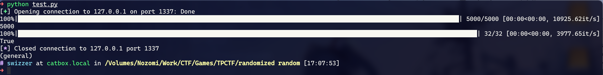

## Solving TPCTF with gf2bv

[gf2bv](https://github.com/maple3142/gf2bv)其实是maple佬写出来求解GF(2)上线性方程组的。恰好MT19937在GF(2)上关于初始状态也是线性递推，所以拿来搞MT也不是不行。

跟maple给的例子对拍了一下，这个板子主要要改的就是

```python
for o in out:
        zeros.append(rng.getrandbits(bs) ^ int(o))
        # 原题每轮getrandbits了两次，这里也要一样地做
        rng.getrandbits(32)
```

这里，zeros.append()的时候需要注意和题目中获取randbits的方式一致。本题中是每两个getrandbits(32)获取一个，所以循环里也是这么写的。其他地方几乎不用动。

```python title="exp.py"
from tqdm import trange
from gf2bv import LinearSystem
from gf2bv.crypto.mt import MT19937
from pwn import *
def mt19937(bs, out):
    lin = LinearSystem([32] * 624)
    mt = lin.gens()
    rng = MT19937(mt)
    zeros = []
    for o in out:
        zeros.append(rng.getrandbits(bs) ^ int(o))
        rng.getrandbits(32)
    zeros.append(mt[0] ^ int(0x80000000))
    sol = lin.solve_one(zeros)
    rng = MT19937(sol)
    pyrand = rng.to_python_random()
    return pyrand
conn = remote('127.0.0.1', 1337)
out = []
nums = 5000
for _ in trange(nums):
    out.append(int(conn.recvline()) >> 24)
    conn.sendline(b'')
print(len(out))

# 每轮取8bit，flag[]对进位的影响比想象中大不少
RNG = mt19937(8, out)
prev = [RNG.getrandbits(32) for _ in range(nums * 2)]
predict = []
check = []
for i in trange(32):
    predict.append(RNG.getrandbits(32)>>16)
    RNG.getrandbits(32)
    check.append(int(conn.recvline())>>16)
    conn.sendline(b'')

print(predict==check)
```



本地生成数据测了一下，比之前手搓~~抄的~~脚本快了好多🥹...
## Yes, and?

Python的MT19937中，getrandbits()是按照32bit为单位产生的。也就是说：

- 如果getrandbits(0)，会直接返回0，不会调用随机数生成
- 如果getrandbits(32k)，那么会连续产生k个32bit的数并拼接起来
- 如果getrandbits(t)，$0<t<32$，那么会先产生一个32bit的数字，然后截取其高t位作为本次随机数

在生成随机数前，MT19937会初始化一个state，state由624个32bit的数字组成。往后所有getrandbits产生的数字，都是关于这个初始state模2下线性的。这里的**线性**，意思是把初始state的二进制展开记作向量 $\vec{v}$ ，那么对此后的getrandbits()产生的任意位置的bit，都存在一个向量 $\vec{t}$ 使得 $\vec{t}*\vec{s}=bit$ 。

所以实际上我们只要获取输出中任意不同位置的19968个bit，就能通过构造矩阵解方程的方法拿到初始状态(假定矩阵满秩)：

$$
\vec{s}\cdot T = \vec{b}
$$

这里的 $\vec{b}$ 题目中就能直接拿到。至于 $T$ ，也可以通过设 $\vec{s}$ 为只有一个分量为1的向量的方式，按黑盒调用的想法逐行取出，跟很久以前做过的一道破解Xoshiro256**的题目是一样的想法。

> exp copied from [huangx607087](https://huangx607087.online/2021/07/10/Explore-MT19937/#0x03-%E7%BB%99%E5%87%BA%E4%BB%BB%E6%84%8F19937%E4%B8%AAbit-upd-2025-01-22)

```python
Dall=list(map(int,open('data3.txt','r').readlines()))
from Crypto.Util.number import *
from random import *
from tqdm import *
n=1250
D=Dall[:n]
rng=Random()
def getRows(rng):
    #这一部分根据题目实际编写，必须和题目实际比特获取顺序和方式完全一致，且确保比特数大于19937，并且请注意zfill。
    row=[]
    for i in range(n):
        row+=list(map(int, (bin(rng.getrandbits(16))[2:].zfill(16))))
    return row
M=[]
for i in tqdm_notebook(range(19968)):#这一部分为固定套路，具体原因已经写在注释中了
    """
    referennce:
    糖醋小鸡块 2025/1/21 20:26:51
    这部分代码相当于取了一组线性基

    糖醋小鸡块 2025/1/21 20:26:56
    因为mt19937是线性的
    """
    state = [0]*624
    temp = "0"*i + "1"*1 + "0"*(19968-1-i)
    for j in range(624):
        state[j] = int(temp[32*j:32*j+32],2)
    rng.setstate((3,tuple(state+[624]),None)) #这个setstate也是固定格式，已于2025.1.21测试
    M.append(getRows(rng))
M=Matrix(GF(2),M)
y=[]
for i in range(n):
    y+=list(map(int, (bin(D[i])[2:].zfill(16))))
y=vector(GF(2),y)
s=M.solve_left(y)
#print(s)
G=[]
for i in range(624):
    C=0
    for j in range(32):
        C<<=1
        C|=int(s[32*i+j])
    G.append(C)
import random
RNG1 = random.Random()
for i in range(624):
    G[i]=int(G[i])
RNG1.setstate((int(3),tuple(G+[int(624)]),None))

print([RNG1.getrandbits(16) for _ in range(75)])
print(D[:75])
```

## Some extra...

### Seed Recovery

有篇[博文](https://stackered.com/blog/python-random-prediction/#seed-recovery-from-few-outputs)详细地讲解了MT19937的工作原理。文中特别提到，如果Python的MT19937是32bit整数的seed，那么只需要一轮624个输出中特定位置的6个即可恢复seed。当然恢复出的seed有两种可能，实际使用时还得做一些额外的判断。

#### 2025 ApoorvCTF

```python title="task.py"
from Crypto.Util.number import getPrime, bytes_to_long, long_to_bytes
import random

flag = b"apoorvctf{fake_flag}"

def secret(p):
    prime_bytes = p.to_bytes(64, byteorder='big')  
    keys = [bytes_to_long(prime_bytes[i:i+4]) for i in range(0, 64, 4)] 
    enc_p = []
    for key in keys:
        tp = []
        random.seed(key)
        indexes = [0, 1, 2, 227, 228, 229]
        random_arr = [random.getrandbits(32) for _ in range(624)] 
        for j in indexes:
            tp.append(random_arr[j])
        enc_p.append(tp) 
    return enc_p

def encrypt():
    p = getPrime(512)
    q = getPrime(512)
    n = p * q
    e = 65537
    c = pow(bytes_to_long(flag), e, n)
    trash = secret(p)  
    return n, c, trash  

def decrypt(n,p,c):
    q = n//p
    if p*q != n:
        print("Invalid n")
        return
    phi = (p-1)*(q-1)
    d = pow(65537,-1,phi)
    return long_to_bytes(pow(c,d,n))

n, c, trash = encrypt() 
print("n:", n)
print("c:", c)
print("trash:", trash)
#print("flag:", decrypt(n,p,c)) 
```

这道题完全就是照搬上面那篇博文，直接抄就行。

```python title="exp.py"
def recover_Kj_from_Ii(Ii, Ii1, Ii2, i):
    # Ii => I[i]
    # Ii1 => I[i-1]
    # Ii2 => I[i-2]
    # Ji => J[i]
    # Ji1 => J[i-1]
    Ji = recover_Ji_from_Ii(Ii, Ii1, i)
    Ji1 = recover_Ji_from_Ii(Ii1, Ii2, i-1)
    return recover_kj_from_Ji(Ji, Ji1, i)
def recover_Ji_from_Ii(Ii, Ii1, i):
    # Ii => I[i]
    # Ii1 => I[i-1]
    ji = (Ii + i) ^ ((Ii1 ^ (Ii1 >> 30)) * 1566083941)
    ji &= 0xffffffff
    # return J[i]
    return ji
def init_genrand(seed):
        MT = [0] * 624
        MT[0] = seed & 0xffffffff
        for i in range(1, 623+1): # loop over each element
            MT[i] = ((0x6c078965 * (MT[i-1] ^ (MT[i-1] >> 30))) + i) & 0xffffffff
        return MT

def recover_kj_from_Ji(ji, ji1, i):
    # ji => J[i]
    # ji1 => J[i-1]
    const = init_genrand(19650218)
    key = ji - (const[i] ^ ((ji1 ^ (ji1 >> 30))*1664525))
    key &= 0xffffffff
    # return K[j] + j
    return key
def unshiftRight(x, shift):
    res = x
    for i in range(32):
        res = x ^ res >> shift
    return res

def unshiftLeft(x, shift, mask):
    res = x
    for i in range(32):
        res = x ^ (res << shift & mask)
    return res

def untemper(v):
    v = unshiftRight(v, 18)
    v = unshiftLeft(v, 15, 0xefc60000)
    v = unshiftLeft(v, 7, 0x9d2c5680)
    v = unshiftRight(v, 11)
    return v
def invertlitep(si, si227):
    # li[i] ^ li[i-227] == (((I[i] & 0x80000000) | (I[i+1] & 0x7FFFFFFF)) >> 1) ^ (0x9908b0df if I[i+1] & 1 else 0)
    X = si ^ si227
    # we know the LliB of I[i+1] because MliB of 0x9908b0df is set, we can see if the XOR has been applied
    mti1 = (X & 0x80000000) >> 31
    if mti1:
        X ^= 0x9908b0df
    # undo shift right
    X <<= 1
    # now recover MliB of state I[i]
    mti = X & 0x80000000
    # recover the rest of state I[i+1]
    mti1 += X & 0x7FFFFFFF
    return mti, mti1


import random
import ast
with open("out.txt") as f:
    n = ast.literal_eval(f.readline())
    c = ast.literal_eval(f.readline())
    trash = ast.literal_eval(f.readline())
    # k = 1
    # K = [i]
    for li in trash:
        S = [untemper(li[i]) for i in range(6)]

        I_227_, I_228 = invertlitep(S[3], S[0])
        I_228_, I_229 = invertlitep(S[4], S[1])
        I_229_, I_230 = invertlitep(S[5], S[2])

        I_228 += I_228_
        I_229 += I_229_

        # two possibilities for I_230
        seed1 = recover_Kj_from_Ii(I_230, I_229, I_228, 230)
        seed2 = recover_Kj_from_Ii(I_230+0x80000000, I_229, I_228, 230)
        # only the MliB differs
        print(seed1, seed2)
from Crypto.Util.number import *
plist = [2233556749,1332779457,3663810718,1146419848,2960081222,3483469796,2128181600,3346153247,61541386,1190096622,362663341,784549194,3375914009,2922819453,2926167818,2960726147]
pp = b""
for x in plist:
    assert len(long_to_bytes(x)) == 4
    pp+=long_to_bytes(x)
isPrime(bytes_to_long(pp))
print(pp)
p = bytes_to_long(pp)
q = n//p
e=65537
d = inverse(e,(p-1)*(q-1))
print(long_to_bytes(pow(c,d,n)))
```

### 对异或封闭

之前打本部的405杯的时候[提过这个事情](https://blog.swizzer.cc/posts/2024-lilac-405%E6%9D%AF/#yamato)，也就是多个MT19937的输出异或后等价于一个MT19937的输出。如果把所有MT19937的输出流看作一个集合，无非就是说这个集合的元素对二进制异或封闭而已，原因在那篇blog里也简要阐明了。其实在本篇的观点下更容易，因为异或就是GF(2)上的加法嘛，而线性映射 $f$ 显然满足 $f(x_1)+f(x_2)=f(x_1+x_2)$

做个实验:

```python
#!/usr/bin/sage
from Crypto.Util.number import *
from random import *
from tqdm import *
D = []
n = 624
stream1 = Random()
stream2 = Random()
for _ in trange(624):
    D.append(stream1.getrandbits(32)^^stream2.getrandbits(32))
rng=Random()
def getRows(rng):
    row=[]
    for i in range(n):
        row+=list(map(int, (bin(rng.getrandbits(32))[2:].zfill(32))))
    return row
M=[]
for i in trange(19968):
    state = [0]*624
    temp = "0"*i + "1"*1 + "0"*(19968-1-i)
    for j in range(624):
        state[j] = int(temp[32*j:32*j+32],2)
    rng.setstate((3,tuple(state+[624]),None))
    M.append(getRows(rng))
M=Matrix(GF(2),M)
y=[]
for i in range(n):
    y+=list(map(int, (bin(D[i])[2:].zfill(32))))
y=vector(GF(2),y)
s=M.solve_left(y)
#print(s)
G=[]
for i in range(624):
    C=0
    for j in range(32):
        C<<=1
        C|=int(s[32*i+j])
    G.append(C)
import random
RNG1 = random.Random()
for i in range(624):
    G[i]=int(G[i])
RNG1.setstate((int(3),tuple(G+[int(624)]),None))

print([RNG1.getrandbits(32) for _ in range(75)])
print(D[:75])
```


两个MT输出流即使其中一个有"偏移"(先生成一些输出之后两者再开始异或)也是同样成立的，可以理解为MT生成一次输出后内部状态经过了一次线性递推，然后在一个新的初始状态下两个输出流进行GF(2)上的加法运算。

不过很奇怪的是，上面这个例子用maple的gf2bv就没办法求解出来，可能是zeros的写法需要进一步修正？
