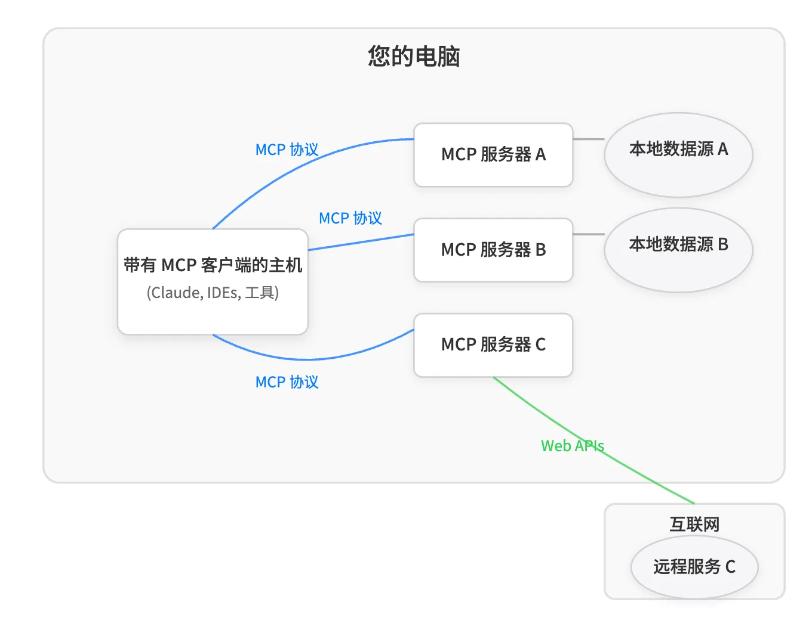
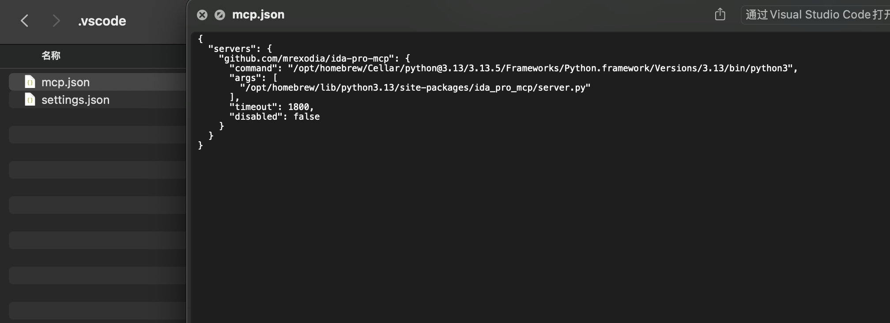
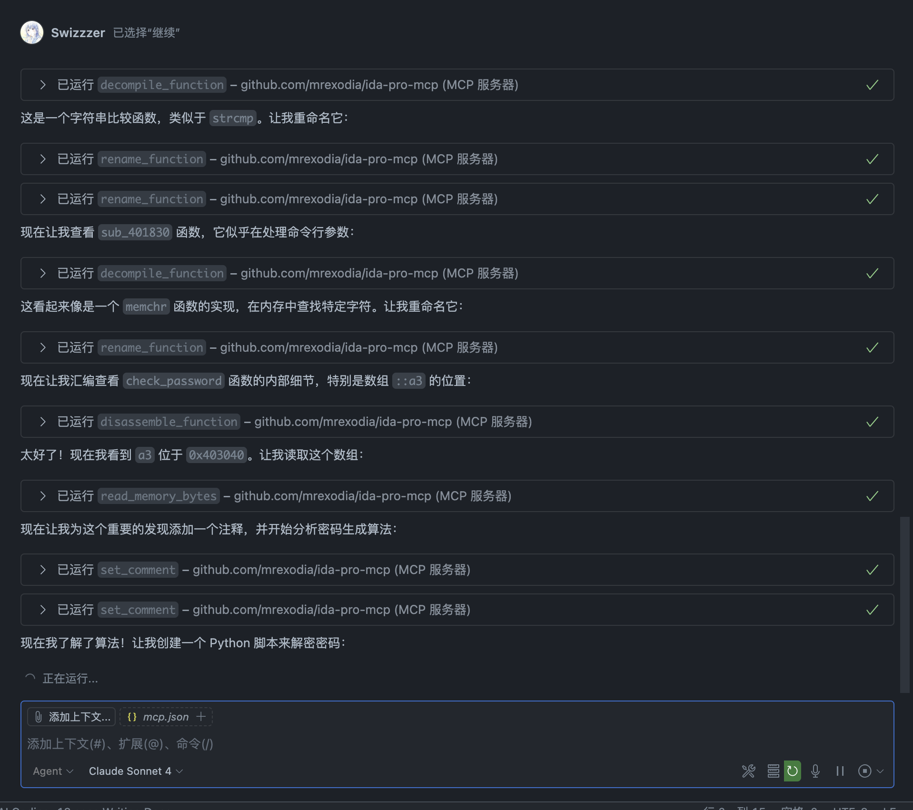

其实很早的时候(在它写出来没几天的时候？)我就star了[IDA MCP](https://github.com/mrexodia/ida-pro-mcp)，不过当时我还是把这玩意儿当作压箱底的宝贝的。不过最近消息似乎传开了，好像也没有藏的必要了2333

## 何为MCP



**模型上下文协议（Model Context Protocol, MCP） 是由 Anthropic 于 2024 年 11 月推出的开放协议**，用于连接大型语言模型（LLM）与外部系统，包括工具、数据源、资源等。不过说实话这玩意儿并不像一个正儿八经的通信协议，MCP里具体传输的格式啦内容啦什么的都没有明确统一的规范，只是告诉你要用JSON对话，对话里还得包括下面这些东西：

- Resources: Context and data, for the user or the AI model to use
- Prompts: Templated messages and workflows for users
- Tools: Functions for the AI model to execute

> 也对，就算你规范明确统一，LLM也不一定严格听你的

---

MCP说到底就是给了LLM调用外部工具的能力，换言之，有了IDA MCP之后就不再需要你手动一步步粘贴伪代码给LLM了，LLM自己就能操作IDA获取它"想要的"数据，实现了半自动化的逆向。所以给你的IDA配个MCP可以很方便地解决一些逻辑简单的逆向，以及一些混淆较少但规模很大的逆向（俗称体力活）

||所以DEFCON的一些题目就很适合AI Agent一把梭||

## 配置IDA MCP

::github{repo="mrexodia/ida-pro-mcp"}

大部分配置过程都在repo里写了，除了VSCode的配置过程。其实VSCode配置也很简单，执行`ida-pro-mcp --config`后把输出复制一下，把`mcpServers`这个item name改成`servers`然后扔进工作区里的`.vscode/mcp.json`就行：



可能还需要稍微配置一下可以访问到这个mcp server的模型，搞好后就能在Copilot Agent mode下让LLM调用mcp做题了。如果嫌麻烦还可以把这一段写进全局设置的json里，免去每个工作区都手动配置的烦恼。

来看看 Claude Sonnet 4 如何 2min 解决`idekCTF 2025-rev/constructor`：




> 以及AI写的解题脚本

```python title="solve.py"
#!/usr/bin/env python3

# Encrypted password data from a3 array at 0x403040
a3 = [0x33, 0x21, 0x00, 0x6d, 0x5f, 0xab, 0x86, 0xb4, 0xd4, 0x2d, 0x36, 0x3a, 
      0x4e, 0x90, 0x8c, 0xe3, 0xcc, 0x2e, 0x09, 0x6c, 0x49, 0xb8, 0x8f, 0xf7, 
      0xcc, 0x22, 0x4e, 0x4d, 0x5e, 0xb8, 0x80, 0xcb, 0xd3, 0xda, 0x20, 0x29, 
      0x70, 0x02, 0xb7, 0xd1, 0xb7, 0xc4]

print("Encrypted data length:", len(a3))

# Reverse the decryption algorithm from the assembly
# Original algorithm: byte_405140[i] = (v6 ^ a3[i]) ^ (i >> 1) ^ 0x5A
# where v6 starts at 0 and increases by 31 each iteration

decrypted = []
v6 = 0  # Initial value of v6 (ecx register)

for i in range(42):
    # Apply the decryption formula
    encrypted_byte = a3[i]
    decrypted_byte = (v6 ^ encrypted_byte) ^ (i >> 1) ^ 0x5A
    decrypted.append(decrypted_byte)
    
    # Update v6 (add 31 for next iteration)
    v6 = (v6 + 31) & 0xFF  # Keep it as byte
    
    print(f"i={i:2d}, v6={v6:02x}, a3[{i}]=0x{encrypted_byte:02x}, decrypted=0x{decrypted_byte:02x} ('{chr(decrypted_byte) if 32 <= decrypted_byte <= 126 else '.'}')")

# Convert to string
password = ''.join(chr(b) if 32 <= b <= 126 else '?' for b in decrypted)
print("\nDecrypted password:")
print(password)

# Also show as hex for verification
print("\nDecrypted bytes (hex):")
print(' '.join(f'{b:02x}' for b in decrypted))
```

