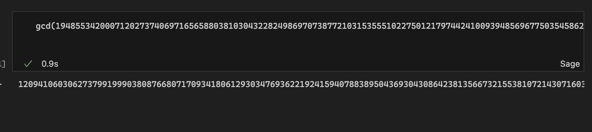
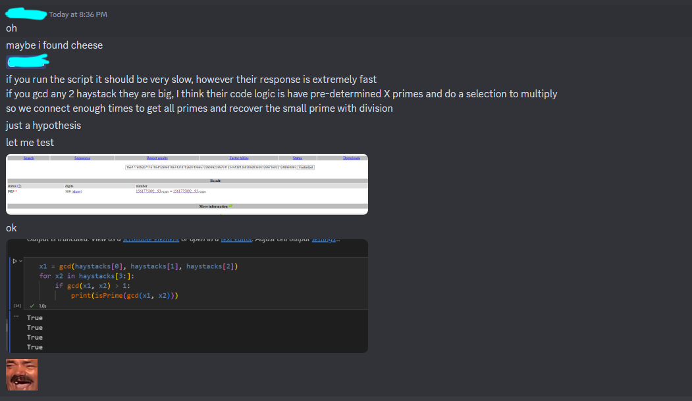

解了Crypto7题中的6题和1题OSINT，最终rank top 12%。

<!-- more -->

## Without a Trace

> task

```python
import numpy as np
from Crypto.Util.number import bytes_to_long
from itertools import permutations
from SECRET import FLAG


def inputs():
    print("[WAT] Define diag(u1, u2, u3. u4, u5)")
    M = [
        [0, 0, 0, 0, 0],
        [0, 0, 0, 0, 0],
        [0, 0, 0, 0, 0],
        [0, 0, 0, 0, 0],
        [0, 0, 0, 0, 0],
    ]
    for i in range(5):
        try:
            M[i][i] = int(input(f"[WAT] u{i + 1} = "))
        except:
            return None
    return M

def handler(signum, frame):
    raise Exception("[WAT] You're trying too hard, try something simpler")

# 计算行列式
def check(M):
    def sign(sigma):
        l = 0
        for i in range(5):
            for j in range(i + 1, 5):
                if sigma[i] > sigma[j]:
                    l += 1
        return (-1)**l

    res = 0
    for sigma in permutations([0,1,2,3,4]):
        curr = 1
        for i in range(5):
            curr *= M[sigma[i]][i]
        res += sign(sigma) * curr
    return res

def fun(M):
    f = [bytes_to_long(bytes(FLAG[5*i:5*(i+1)], 'utf-8')) for i in range(5)]
    F = [
        [0, 0, 0, 0, 0],
        [0, 0, 0, 0, 0],
        [0, 0, 0, 0, 0],
        [0, 0, 0, 0, 0],
        [0, 0, 0, 0, 0],
    ]
    for i in range(5):
        F[i][i] = f[i]

    try:
        R = np.matmul(F, M)
        return np.trace(R)

    except:
        print("[WAT] You're trying too hard, try something simpler")
        return None

def main():
    print("[WAT] Welcome")
    M = inputs()
    if M is None:
        print("[WAT] You tried something weird...")
        return
    elif check(M) == 0:
        print("[WAT] It's not going to be that easy...")
        return

    res = fun(M)
    if res == None:
        print("[WAT] You tried something weird...")
        return
    print(f"[WAT] Have fun: {res}")

if __name__ == "__main__":
    main()

```

flag按照5字节一组拆分后放到了5x5矩阵 $\mathbf{F}$ 的对角线上，然后让你输入一个5x5的对角矩阵 $\mathbf{M}$ ，给你返回 $\mathbf{F}*\mathbf{M}$ 的迹(trace)。程序会检查你输入的矩阵，其行列式不能为0。

两个对角矩阵相乘的迹其实就是俩向量的的欧氏内积而已，输入 $I_{5\times 5}$ 之后就能拿到 

$$
\sum_{i=0}^{4} FLAG[5*i:5*(i+1)]
$$

然后的oracle时，改变某个位置对应的系数为2，两次拿到的trace相减就能得到flag的5字节。

`uiuctf{tr4c1ng_&&_mult5!}`

## X Marked the Spot

> task 

```python
from itertools import cycle

flag = b"uiuctf{????????????????????????????????????????}"
# len(flag) = 48
key  = b"????????"
# len(key) = 8
ct = bytes(x ^ y for x, y in zip(flag, cycle(key)))

with open("ct", "wb") as ct_file:
    ct_file.write(ct)
```

得到的key只有1byte未知，直接爆破就行。

> exp

```python
from itertools import cycle

with open('ct', 'rb') as f:
    ct = f.read()

m = b'uiuctf{'
# print(len(m))
# key = bytes(x^y for x,y in zip(ct,m))
for i in range(0, 256):
    key = b'hdiqbfj'
    key += chr(i).encode()
    dec = bytes(x^y for x,y in zip(ct,cycle(key)))
    if all(chr(b).isprintable() for b in dec):
        print(dec)

# 得到的输出还需要人肉筛选一下
# b'uiuctf{n0t_ju5t_th3_st4rt_but_4l50_th3_3nd!!!!!}'
```

## Determined

> task

> server.py

```python
from Crypto.Util.number import bytes_to_long, long_to_bytes
from itertools import permutations
from SECRET import FLAG, p, q, r


def inputs():
    print("[DET] First things first, gimme some numbers:")
    M = [
        [0, 0, 0, 0, 0],
        [0, 0, 0, 0, 0],
        [0, 0, 0, 0, 0],
        [0, 0, 0, 0, 0],
        [0, 0, 0, 0, 0],
    ]
    try:
        M[0][0] = p
        M[0][2] = int(input("[DET] M[0][2] = "))
        M[0][4] = int(input("[DET] M[0][4] = "))

        M[1][1] = int(input("[DET] M[1][1] = "))
        M[1][3] = int(input("[DET] M[1][3] = "))

        M[2][0] = int(input("[DET] M[2][0] = "))
        M[2][2] = int(input("[DET] M[2][2] = "))
        M[2][4] = int(input("[DET] M[2][4] = "))

        M[3][1] = q
        M[3][3] = r

        M[4][0] = int(input("[DET] M[4][0] = "))
        M[4][2] = int(input("[DET] M[4][2] = "))
    except:
        return None
    return M

def handler(signum, frame):
    raise Exception("[DET] You're trying too hard, try something simpler")

def fun(M):
    def sign(sigma):
        l = 0
        for i in range(5):
            for j in range(i + 1, 5):
                if sigma[i] > sigma[j]:
                    l += 1
        return (-1)**l

    res = 0
    for sigma in permutations([0,1,2,3,4]):
        curr = 1
        for i in range(5):
            curr *= M[sigma[i]][i]
        res += sign(sigma) * curr
    return res

def main():
    print("[DET] Welcome")
    M = inputs()
    if M is None:
        print("[DET] You tried something weird...")
        return

    res = fun(M)
    print(f"[DET] Have fun: {res}")

if __name__ == "__main__":
    main()
```

> gen.py

```python
from SECRET import FLAG, p, q, r
from Crypto.Util.number import bytes_to_long
n = p * q
e = 65535
m = bytes_to_long(FLAG)
c = pow(m, e, n)
# printed to gen.txt
print(f"{n = }")
print(f"{e = }")
print(f"{c = }")

```

要你输入矩阵中固定几个元素的值，然后给你返回矩阵的行列式值。目标是从中拿到信息后解密一个RSA。

题目可以让我们拿到关于p，q，r的多项式，一个直观的想法是让p,q和r不同时在一项里出现。我们知道，行列式如果写成多项式形式，每一项其实是矩阵里所有既不同行也不同列的元素的乘积。所以，如果某一项里包含了和r同行/同列的元素，这一项里就一定没有r。

所以可以这么构造：

```python
# sage
p, q, r, x, y = var('p q r x y')

M = Matrix([
    [p, 0, x, 0, x],
    [0, x, 0, y, 0],
    [x, 0, x, 0, x],
    [0, q, 0, r, 0],
    [x, 0, x, 0, 0],
])

det_M = M.determinant()
det_M

# -p*r*x^3 + r*x^4 + p*q*x^2*y - q*x^3*y
```

两次质询时分别令(x,y) = (1,1)和(1,2)，得到的两个结果相减就消去了r，再和N做gcd就拿到了N的质因子。

`b'uiuctf{h4rd_w0rk_&&_d3t3rm1n4t10n}'`

## Naptime

> task

```python
# sage
from random import randint
from Crypto.Util.number import getPrime, bytes_to_long, long_to_bytes
import numpy as np

def get_b(n):
    b = []
    b.append(randint(2**(n-1), 2**n))
    for i in range(n - 1):
        lb = sum(b)
        found = False
        while not found:
            num = randint(max(2**(n + i), lb + 1), 2**(n + i + 1))
            if num > lb:
                found = True
                b.append(num)
    print(b)
    return b

def get_MW(b):
    lb = sum(b)
    M = randint(lb + 1, 2*lb)
    W = getPrime(int(1.5*len(b)))

    return M, W

def get_a(b, M, W):
    a_ = []
    for num in b:
        a_.append(num * W % M)
    pi = np.random.permutation(list(i for i in range(len(b)))).tolist()
    a = [a_[pi[i]] for i in range(len(b))]
    return a, pi


def enc(flag, a, n):
    bitstrings = []
    for c in flag:
        # c -> int -> 8-bit binary string
        bitstrings.append(bin(ord(c))[2:].zfill(8))
    ct = []
    for bits in bitstrings:
        curr = 0
        for i, b in enumerate(bits):
            if b == "1":
                curr += a[i]
        ct.append(curr)

    return ct

def dec(ct, a, b, pi, M, W, n):
    # construct inverse permuation to pi
    pii = np.argsort(pi).tolist()
    m = ""
    U = pow(W, -1, M)
    ct = [c * U % M for c in ct]
    for c in ct:
        # find b_pi(j)
        diff = 0
        bits = ["0" for _ in range(n)]
        for i in reversed(range(n)):
            if c - diff > sum(b[:i]):
                diff += b[i]
                bits[pii[i]] = "1"
        # convert bits to character
        m += chr(int("".join(bits), base=2))

    return m


def main():
    flag = 'uiuctf{I_DID_NOT_LEAVE_THE_FLAG_THIS_TIME}'

    # generate cryptosystem
    n = 8
    b = get_b(n)
    M, W = get_MW(b)
    a, pi = get_a(b, M, W)

    # encrypt
    ct = enc(flag, a, n)

    # public information
    print(f"{a =  }")
    print(f"{ct = }")

    # decrypt
    res = dec(ct, a, b, pi, M, W, n)

if __name__ == "__main__":
    main()

```

典型的Knapsack Cryptography，直接拿格子打就行。

> exp

```python
M = [66128, 61158, 36912, 65196, 15611, 45292, 84119, 65338]
ct = [273896, 179019, 273896, 247527, 208558, 227481, 328334, 179019, 336714, 292819, 102108, 208558, 336714, 312723, 158973, 208700, 208700, 163266, 244215, 336714, 312723, 102108, 336714, 142107, 336714, 167446, 251565, 227481, 296857, 336714, 208558, 113681, 251565, 336714, 227481, 158973, 147400, 292819, 289507]
n = len(M)
L = matrix.zero(n + 1)
flag = ""
for S in ct:
    n = len(M)
    L = matrix.zero(n + 1)
    for row, x in enumerate(M):
        L[row, row] = 2
        L[row, -1] = x

    L[-1, :] = 1
    L[-1, -1] = S
    L = L.LLL()
    res = L[0]
    flagc = []
    for i in res[:-1]:
        flagc.append((1-i)//2)
    binary_string = ''.join(map(str, flagc))
    integer_value = int(binary_string, 2)
    character = chr(integer_value)
    flag += character
print(flag)

# uiuctf{i_g0t_sleepy_s0_I_13f7_th3_fl4g}
```

## Snore Signatures

> task

```python
#!/usr/bin/env python3

from Crypto.Util.number import isPrime, getPrime, long_to_bytes, bytes_to_long
from Crypto.Random.random import getrandbits, randint
from Crypto.Hash import SHA512

LOOP_LIMIT = 2000


def hash(val, bits=1024):
    output = 0
    for i in range((bits//512) + 1):
        h = SHA512.new()
        h.update(long_to_bytes(val) + long_to_bytes(i))
        output = int(h.hexdigest(), 16) << (512 * i) ^ output
    return output


def gen_snore_group(N=512):
    q = getPrime(N)
    for _ in range(LOOP_LIMIT):
        X = getrandbits(2*N)
        p = X - X % (2 * q) + 1
        if isPrime(p):
            break
    else:
        raise Exception("Failed to generate group")

    r = (p - 1) // q

    for _ in range(LOOP_LIMIT):
        h = randint(2, p - 1)
        if pow(h, r, p) != 1:
            break
    else:
        raise Exception("Failed to generate group")

    g = pow(h, r, p)

    return (p, q, g)


def snore_gen(p, q, g, N=512):
    x = randint(1, q - 1)
    y = pow(g, -x, p)
    return (x, y)


def snore_sign(p, q, g, x, m):
    k = randint(1, q - 1)
    r = pow(g, k, p)
    e = hash((r + m) % p) % q
    s = (k + x * e) % q
    return (s, e)


def snore_verify(p, q, g, y, m, s, e):
    if not (0 < s < q):
        return False

    rv = (pow(g, s, p) * pow(y, e, p)) % p
    ev = hash((rv + m) % p) % q

    return ev == e


def main():
    p, q, g = gen_snore_group()
    print(f"p = {p}")
    print(f"q = {q}")
    print(f"g = {g}")

    queries = []
    for _ in range(10):
        x, y = snore_gen(p, q, g)
        print(f"y = {y}")

        print('you get one query to the oracle')

        m = int(input("m = "))
        queries.append(m)
        s, e = snore_sign(p, q, g, x, m)
        print(f"s = {s}")
        print(f"e = {e}")

        print('can you forge a signature?')
        m = int(input("m = "))
        s = int(input("s = "))
        # you can't change e >:)
        if m in queries:
            print('nope')
            return
        if not snore_verify(p, q, g, y, m, s, e):
            print('invalid signature!')
            return
        queries.append(m)
        print('correct signature!')

    print('you win!')
    print(open('flag.txt').read())

if __name__ == "__main__":
    main()

```

问题点在于verify时的`rv+m`。s变化后的rv可以计算得到，然后在m里把rv的变化量抵消掉就行。

## Groups

> task

```python
from random import randint
from math import gcd, log
import time
from Crypto.Util.number import *


def check(n, iterations=50):
    if isPrime(n):
        return False

    i = 0
    while i < iterations:
        a = randint(2, n - 1)
        if gcd(a, n) == 1:
            i += 1
            if pow(a, n - 1, n) != 1:
                return False
    return True


def generate_challenge(c):
    a = randint(2, c - 1)
    while gcd(a, c) != 1:
        a = randint(2, c - 1)
    k = randint(2, c - 1)
    return (a, pow(a, k, c))


def get_flag():
    with open('flag.txt', 'r') as f:
        return f.read()

if __name__ == '__main__':
    c = int(input('c = '))

    if log(c, 2) < 512:
        print(f'c must be least 512 bits large.')
    elif not check(c):
        print(f'No cheating!')
    else:
        a, b = generate_challenge(c)
        print(f'a = {a}')
        print(f'a^k = {b} (mod c)')
        
        k = int(input('k = '))

        if pow(a, k, c) == b:
            print(get_flag())
        else:
            print('Wrong k')
        
```

输入的数字需要经过Fermat primality test。数学上，能通过test的称为Carmichael数，[wiki](https://en.wikipedia.org/wiki/Carmichael_number)上给出了其子集的一种形式。

在这里我选择$(6*k+1)(12*k+1)(18*k+1)$这种$n=pqr$的形式去生成Carmichael数。因为dlog可以分别放在模p，q，r下求解后再crt回去，所以只要k足够smooth就能支持我们求解dlog。所以我在生成的时候额外要求了k是平方数：

```python
# sage
from Crypto.Util.number import *
import random

def getCarmichael(bits):
	while True:
		tmp = random.randint(0,2**bits)
		coffs = [6*tmp**2+1, 12*tmp**2+1, 18*tmp**2+1]
		if all(isPrime(coff) for coff in coffs):
			return tmp, prod(coffs)

print(getCarmichael(90))

# 33227260843780820643703796

'''
then we can pass the test and solve the dlog problem
'''

a = 1087182322029428451431352814661028404317261438560217183623470950587004964537721537160090117797228821594278675742580557938948325434099886182651930045832267161
b = 395045934147330872357509912347490106386224334686889470404653318098354886056722000897698098226598177397115300521592705501811552459912857403891995974895322659
tmp = 33227260843780820643703796
p = 6*tmp**2+1
q = 12*tmp**2+1
r = 18*tmp**2+1
n = p*q*r

def alllog(a, b):
    xp = ZZ(GF(p)(b).log(a))
    xq = ZZ(GF(q)(b).log(a))
    xr = ZZ(GF(r)(b).log(a))
    assert power_mod(a, xp, p) == b % p
    assert power_mod(a, xq, q) == b % q
    assert power_mod(a, xr, r) == b % r
    x = crt(
        [xp, xq, xr],
        [
            GF(p)(a).multiplicative_order(),
            GF(q)(a).multiplicative_order(),
            GF(r)(a).multiplicative_order(),
        ],
    )
    assert power_mod(a, x, n) == b
    return x

print(alllog(a,b))

# 23215446240396586475612601707347731048887190450595658
```

## *Key in a Haystack

白天忙着肝鸣潮，直到完赛前4h才开始看Crypto最后一题，所以很遗憾，虽然找到了个side-channel的方法，但没能在规定时间内解出来。(不过本来这条side-channel way也在赛中被堵了一点XDD)

对不起我的队友😭😭😭

> task

```python
from Crypto.Util.number import getPrime
from Crypto.Util.Padding import pad
from Crypto.Cipher import AES

from hashlib import md5
from math import prod
import sys

from secret import flag

key = getPrime(40)
haystack = [ getPrime(1024) for _ in range(300) ]
key_in_haystack = key * prod(haystack)

enc_flag = AES.new(
	key = md5(b"%d" % key).digest(),
	mode = AES.MODE_ECB
).encrypt(pad(flag, 16))

sys.set_int_max_str_digits(0)

print(f"enc_flag: {enc_flag.hex()}")
print(f"haystack: {key_in_haystack}")

exit(0)

```

朴实无华的分解质因数题目，因为有一个小因子所以赛场上我在想Pollard p-1是不是work，但是手搓了个Pollard p-1的脚本分不出那个小因子(赛后在Discord上问了下，别人用[几乎一样的code](https://berliangabriel.github.io/post/uiu-ctf-2024/)是成功分解了的，但是我在赛场上试验了差不多20次没成功就跑路了😖)

然后我在本地测的时候发现这个haystack生成速度非常非常慢，但是server那里是秒出的，这时候我才嗅到一丝不对劲——server端的素数应该是预生成的。连接两次靶机后gcd了一下发现真的有非1的common divisor:



所以如果反复重连靶机+gcd应该是可以拿到它背后的完整素数表的，但是这道题有个Proof of Work，我不是很懂怎么写脚本去做，所以这条路没能走通。

但是赛后我在Discord里看到有人是走通了这条路的：



并且这道题的PoW是半途才上的：


这波只能说天时地利都没占到，所以还是精进技术吧。

我猜，预期解应该是gmp-ecm/Pollard's rho硬分？等一波官方题解。
