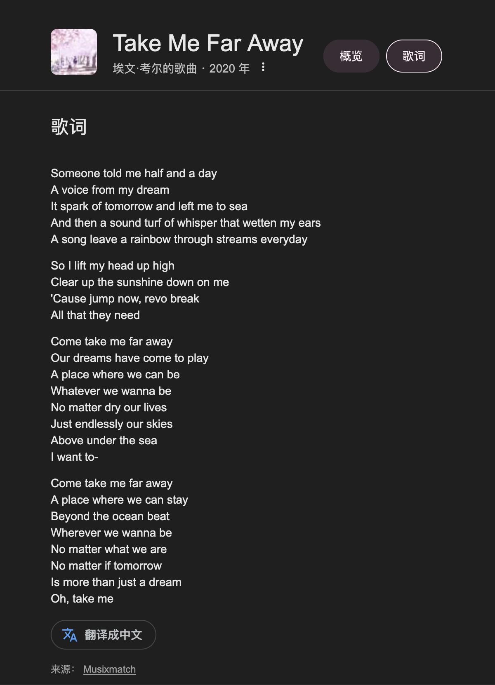

import {Spoiler, Collapse} from 'astro-pure/user'

《Take me far away》是动画电影《ジョゼと虎と魚たち》avant的插曲。演唱者浓厚的日式英语风味+官方没发行的歌词文本，导致这首歌的歌词在网络上具有多种版本——且其中最广为流传的版本包含大量错讹😡

如果你在Google上直接检索`evan call take me far away歌词`，首选项将会是：

<Collapse title='错讹版本'>
> Someone told me half and a day \
> A voice from my dream \
> It spark of tomorrow and left me to sea \
> And then a sound turf of whisper that wetten my ears \
> A song leave a rainbow through streams everyday\
> So I lift my head up high\
> Clear up the sunshine down on me\
> 'Cause jump now, revo break\
> All that they need\
> Come take me far away\
> Our dreams have come to play\
> A place where we can be\
> Whatever we wanna be\
> No matter dry our lives\
> Just endlessly our skies\
> Above under the sea\
> I want to-\
> Come take me far away\
> A place where we can stay\
> Beyond the ocean beat\
> Wherever we wanna be\
> No matter what we are\
> No matter if tomorrow\
> Is more than just a dream\
> Oh, take me
</Collapse>
稍微看一眼就会发现其中存在的大量语法错误和语意不通。

<Spoiler>不客气地讲，这听写的就是一坨狗屎</Spoiler>

为了对比，我从nyaa上下载了比较受欢迎的[一个版本](https://nyaa.si/view/1528060)，并比较了其中HappySub和MaxEffort各自的听译，结果这两个字幕组(?)也用的是同样的错误版本。。。

<Spoiler>真给老外🍬丸了，我甚至怀疑这个错讹版本就是这些不负责的字幕组搞出来的，污染环境</Spoiler>

在我能找到的版本中，最接近听感的且语意通顺语法正确的，我认为是[SweetSub&VCB-Studio的版本](https://vcb-s.com/archives/14969)，他们的听译版本如下：

> Someone told me of a new day\
> A voice from my dream\
> It spoke of tomorrow and led me to see\
> And I listened to the whisper\
> The wind in my ears\
> A song never-ending through smiles and tears\
> So I lift my head up high,
> feel the sunshine down on me\
> 'Cause tomorrow will bring all that I need\
> Come, take me far away,
> where dreams have come to play,
> a place where we can be, whatever we wanna be\
> No limit to our lives,
> just endless teal skies, above an open sea\
> Oh, won't you come, take me far away,
> a place we can stay
> beyond the ocean breeze,
> wherever we wanna be\
> No matter what we are,
> no matter if tomorrow is more than just a dream\
> Oh, take me

但是从听感上，这个版本似乎也并不完全正确，比如`Come`和`take me far away`之间，听起来似乎还有一个音节，但是这个版本里并未体现。不过不管怎么说，这个版本已经足够正确了。

> 希望正确的版本能逐步扩散并取代传播已久的错讹版本

