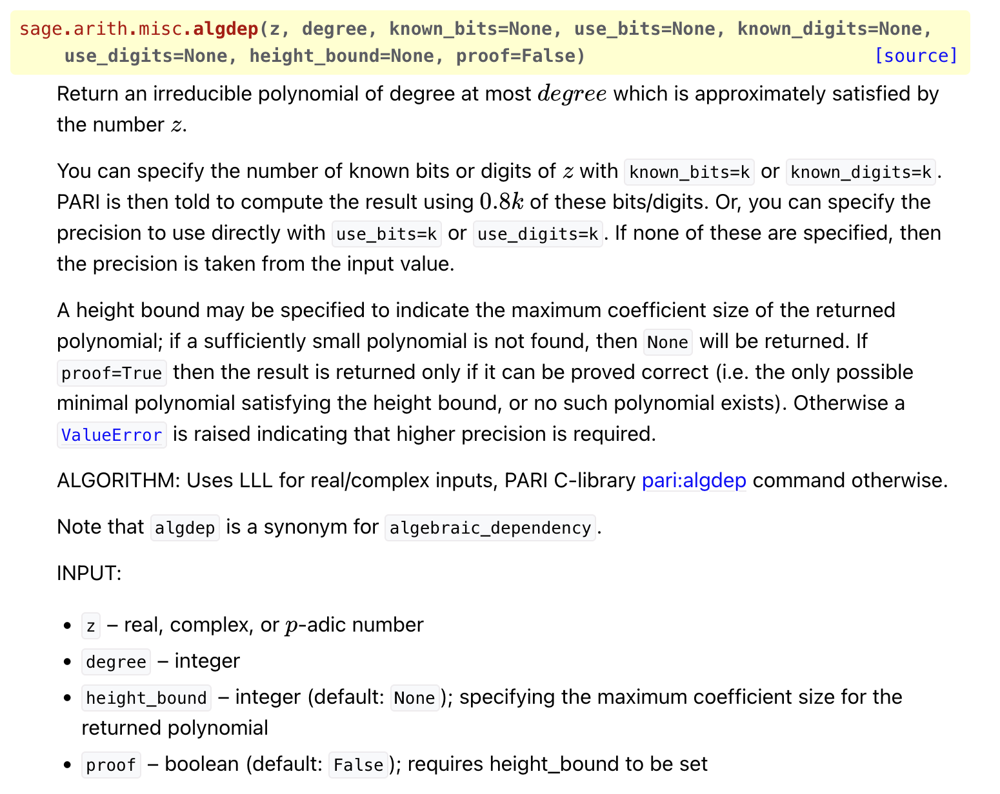
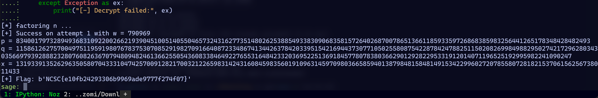
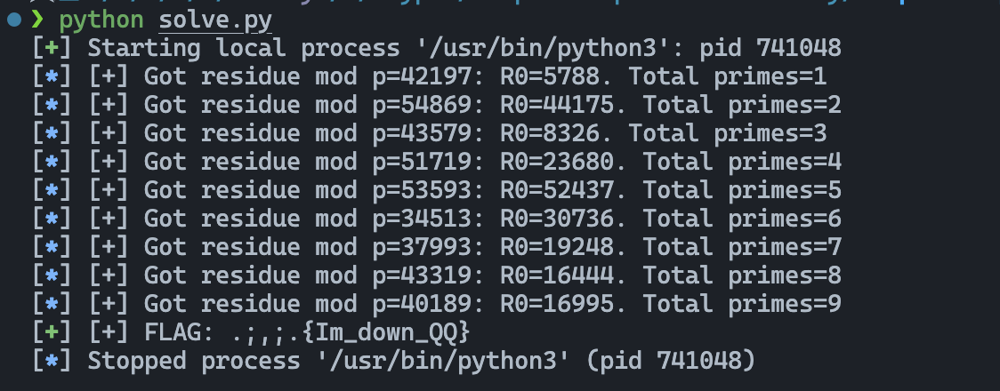

||因为你校拖沓的行政效率导致原有的安排全被打乱了，烦躁不安，不如做做密码题散散心||

## NepCTF 2025 - Lattice Bros

```python title="chall.py"
#已知α的极小多项式为三次多项式f(x),即f(α)=0,且α≈54236.606188881754809671280151541781895183337725393
#上述极小多项式的常数项为a0

from secret import a0,alpha
import gmpy2
from Crypto.Util.number import long_to_bytes
import random
from math import sqrt,log2

d=981020902672546902438782010902608140583199504862558032616415
p = d - a0

k=sqrt(log2(p))+log2(log2(p))
B = 2**30
assert B < p/2**k

m = 30
assert m > 2*sqrt(log2(p))

samples = []
betas = []

f = open("samples.txt",'w')
for _ in range(m):
    t = random.randint(1, p-1)
    beta = random.randint(-B + 1, B - 1)
    a = (t * alpha - beta) % p
    samples.append((t, a))
    betas.append(beta)

f.write(str(samples))

for i in range(0,30):
    assert (betas[i]-samples[i][0]*alpha+samples[i][1])%p == 0

#flag = long_to_bytes(alpha)

```

首先要痛斥出题人的符号混用，题目中两个$\alpha$是何意？虽然我在这上面没卡壳，但是据我所知是实打实有师傅被这个困惑了一阵子的。 

> $\alpha$ != `alpha`说是

回到这题，首先我们得想办法恢复出p，想恢复p就得恢复出那个极小多项式。我看不少师傅都是手动造格去做的，that's good，但是不符合我们对速度的追求。

其实Sage提供[一个函数](https://doc.sagemath.org/html/en/reference/rings_standard/sage/arith/misc.html#sage.arith.misc.algdep)可以完美解决这类问题。||能自动造格为什么要手动造呢||



后半部分可以看成HNP然后去打SVP规约alpha，但是一个小问题是我们不知道`alpha`的大小，配平格时得靠猜。那么我们为什么不直接打CVP呢？

> 或者打SVP恢复beta，也比直接恢复alpha来得简单

$$\mathbf{M}=\left(\begin{array}{cccccc}p & & &\\ & p & &\\ & & \ddots & \\ & & & p\\ t_1 & t_2 & \cdots & t_m \\\end{array}\right)$$

很容易知道如果 $\vec{a} = [a_i]$ 没有误差那么就在 $\mathbf{M}$ 中，所以对带误差的 $\vec{a} = [a_i]$ 的求个CVP就能恢复出原本无误差的向量，然后选个分量乘上t模p的逆就能恢复alpha了。

> 我这种做法刚需t和p互素，所以尽管题目没说，我还是从一开始就猜测p是素数。某种程度上这让我第一步免去了很多麻烦，并且第二步也不需要猜测alpha的大小了。

```python title="solve.py"
from sage.all import *
import ast
from lll_cvp import solve_inequality, kannan_cvp, BKZ
from functools import partial
from Crypto.Util.number import *

alpha_approx_str = "54236.606188881754809671280151541781895183337725393"

# 大约 53 * log2(10) ≈ 176 bits
R = RealField(175)
alpha_approx = R(alpha_approx_str)
degree = 3
f = algdep(alpha_approx, degree)
print(f"[+] f(x) = {f}")
a0 = f.constant_coefficient()
d = 981020902672546902438782010902608140583199504862558032616415
p = d - a0
print(f"[+] p = {p}")
print(isPrime(p))
with open("samples.txt", "r") as f:
    samples = ast.literal_eval(f.read())

m = len(samples)
M = Matrix(ZZ, m + 1, m)
for i in range(m):
    M[i, i] = p
for i in range(m):
    M[m, i] = samples[i][0]

T_list = []
t_i = []
for t, a in samples:
    t_i.append(t)
    T_list.append(a)

T = vector(ZZ, T_list)
lb = vector([c - 2**30 for c in T])
ub = vector([c + 2**30 for c in T])
v_closest = solve_inequality(M, lb, ub, cvp=partial(kannan_cvp, reduction=BKZ))

alphas = [v_closest[i] for i in range(len(v_closest))]
print(long_to_bytes((inverse(t_i[0], p) * alphas[0]) % p))
```

||可惜开始看题的时候有点晚，不然感觉有机会一血xD||

## 不知名比赛 - RSA101

一个师傅问我的题，内容是已经被出烂了的algebraic-group factorization ~~感谢maple开源~~

```python title="chall.py"
from Crypto.Util.number import getPrime, isPrime, bytes_to_long


def gp():
    p = getPrime(512)
    while True:
        w = getPrime(20)
        x = 2 * w * p - 1
        if isPrime(x):
            return p, x

def gm():
    p, x = gp()
    q = getPrime(1024)
    return p, q, x, p * q * x

def enc(m, e, n):
    return pow(bytes_to_long(m), e, n)

f = open("../flag.txt", "rb").read().strip()
e = 65537
p, q, x, n = gm()
c = enc(f, e, n)

with open("out.txt", "w") as f_out:
    f_out.write(f"n = {n}\ne = {e}\nc = {c}\n")
```
```txt title="output.txt" collapse={1-3}
n = 12748576345263501361692766005313832566017044941769531960615161214960770178063498103947589336511278352065717175615437116671837589144001552267796531051657491370228793242807714085970557256083680234837564340657637674369174323695153107911216828001490888063824814516345427672878163276236160129886768032625063904666109623986396740795957476525580474090652093934492794181443493363403655205744733175568301985293050402898152991377395388317329309303275511350966216521151347301970080876053441574538652932942419970350930254329958215416421624966722461180713804794207144419719262543872075762030107571596461903686965033266037692840413799843
e = 65537
c = 8508768636681383485886433863675859851667726425369909559428115495457659664620344645318447325279820314974850583139818986461432844799753218752700385990780617980523519036090494516969110773675470746062947535194462766772018038028493792333166656550035503487127207024332065889257058516313897979101302575223171169614988847893243896415219981937133062680819894038950475723440485702611005361265034140562987043003767264328225432024740495267499670055292968105905076785924465434248720931382318060854615587588184233675072148745666868997447754510341002999926369479159572334698030201976114937510482575370732860362550666538478230914375330421
```

核心idea参考maple的原题[imaginaryCTF 2023 - sus](https://github.com/maple3142/My-CTF-Challenges/tree/master/ImaginaryCTF%202023/Sus)。不过这题略有不同，接下来我还是会用我的话简要描述一下思路。

我们先考虑退化情况 $n=pqr=pq(2q-1)$，那么 $GF(r^{2})$ 的乘法循环群的群阶就是 $r^{2}-1=(r+1)(r-1)=2q(2q-2)$

考虑这么一个环

$$\mathbin{P} = \mathbin{F}_r[x]/f(x)$$

其中f是随机选取的度为2的多项式。如果f在 $\mathbin{P}$ 中不可约，那么 $\mathbin{P}$ 其实就同构于 $GF(r^{2})$。但是我们不知道r是多少所以构造不出来这个东西，不过，至少我们可以构造

$$\mathbin{P'} = \mathbin{Z}_n[x]/f(x)$$

可以发现 $\mathbin{P}$ 是 $\mathbin{P'}$ 的子环。

回到环 $\mathbin{P}$ ，我们随机取一个元素g，如果它是生成元，那么 $g^{2n}$的阶就是 $ord(g^{2n})=\frac{r^2-1}{gcd(2n, r^2-1)}=2q-2=r-1$。记 $t=g^{2n}$，那么在环 $\mathbin{P}$ 上我们有 $t^{r-1}=1$

我们知道n阶有限循环群中阶为d的元素的个数是 $\phi{(d)}$，此处 $\phi$ 为欧拉函数。$\phi{(r-1)}<r-1$，显然环 $\mathbin{P}$ 中阶为r-1的元素只能从常数项元素中生成

> 因为满足 $t^{r-1}=1$ 的元素t构成一个阶为r-1的群K，而常数项构显然也在K里，且常数项的个数刚好是r-1。所以K其实就是常数项组成的群。

也就是说我们通过在环 $\mathbin{P}$ 上随机选多项式求出其2n次幂就能得到环 $\mathbin{P}$ 上的常数。环 $\mathbin{P}$ 上的常数放在环 $\mathbin{P'}$ 上就是系数为r的倍数的多项式，于是我们取多项式的系数和n做gcd就能拿到r，后面就顺理成章了。

具体到本题，$r$ 并非 $2q-1$，而是又乘上了一个 $w$，所以需要对每个w都做一遍check，不过我们可以稍微优化一下，取一个f计算好 $g^n$ 之后，再遍历素数计算 $^{2w}$。

```python title="solve.py"
from sage.all import *
import re


def parse_out(path="output.txt"):
    txt = open(path, "r").read()
    n = Integer(re.search(r"n\s*=\s*(\d+)", txt).group(1))
    e = Integer(re.search(r"e\s*=\s*(\d+)", txt).group(1))
    c = Integer(re.search(r"c\s*=\s*(\d+)", txt).group(1))
    return n, e, c


def do_factor(n, try_limit=50):
    R = PolynomialRing(Zmod(n), "X")
    X = R.gen()
    prime_list = list(prime_range(2**19, 2**20))

    for attempt in range(1, try_limit + 1):
        f = R.random_element(2)
        Q = R.quotient(f)  # (Z/nZ)[X]/(f)
        t = Q.random_element()
        base = t**n
        for w in prime_list:
            u = base ** (2 * w)

            coeffs = list(u)
            if len(coeffs) < 2:
                continue
            rr = gcd(ZZ(coeffs[1]), n)
            if 1 < rr < n:
                x = Integer(rr)
                p = gcd(n, x + 1)
                if p == 1:
                    p = (x + 1) // (2 * w)
                q = n // (p * x)
                assert p * q * x == n
                print(f"[+] Success on attempt {attempt} with w = {w}")
                return p, q, x

        print(f"[-] attempt {attempt} failed, retrying...")

    raise ValueError("Failed to factor n within try_limit attempts.")


def dec(n, e, c, p, q, x):
    lam = (p - 1) * (q - 1) * (x - 1)
    d = inverse_mod(e, lam)
    m = pow(c, d, n)
    m_int = int(m)
    blen = (m_int.bit_length() + 7) // 8
    return Integer(m).to_bytes(blen, "big")


if __name__ == "__main__":
    n, e, c = parse_out("output.txt")
    print("[*] factoring n ...")
    p, q, x = do_factor(n)
    print("p =", p)
    print("q =", q)
    print("x =", x)

    try:
        m = dec(n, e, c, p, q, x)
        print("[+] Flag:", m)
    except Exception as ex:
        print("[-] Decrypt failed:", ex)
```



## NepCTF 2025 - ezRSA2

赛中没看，下来看了看感觉完全没啥难度...那为什么解数这么少🧐

> 早知道就不应该在World Wide CTF那个LFSR上花那么长时间，对称密码🐶都不打

```python title="chall.py" collapse={5-25, 46-53}
from Crypto.Util.number import getStrongPrime, getRandomNBitInteger, GCD, inverse, long_to_bytes, bytes_to_long, sieve_base
from flag import flag


def gen_parameters(gamma=0.33, beta=0.33):
    p = getStrongPrime(1024)
    q = getStrongPrime(1024)
    N = p*q
    phi = (p-1)*(q-1)
    while True:
        d = getRandomNBitInteger(int(2048*beta))
        if GCD(d, phi) == 1:
            break
    e = inverse(d, phi)
    
    hints = []
    M = 1
    for i in range(1, len(sieve_base)):
        li = sieve_base[i]
        hints.append(d%li)
        M *= li
        if M.bit_length() >= 1024*gamma:
            break
    
    return e, N, hints


def main():
    e,N,hints = gen_parameters()
    print(f'e={hex(e)}')
    print(f'N={hex(N)}\n')
    print(f'hints={hints}\n')
    
    flag_prefix = b'NepCTF{'
    assert flag.startswith(flag_prefix)
    assert flag.endswith(b'}')
    
    pt = bytes_to_long(flag[len(flag_prefix):-1])
    ct = pow(pt, e, N)
    print(f'ct={hex(ct)}')
    
main()


"""
e=0x73915608ed64c9cf1a2279684cab4f4a78fba229d45d4f860971a241481363470a19cb0dc0d00f816b5befdaca017cf71483e96ef17b36179012f5194a0e6bf481bb06c2644f74c6812efb65d05c00631f282d6aa55c0bc140a1830b95a1cf4b6024cb0db53f2c2189897c41f22e2eec773723f531ec4bfa537fae6de5fe480cf46fe17850f7eb47df08194d95db3d26ac923b26e110ee645239ab586bbc546ddc5906f280a106edbb727ccb05536b5a3f5c0ebcf865c95ce58be54f7f3547aa53baa218b0dfa98e42d925fa341e45f94a3b16b0c83802660c7f34de3336cb21f219073cf8e9f5e39d47f0a9a9ee7c255f09a6add9a2f7a47960f4a853183d29
N=0xba8956e81394f3f1265ca5d9c4ad1ab0078bb43c4b80a231ab2cc62246ae45f66a562252622aed2cbbfc08647ef2fec0f97a632bf2242845f4b3af0c427cec3d90f42e90278a5a0feeed0922a8cd2278074ac54e9cfc0e96ff68f8d8f266dd87dc1cc59c2895ec884de2022311767f6a9a7e0bd288c79620e28b83bb3c8d8ad1047c839d6ccf5544eaf434a5f00b951769ab3121298d04b63a162757beb3d49917cd0c9e02ee1ac29398c8130961d5a2f2833aba1e538edb7bb97071f40fae543d1622f0c9206c6d4d8abb2ac1b93ebfb603c2f3a909ede357ade4043550fe540d13a4e87db8d731fe130f15a43a1a00364f5da2d87f7b660c3a04e734218a11

hints=[1, 3, 0, 3, 9, 16, 10, 14, 5, 11, 21, 18, 30, 30, 38, 2, 20, 62, 66, 1, 22, 56, 41, 13, 78, 59, 51, 6, 57, 117, 73, 75, 96, 112, 50, 93, 158, 97, 146, 8, 65, 96, 186, 161, 90, 131, 46, 32, 140, 133, 50, 43, 151, 234]

ct=0x101b284ad196b5bbd3d3df00a7d3577caeb29c681bdd122582b705afc671febf45d4f3786640e55aadd6a31ecc49175f97b772720f1735f8555f768b137a4643cd6958f80a3dfca4d0270ad463d6dde93429940bd2abb5ad8408b0906fa8d776544a1c50cc0d95939bef4c3fb64d0b52dca81ff0f244fc265bfc0bc147435d05f8f1a146e963a1403b3c123b4d6e73d1fd897109995009be1673212607f0ea7ae33d23f3158448b05c28ea6636382eee9436c4a6c09023ead7182ecd55ac73a68d458d726e1abc208810468591e63f4b4c2c1f3ce27c4800b52f7421ccab432c03e88b3b255740d719e40e0226eabb7633d97ed210e32071e2ac36ed17ef442e
"""
```

之前做maple出的一题的时候碰见过sieve_base，我对它的理解是一个素数组成的tuple。所以这题的hint拿去做个CRT其实就等于把d的低位给出来了，所以我们拿到的其实是

$$ed = k_1\phi(n)+1 = e(k_2*\prod{\text{s}}+d_l)$$

跟2024强网杯的traditional_game有点像，把p+q当x，k1当y，后面直接在模 $e*\prod{\text{s}}$ 下面二元Copper我估计就行。

试试看：

```python title="solve.py" collapse={4-62}
from sage.all import *
from Crypto.Util.number import *
import itertools


# https://github.com/defund/coppersmith
def small_roots(f, bounds, m=1, d=None):
    if not d:
        d = f.degree()

    if isinstance(f, Polynomial):
        (x,) = polygens(f.base_ring(), f.variable_name(), 1)
        f = f(x)

    R = f.base_ring()
    N = R.cardinality()

    f /= f.coefficients().pop(0)
    f = f.change_ring(ZZ)

    G = Sequence([], f.parent())
    for i in range(m + 1):
        base = N ^ (m - i) * f ^ i
        for shifts in itertools.product(range(d), repeat=f.nvariables()):
            g = base * prod(map(power, f.variables(), shifts))
            G.append(g)

    B, monomials = G.coefficient_matrix()
    monomials = vector(monomials)

    factors = [monomial(*bounds) for monomial in monomials]
    for i, factor in enumerate(factors):
        B.rescale_col(i, factor)

    B = B.dense_matrix().LLL()

    B = B.change_ring(QQ)
    for i, factor in enumerate(factors):
        B.rescale_col(i, 1 / factor)

    H = Sequence([], f.parent().change_ring(QQ))
    for h in filter(None, B * monomials):
        H.append(h)
        I = H.ideal()
        if I.dimension() == -1:
            H.pop()
        elif I.dimension() == 0:
            roots = []
            for root in I.variety(ring=ZZ):
                root = tuple(R(root[var]) for var in f.variables())
                roots.append(root)
            return roots

    return []


# fmt: off
e = 0x73915608ED64C9CF1A2279684CAB4F4A78FBA229D45D4F860971A241481363470A19CB0DC0D00F816B5BEFDACA017CF71483E96EF17B36179012F5194A0E6BF481BB06C2644F74C6812EFB65D05C00631F282D6AA55C0BC140A1830B95A1CF4B6024CB0DB53F2C2189897C41F22E2EEC773723F531EC4BFA537FAE6DE5FE480CF46FE17850F7EB47DF08194D95DB3D26AC923B26E110EE645239AB586BBC546DDC5906F280A106EDBB727CCB05536B5A3F5C0EBCF865C95CE58BE54F7F3547AA53BAA218B0DFA98E42D925FA341E45F94A3B16B0C83802660C7F34DE3336CB21F219073CF8E9F5E39D47F0A9A9EE7C255F09A6ADD9A2F7A47960F4A853183D29
N = 0xBA8956E81394F3F1265CA5D9C4AD1AB0078BB43C4B80A231AB2CC62246AE45F66A562252622AED2CBBFC08647EF2FEC0F97A632BF2242845F4B3AF0C427CEC3D90F42E90278A5A0FEEED0922A8CD2278074AC54E9CFC0E96FF68F8D8F266DD87DC1CC59C2895EC884DE2022311767F6A9A7E0BD288C79620E28B83BB3C8D8AD1047C839D6CCF5544EAF434A5F00B951769AB3121298D04B63A162757BEB3D49917CD0C9E02EE1AC29398C8130961D5A2F2833ABA1E538EDB7BB97071F40FAE543D1622F0C9206C6D4D8ABB2AC1B93EBFB603C2F3A909EDE357ADE4043550FE540D13A4E87DB8D731FE130F15A43A1A00364F5DA2D87F7B660C3A04E734218A11
hints=[1, 3, 0, 3, 9, 16, 10, 14, 5, 11, 21, 18, 30, 30, 38, 2, 20, 62, 66, 1, 22, 56, 41, 13, 78, 59, 51, 6, 57, 117, 73, 75, 96, 112, 50, 93, 158, 97, 146, 8, 65, 96, 186, 161, 90, 131, 46, 32, 140, 133, 50, 43, 151, 234]
ct = 0x101B284AD196B5BBD3D3DF00A7D3577CAEB29C681BDD122582B705AFC671FEBF45D4F3786640E55AADD6A31ECC49175F97B772720F1735F8555F768B137A4643CD6958F80A3DFCA4D0270AD463D6DDE93429940BD2ABB5AD8408B0906FA8D776544A1C50CC0D95939BEF4C3FB64D0B52DCA81FF0F244FC265BFC0BC147435D05F8F1A146E963A1403B3C123B4D6E73D1FD897109995009BE1673212607F0EA7AE33D23F3158448B05C28EA6636382EEE9436C4A6C09023EAD7182ECD55AC73A68D458D726E1ABC208810468591E63F4B4C2C1F3CE27C4800B52F7421CCAB432C03E88B3B255740D719E40E0226EABB7633D97ED210E32071E2AC36ED17EF442E
# fmt: on
mods = []
for i in range(1, len(hints) + 1):
    mods.append(sieve_base[i])

d_l = int(crt(hints, mods))
modulus = prod(mods) * e
PR = PolynomialRing(Zmod(modulus), implementation="generic", names="x, y")
x, y = PR.gens()
f = y * (N - x + 1) + 1 - e * d_l
res = small_roots(f, (2**1024, 2**682), m=4, d=2)[0]
p_plus_q = int(res[0])
p = (p_plus_q + isqrt(p_plus_q**2 - 4 * N)) // 2
q = N // p
phi = (p - 1) * (q - 1)
d = inverse(e, phi)
flag = long_to_bytes(pow(ct, d, N))
print(flag.decode())
# larg3r_M0du1u5_1nf0_g1ves_b3773r_b0und5
```

秒出~

> 这里本来想用懒人包cuso一把梭的，但是bounds开到`2**1025`会有奇怪的报错，开到`2**1024`虽然不报错但是非常非常慢，最后还是用回了原来defund的板子

## smileyCTF 2025 - a special place in reality

```python title="chall.py"
#!/usr/local/bin/python
from Crypto.Util.number import *
import math

FLAG = open('flag.txt').read()

while True:
    if input("Yes? ") == "yes":
        try:
            x = int(input("Length: "))
            if x <= len(FLAG) * 40:
                p = getPrime(x)
            elif x <= 10000: # no dos pls
                p = 256
            n = p*p

            flag = FLAG + "a" * (1 + math.ceil(x/8))
            flag = bytes_to_long(flag.encode())
            flag = flag - flag % p

            c = pow(flag, 65537, n)

            print("p multiple length:", len(bin(flag//p)) - 2)
            print("p multiple 1 bits:", bin(flag//p).count("1"))
            print(c, 65537, n)
            
        except:
            print("invalid input")
    else:
        print("exiting...")
        exit(0)
```

这题真的很有意思，可惜赛中看解数太少+操作很妙妙就没上手去做xD

题目基于一个无限次数的Oracle，每轮允许我们输入x，然后根据x的大小生成p，再根据x的大小对`FLAG`做padding，最后给我们`flag//p`的popcount和`flag//p`的bit数。

> 也就是说把hamming weight给了我们

很容易发现如果输入的x大于10000，那么p是不会重新生成的。||这里就非常可疑，很容易让人想到CRT|| 问题在于，我们获得hamming weight有什么用呢？

关键在于这里的Oracle。还是考虑p不变的情况，因为是无限次的Oracle，所以我们可以选取适当的x使得下一轮Oracle中追加的 'a' 的个数比这一轮追加的多1。记`S = FLAG + 'a' * k`，`G_k = bytes_to_long(S)`，`R_k = G_k mod p`，`Q_k = ⌊G_k / p⌋`，那么从 k 变到 k+1 的时候：

```python
R_{k+1} = (256 * R_k + 97) mod p
s_k     = floor((256 * R_k + 97) / p)   # 0..255
Q_{k+1} = (Q_k << 8) + s_k
```

因为 s_k仅占 8 位，不会产生进位，所以`popcount(Q_{k+1}) - popcount(Q_k) = popcount(s_k)`[^1]，也就是说，通过popcount的差分可以搞出来一个与 $R_0$ 有关的序列，而p较小的时候我们完全可以在模p的意义下枚举 $R_0$，然后用同样的逻辑生成序列与获取到的做比较，以判断出枚举到的是否是正确的 $R_0$，随后多收集几组就能CRT了。

> 这种获取sequence以供后续枚举判断的思路我在很久之前刷到过类似的题，那题好像是泄露了辗转相除时的LSB，不过我完全不记得出处了

因为远程环境🈚️了所以本地测一下：

```python title="solve.py"
from pwn import *
from math import isqrt, ceil
from Crypto.Util.number import long_to_bytes

MIN_SEQ_LEN = 32
MAX_SEQ_LEN = 256
TARGET_PRIMES = 40
X_FREEZE_BASE = 10008
X_STEP = 8
SMALL_BITS = 16


def popcount8(x: int) -> int:
  x &= 0xFF
  return x.bit_count()


def recv_block(io):
  io.recvuntil(b"Yes? ")

  line1 = io.recvline().decode(errors="ignore").strip()
  line2 = io.recvline().decode(errors="ignore").strip()
  line3 = io.recvline().decode(errors="ignore").strip()

  # line1: "p multiple length: {L}"
  bitlen = int(line1.split(":")[1].strip())

  # line2: "p multiple 1 bits: {H}"
  pop1bits = int(line2.split(":")[1].strip())

  # line3: "{c} 65537 {n}"
  parts = line3.split()
  n = int(parts[2])
  p = isqrt(n)
  return p, pop1bits, bitlen


def query_once(io, x: int):
  io.recvuntil(b"Yes? ")
  io.sendline(b"yes")
  io.recvuntil(b"Length: ")
  io.sendline(str(x).encode())

  line1 = io.recvline().decode(errors="ignore").strip()
  line2 = io.recvline().decode(errors="ignore").strip()
  line3 = io.recvline().decode(errors="ignore").strip()
  L = int(line1.split(":")[1].strip())
  H = int(line2.split(":")[1].strip())
  parts = line3.split()
  n = int(parts[2])
  p = isqrt(n)
  return p, H, L


def get_delta_seq(io, p_expected: int, steps: int, x_base: int):
  d_list = []
  p, H_prev, _ = query_once(io, x_base)
  k_start = 1 + ceil(x_base / 8)

  x = x_base
  for _ in range(steps):
    x += X_STEP
    p, H_cur, _ = query_once(io, x)
    d = H_cur - H_prev
    d_list.append(d)
    H_prev = H_cur

  return d_list, k_start


def find_R0(p: int, d_list):
  T = len(d_list)
  cands = []

  for R in range(p):
    ok = True
    cur = R
    for i in range(T):
      s = (256 * cur + 97) // p  # 0..255
      if popcount8(s) != d_list[i]:
        ok = False
        break
      cur = (256 * cur + 97) % p
    if ok:
      cands.append(R)
    if len(cands) > 2 * 256:
      pass

  if len(cands) == 1:
    return cands[0]
  else:
    return None


def backward(p: int, Rk: int, k: int):
  inv256 = pow(256, -1, p)
  cur = Rk
  for _ in range(k):
    cur = ((cur - 97) * inv256) % p
  return cur  # R_0


def crt_merge(R, M, ri, pi):
  t = ((ri - R) * pow(M % pi, -1, pi)) % pi
  R2 = R + M * t
  M2 = M * pi
  return R2 % M2, M2


def solve():
  io = process(["python3", "chall.py"])

  R_all, M_all = 0, 1
  found = None

  primes_got = 0

  while primes_got < TARGET_PRIMES and found is None:
    p, H0, L0 = query_once(io, SMALL_BITS)
    steps = MIN_SEQ_LEN
    while True:
      d_list, k_start = get_delta_seq(io, p, steps, X_FREEZE_BASE)
      Rk0 = find_R0(p, d_list)
      if Rk0 is None and steps < MAX_SEQ_LEN:
        steps = min(MAX_SEQ_LEN, steps + 16)
        continue
      elif Rk0 is None:
        log.warning(f"p={p}: still ambiguous after {steps} steps; skip this p")
        break

      R0 = backward(p, Rk0, k_start)
      R_all, M_all = crt_merge(R_all, M_all, R0, p)
      primes_got += 1
      log.info(f"[+] Got residue mod p={p}: R0={R0}. Total primes={primes_got}")
      cand = long_to_bytes(R_all)
      try:
        s = cand.decode("utf-8", errors="ignore")
      except Exception:
        s = ""

      if ".;,;.{" in s:
        start = s.find(".;,;.{")
        end = s.find("}", start)
        if end != -1:
          flag = s[start : end + 1]
          log.success(f"[+] FLAG: {flag}")
          found = flag
          break
      break

  if found is None:
    log.error("[-] Failed to find the flag.")
  io.close()


if __name__ == "__main__":
  solve()
```



> 真的是好题，考察的知识点不复杂又有思考的空间

[^1]: 这里可以粗略地理解为在p进制下操作，popcount的差分就会受到末位的影响。如果详细地解释，是因为
    
    $$G_k = p·Q_k + R_k$$
    
    $$G_{k+1} = 256·G_k + 97$$

    由 $G_k = p·Q_k + R_k$，模 p 得
        $$R_{k+1} = (256·G_k + 97) \bmod{p} = (256·R_k + 97) \bmod{p}$$

    然后将 $G_k = p·Q_k + R_k$ 代入 $G_{k+1}$：

      $$
      \begin{aligned}
        Q_{k+1} &= ⌊G_{k+1}/p⌋ \\
        &= ⌊(256(p·Q_k + R_k) + 97)/p⌋ \\
        &= ⌊256·Q_k + (256·R_k + 97)/p⌋ \\
        &= 256·Q_k + ⌊(256·R_k + 97)/p⌋
      \end{aligned}
      $$

    因此
        $$Q_{k+1} = 256·Q_k + s_k = (Q_k << 8) + s_k$$