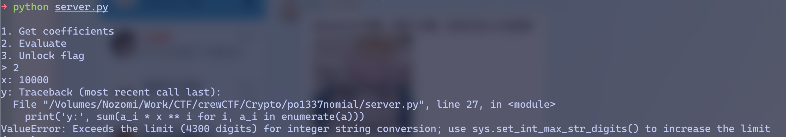

import { Tabs, TabItem } from 'astro-pure/user';

## crewCTF 2025 - po1337nomial

```python title="server.py"
#!/usr/bin/env python3

from os import getenv
from random import getrandbits, randbytes, randrange, shuffle


FLAG = getenv('FLAG', 'crew{fake_flag}')

a = [getrandbits(32) for _ in range(1337)]
options = {'1': 'Get coefficients', '2': 'Evaluate', '3': 'Unlock flag'}

while options:
    option = input(''.join(f'\n{k}. {v}' for k, v in options.items()) + '\n> ')

    if option not in options:
        break

    options.pop(option)

    if option == '1':
        shuffle(s := a.copy())
        print('s:', s)

    if option == '2':
        x = int(input('x: '))
        a[randrange(0, 1337)] = 1337
        print('y:', sum(a_i * x ** i for i, a_i in enumerate(a)))

    if option == '3':
        if input('k: ') == randbytes(1337).hex():
            print(FLAG)
```

~~一眼丁真，鉴定为MT~~

要打MT就得拿到有序的输出，只有乱序的输出是不够的。选项2允许我们对多项式求值，所以Swizzer的第一反应是传入一个很大的x，拿到值后按x进制展开就能拿到所有系数，接着就能愉快地打MT了。然而现实并没有这么美好(远程环境🈚️了，截图是本地测试。远程也是同样的报错)：



Python默认的4300digits限制直接堵死了这条路。

> 不过也是，要是这条路能走通那选项1就完全没用了xD

不过没关系，Swizzer还可以二次启动！脑测了一下，这题能传入的x最大也就是1600左右，至少是比1337大的。有没有可能我们传入一个数p，能使得1337个系数在模p下刚好划分到不同的剩余类呢？这样结合选项1就能靠余数对应恢复系数了——**可惜，测试后发现依然不行**。

这一步测下来发现随便取一个1000~1500之间的x，所有系数模x一共大概800多种取值。这就说明这些模x剩余类中总有一些是对应唯一一个系数的，这足以让我们恢复出部分系数。同时这也给出了DFS的可能——每项系数都落在一个剩余类里，800多种剩余类，可以想见每种剩余类里的候选系数也不会很多，每搜一层只要去对应的剩余类里搜那几种可能就行。

```python title="solve.py" collapse={12-91}
from pwn import *
from tqdm import trange
from gf2bv import LinearSystem
from gf2bv.crypto.mt import MT19937
from collections import Counter, defaultdict
from ast import literal_eval
import sys

sys.setrecursionlimit(10**6)


def mt19937(bs, out):
  lin = LinearSystem([32] * 624)
  mt = lin.gens()
  rng = MT19937(mt)
  zeros = []
  for o in out:
    zeros.append(rng.getrandbits(bs) ^ int(o))
  zeros.append(mt[0] ^ int(0x80000000))
  sol = lin.solve_one(zeros)
  rng = MT19937(sol)
  pyrand = rng.to_python_random()
  return pyrand


def dfs(s, x, y):
  n = len(s)
  marker = 1337

  ori_s = list(s)

  for r in trange(n):
    si = s[r]
    s[r] = marker
    residues = defaultdict(Counter)
    for val in s:
      residues[val % x][val] += 1
    a = [None] * n

    def helper(i, v):
      if i == n:
        return v == 0
      rmod = v % x
      bucket = residues.get(rmod)
      if not bucket:
        return False
      cands = sorted(bucket.items(), key=lambda kv: (kv[1], kv[0]))
      for val, cnt in cands:
        if bucket[val] == 0:
          continue
        bucket[val] -= 1
        a[i] = val
        nv = v - val
        if nv % x == 0:
          if helper(i + 1, nv // x):
            return True

        bucket[val] += 1
        a[i] = None

      return False

    ok = helper(0, y)
    if ok:
      if any(v is None for v in a):
        s[r] = si
        continue
      if Counter(a) == Counter(s):
        s[r] = si
        try:
          idx = a.index(marker)
        except ValueError:
          return a
        ori_cnt = Counter(ori_s)
        a_cnt = Counter(a)
        a_cnt[marker] -= 1
        if a_cnt[marker] <= 0:
          del a_cnt[marker]

        missed = ori_cnt - a_cnt
        if not missed:
          return None
        missed_val = next(iter(missed.elements()))
        a[idx] = missed_val
        if Counter(a) == Counter(ori_s):
          return a
        else:
          s[r] = si
          continue
    s[r] = si
  return None


def solve(io):
  x = 1500
  io.sendlineafter(b"> ", b"1")
  io.recvuntil(b"s: ")
  s = literal_eval(io.recvline().decode())
  io.sendlineafter(b"> ", b"2")
  io.sendlineafter(b"x: ", str(x).encode())
  io.recvuntil(b"y: ")
  y = literal_eval(io.recvline().decode())
  a = dfs(s, x, y)
  assert a
  RNG = mt19937(32, a)
  assert all(aa == RNG.getrandbits(32) for aa in a)
  shuffled = a.copy()
  RNG.shuffle(shuffled)
  assert shuffled == s
  RNG.randrange(0, 1337)
  io.sendlineafter(b"> ", b"3")
  io.sendlineafter(b"k: ", RNG.randbytes(1337).hex().encode())
  io.success(io.recvline().decode())


if __name__ == "__main__":
  context.log_level = "info"
  io = process(["python", "server.py"])
  solve(io)
```

## crewCTF 2025 - IOIOIOI

### TL; DR
题目要求统计长度为 $N$，分数为 $K$ 的字符串（字母集合 $\{I,O\}$）在模998244353意义下的个数。分数定义为字符串中所有形如 $I(OI)^t$（长度 $2t+1$，例如 `IOI`, `IOIOI`, ...）的连续子串的个数。时间限制5min，$1 ≦ N ≦ 10^{18}，0 ≦ K ≦ 1000$

> ex. score("IOIOIO") = 2 ("IOI") + 1 ("IOIOI") = 3

将所有字符串编码为二元生成函数：

$$
G(x, y) = \sum_{m \geq 1} x^{2m - 1} y^{\binom{m}{2}}, 
$$

$$
F(x, y) = \frac{x + (1+x^2)G}{1 - x - (1+x+x^2)G},
$$

题目要求的就是系数

$$
[x^N y^K] F(x, y)
$$


### 观察
首先这个模数一眼NTT，那么就得想办法往多项式上靠拢。一个关键观察是，把字符串按最长交替子段切开（把连续交替的段分出来，比如 `IOIOI`、`OIO`、`I`，...）后，任一 `I(OI)^t` 类型的子串必须完全落在某个交替段内，因此整体 score 等于对每个以 `I` 开头的交替段内部贡献的三角形数的和。

- 对以 `I` 开头，且长度为 $2q+1$ 的交替段（奇长并首尾相同），它内部包含的所有这些模式的总数恰好是三角数

  $$
  T(q)=1+2+\dots+q=\frac{q(q+1)}{2}.
  $$

  例如 `IOIOI`（长度5，对应 $q=2$）内部出现数为 $T(2)=3$，分别是两个 `IOI` 和一个 `IOIOI`。

- 对以 `O` 开头的交替段，若长度为 $2q+1$（奇长），它内部以 `I` 开头的模式数量为 $T(q-1)$（因为第一个位置不是 `I`，以 `I` 开头的模式要从第二个字符开始计数）。对偶地，以 `I` 开头的偶长交替段也会有特定的贡献。

至此，我们把计数问题转化为按交替段拼接的组合计数问题：把长度 $N$ 的字符串看作若干交替段（每段的长度、首字母、以及该段内部对 `score` 的贡献），把这些段按能否首尾拼接的规则拼起来，统计总 `score=K` 的方案数。


### 引入生成函数

定义生成函数

$$
G(x,u)=\sum_{n\ge0}\sum_{k\ge0} a_{n,k}\,x^n u^k,
$$

其中 $a_{n,k}$ 为长度为 $n$、score 为 $k$ 的字符串数量。我们要的即是系数 $[x^N u^K]\,G(x,u)$。

利用上面的交替拼接思想，可以把每种类型的交替段看作一个“带权的字”（权为 $x^{\text{段长}} u^{\text{段内贡献}}$）。考虑状态为“当前末尾字母是 I / O”两种情况，段的拼接变为状态之间的转换。于是可以构造一个 $2\times2$ 的矩阵生成函数 $M(x,u)$，其各项是从某一末尾字母到下一末尾字母所能追加的段的生成函数：

* $A(x,u)$ —— 从 `I` 追加一个段，使得段**开始且结束都是 I**（即段长度为奇数 $2q+1$），对应的权是 $x^{2q+1} u^{T(q)}$。因此在代码里 `A` 在指数 $2q+1$ 处放入 $u^{T(q)}$。
* $B(x,u)$ —— 从 `O` 追加一个段，使得段**开始且结束都是 O**（奇长），段内以 `I` 开头的模式贡献是 $T(q-1)$（对 $q\ge1$），所以 `B` 在指数 $2q+1$ 处放入 $u^{T(q-1)}$（当 $q=0$ 时视为 0）。
* $E(x,u)$ —— 长度为偶数 $2q+2$ 的交替段（会把 I→O 或 O→I），其内部对 score 的贡献是 $T(q)$，因此 `E` 在指数 $2q+2$ 处放入 $u^{T(q)}$。

因此有

$$
M(x,u)=\begin{pmatrix} A & E \\ E & B \end{pmatrix},
$$

在这种状态机下，从“空”的初始（不考虑首字母）出发，所有字符串对应于对 $M$ 的任意次数的串联（包括 0 次），因此总体生成函数是

$$
G(x,u)=(1,1)\cdot (I-M(x,u))^{-1} \cdot (1,1)^{T}.
$$

把矩阵逆写成伴随矩阵 / 行列式的形式可以化简为一个有理函数，分母是 $Q(x,u)=\det(I-M)= (1-A)(1-B)-E^2$，分子是 $P(x,u)=2-(A+B)+2E$

于是

$$
G(x,u)=\frac{P(x,u)}{Q(x,u)}.
$$

取

```cpp
ONEminusA = 1 - A;
ONEminusB = 1 - B;
D1 = (1-A)*(1-B);
E2 = E*E;
D = D1 - E2;      // = Q(x,u)
P = 2 - (A+B) + 2E; // = P(x,u)
Q = D;
```

因此问题就变为计算有理函数 $\dfrac{P(x,u)}{Q(x,u)}$ 在 $x^N$ 项的系数多项式，再取该多项式的 $u^K$ 系数。后续的多项式相关操作找板子加速即可，我的代码里最终用了Bostan-Mori、NTT和奇偶分解这几大块的优化。

### solve
<Tabs>
<TabItem label="solver.cpp">
```cpp title="solver.cpp" collapse={2-337}
// g++ -O3 -march=native -std=c++17 -pipe solver.cpp -o solver
#include <bits/stdc++.h>
using namespace std;

static const uint32_t MOD = 998244353;
static const uint32_t G = 3;

static inline uint32_t addm(uint32_t a, uint32_t b) {
  uint32_t c = a + b;
  return c >= MOD ? c - MOD : c;
}
static inline uint32_t subm(uint32_t a, uint32_t b) {
  return a >= b ? a - b : a + MOD - b;
}
static inline uint32_t mulm(uint64_t a, uint64_t b) {
  return (uint32_t)((a * b) % MOD);
}
static inline uint32_t powm(uint32_t a, uint64_t e) {
  uint64_t r = 1, x = a;
  while (e) {
    if (e & 1)
      r = (r * x) % MOD;
    x = (x * x) % MOD;
    e >>= 1;
  }
  return (uint32_t)r;
}

struct NTTScalar {
  int n;
  vector<uint32_t> w, iw;
  vector<int> rev;
  void init(int N) {
    n = N;
    w.resize(n);
    iw.resize(n);
    rev.resize(n);
    for (int i = 1; i < n; i++)
      rev[i] = (rev[i >> 1] >> 1) | ((i & 1) ? (n >> 1) : 0);
    uint32_t root = powm(G, (MOD - 1) / n), iroot = powm(root, MOD - 2);
    w[0] = 1;
    iw[0] = 1;
    for (int i = 1; i < n; i++) {
      w[i] = mulm(w[i - 1], root);
      iw[i] = mulm(iw[i - 1], iroot);
    }
  }
  void dft(uint32_t *a, bool inv) {
    for (int i = 1; i < n; i++) {
      int j = rev[i];
      if (i < j)
        swap(a[i], a[j]);
    }
    for (int len = 2; len <= n; len <<= 1) {
      int step = n / len;
      for (int i = 0; i < n; i += len) {
        for (int j = 0; j < (len >> 1); j++) {
          uint32_t u = a[i + j];
          uint32_t v = mulm(a[i + j + (len >> 1)], (inv ? iw : w)[step * j]);
          a[i + j] = addm(u, v);
          a[i + j + (len >> 1)] = subm(u, v);
        }
      }
    }
    if (inv) {
      uint32_t invn = powm(n, MOD - 2);
      for (int i = 0; i < n; i++)
        a[i] = mulm(a[i], invn);
    }
  }
};

static inline int ceil_pow2(int x) {
  int n = 1;
  while (n < x)
    n <<= 1;
  return n;
}
static inline int calc_M(int K) {
  int lo = 0, hi = K + 2;
  while (lo + 1 < hi) {
    int mid = (lo + hi) >> 1;
    if (1LL * mid * (mid - 1) / 2 <= K)
      lo = mid;
    else
      hi = mid;
  }
  return lo;
}

struct RingContext {
  int K, Lu;
  NTTScalar ntt_u;
  vector<uint32_t> mon1, mono_table;
  void init(int K_) {
    K = K_;
    Lu = ceil_pow2(2 * K + 1);
    ntt_u.init(Lu);
    mon1.resize(Lu);
    for (int j = 0; j < Lu; j++)
      mon1[j] = ntt_u.w[j];
    mono_table.assign((K + 1) * Lu, 0);
    for (int j = 0; j < Lu; j++)
      mono_table[j] = 1;
    for (int t = 1; t <= K; t++) {
      uint32_t *prev = &mono_table[(t - 1) * Lu];
      uint32_t *curr = &mono_table[t * Lu];
      for (int j = 0; j < Lu; j++)
        curr[j] = mulm(prev[j], mon1[j]);
    }
  }
  inline const uint32_t *mono(int t) const { return &mono_table[t * Lu]; }
  void truncate_block(uint32_t *blk) {
    ntt_u.dft(blk, true);
    memset(blk + (K + 1), 0, sizeof(uint32_t) * (Lu - (K + 1)));
    ntt_u.dft(blk, false);
  }
};

struct XNTT {
  unordered_map<int, NTTScalar> cache;
  NTTScalar &get(int Lx) {
    auto it = cache.find(Lx);
    if (it != cache.end())
      return it->second;
    NTTScalar c;
    c.init(Lx);
    return cache.emplace(Lx, std::move(c)).first->second;
  }
  void dft_blocks(vector<uint32_t> &a, int Lx, int Lu, bool inv) {
    NTTScalar &ctx = get(Lx);
    for (int i = 1; i < Lx; i++) {
      int j = ctx.rev[i];
      if (i < j) {
        uint32_t *p = &a[i * Lu];
        uint32_t *q = &a[j * Lu];
        for (int t = 0; t < Lu; t++)
          swap(p[t], q[t]);
      }
    }
    for (int len = 2; len <= Lx; len <<= 1) {
      int step = Lx / len;
      for (int i = 0; i < Lx; i += len) {
        for (int j = 0; j < (len >> 1); j++) {
          uint32_t w = (inv ? ctx.iw[step * j] : ctx.w[step * j]);
          uint32_t *u = &a[(i + j) * Lu];
          uint32_t *v = &a[(i + j + (len >> 1)) * Lu];
          for (int t = 0; t < Lu; t++) {
            uint32_t vv = mulm(v[t], w), uu = u[t];
            u[t] = addm(uu, vv);
            v[t] = subm(uu, vv);
          }
        }
      }
    }
    if (inv) {
      uint32_t invn = powm(Lx, MOD - 2);
      for (uint32_t &x : a)
        x = mulm(x, invn);
    }
  }
};

static vector<uint32_t> multiply_x_blocks(const vector<uint32_t> &A,
                                          const vector<uint32_t> &B, int Lu,
                                          XNTT &xntt) {
  int nA = (int)A.size() / Lu, nB = (int)B.size() / Lu;
  int need = nA + nB - 1, Lx = ceil_pow2(need);
  vector<uint32_t> FA(Lx * Lu), FB(Lx * Lu);
  memcpy(FA.data(), A.data(), sizeof(uint32_t) * nA * Lu);
  memcpy(FB.data(), B.data(), sizeof(uint32_t) * nB * Lu);
  xntt.dft_blocks(FA, Lx, Lu, false);
  xntt.dft_blocks(FB, Lx, Lu, false);
  for (int i = 0; i < Lx; i++) {
    uint32_t *pa = &FA[i * Lu];
    uint32_t *pb = &FB[i * Lu];
    for (int j = 0; j < Lu; j++)
      pa[j] = mulm(pa[j], pb[j]);
  }
  xntt.dft_blocks(FA, Lx, Lu, true);
  FA.resize(need * Lu);
  return FA;
}
static vector<uint32_t> take_even(const vector<uint32_t> &A, int Lu) {
  int n = (int)A.size() / Lu, m = (n + 1) / 2;
  vector<uint32_t> R(m * Lu);
  for (int i = 0; i < m; i++)
    memcpy(&R[i * Lu], &A[(2 * i) * Lu], sizeof(uint32_t) * Lu);
  return R;
}
static vector<uint32_t> take_odd(const vector<uint32_t> &A, int Lu) {
  int n = (int)A.size() / Lu, m = n / 2;
  vector<uint32_t> R(m * Lu);
  for (int i = 0; i < m; i++)
    memcpy(&R[i * Lu], &A[(2 * i + 1) * Lu], sizeof(uint32_t) * Lu);
  return R;
}
static void truncate_poly_blocks(vector<uint32_t> &P, RingContext &rc) {
  int n = (int)P.size() / rc.Lu;
  for (int i = 0; i < n; i++)
    rc.truncate_block(&P[i * rc.Lu]);
}

static vector<uint32_t> poly_add(const vector<uint32_t> &A,
                                 const vector<uint32_t> &B, int Lu) {
  int nA = (int)A.size() / Lu, nB = (int)B.size() / Lu, n = max(nA, nB);
  vector<uint32_t> R(n * Lu, 0);
  for (int i = 0; i < n; i++) {
    uint32_t *pr = &R[i * Lu];
    if (i < nA)
      memcpy(pr, &A[i * Lu], sizeof(uint32_t) * Lu);
    if (i < nB) {
      const uint32_t *pb = &B[i * Lu];
      for (int j = 0; j < Lu; j++)
        pr[j] = addm(pr[j], pb[j]);
    }
  }
  return R;
}
static vector<uint32_t> poly_sub(const vector<uint32_t> &A,
                                 const vector<uint32_t> &B, int Lu) {
  int nA = (int)A.size() / Lu, nB = (int)B.size() / Lu, n = max(nA, nB);
  vector<uint32_t> R(n * Lu, 0);
  for (int i = 0; i < n; i++) {
    if (i < nA)
      memcpy(&R[i * Lu], &A[i * Lu], sizeof(uint32_t) * Lu);
    if (i < nB) {
      const uint32_t *pb = &B[i * Lu];
      uint32_t *pr = &R[i * Lu];
      for (int j = 0; j < Lu; j++)
        pr[j] = subm(pr[j], pb[j]);
    }
  }
  return R;
}
static void poly_scale_inplace(vector<uint32_t> &A, int /*Lu*/, uint32_t c) {
  if (c == 1)
    return;
  for (uint32_t &x : A)
    x = mulm(x, c);
}

static void build_ABE(int K, RingContext &rc, vector<uint32_t> &A,
                      vector<uint32_t> &B, vector<uint32_t> &E) {
  int M = calc_M(K);
  int degA = 2 * M + 1, degE = 2 * M;
  A.assign((degA + 1) * rc.Lu, 0);
  B.assign((degA + 1) * rc.Lu, 0);
  E.assign((degE + 1) * rc.Lu, 0);
  vector<int> T(M + 1);
  for (int q = 0; q <= M; q++)
    T[q] = q * (q + 1) / 2;

  for (int q = 0; q <= M; q++) {
    int d = 2 * q + 1, t = T[q];
    if (t <= K) {
      memcpy(&A[d * rc.Lu], rc.mono(t), sizeof(uint32_t) * rc.Lu);
    }
  }
  for (int q = 0; q <= M; q++) {
    int d = 2 * q + 1, tm1 = (q >= 1 ? T[q - 1] : 0);
    if (tm1 <= K) {
      memcpy(&B[d * rc.Lu], rc.mono(tm1), sizeof(uint32_t) * rc.Lu);
    }
  }
  for (int q = 0; q <= M - 1; q++) {
    int d = 2 * q + 2, t = T[q];
    memcpy(&E[d * rc.Lu], rc.mono(t), sizeof(uint32_t) * rc.Lu);
  }
}

static uint32_t solve_one(uint64_t N, int K) {
  RingContext rc;
  rc.init(K);
  XNTT xntt;

  vector<uint32_t> A, B, E;
  build_ABE(K, rc, A, B, E);

  vector<uint32_t> ONE(rc.Lu, 0);
  for (int j = 0; j < rc.Lu; j++)
    ONE[j] = 1;
  auto ONEminusA = poly_sub(ONE, A, rc.Lu);
  auto ONEminusB = poly_sub(ONE, B, rc.Lu);

  auto D1 = multiply_x_blocks(ONEminusA, ONEminusB, rc.Lu, xntt);
  auto E2 = multiply_x_blocks(E, E, rc.Lu, xntt);
  auto D = poly_sub(D1, E2, rc.Lu);

  auto ApB = poly_add(A, B, rc.Lu);
  auto two = ONE;
  poly_scale_inplace(two, rc.Lu, 2);
  auto twoE = E;
  poly_scale_inplace(twoE, rc.Lu, 2);
  auto tmp = poly_sub(two, ApB, rc.Lu);
  auto P = poly_add(tmp, twoE, rc.Lu);
  auto Q = std::move(D);

  truncate_poly_blocks(P, rc);
  truncate_poly_blocks(Q, rc);

  while (N > 0) {
    vector<uint32_t> Qhat = Q;
    int qn = (int)Q.size() / rc.Lu;
    for (int i = 1; i < qn; i += 2) {
      uint32_t *blk = &Qhat[i * rc.Lu];
      for (int j = 0; j < rc.Lu; j++)
        blk[j] = (blk[j] == 0 ? 0u : MOD - blk[j]);
    }
    auto R = multiply_x_blocks(P, Qhat, rc.Lu, xntt);
    auto S = multiply_x_blocks(Q, Qhat, rc.Lu, xntt);

    vector<uint32_t> Pn = (N & 1) ? take_odd(R, rc.Lu) : take_even(R, rc.Lu);
    vector<uint32_t> Qn = take_even(S, rc.Lu);

    truncate_poly_blocks(Pn, rc);
    truncate_poly_blocks(Qn, rc);

    P.swap(Pn);
    Q.swap(Qn);
    N >>= 1;
  }

  rc.ntt_u.dft(&P[0], true);
  return (K < rc.Lu ? P[K] % MOD : 0u);
}

int main() {
  ios::sync_with_stdio(false);
  cin.tie(nullptr);
  uint64_t N;
  int K;
  while ((cin >> N >> K)) {
    cout << solve_one(N, K) << '\n' << flush;
  }
  return 0;
}
```
</TabItem>
<TabItem label="solve.py">
```python title="solve.py"
from pwn import *
from tqdm import trange

import os, subprocess, threading, atexit

MOD = 998244353
_proc = None
_proc_lock = threading.Lock()


def _ensure_proc():
  global _proc
  with _proc_lock:
    if _proc is not None:
      return True
    exe = os.path.join(os.path.dirname(__file__), "solver")
    if not os.path.exists(exe):
      return False
    _proc = subprocess.Popen(
      [exe],
      stdin=subprocess.PIPE,
      stdout=subprocess.PIPE,
      bufsize=1,
      text=True,
    )

    def _cleanup():
      try:
        if _proc:
          _proc.stdin.close()
          _proc.terminate()
      except Exception:
        pass

    atexit.register(_cleanup)
    return True


def _call_native(N, K):
  if not _ensure_proc():
    return None
  try:
    _proc.stdin.write(f"{N} {K}\n")
    _proc.stdin.flush()
    line = _proc.stdout.readline()
    if not line:
      return None
    return int(line.strip())
  except Exception:
    return None


def Solve(N, K):
  ans = _call_native(N, K)
  return ans


def processing(io):
  for _ in trange(300):
    io.recvuntil(b"Test ")
    io.recvline()
    N = int(io.recvlineS().split("=")[1].strip())
    K = int(io.recvlineS().split("=")[1].strip())
    ans = Solve(N, K)
    io.sendlineafter(b"Your answer: ", str(ans))
  io.interactive()


if __name__ == "__main__":
  context.log_level = "error"
  print(Solve(40, 4))
  io = remote("ioioioi.chal.crewc.tf", 1337, ssl=True)
  processing(io)
```
</TabItem>
</Tabs>
## HITCONCTF 2025 - pedantic

```python title="server.py"
#!/usr/bin/env python3
import hashlib
import json
import os
import secrets

from fastecdsa.curve import secp256k1
from fastecdsa.point import Point

p = secp256k1.p
q = secp256k1.q
G = secp256k1.G
field_bytes = (p.bit_length() + 7) // 8
scalar_bytes = (q.bit_length() + 7) // 8


def encode_point(pt: Point):
    return pt.x.to_bytes(field_bytes, "big") + pt.y.to_bytes(field_bytes, "big")


def decode_point(data: bytes):
    if len(data) != 2 * field_bytes:
        raise ValueError("Invalid point encoding")
    x = int.from_bytes(data[:field_bytes], "big")
    y = int.from_bytes(data[field_bytes:], "big")
    return Point(x, y, secp256k1)


def hash_point(pt: Point):
    h = hashlib.sha256(encode_point(pt)).digest()
    return int.from_bytes(h, "big") % q


def hash_points_to_scalars(pts: list[Point], n: int):
    s = sum([hash_point(pt) for pt in pts]) % q
    ret = []
    for _ in range(n):
        ret.append(s)
        s = (1337 * s + 7331) % q
    return ret


ProofType = list[tuple[Point, int]]


def prove(x: int, n: int) -> ProofType:
    rs = [secrets.randbelow(q) for _ in range(n)]
    Grs = [G * r for r in rs]
    cs = hash_points_to_scalars(Grs, n)
    zs = [(r + c * x) % q for r, c in zip(rs, cs)]
    return list(zip(Grs, zs))


def verify(Y: Point, proof: ProofType):
    Grs, zs = zip(*proof)
    n = len(Grs)
    cs = hash_points_to_scalars(Grs, n)
    return all(G * z == Gr + Y * c for Gr, z, c in zip(Grs, zs, cs)) * n


def serialize_proof(proof: ProofType):
    return json.dumps([(encode_point(pt).hex(), z) for pt, z in proof])


def deserialize_proof(s: str) -> ProofType:
    return [(decode_point(bytes.fromhex(pt)), z) for pt, z in json.loads(s)]


def main():
    flag = os.environ.get("FLAG", "flag{test}")

    sk = int.from_bytes(hashlib.sha256(flag.encode()).digest(), "big") % q
    pk = G * sk

    print("Hey, I know the flag!")
    proof = prove(sk, 10)
    assert verify(pk, proof) == 10, "wtf"
    print("Here is the proof:")
    print(serialize_proof(proof))
    print("Do you know it too?")
    proof = deserialize_proof(input("proof:"))
    n = verify(pk, proof)
    if n >= 42:
        print("I am convined :D")
        print(f"Here is it: {flag}")
    elif n > 0:
        print("Hmm, not sure about that... :thinking:")
    else:
        print("I think you don't :(")


if __name__ == "__main__":
    main()
```

最喜欢的maple师傅的题🥰 ~~今年maple佬似乎有点忙，很久之前就听说imaginaryCTF他都没来出题...不过还好HITCON里见到了~~

题目实现了一个secp256k1曲线上的ZKP协议，以及相关参数：
```python
p = secp256k1.p
q = secp256k1.q
G = secp256k1.G
```

然后`prove()`是这样的：
```python
def prove(x: int, n: int) -> ProofType:
  rs = [secrets.randbelow(q) for _ in range(n)]
  Grs = [G * r for r in rs]
  cs = hash_points_to_scalars(Grs, n)
  zs = [(r + c * x) % q for r, c in zip(rs, cs)]
  return list(zip(Grs, zs))
```
其中`hash_points_to_scalars()`也是用来生成随机数的，会把所有的 $Gr_i$ 哈希后求和当作seed，seeding LCG去生成一串随机数作为$c_i$。

verify逻辑则是如下：

$$
z_i*G == Gr_i+c_i*Y
$$

其中我们输入的是 $z_i, Gr_i$，$Y$ 满足 $Y = x*G$，$x$ 为私钥，$Y$ 为公钥。

ZKP协议本身没什么问题，`hash_points_to_scalars()`里的hash也是SHA-256，几乎也打不动，所以唯一的疑点就是这个LCG了。LCG说实话也不是很能打，毕竟我们只能控制输入的$Gr_i$，
这些点还得求和hash之后才能当作seed。

import {Aside, Spoiler} from 'astro-pure/user';

<Aside type='note'>
退一步来说，就算有办法直接控制seed也不能很随心所欲地控制输出，毕竟隔了一层LCG呢
</Aside>

我们知道有些LCG是存在轨道/不动点的——对于特定的seed，LCG的迭代输出可能会进入一个循环，甚至是固定不变的值。这其实跟动力系统很像。本题的LCG同样存在不动点。
因此对于我们来说，最朴素的想法就是控制输入使得seed为不动点，这样LCG的输出比较简单，后面做题大概率也会简化一点。

输入的seed是不动点，$z_i$也是我们指定的，那么$Gr_i$直接就能计算出来。问题在于，怎么确保这些$Gr_i$经过hash求和之后刚好就等于不动点seed呢？

直觉上会觉得有点像LLL<Spoiler>看见线性关系就想格说是</Spoiler>，因为我们其实只需要找到这么一组系数${a_i}$使得$\Sigma a_i * hash(Gr_i)$等于不动点seed即可，到时候我们传入$Gr_i$的时候把对应的$Gr_i$和$z_i$重复$a_i$次就好了。

偷懒不想写exp了，放个maple写的然后跑路🥰

<Tabs>
<TabItem label='solve.py'>
```python
from sage.all import *
import gzip
import hashlib

from binteger import Bin
from server import (
    G,
    deserialize_proof,
    hash_point,
    hash_points_to_scalars,
    q,
    scalar_bytes,
    serialize_proof,
    verify,
)
from lll_cvp import affine_cvp, qary_lattice

from pwn import process, remote

# io = process(["python", "server.py"])
# io = remote("localhost", 1337)
io = remote("pedantic.chal.hitconctf.com", 1337)
io.recvuntil(b"proof:\n")
proof = deserialize_proof(io.recvlineS().strip())

Grs, zs = zip(*proof)
cs = hash_points_to_scalars(Grs, len(Grs))
Y = (G * zs[0] - Grs[0]) * pow(cs[0], -1, q)
print(Y)  # use this as input to the golang solver to get solution_with_z.txt

F = GF(q)
a = F(1337)
b = F(7331)
c = int(-b / (a - 1))  # fixed opint
assert a * c + b == c


m = 64
zs = list(range(m))
Grs = [G * z - Y * c for z in zs]
hs = [hash_point(Gr) for Gr in Grs]
L = matrix(F, hs)
rhs = vector(F, [c])

# we want to find a short, positive solution to L * ? = rhs
s0 = L.solve_right(rhs).change_ring(ZZ)
ker = L.right_kernel_matrix()
# the solution should be positive, so we find a vector close to 20
t = affine_cvp(s0, qary_lattice(ker, q), vector([20] * m))
print(t, sum(t))
assert L * t == rhs
assert all([x >= 0 for x in t])

Grs = sum([[Gr] * x for Gr, x in zip(Grs, t)], [])
zs = sum([[z] * x for z, x in zip(zs, t)], [])

proof = list(zip(Grs, zs))
assert verify(Y, proof) == sum(t)

io.sendline(serialize_proof(proof).encode())
print(io.recvallS().strip())
```
</TabItem>
</Tabs>