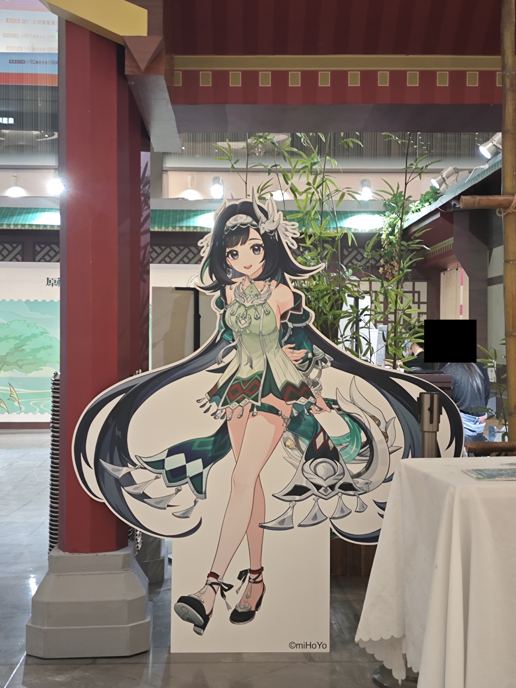
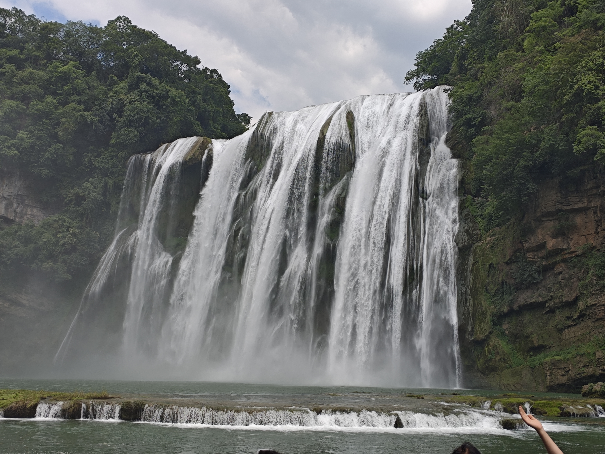
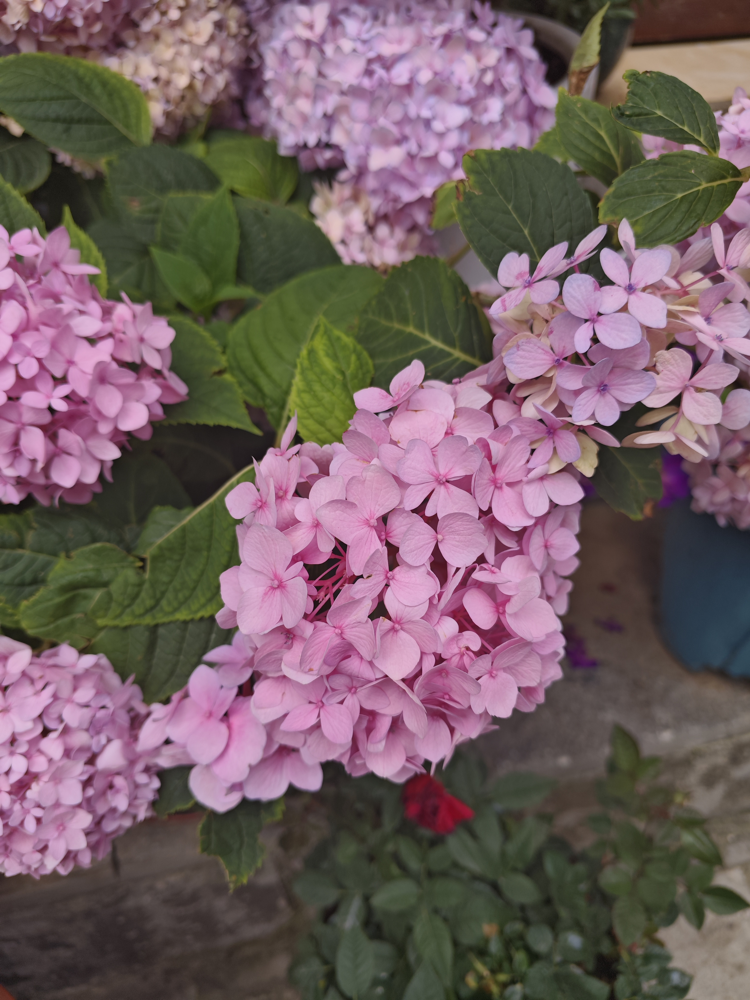
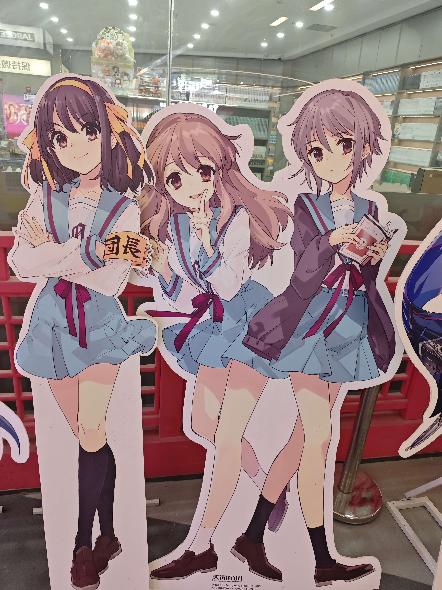
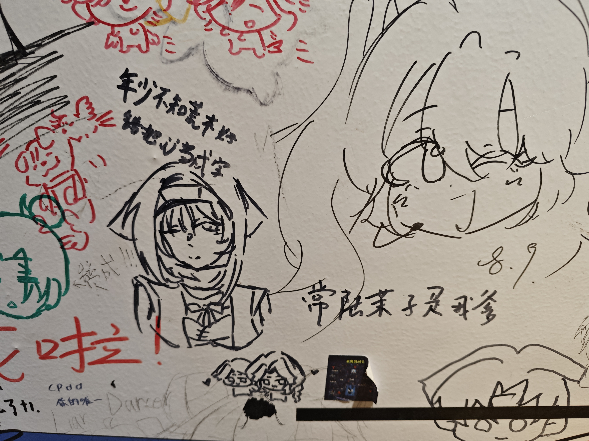
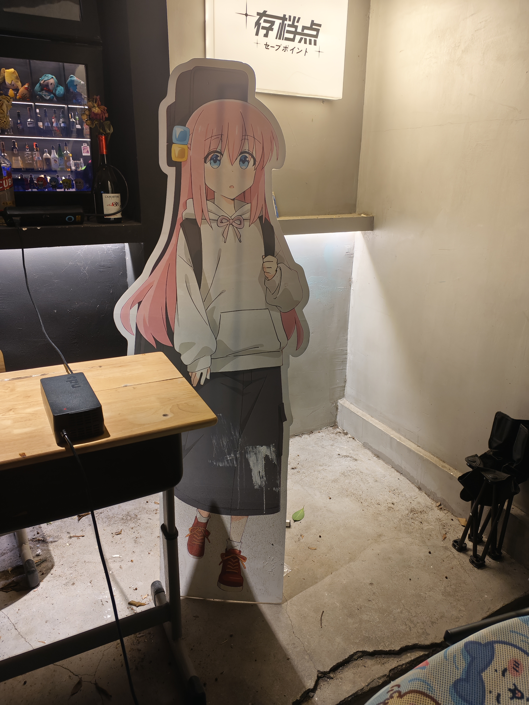
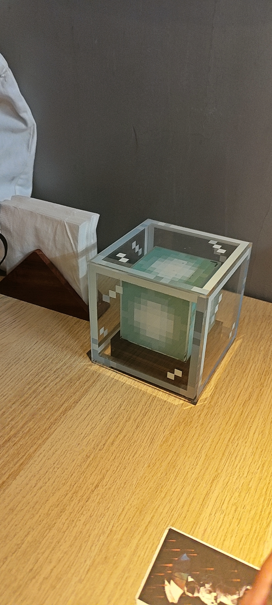
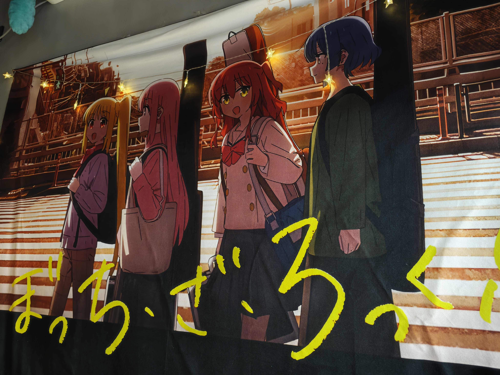

庆祝过一些事情，处理完一些事情，接受了一些事情，毕业季逐渐上紧发条。队友[@cheng_xing](https://sakuraraindrop.github.io)和[@Keyboard](https://muzihit.github.io)很想出去玩，拉上我出去逛了一圈。

> 用一次旅行为Del0n1x着墨一个掷地有声的句读吧

## Day 1: 贵州贵阳

想必各位从blog风格就能看出这是三个二次元抱团旅行去了，第一站选在贵阳也只是因为原神在贵阳有一场快闪活动。队友是miHoYo的忠实粉丝，不过我并非原神玩家...那我怎么还去了原神的快闪店呢？

> 只能说蓝砚确实很漂亮

快闪店在贵阳万象城，按店面规模来看足可称为一省旗舰店。不过或许因为正值高考，店铺客流量一般般，很轻松地就买到了想要的蓝砚周边(立牌+Q版立牌+挂件+色纸)。

以及可爱的看板：

买完周边后在贵厨吃了酸汤火锅，味道很独特。

## Day 2: 贵州安顺

在贵阳其实只住了一晚，第二天早上就坐高铁去了安顺，去看看小学教科书上描述的雄伟壮观的大瀑布。

> 早餐买了贵州的三鲜包，没想到是豆沙馅配肉馅，太恐怖了

### 午饭

到达安顺时已是中午时分，安顿好住宿后先得想办法吃点东西。不过我们选择的民宿似乎有些偏僻，周边的店铺大都门可罗雀——不如说有顾客的店铺十不存一。即使如此小镇依然转动(それでも町は廻っている~)，店铺冷清如斯但是都神奇地开着门而没有倒闭。久闻云贵地区天麻鸡大名，于是去了一家天麻炖土鸡店。

开店的应该是对夫妻，不过似乎是因为顾客实在太少导致打理店铺不怎么上心，店里的垃圾桶看起来许久未清理，存储食材的冰柜条件一言难尽，甚至后厨也是在我们到了之后才开火准备了一点熟食。

当然鸡汤还是很美味的。只是看着空旷的街道上缓慢蒸腾的热气，心里也仿佛被骄阳炙烤。

### 黄果树瀑布

黄果树瀑布分为大瀑布、陡坡塘和天星桥三个部分，两两之间均有摆渡车来往。毕竟暑假还未开始，所以景区游客(学生)并不多。核验了学生票身份后，我们乘摆渡车先前往了大瀑布。

#### 大瀑布

大瀑布的落差很大，想步行抵达瀑底观瀑潭还是很费脚力的。景区提供了自动扶梯，据说是世界上最大的户外A类扶梯，足见落差之大，距离之远。当然，这么方便的东西肯定不是免费的，如果原价买的话，你需要花50块钱才能有资格乘坐扶梯往返。

拥挤出扶梯的人流，再转几个山路弯就能到达观瀑潭。虽说百闻不如一见，不过真的到达了观瀑潭前，感受着水雾氤氲的凉意，却觉得并没有如记忆中那般雄伟——至少不是"飞流直下三千尺"的那种瀑布。这大概是因为大瀑布的流速不够快，或是因为观瀑潭离瀑底还有段距离？

不过还是很出片：

从入口到观瀑潭，海拔一路下行，所以去路步行会比较容易，归程则不得不求助扶梯。一路上不少推销数码照相的摊主，朦胧的水雾间仿佛看到了90年代的光影婆娑。

大瀑布顺路还可以去往水帘洞观赏溶洞，不过需要提前一天预约，我们不知道这事儿，自然也没能去溶洞一览自然风貌。

#### 陡坡塘

比起大瀑布，陡坡塘瀑布落差更小而水面更宽。顺着木栈道走十几分钟就能看到陡坡塘瀑布，地形比起大瀑布平坦许多，很适合我这种体力菜鸟。

据说陡坡塘瀑布还是89版西游记的取景地，一路上也有不少布景与西游文化有关。不过，仅止于布景，商铺什么的寥寥，感觉尚有不少开发余地。

#### 天星桥

贵州的喀斯特地貌在险峻奇绝的同时，也让山路变得荦确径微。这一点在大瀑布和陡坡塘上体现并不明显，只有到了天星桥才切身体会到了喀斯特地貌的性格。韩愈诗云"天明独去无道路，出入高下穷烟霏"，以此形容绝非夸张。山路或幽闭狭窄，或崎岖斗折，石灰岩溶的鬼斧神工让人唯有感慨。甚至在某个转角，还能看到真正的悬泉瀑布飞漱其间，名为"马尾瀑布"(虽然只是一处很小的泉水从石罅中泻出)。

山越险越令人兴奋，至少在我心中，天星桥的路途远比前两处让我雀跃。不过天星桥路险而远，只有一个下午逛黄果树的我们只能逛一半。景区也很贴心地在入口处侧方的楼梯处给了只走下半程的路线，这样即使不走完全程也能打卡天星桥里极美的银链坠潭瀑布。

请原谅我无法用语言描述其美妙以及Redmi垃圾的摄影质量：

> 以下是YouTube视频，你需要🪜

<iframe width="100%" height="468" src="https://www.youtube.com/embed/3ed8OylKbvA" title="YouTube video player" frameborder="0" allowfullscreen></iframe>

银链坠潭瀑布旁并无观瀑台，只是一径狭窄小道，游人聚集于此更显熙熙攘攘。这反倒使我得以与他们近距离接触，视频中几乎可以记录下每个人的言语。这些欢声笑语，失真在激流声声，弥漫于水汽缕缕，最终消散在——或者说定格在——黄果树的崇山峻岭之间。

从银链坠潭走到出口，依然有摆渡车接送到景区出口，很人性化的体验。

以及回程路上看到的很像鸣潮黑海岸地区的花：

### 晚饭

去黄果树瀑布旁的藏鲜阁吃了晚饭。贵州的菜单上总有折耳根，不过我们三个都不喜欢折耳根的味道🥲点了份狗地芽煎蛋，也算是第一次尝到了贵州野菜的鲜味；其他几道菜，青椒鸡麻感微弱而更具山椒的清爽，酸菜汤则有种薄荷的凉感，颇为神奇。店家还出售茅台镇的散酒，不过我和cheng_xing都不胜酒力，压根没想着去尝一尝"国酒"的"酱香"。

不过即使是黄果树周边，走出500m后也是很快门庭冷落，整条街上除了藏鲜阁较为有人气，其他店面也只顾客零星。

### 夜

美餐一顿后回民宿休息，不巧遇上了十年不遇的停电。好在贵州温度宜人，21°C即使不开空调也很凉爽。

电绝对是现代人最伟大的发明，无数生产力和娱乐都依赖于此，停电的夜晚自然百无聊赖。好在白天我们三个人的电脑都充了电，连上手机热点局域网联机游戏也是不错的。

> 三个人出来旅游还都带着电脑也是很神了，鉴定为打CTF打的

Keyboard和我带的都是MacBook Pro，不过我有CrossOver而他没有。所以只有我能和带着Windows设备的cheng_xing联机了，正好前几天他给我推荐一款游戏，《Escape the Backrooms》。漆黑的夜晚就该进行一个恐怖游戏的玩！

我当然是游戏黑洞，好在cheng_xing是经验老手。加上攻略的指点，一个晚上有惊无险地打通Level 3~

> 写到这里才想起来，有多久没和朋友们一起无忧无虑地联机打游戏了呢

## Day 3: 安顺旧州古镇 -> 成都

### 安顺旧州古镇

其实原本打算去格凸河来着，奈何路途遥远路费太贵。我们三个穷学生只能选择便宜大碗的，结合小📕攻略，最终我们决定去旧州古镇看看。

尽管在小📕上旧州古镇尚有一抹亮色，但当你从北门踏入其中，就会感到贫困的泥泞感。北街的入口尚在翻修，而内部所见则几乎全是关门的店铺，甚至来不及收拾店面撤换招牌，投过浑浊的落地窗只能看到一地鸡毛，仿佛战争过后的土地，毫无生气可言。直到走到南街，才会在盛放的绣球花、稀稀落落的游人和书声琅琅的校园之间体会到这古老的大地上依然存在着鲜活的生命。彼时正值小学放学时分，从校门向内望去，满是青春和朝气的脸庞。对他们而言，对校门之外又有着怎样的期待呢？

古镇的街角时有用于祈福结锁的挂绳，上面挂满了孩子们对家人的关怀，对国事的热血，对未来的期许。青春的力量，就遒劲在那些青涩的字迹之间。

不过小镇实在是不大，我们买的下午5点左右的高铁，但是中午就已经逛得差不多了，于是干脆在古镇尝了安顺有名的支记牛肉粉，红油配米粉真的很香。

当天下午要从安顺动身去成都，直到我们从旧州古镇回到民宿收拾东西，仍是没有来电。呆坐无聊，三个人坐在民宿玩了一个小时左右的猜名词，蛮有意思的。

### 成都

高铁到成都已是晚上。我们住的地方楼下有不少餐饮店，因而一到地方就有红油的麻辣鲜香窜入鼻腔。在一家小铺吃了酸菜鱼和烧白，第一餐便被川菜俘虏了味蕾。

> 虽然不想捧一踩一，但是比起贵州菜，川菜真王朝了

吃完之后窝在民宿三个人一起看了两集《魔法少女小圆》。想起来上次看小圆还是大二给高中同学安利时陪他通宵一起看的，当时甚至一口气看完了12集，结果对方看完后非常不屑地表示这是什么垃圾作品...

> 小圆真的很好

## Day 4: 成都

### 午饭

午饭在民宿楼下的万重锦解决，点了麻婆豆腐水煮肉片蒜泥白肉夫妻肺片，样样都令人垂涎。尤其是蒜泥白肉，人生中第一次知道原来炸过的蒜居然可以这么香😚

本来三个人吃了¥200+，结果结账前扫码抽奖到了100元代金券，人均不到¥40！好吃爱吃，下次还来~

### 天府红

成都的自然景观跟贵州肯定是没法比的，所以一开始的目标就是狠狠地city walk，体验人文风情。二次元凑一起city walk，第一站那肯定是得去二次元驿站了——那就只能是天府红。

初到天府红顺手拿了个别人发的时尚小垃圾(我当时以为是无料来着)，然后手机就被拿去一通操作安装抖音拉新了QAQ...作为搞网安的居然在这种地方看着自己的设备被鸿儒，实在是耻辱😡

> 老了不被🎣网站蒙骗就是成功

📱被狠狠操作十来分钟之后，总算是进去天府红了。一层没什么卖作品/同人/周边的店铺，先去负一层转了转。负一层的樱漫很不错，有不少原画集、设定集和漫画小说卖——甚至还有京吹和凉宫的全套！

> 樱漫门口的凉宫立牌

兴奋地转了五六分钟，我和Keyboard同时意识到一个事情：我俩完全没有装goods的包😢 cheng_xing身上一贯背着一个帆布包，就没有这种只能看不能买，买了没地方装的烦恼；我们两个没包人，这趟恐怕要白来。所以当务之急是整个包。不过在此之前还是可以慢慢逛逛，看看各家店兜售的东西。从-1层转悠到5层，发现大部分店铺的IP千篇一律，都是最近大火的作品周边+同人女喜欢的作品周边(说的就是你，《Free!》和《弦音》😈)

> IP不够丰富似乎也是天府红被微妙诟病的一点

当然我对同人女没有任何偏见，这里使用这个名词只是为了方便陈述而已，毕竟内海在拍Free的时候本身也就是冲着炒cp卖同人去的，恰好这部也偏女性向。弦音虽然不是内海的作品，但也走上了类似的道路，不过那就是KyoAni自己的商业路线取舍了。总而言之，想找到一些稍微冷门的作品IP还是挺难的。并且，似乎大部分店铺都不卖帆布包(卖那种可展示badge的透明痛包的倒是不少，不过我们需要的是能装的而不是能看的...)

从animate逛到TAPIOCA再到次元Go，我拢共买了BTR的两包卡牌，Keyboard整了点粥的玩偶，cheng_xing好像只入手了点原神周边？

> 本来有家店整了个泠鸢的立面广告，cheng_xing还很兴奋，结果里面完全不卖泠鸢的周边2333
>
> 没记错的话次元Go的游戏周边还是蛮丰富的，我听说过的粥的周边里面几乎都有，鸣潮和BA的周边也挺齐全。
>
> 另外不得不说粥的周边的字体选择和排版风格真是非常美观雅致，别家能不能学学（

以及一些偶遇的手绘：

`柚子厨的丑态`

`大触的手笔`

但是，但是，但是！还是没有找到帆布包...一直逛到乌丸屋，才找到有Girls Band Cry的帆布包卖，¥45一个，价格还算美丽。另外有一些大一点的、画师作品的帆布包，不过需要¥80。性价比起见，我和Keyboard都选择了GBC的包。

当然，既然是乌丸屋，懂的人应该知道乌丸屋里面有好东西😋 在里面转了几圈，我又拿了个86的立牌，Keyboard额外拿了个《x与x》(x请自行替换)的眼镜架立牌。

——以及终于收获的帆布包！有了包后一行人就去了樱漫扫尾——当然，事后才知道只有我兴冲冲地买了本点兔的画集，Keyboard和cheng_xing完全没出手QQ

最终从天府红满载而归，原本安排的city walk行程都有点被打乱了。唉唉，二次元😔

### 武侯祠 & 锦里

因为在天府红待得有点久所以只能少点city walk了，我们选择直接坐车去了武侯祠。倒是没有买票去武侯祠文物区参观，只去看了看刘湘墓，接着就去锦里逛了逛。成都这边喝茶的地方相当多，在锦里稍微一转就走进了个茶馆摊。天气本来就热，所以我们仨也二话不说决定喝点茶歇一会儿。

说实话茶馆的茶还是不便宜的，一壶茶要128。不过一壶茶大概是可以坐一天的，所以在这个意义上似乎又不是很贵？Keyboard和cheng_xing都不太懂茶，我按照我的口味选了壶福鼎白茶。一边喝茶，一边刷到S1um4i战队里一位师傅，接着开启了~~罪恶的~~开盒之旅（

> 怎么会有人在茶馆里不喝茶盒别人啊

当然最为戏剧性的莫过于盒出来人家的npy的昵称跟Keyboard穿的T-shirt上的印花一模一样，也是冥冥中的指引了w。至于茶的味道，只能说一般般，可能歇脚聊天的意义大于品茶吧。茶馆里还有采耳师傅，不时敲响手中长长的音叉作为一种温和的广告。

喝完茶去一家川菜融合餐厅吃了饭，菜品味道一般，分量也很少，有点踩雷。

### SavePoint!

`最喜欢的一集！`

在茶馆喝茶的时候在📕刷到的一家二次元清吧。看了看装潢和店主po的一些内容感觉是个很有趣的地方，于是吃完饭之后果断去坐了坐。招牌非常极简，大概是SavePoint的假名？店里面的氛围也非常好，三五个人坐在里面看着《银魂》小酌，店铺最里面还摆着一些乐器，等待着谁立于浮华之世，奏响天籁之音。

> 店门口的看板娘

看板娘是社恐，然后我们三个也犯了社恐，所以直接坐到店铺无人的角落点了饮品。菜单很有意思，基本都是neta(饮品名neta，饮品描述更是直接neta原片名场面台词)。我和Keyboard点了带酒精的青鸟，cheng_xing只敢选择无酒精的拿铁。青鸟的口感先是清新，然后有微微的苦涩，简直就是原片的翻版🥰

初品的时候感觉酒精的劲还挺大的，结果中途[@EthanC](https://github.com/EthanC20)喊我们几个去打一个LLM jailbreaking相关的CTF，打了几道题之后感觉酒精又没效果了🤣

> 坐在二次元酒吧里打CTF也是神人了，不过能容得下这种神人的bar也是很好了

一些有意思的：

> 桌子上的MC信标灯

> 墙上的BTR挂画

店里还有不少漫画杂志可读，甚至可以点一杯然后读一整天的《知音漫客》，平和而包容。喝完一杯之后回民宿，加了SavePoint!群，带着俩队友看了小圆ep3-ep10，得知了SavePoint!二号机的消息...美好而梦幻的一晚

> 顺带也让我有一种感觉，BTR是新时代的轻音。~~虽然之前自己还是演出豚的时候对这种想法还挺不屑的~~

## Day 5: 成都

### IFS & 太古里

打算去太古里转转，但是一觉睡到中午才起来😣

中午吃了老火锅，重麻重辣确实够劲。吃完之后去IFS打卡了熊猫楼。cheng_xing打算配台电脑，所以顺带逛了逛华硕和ROG的店铺，看了点设备。不过华硕店里没有天选Air，ROG店里没有幻X，挺意外的。

从IFS出来之后去了太古里负一层的方所书店。久闻方所书店大名，不过真的实地到访才会知道是多么奢侈——在太古里这种核心繁华地段居然能有这么大面积的书店！正门入口有一些时尚相关的衣物售卖，价格不菲；从左手边上二楼，一路深入，欧美文学、现当代中国文学和古代中国文学、科幻、推理等作品类目就会一一呈现。本来想买本迟子建的《额尔古纳河右岸》或者王安忆新作，然而迟子建的作品摆的较多的是《伪满洲国》，王安忆则压根未见其专区。可能是因为我的走马观花吧。

> 依稀记得刘亮程有部作品也不错，但是我忘了名字是啥了，所以在专区前徘徊之后选择了放弃XD

二楼接近尽头的地方有一些哲学书，欧陆哲学女权主义和御宅族批评皆有，还挺兼容并包。

> 说是御宅族批评其实只有东浩纪，气抖冷，我们宇野常宽和笠井洁什么时候才能站起来👿

走完二楼回到一楼会看到很大一片ACG专区，也有一些原画集卖。看上了一本《明日方舟》原画集，不过似乎只是展品而没有卖品；另外感兴趣的一本《追逐繁星的孩子》的分镜集，则是只有卖品没有展品，完全不能窥知其是否值得入手。

还有一些杂志音乐畅销书相关的分区，不过没怎么细看。

靠出口的地方也是ACG相关，本来以为只是大热作品的集散地，没想到还摆有《金牌得主》的全卷漫画。想给[@Doctxing](https://let.doctxing.win)和[@oldkingOK](https://oldkingok.cc)整点小礼物，然而我的💰并不宽裕，所以只买了本《蓦然回首》，买了《孤独摇滚》卷1和虹夏的立牌

> cheng_xing挑了本推理小说，后来返程登机的时候才发现只买了下册而没买上册2333
>
> Keyboard买的我给忘了

从负一层上来是大量奢侈品店铺，无感。然而在商业的浮华之内竟然藏有一座古刹叫大慈寺，环抱在市井之间依然保持着安静古朴。我们去的时候较晚，只能从正门进入，找门还绕了一大圈2333

参拜的人不多，香火倒是续着。里面有不少咕咕，不怕人，很可爱~

> 还许了点小愿望，不过保密:P

从大慈寺出来已是傍晚。去Lego店看了看积木，然后就回到民宿楼下吃串串当晚饭。串串看起来和吃起来都很像火锅，不过因为串了起来所以吃着更方便。吃完回到民宿，看了歌手的直播和小圆TV版最后两集。单依纯的基本功真的很不错，Madoka无论多少次还是令人动容。

小睡1个小时后，起床，登机，飞回深圳。

## Afterstory

《凉宫春日的忧郁》里，“人生只有一次的高一暑假”因为凉宫春日的心愿没能完成而循环了15532次。我当然不具有幻想作品中干涉时间线的能力，不过站在人生只有一次的大四暑假，确实也有未完成的心愿。印象中我从未因别离而怅惘；唯独当下，仰望着你们展翅高飞的背影而自己仿佛停留在原地，心里却有点自私地希望这个六月能永不结束。

如果我的意志品质更坚定一点，我的大学生活会更成功吗？如果我的大学生活更成功一点，我现在会不那么怅惘吗？

不如说，如果更早地相遇，会更好吗？

会更好吧。某种意义上讲我应该感谢队友，如果没有Del0n1x，或许我现在已经退学或是不存在于这个世界了，but who knows?

只是才成军一年就各奔前程，还是有点心有不甘吧。还没拿过国一，还没成为顶尖战队，还没实现健康的新老更替；还没学会同源，还没读完交换代数，还没成为网安研究生...

> 不甘心，不甘心得要死啊

之前[国赛的WP里](https://blog.swizzer.cc/posts/2025-ciscnxccb-qual-writeup/#%E7%BB%93%E8%AF%AD)我似乎感慨过:

> [!NOTE]
> 大概是本科最后一次CISCN了（如果未来不延毕的话）？比起以前实在是顺利太多。 社团、课程也都逐渐有了起色，Del0n1x能在一个没有网安专业的学校开花，多有困难，也不乏幸运。
> 
> 自己因为一直心心念念数学顺理成章地做起密码，现在也算是有一点水平；从隔壁电信学院抽卡出了SSR级别的逆向手；队长和副队长分别在pwn和web上颇有研究。 初次启航的战队，就这么奇迹般地凑齐了所有方向，而且每个方向都有一定的竞争力，无疑是幸运的。
> 
> 2024.2初次成军，今年前前后后已经进了四五次线下赛，也在鹏城杯的赛场第一次拿到了比赛奖金。
> 
> 未来，Del0n1x会有更好的成绩吗？

`和我组一辈子Del0n1x吧，把你的余生都交给我`

